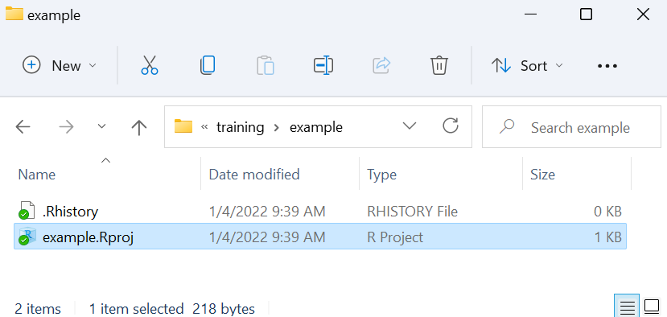

<!-- NOTES: To edit images, edit them in the "images" folder that lives NEXT TO THE RMD FILE -->


<!-- Add JavaScript code for making the exercise code larger -->
<script language="JavaScript" src="js/exercise-font-size.js"></script>

```{r setup, include=FALSE}
library(learnr)          # create lessons from rmd
library(gradethis)       # evaluate exercises
library(sortable)        # questions on choosing order of commands
library(skimr)           # dataset summary
library(dplyr)           # wrangle data
library(flair)           # highlight code
library(ggplot2)         # visualise data
library(gtsummary)       # visualise data
library(fontawesome)     # for emojis
library(DT)              # present tables

# library(RMariaDB)      # connect to sql database

## set options for exercises and checking ---------------------------------------

## Define how exercises are evaluated 
gradethis::gradethis_setup(
  ## note: the below arguments are passed to learnr::tutorial_options
  ## set the maximum execution time limit in seconds
  exercise.timelimit = 60, 
  ## set how exercises should be checked (defaults to NULL - individually defined)
  # exercise.checker = gradethis::grade_learnr
  ## set whether to pre-evaluate exercises (so users see answers)
  exercise.eval = FALSE 
)

# ## event recorder ---------------------------------------------------------------
# ## see for details:
# ## https://pkgs.rstudio.com/learnr/articles/publishing.html#events
# ## https://github.com/dtkaplan/submitr/blob/master/R/make_a_recorder.R
# 
# ## connect to your sql database
# sqldtbase <- dbConnect(RMariaDB::MariaDB(),
#                        user = 'sander', 
#                        password = 'E9hqb2Tr5GumHHu',
#                        # user     = Sys.getenv("userid"),
#                        # password = Sys.getenv("pwd"),
#                        dbname   = 'excersize_log',
#                        host     = "144.126.246.140")
# 
# 
# ## define a function to collect data
# ## note that tutorial_id is defined in YAML
#     ## you could set the tutorial_version too (by specifying version:) but use package version instead
# recorder_function <- function(tutorial_id, tutorial_version, user_id, event, data) {
# 
#   ## define a sql query
#   ## first bracket defines variable names
#   ## values bracket defines what goes in each variable
#   event_log <- paste("INSERT INTO responses (
#                        tutorial_id,
#                        tutorial_version,
#                        date_time,
#                        user_id,
#                        event,
#                        section,
#                        label,
#                        question,
#                        answer,
#                        code,
#                        correct)
#                        VALUES('", tutorial_id,  "',
#                        '", tutorial_version, "',
#                        '", format(Sys.time(), "%Y-%M%-%D %H:%M:%S %Z"), "',
#                        '", Sys.getenv("SHINYPROXY_PROXY_ID"), "',
#                        '", event, "',
#                        '", data$section, "',
#                        '", data$label,  "',
#                        '", paste0('"', data$question, '"'),  "',
#                        '", paste0('"', data$answer,   '"'),  "',
#                        '", paste0('"', data$code,     '"'),  "',
#                        '", data$correct, "')",
#                        sep = '')
# 
#     # Execute the query on the sqldtbase that we connected to above
#     rsInsert <- dbSendQuery(sqldtbase, event_log)
# 
# }
# 
# options(tutorial.event_recorder = recorder_function)

# data prep (must be in setup chunk) --------------------------------------------------------------------
linelist <- rio::import(system.file("dat/surveillance_linelist_20141201.csv", package = "epitutorials"))

linelist_clean <- rio::import(system.file("dat/tutorial_linelist_clean.rds", package = "epitutorials"))


# hide non-exercise code chunks ------------------------------------------------
knitr::opts_chunk$set(echo = FALSE)

```


## Welcome to Applied Epi's free self-paced R tutorial series

```{r, eval = TRUE, echo = FALSE, out.width = "100%"}
knitr::include_graphics("images/applied_epi_banner.png", error = F)
```

</br>

#### Tutorial 1: R basics

This is the **first** tutorial in the series.  

* **This tutorial teaches**: Introduction to R, elementary R coding, file and project management, and importing data  
* **Target audience**: Public health practitioners, epidemiologists, clinicians, and researchers who cannot access our live courses  
* **Format**: R coding is performed *within* this tutorial window  
* **Offline access**: Follow [these instructions](www.training.appliedepi.org) to download and view offline in your RStudio  

</br>

#### Our introductory R training materials  

All of our training materials focus on challenges and solutions for frontline practitioners, and are accessible to beginner audiences. Read more about our educational approach [here](training.appliedepi.org/educational-approach) 

:::: {style="display: flex;"}

::: {.tutorial}
**Self-paced tutorials:**

 
* Introduce you to the basics of R coding  
* R on your computer is **not** required  
* Help is available at our public [Applied Epi Community](http://community.appliedepi.org) forum  

:::


::: {.col data-latex="{0.05\textwidth}"}
\ 
<!-- an empty Div (with a white space), serving as
a column separator -->
:::


::: {.tutorial}
**Live courses:**  

* A more comprehensive curriculum  
* We help you navigate and use R on your computer  
* Personal support and tips from live instructors who have  
extensive frontline public health experience  


:::

::::

See our [live course offerings](www.training.appliedepi.org), [educational philosophy](https://applied-epi-training.netlify.app/educational-approach.html), and [email us](mailto:contact@appliedepi.org) for tutorial personal coaching options.  

</br>

#### About Applied Epi


:::: {style="display: flex;"}

::: {}


**[Applied Epi](www.appliedepi.org) is a nonprofit organization that supports frontline public health practitioners through accessible tools, training, and support.**  

We are a global team of 150 applied epidemiologists and public health practitioners with extensive ground-level experience.  

Our free [Epidemiologist R Handbook](www.epiRhandbook.com) is a vital resource for over **175,000 people**.  

We offer a comprehensive ecosystem of training, tools, and support:  


:::: {style="display: flex;"}

::: {}
```{r, out.width = "55%", fig.align = "left", echo=F}
knitr::include_graphics("images/teaching_icon.png")
```

**Training:**  
**[Live courses](https://appliedepi.org/live/)**  
**[Tutorials](https://appliedepi.org/tutorial/)**  
**[Case studies](https://appliedepi.org/case/)**  
:::

::: {}
```{r, out.width = "55%", fig.align = "left", echo=F}
knitr::include_graphics("images/tools_icon.png")
```

**Tools:**  
**[Epi R Handbook](https://epiRhandbook.com)**  
**[R packages](https://appliedepi.org/tools/)**  
**[Sitrep templates](https://appliedepi.org/tools/)**  
:::

::: {}
```{r, out.width = "55%", fig.align = "left", echo=F}
knitr::include_graphics("images/QA_icon.png")
```

**Support:**  
**[Community forum](https:/community.appliedepi.org)**  
**[R Help Desk](https://appliedepi.org/helpdesk/)**  
**[Mentorship](https://appliedepi.org/join/)**  
:::


::::

<form target="_blank" action="https://www.paypal.com/donate" method="post" target="_top">
<input type="hidden" name="hosted_button_id" value="YTEZELC8VBXV6" />
<input type="image" src="https://github.com/appliedepi/epiRhandbook_eng/raw/master/images/donate_button_long.png" border="0" name="submit" title="PayPal - The safer, easier way to pay online!" alt="Donate with PayPal button" />

</form>


:::


::: {.col data-latex="{0.15\textwidth}"}
\ 
<!-- an empty Div (with a white space), serving as
a column separator -->
:::


::: {}
```{r, out.width = "100%", fig.align = "center", echo=F}

```
[*Image: Neale Batra*]{style="float:right"}
:::

::::


</br>

#### Acknowledgements and partners  

Authors of this tutorial include:  

* Neale Batra  
* Brianna Bradley  

Graphics supported by Calder Fong. Images are either from Applied Epi team members or via our Canva account.  

Funding for this tutorial was provided by Médecins Sans Frontières (MSF) / Doctors without Borders and TEPHINET.  


:::: {style="display: flex;"}

::: {}
```{r, out.width = "85%", fig.align = "center", echo=F}

```
:::


::: {.col data-latex="{0.05\textwidth}"}
\ 
<!-- an empty Div (with a white space), serving as
a column separator -->
:::


::: {}
```{r, out.width = "85%", fig.align = "center", echo=F}

```

:::

::::


### License {.unnumbered} 

<a rel="license" href="http://creativecommons.org/licenses/by-nc-sa/4.0/"></a> Applied Epi Incorporated, 2022 <br />This work is licensed by Applied Epi Incorporated under a <a rel="license" href="http://creativecommons.org/licenses/by-nc-sa/4.0/">Creative Commons Attribution-NonCommercial-ShareAlike 4.0 International License</a>.  


**Click "Next Topic" to move to the next section of the tutorial, or navigate using the Table of Contents on the left.**  


## About this tutorial


### Learning objectives

In this tutorial you will:  

1) Become familiar with the panels in the RStudio interface
2) Practice opening a new R script and running R code "commands" from an R script
3) Learn basic R syntax, operators, and functions  
4) Practice by coding a medical supply chain exercise  
5) Install and load R packages  
6) Learn about RStudio projects and best-practices for naming files  
7) Import a CSV dataset into R, and conduct some exploratory analysis   


#### Accompanying resources

This tutorial draws from chapters of our free [Epidemiologist R handbook](https://epirhandbook.com/en/) such as [R basics](https://epirhandbook.com/en/r-basics.html), [Importing and exporting](https://epirhandbook.com/en/import-and-export.html), and [R projects](https://epirhandbook.com/en/r-projects.html).  


#### Next steps  
After completing this tutorial, we recommend you complete our tutorial on "Data preparation" - collecting, formatting, and preparing your dataset *before* importing it into R is a critical step!  


### Review a dataset  

Because this tutorial is self-contained within this window, we will often ask you to look at the first few rows of practice datasets in the format below.  

Below, the dataset `linelist` is displayed. It contains `r nrow(linelist)` rows, but we are only showing the **first 25 rows** now. A "linelist" is a term used in applied epidemiology to refer to a table that contains key information about each case or suspect case in an outbreak. Each row represents one case, and the columns contain variables such as age, sex, date of symptom onset, outcomes, etc.  

* Scroll to the right to see all the columns  
* Use the numbers buttons in the lower-right to page through the additional available rows (25 rows in this case)  
* Click a column name to sort the rows  
* Filter rows by clicking/typing in the empty box above the column  

```{r, echo=FALSE, eval=TRUE, message = FALSE, warning = FALSE}
DT::datatable(head(linelist_clean, 25), rownames = FALSE, filter="top", options = list(pageLength = 5, scrollX=T), class = 'white-space: nowrap' )
```


### Getting help  

To get help while completing this tutorial:  

1) Look for expandable green helper text  
2) Look for "hints" and "solutions" above the coding boxes   
3) Post a question in [Applied Epi Community](www.community.appliedepi.org) in the category for questions about Applied Epi Training  


### Helper text  

Here is what the "helper text" will look like. Click on it to expand the text.

<!--
NOTE: Below is the hint (all within details tags collapsed)
-->
<details>

<summary style='text-decoration: underline; color: darkgreen;'>`r fontawesome::fa("lightbulb", fill = "gold")` Click to read more</summary>
</br>

Here there will be some helpful tips or advice!


</br>
</details>


### Code boxes  

This tutorial does not assume that you have R or RStudio working on your computer. Therefore, you can complete coding exercises in these codeboxes within the tutorial. For example:  

**Type the following R command in the codebox and press "Submit answer"**. This command will cross-tabulate observations from the dataset `linelist` (displayed above), placing gender in the output table's rows and case definition in the output table's columns.  

```
tbl_cross(data = linelist, row = gender, col = case_def)
```

* Press "Hints" to see hints or tips  
* Press "Run code" to run the code to preview the result  
* Press "Start over" to revert the box to its original state  
* Press "Submit answer" to submit your code and compare it against the solution  


<!-- ```{r ex-demo-setup, echo=FALSE, eval=FALSE} -->
<!-- linelist <<- rio::import(system.file("dat/surveillance_linelist_20141201.csv", package = "epitutorials")) -->
<!-- ``` -->


```{r example-codebox, exercise = TRUE}
Type the code here
```

```{r example-codebox-hint, eval = FALSE, exercise = FALSE}
Type the code exactly as written, into the codebox. Then press Run
```

```{r example-codebox-hint2, eval = FALSE, exercise = FALSE}
tbl_cross(data = linelist, row = gender, col = case_def)
```

```{r example-codebox-solution, exercise = FALSE}
tbl_cross(data = linelist, row = gender, col = case_def)
```

```{r example-codebox-check, exercise = FALSE}
grade_this_code("Correct, you should see a cross-tabulation of the linelist, in which gender is in the rows and case definition is in the columns.")
```

</br>

`r fontawesome::fa("exclamation", fill = "red")` If you get the error: `It looks like this might not be valid R code...` try typing the code instead of copy/pasting into the codebox.  


### Quiz questions  

Please complete the quiz questions that you encounter throughout the tutorial. **Answering will help you** to comprehend the material, and will also help us to improve the exercises for future students.  

To practice, please answer the following questions:  

```{r quiz-use-helper, echo=F}
quiz(
  question_radio("When should I view the code hints and solutions?",
    answer("After trying to write the code myself", correct = TRUE),
    answer("Before I try coding", correct = FALSE),
    correct = "Reviewing best-practice code after trying to write yourself can help you improve",
    incorrect = "Please attempt the exercise yourself, or use the hint, before viewing the answer."
  )
)
```


```{r quiz-anxious, echo = FALSE}
question_numeric(
 "How anxious are you about beginning this tutorial - on a scale from 1 (least anxious) to 10 (most anxious)?",
 answer(10, message = "Try not to worry, we will help you succeed!", correct = T),
 answer(9, message = "Try not to worry, we will help you succeed!", correct = T),
 answer(8, message = "Try not to worry, we will help you succeed!", correct = T),
 answer(7, message = "Try not to worry, we will help you succeed!", correct = T),
 answer(6, message = "Ok, we will get there together", correct = T),
 answer(5, message = "Ok, we will get there together", correct = T),
 answer(4, message = "I like your confidence!", correct = T),
 answer(3, message = "I like your confidence!", correct = T),
 answer(2, message = "I like your confidence!", correct = T),
 answer(1, message = "I like your confidence!", correct = T),
 allow_retry = TRUE,
 correct = "Thanks for sharing. ",
 min = 1,
 max = 10,
 step = 1
)
```


### Icons  

You will see these icons throughout the exercises:

Icon  |Meaning
------|--------------------
`r fontawesome::fa("eye", fill = "darkblue")`|Observe  
`r fontawesome::fa("exclamation", fill = "red")`|Alert!  
`r fontawesome::fa("pen", fill = "brown")`|An informative note  
`r fontawesome::fa("terminal", fill = "black")`|Time for you to code!  
`r fontawesome::fa("window-restore", fill = "darkgrey")`|Change to another window  
`r fontawesome::fa("bookmark", fill = "orange")`|Remember this for later  


### Getting help on Applied Epi Community  

Our other site [Applied Epi Community](www.community.appliedepi.org) is a public Q&A and discussion forum. You can post a question in the category "Applied Epi Training" about the content in these tutorials. A member of the community may help you by voluntarily answering your question.  

* Be sure to clearly reference which tutorial and which question you are stuck on  
* Explain what you have already tried to do  
* Thank anyone who replies for their time  


## Understand R and RStudio  


This section of the tutorial will help you better understand R and RStudio.

**This tutorial does not assume that you have R and RStudio on your computer - it focuses on teaching you R syntax within R coding portals that are built into the tutorial**.

If you want support installing and troubleshooting R code on your computer, consider taking one of our live courses or contacting us about a personal session.  


### Understand R   

**R is a language** used for statistical computing and graphics, developed in 1991 and based on the language S ([read more of the history here](https://bookdown.org/rdpeng/rprogdatascience/history-and-overview-of-r.html#what-is-r)). 

**R is different from other programming languages** in that its original purpose is data analysis.  

**R is distinct from other data analysis languages like SAS and Stata** because:  

* It is free (no more license fees!)  
* It has advanced graphics capabilities  
* It has versatile automated reporting capabilities (very useful in public health!)  
* It is open-source (new capabilities are created by the user community)  
* It has a large, growing, and vibrant user community.  

Because R is open-source, its functionalities are expanded by its user community - every day! Users like you can write R code that does a specific task (for example, a template for an outbreak situation report), share it with the world, and others can evaluate and adopt it as needed. Ultimately, this is a robust process with millions of people testing and vetting code. Only the best becomes widely adopted. R is trusted and used by many institutions: for example, the [US Food and Drug Administration (FDA)](https://blog.revolutionanalytics.com/2012/06/fda-r-ok.html).  

R is governed by a "core group" and is updated every few months. Pay attention to the **R version** that you download - each version is assigned a number (like "R version 4.1.2 (2021-11-01)") and a name to make it easier to remember, like "Bird Hippie". To update your version of R, re-download it.  


### Why use R?  

#### R is a very effective tool  

```{r dominoes, fig.margin = TRUE, echo = FALSE, fig.width = 3, out.width = "50%", fig.cap = ""}
knitr::include_graphics("images/stop_epidemic_dominoes2.png", error = FALSE)
```

Using R will make your analyses more versatile, your communication more clear and timely, and improve your public health work.  


#### R is free

```{r freedom, fig.margin = TRUE, echo = FALSE, fig.width = 3, out.width = "50%", fig.cap = ""}
knitr::include_graphics("images/freedom_bird.png", error = FALSE)
```

R is free to use! There is a strong ethic in the community of free and open-source material. The accessibility of R is a major draw. Most analytic software comparable to R are not free and can be quite expensive over time if one has to renew and purchase a license annually. Without cost as a barrier, you can now focus on learning how to use R.  

R is also **free-ing** in that you are no longer bound by the tools of a commercial software. Eventually, you will be able to write your own R tools and templates, and even share them with others. This is the beauty of open-source, community-driven software.  


#### Popularity

The below graph shows the number of publications citing R, SPSS, SAS, and STATA from 2015 to 2019, as sourced from Google Scholar. As a field epidemiologist from Nigeria said to us: "R has become the gold standard in infectious disease epidemiology globally."  

```{r popularity, fig.margin = TRUE, echo = FALSE, fig.width = 3, out.width = "50%", fig.cap = ""}
knitr::include_graphics("images/r_popularity.png", error = FALSE)
```


#### Data visualization

R is known for its brilliant data visualizations. It is capable of producing deeply customized tables, maps, and epidemic curves. With a bit more advanced knowledge you can visualize contact tracing patterns, phylogenetic trees, and publication-ready plots.  

```{r viz, fig.margin = TRUE, echo = FALSE, out.width = "100%", out.height="100%", fig.cap = ""}
knitr::include_graphics("images/visualization.png", error = FALSE)
```

#### Automated reports and dashboards  

In public health, we often want to make semi-automated reports (e.g. for surveillance, situation reports, periodic surveys, etc). The **R Markdown** functionality is the most versatile tool for making such reports.  

The dashboards that you can make with R are also extremely sharp and versatile, whether to send to a supervisor by email, or to host online for the public.  

:::: {style="display: flex;"}

::: {}
```{r dashboards, fig.margin = TRUE, echo = FALSE, out.width = "100%", out.height="100%", fig.cap = "", fig.show='hold'}
knitr::include_graphics("images/automated_reports.png", error = FALSE)
```

Early in the COVID-19 pandemic, a UK health agency produced over 300 customized reports *per day* using R Markdown.  


:::

::: {.col data-latex="{0.15\textwidth}"}
\ 
<!-- an empty Div (with a white space), serving as
a column separator -->
:::


::: {}
```{r shiny, fig.margin = TRUE, echo = FALSE, out.width = "100%", out.height="100%", fig.cap = "", fig.show='hold'}
knitr::include_graphics("images/automated_dashboard.png", error = FALSE)
```

Many agencies now use "Shiny" (a tool within R) for their public-facing dashboards, including the WHO.  
:::

::::


#### Efficiency

A Haitian epidemiologist using our training resources said: ‘With R I can do anything. What took 10 hours in Excel, I do in less than 1 hour. Also it is easier to detect if there is a mistake."  

R means more flexibility, confidence, and time for systemic change. Implementing R skills into your daily workflow will allow you to increase your work capacity and reduce response time to rapidly evolving public health scenarios.  


#### Flexibility

R can interact with many common data collection tools, websites, and software. You can even automate R to produce surveillance or situation reports and email them out to partners. 

```{r appliedepi-flexibility, fig.margin = TRUE, echo = FALSE, fig.width = 3, out.width = "50%", fig.cap = ""}
knitr::include_graphics("images/interoperability.png", error = FALSE)
```


#### Equity

*R is not just a new tool, but a new culture*

As an open-source language, R is built by its end-users. This advances an equity agenda, advancing local capacity, local problem-solving, and decentralizing innovation.  

An R user in any part of the world can write code to produce a tool, share it, have it be verified by the community, and see it be adopted widely. This empowerment of end-users is paramount to a more equitable epidemiological community.


#### Community  

R has a vibrant user community support network, such as events facilitated by groups like [R-Ladies](https://rladies.org/), [AfricaR](https://africa-r.org/), and Q&A forums on StackOverflow, R-Bloggers, and Twitter (follow \@epitwitter, \@epiRhandbook, \@AppliedEpi, and #rstats).  


```{r appliedepi-community, fig.margin = TRUE, echo = FALSE, fig.width = 3, out.width = "50%", fig.cap = ""}
knitr::include_graphics("images/user_community.png", error = FALSE)
```


### What is your reason for learning R?

  

```{r rhetorical1, echo = FALSE}
question_text(
  "Tell us in one or two sentences why you are trying to learn R.",
  answer_fn(function(value) {
    if (grepl(paste(letters, collapse = "|"), value)) {
      correct("Thank you for sharing your motivations")
    }
  }, )
)
```


```{r rhetorical2, echo = FALSE}
question_text(
  "Which analytical software do you use the most? (e.g. SAS, Stata, Excel, R, EpiInfo, EpiData, Tableau, Python...)",
  answer_fn(function(value) {
    if (grepl(paste(c(letters,toupper(letters)), collapse = "|"), value)) {
      correct("Thank you for sharing")
    }
  }, )
)
```


```{r rhetorical3, echo = FALSE}
question_text(
  "What is your current level of experience with R? (Write either: None, Some training, Run other people's scripts, Regular user, or Advanced)",
  answer_fn(function(value) {
    if (grepl(paste(letters, collapse = "|"), value)) {
      correct("Thank you for sharing")
    }
  }, )
)
```


```{r rhetorical4, echo = FALSE}
question_text(
  "What is your primary professional relationship with public health? (e.g. None, Student/trainee, Academic research, Public health practitioner, Applied epidemiologist, or Clinician)",
  answer_fn(function(value) {
    if (grepl(paste(letters, collapse = "|"), value)) {
      correct("Thank you for sharing")
    }
  }, )
)
```


### R is the engine  

When you install R to your computer, it is an independent software that you can open directly. If you open only R (not RStudio), you will see only one simple panel - the R Console. **This is not how must people use R**. Using R this way will run all the computations and create all the plots you desire, *but it will be difficult to stay organized*.    

**Now, people use Integrated Development Environments (IDEs) such as RStudio** to "wrap around" their R software, allowing a more friendly user interface and file organization.  

You can think of R as being the *engine* of a vehicle, doing the crucial work, and RStudio as the *body* of the vehicle (with seats, accessories, etc.) that helps you actually use the engine to move forward!  


### RStudio is the vehicle body  

"RStudio" is an interface (IDE) for easier use of R. It is offered for free by the RStudio corporation.  

Again, you can think of **R as the engine of a vehicle**, doing the crucial work, and **RStudio as the body of the vehicle** (with seats, accessories, etc.) that helps you actually use the engine to move forward! Therefore, you should install R *and* RStudio to proceed.  

When you open RStudio, it will automatically find the R installation on your computer, and use it. There is no need to open both programs.  


### Quiz  

Now, please check your understanding of R and RStudio by answering the questions below:  

```{r rstudio-quiz, echo=FALSE}
quiz(caption = "Quiz - R and RStudio",
    
   question("What is RStudio?",
            allow_retry = TRUE,
    answer("An application that makes it easier to use R.",
           correct = TRUE,
           message = "RStudio is an 'Integrated Development Environment (IDE) that makes it easier to write, use, debug, and save R code."),
    answer("A spreadsheet program like Microsoft Excel."),
    answer("Another name for R",
           message = "R and RStudio are two separate things. R is a language, like English or French. RStudio can be thought of as a program that helps you use the language, like how a word processing program helps you write."),
    answer("An application that lets you use R without writing any code",
           message = "You still have to write code - and that's a good thing! Code provides a reproducible record of your work, which is best practice.")
  ),
     
  
  question("Is RStudio free to download and use?",
    answer("Yes",
           correct = TRUE,
           message = "The RStudio IDE is a software offered for free by the RStudio corporation. There are other, less common, IDEs to use R, such as Tinn-R and Emacs."),
    answer("No",
           message = "RStudio IDE is free and open-source."),
    allow_retry = TRUE
  ),
  
  question("Do you need to install both R and RStudio?",
    answer("Yes.",
           correct = TRUE, message = "While it is possible to work in R without an interface like RStudio, this is not recommended for beginners."),
    answer("No.",
           message = "You need to install both programs separately."),
    allow_retry = TRUE
  ),
  
  question("Once both programs are installed, which one should you open to begin working?",
    answer("RStudio",
           correct = TRUE,
           message = "Opening RStudio will automatically start R."),
    answer("R",
           message = "For beginners, it is best to work in R *through* RStudio. Open RStudio."),
    allow_retry = TRUE)
)
```


#### Install R
To install R, visit this website https://www.r-project.org/ and download the latest version of R suitable for your computer. If your computer has shared drives or syncing software such as OneDrive, we recommend installing R and RStudio to a location such as "My Documents", but you should consult with your IT department on their recommended approach.  

#### Install RStudio
To install RStudio, visit this website https://rstudio.com/products/rstudio/download/ and download the latest free Desktop version of RStudio suitable for your computer.

#### R on a USB drive
It is possible to save R and RStudio to an external storage device such as a USB. Once you have them installed, copy all their folders onto your USB disc. Then, you will be able to use R on the devices you plug your USB into in the future.

#### Considerations for Shared Drives
Using shared drives or syncing tools such as OneDrive can make using R more difficult, especially when using R with collaborators. Talk with your organization's IT department about how to resolve issues, or see the "R on Network Drives" chapter of the [Epi R Handbook](www.epiRhandbook.com).  


## RStudio tour 

`r fontawesome::fa("eye", fill = "darkblue")` If you have RStudio installed, open it and observe the various panes. If the size of the text is too small or large, adjust it with the *View* menu. If you do not have RStudio installed, see the image below.  

```{r, eval = TRUE, echo = FALSE, out.width = "100%"}
# adding xfun::relative_path() creates a dynamic file path between the Rmd location and the here() path.
# It dynamically creates the ../../etc filepath.

knitr::include_graphics("images/rstudio_overview.png", error = F)
```

* Observe the major RStudio panes. How many panes do you see?  
     * You should see at least 3 panes:  
        * The **Console, Terminal, Render, and Jobs** pane (left or lower-left)  
        * The **Environment** (upper-right, which also holds the **Tutorials** that this exercise is in)  
        * The **Files, Plots, Packages, Help, and Viewer** panes (lower-right)   
     * If you see only these 3 panes, click *File -> New file -> R script* to open a new R Script and achieve the classic look pictured below. Now you will have the 4th pane, which is called the "Source" pane.  
     * Take a few minutes to familiarize yourself with the locations of the various panes, using the diagram below.  
     
#### The Source Pane  

This pane, by default in the upper-left, is a space to edit, run, and save your scripts. Scripts contain the commands you want to run. This pane can also display datasets (data frames) for viewing.

For Stata users, this pane is similar to your Do-file and Data Editor windows.

#### The R Console Pane

In the lower-left, you may need to click from "Jobs" tab to the "Console" tab to see the R Console (because this tutorial is running). This is the home of the R software itself, the “engine” where the commands are actually run and non-graphic outputs and error/warning messages appear. You can directly enter and run commands in the R Console, but realize that these commands are not saved as they are when running commands from a script.

If you are familiar with Stata, the R Console is like the Command Window and also the Results Window.

#### The Environment Pane

This pane, by default in the upper-right, is most often used to see brief summaries of objects in the R Environment in the current session. These objects could include imported, modified, or created datasets, parameters you have defined (e.g. a specific epi week for the analysis), or vectors or lists you have defined during analysis (e.g. names of regions). You can click on the arrow next to a data frame name to see its variables.

In Stata, this is most similar to the Variables Manager window.

This pane also contains History where you can see commands that you can previously. It also has a “Tutorial” tab where you can complete interactive R tutorials if you have the learnr package installed. It also has a “Connections” pane for external connections, and can have a “Git” pane if you choose to interface with Github.

#### Files, Plots, Packages, Help and Viewer Pane  

The lower-right pane includes several important tabs. The Files pane is a browser which can be used to open, rename, or delete files. Typical plot graphics including maps will display in the Plot pane. Interactive or HTML outputs will display in the Viewer pane. The Help pane can display documentation and help files. The Packages pane allows you to see, install, update, delete, load/unload R packages, and see which version of the package you have. To learn more about packages see the packages section below.

This pane contains the Stata equivalents of the Plots Manager and Project Manager windows.

`r fontawesome::fa("pen", fill = "brown")`  
For more detail on RStudio capabilities, download this PDF [RStudio IDE cheatsheet](https://raw.githubusercontent.com/rstudio/cheatsheets/main/rstudio-ide.pdf).  


## RStudio projects

### What is an RStudio project?  

Most of the time when you use R, it will make your life drastically easier to organize your work within an RStudio project.  

#### A self-contained and portable R environment  

```{r, eval = TRUE, echo = FALSE, out.width = "50%"}
# adding xfun::relative_path() creates a dynamic file path between the Rmd location and the here() path.
# It dynamically creates the ../../etc filepath.

knitr::include_graphics("images/project_briefcase.png", error = F)
```


An RStudio project is a **self-contained and portable R working environment** - it is **a folder for all the files associated with a distinct project (data files, R scripts, outputs, etc)**.  

* You can zip an RStudio project and email it to someone else. They should be able to open it and replicate your work exactly!  
* An RStudio project can be linked to a repository on version-control software like Git/Github  

If you do not work in an R project, it will be harder to organize files, to share your work with others, and you may encounter lots of frustration struggling to import files with something called the "working directory". When you use an R project, your scripts become much more easy to share and less likely to "break" when someone else uses them.  

### To create an R project

Creating an RStudio project is not required to complete this tutorial. But if you want to try on your computer, you can use the following instructions.  

To create an R project, select “New Project” from the RStudio File menu.

* If you want to create a new folder for the project, select “New directory” and indicate where you want it to be created (shown in the example below)
* If you want to create the project within an existing folder, click “Existing directory” and indicate the folder.
* If you want to clone a Github repository, select the third option “Version Control” and then “Git”. See the page on [Version control and collaboration with Git and Github ](https://epirhandbook.com/en/version-control-and-collaboration-with-git-and-github.html) for further details.

```{r rproject-gif, fig.margin = TRUE, echo = FALSE, fig.width = 3, out.width = "100%", fig.cap = ""}
knitr::include_graphics("images/rproject_create1.gif")
```


### Review your R project

Now, we can see the new folder that we created (/example), and within this folder is a new "R project" file ("example.Rproj"). Best practice for naming a project is using all lowercase letters with no spaces.

```{r rproject-folder-empty, fig.margin = TRUE, echo = FALSE, fig.width = 3, out.width = "50%", fig.cap = ""}

```

If you are working in an RStudio project, you will see the name of the project indicated in the upper-right corner of RStudio. If you are not in an RStudio project, it will read "Project: (None)". 


### An example RStudio project  

For example, if you you were to create an RStudio project on your desktop called "intro_course", and then continue building subfolders, the contents might look like this:  

```{r, eval = TRUE, echo = FALSE, out.width = "75%"}
knitr::include_graphics("images/new_r_project_explorer.png", error = F)
```

In the folder, you will see a small file with an icon that looks like an box with an "R" on it - this is the RStudio project file (.Rproj).  

**To directly open the project next time, simply double-click this RStudio project file to open it. RStudio will open, and all your files for this project will be at-the-ready.**  

`r fontawesome::fa("eye", fill = "darkblue")` If you open the RStudio project, you will note that in the "Files" RStudio pane (lower-right) that you can also see and access the files/subfolders of your project.  

You can read more about RStudio projects in [this chapter of the Epi R Handbook](https://epirhandbook.com/en/r-projects.html).  


## Running R commands

### To open an R script

**Although creating a script is not taught and is not necessary for this tutorial, you will typically work in R by drafting and running your commands from an R script.**  

If you have RStudio and R running on your computer, you would click *File -> New file -> R script*.  

```{r script-new, fig.margin = TRUE, echo = FALSE, fig.width = 3, out.width = "35%", fig.cap = ""}
knitr::include_graphics("images/new_script.jpg", error = F)
```

You should see a new empty space appear in the upper-left of RStudio. This space is the R script. To save the script, click the save icon above the script, or click *File -> Save As*.  

Note that the file extension for an R script is ".R". In working with R, you will encounter other extensions, but remember that this one is for R scripts.  

`r fontawesome::fa("eye", fill = "darkblue")` If you save the script into your RStudio project (e.g. in a "scripts" subfolder), it will be visible in the "Files" RStudio pane in the lower-right. Similarly, it should also appear in your File Explorer.    


```{r file-quiz, echo=F}
quiz(
  question("Which of these file names is an R script?",
           allow_retry = TRUE,
    answer("survey_analysis.Rproj", message = "No, this extension signifies an R project. You could click this to open RStudio and work on the project."),
    answer(".Rhistory", message = "No, .Rhistory is a special file that saves a record of commands and outputs. It is rarely viewed."),
    answer("cholera_plots.Rmd", message = ".Rmd signifies an 'R markdown' script, which is not a standard R script. You'll learn about R markdown later in the course."),
    answer("measles.R", correct = TRUE, message = "Yes, the .R signifies that this is an R script."),
    answer("pirate_ship.arrrrr", message = "No, this is just silly!")
  )
)
```


### A script is a list of instructions for R  

A script is a place to write instructions for R. A typical R script for public health analysis/reporting might include sections like:  

* Header containing information for the reader such as the script objective, authors, contact info, date last updated, etc.
* Load R packages
* Import the data
* Clean the data
* Perform summary and statistical analyses
* Display results as plots, tables, maps, etc.

In the example below, the green text preceeded by hash (#) symbols are "comments" or "notes" for the reader, or used to delineate sections of the script. The black text is R code commands.  

```{r script-example, fig.margin = TRUE, echo = FALSE, fig.width = 3, out.width = "85%", fig.cap = ""}
knitr::include_graphics("images/example_script.png", error = F)
```


### Write simple R commands  

`r fontawesome::fa("terminal", fill = "black")` Let's do some coding!

#### Get comfortable writing and running commands

In this tutorial, you run R commands by typing them in the codeboxes as described earlier. 

In RStudio, you can run R commands the following ways:  

1) Type the command directly into the *Console pane* (lower-left of RStudio) and press Enter.  
2) Type the command into a script, ensure that your cursor on this line of the script, and press the "Run" button in the upper-right of the script.  
3) Type the command into a script, ensure that your cursor is on this line of the script, and type Ctrl and Enter (or Cmd and Enter on a Mac).  
4) Use your mouse to highlight certain part of a command. Press "Run" or Ctrl+Enter to run only the highlighted code.   


#### R as a calculator  

**Let's begin with perhaps the most simple use of R, just to get comfortable running commands.**  

Below are common mathematical operators in R. These are often used to perform addition, division, to create new columns in datasets, etc. Spaces around the operators will not affect the command, but make the code more readable.

| Purpose             | Example in R |
|---------------------|--------------|
| addition            | 2 + 3        |
| subtraction         | 2 - 3        |
| multiplication      | 2 \* 3       |
| division            | 30 / 5       |
| exponent            | 2 \^ 3         |
| order of operations | ( )          |


**Delete the text below and type some simple mathematical commands into the R codebox below. Press "Run code" each time to see the result.**  

```{r openmath, exercise = TRUE}
Try to write some simple calculations here and press 'Run Code'
```

Note that R prints `[1]` before the result. This is simply to tell you that this result is the first result. Other more complex commands may result in multiple results printed.  

**Now, type a command in the codebox below to print the sum of 12, -99, 2, 147, and 29:**  

```{r simple-math, exercise = TRUE}
Try to write the code here
```

```{r simple-math-check}
grade_this({
  # custom checking code appears here
  if (.result == 12 + -99 + 2 + 147 + 29) {
    pass("Nice work, you wrote a pretty long calculation with R.")
  }
  fail("Press 'Start over' and try again")
})
```

```{r simple-math-hint}
Simply type the numbers into the console, with the appropriate operators between then, such as + or -. Do not forget that the second value is NEGATIVE.
```

```{r simple-math-hint-2}
12 + -99 + 2 + 147 + 29
```

```{r simple-math-solution, eval=FALSE}
12 + -99 + 2 + 147 + 29
```


Congratulations! You are using R as a basic calculator! Don't worry R will get much more fun very soon...  


### Medical supply chain exercise  


Now let's try an exercise that is more relevant to public health:  

You are managing a COVID testing campaign across 3 sites, and you need to place a supply purchase order for rapid tests for next month. **Based on the following information, how many tests do you need to order?**  

* Site 1 uses 200 per month  
* Site 2 uses 550 per month  
* Site 3 has 2 sub-sites that each need 925 tests per month  
* You should order 10% extra as a buffer against higher demand  
* You have 420 tests extra remaining from last month, which you can use in the coming month  

Look through the **multiple hints** if you have trouble.

```{r supply, exercise = TRUE}
Write your command here
```

```{r supply-check}
grade_this_code("You got it correct! You should order 2440 tests for next month's testing operations.")
```

```{r supply-hint}
Write a command that uses the numbers above, with +, -, and * . Also use parentheses ( ) to run certain operations first. 
```

```{r supply-hint-2}
Use parentheses ( ), the asterisk multiplication operator, and the addition + and subtraction - operators. First, total the known needs (200, 550, and two times 925). Wrap that all in parentheses, because you need to multiply that sum by the desired buffer (110%, but in decimal form as 1.1). That total should also be wrapped in parentheses, because you need to then subtract the extra remaining from the previous month.
```

```{r supply-hint-3}
((200 + 550 + (925 * 2)) * 1.1) - 420
```

```{r supply-solution, eval=FALSE}
((200 + 550 + (925 * 2)) * 1.1) - 420
```


#### Adjust the equation  

How many tests would you need to order if each of the Site 3 sub-sites needed only 800 tests, instead of 925? Write the command you used above, but modify for the new scenario.  
```{r supply-adjust, exercise = TRUE}
Write your command here
```

```{r supply-adjust-check}
grade_this_code("You got it correct! You should order 2165 tests in this scenario.")
```

```{r supply-adjust-hint}
Replace the 925 with 800 and re-run the command
```

```{r supply-adjust-hint-2}
((200 + 550 + 800 * 2)) * 1.1) - 420
```

```{r supply-adjust-solution, eval=FALSE}
((200 + 550 + (800 * 2)) * 1.1) - 420
```

You can see how changing the equation to account for updated might get difficult. Soon we'll learn a different approach to solving this problem.  


### Documentation  

`r fontawesome::fa("pen", fill = "brown")` It is important to write your code so that other people have an easy time reading it! In fact, if you return to this code one or two months later, you may need help remembering why you wrote this command. 

Any text written to the right of a "hash" symbol (#) is ignored by R as it runs commands in a script. So, you can use these symbols to write "comments" throughout the script. 

If you were writing a proper R script in RStudio, it might look like below:  

- A header that describes the purpose of the command  
- Some detailed instructions about the command  
- **Spaces** around all the mathematical operators as shown below  

Future readers of your code will thank you!  

```{r eval = F, echo=T}
# Purpose: Calculate monthly order for testing supplies
# Author: Neale Batra
# Last updated: 31 March, 2022  
# Contact email: contact@appliedepi.org

# Site 1 uses 200 per month  
# Site 2 uses 550 per month  
# Site 3 has 2 sub-sites that each need 925 tests per month  
# Order 10% extra as a buffer against higher demand  
# At the end, subtract the number of tests remaining from last month  

((200 + 550 + (925 * 2)) * 1.1) - 420

```


## Creating objects  

### Types of objects  

R is built to allow you to store "*objects*" for later use. If you are using RStudio, they are displayed in your R **Environment**, which is visible in the Environment pane (upper-right). In this tutorial, objects are still stored, but you just won't be able to see them.  

Everything you store in R - datasets, variables, a list of village names, a total population number, even outputs such as graphs - are **objects** which are **assigned a name** and **can be referenced** in later commands.

In a given script you may create ("define") and re-define hundreds of objects. Some examples of objects include:  
     
* Single values, of the class: 
     * Numeric (e.g. `2`)
     * Logical (`TRUE` or `FALSE`)  
     * Character (e.g. `"Kigali"`)  
* A "data frame" (a dataset imported into R from an Excel, CSV, or other file format)
* A "vector" (sequence or list of single values, such as which colors to use in a plot)  
     
We'll talk more about the various types of objects later, but for now let's practice defining simple objects. 


### The assignment operator  

**Create objects by assigning them a value with the "assignment operator", that is: `<-`**  

You can think of the assignment operator <- as the words **“is defined as”**.

This operator looks like an arrow, and it takes the **value** of the right side, and assigns it to the **name** on the left. Assignment commands generally follow a standard order:

>**object_name <- value** (or calculation/process that produces a value)

By running the command with the assignment operator, you can **create** an object, or by re-running the command you can **re-define** the object with a new value.  

The keyboard shortcut to create the `<-` is Alt and - (Windows) or Option and - (Mac).  

See this command below:  

```{r, echo=TRUE, eval=F}
confirmed_cases <- 34
```

This command creates the object `confirmed_cases`, and assigned it the value `34`. This means that in R, we can run other commands using the name `confirmed_cases`, and R will know that we are referring to the value 34.

In the codebox below, do the following:  

1) Write a command to create an object called `confirmed_cases`, and define it with the assignment operator `<-` as the value `34`. Then click the "Run Code" button.

```{r confirmed-cases, exercise = TRUE}
Write your command(s) here
```

**What is the output printed below the codebox?** The correct output is... **nothing**.  

`r fontawesome::fa("bookmark", fill = "orange")` **Remember this!** You are now learning the difference between two fundamentally different types of R commands:  

1) Commands that *assign a value* and,  
2) Commands that *ask R to print something*  

Whenever you run a command in R, you must ask yourself: **"What am I asking R to do?"**  
Are you asking R to print something, or assign a value to something?  

If your command includes the assignment operator `<-`, then you are asking R to assign a value, and R will not return a printed output. Instead, the value may be stored, updated, and ready for use in a later command.  


Write the same command that you ran above, but this time add a *second command* on a new line that is only the name `confirmed_cases`. Then click the "Run Code" button.

```{r confirmed-cases-print, exercise = TRUE}
confirmed_cases <- 34
Write your next command here
```

```{r confirmed-cases-print-hint}
confirmed_cases <- 34
confirmed_cases
```

```{r confirmed-cases-print-solution, eval=FALSE}
confirmed_cases <- 34
confirmed_cases
```

```{r confirmed-cases-print-check}
grade_this_code("Correct, you are running one statment that assigned the name confirmed_cases with the value 34, and the next command asks R to print the current value of confirmed_cases.")
```

See how this new command, `confirmed_cases`, tells R to print the current value of the object `confirmed_cases`.  


### Naming objects  

`r fontawesome::fa("pen", fill = "brown")` A quick note about naming objects:  

* **Object names must not contain spaces**, but you should use underscore (_) or a period (.) instead of a space.
* **Object names are case-sensitive** (meaning that Dataset_A is different from dataset_A).
* **Object names must begin with a letter** (cannot begin with a number like 1, 2 or 3).  
* Typically, coders write object names in all lowercase, but this is a stylistic choice  
* Keep your object names short - it is much easier to code with short names  

`r emo::ji("cross mark")` `my object name`  
`r emo::ji("cross mark")` Having both `dataset` and `Dataset`  
`r emo::ji("cross mark")` `2nd_wave_of_cases_from_Santa_Clara_County`  

`r emo::ji("check")` `cases_zambia`  
`r emo::ji("check")` `linelist_raw`  
`r emo::ji("check")` `lab_20140216`  

Note: in R literature, you may often see people using `df` as an object name. This is a shorthand way to refer to the fact that the object they are saving is a "data frame" (R's name for a dataset with columns and rows).  


### Defining multiple objects  

**Now, build upon your previous command. Define an object named `suspect_cases` and assign the value `12`. Then in another command, ask R to print the value.**  


```{r suspect-cases, exercise = TRUE, exercise.lines = 5}
confirmed_cases <- 34
confirmed_cases
Write your next commands here
```

```{r suspect-cases-hint}
confirmed_cases <- 34
confirmed_cases
suspect_cases <- 12
suspect_cases
```

```{r suspect-cases-solution, eval=FALSE}
confirmed_cases <- 34
confirmed_cases
suspect_cases <- 12
suspect_cases
```

```{r suspect-cases-check}
grade_this_code("Correct, you have added a command that defines the object suspect_cases as the value 12, and another command that prints the value of suspect_cases.")
```


`r fontawesome::fa("exclamation", fill = "red")` If you get the error: `It looks like this might not be valid R code...` try typing the code instead of copy/pasting into the codebox.  


### Referencing objects  

In R it is best to write commands in a logical sequence - a specific order that builds from one step to the next. By default, R runs written commands from top-to-bottom.

**Let us use the two values we have already defined, to create a new object `total_cases` with this command.** 

```{r, echo=TRUE, eval=F}
total_cases <- confirmed_cases + suspect_cases
```

Do you see how we can reference the values `confirmed_cases` and `suspect_cases`? Importantly, this final command will only work if the other two commands have been run previously, so that R knows what the values of `confirmed_cases` and `suspect_cases` are.  

```{r sort}
# Define the answer options
commands <- c(
    "confirmed_cases <- 44",
    "suspect_cases <- 12",
    "total_cases <- confirmed_cases + suspect_cases"
  )

# Initialize the question
question_rank(
  "Click and move the commands into their correct order:",
  random_answer_order = TRUE,
  answer(commands, correct = TRUE, message = "Yes, you must assign the values of `confirmed_cases` and `suspect_cases`, then finally assign the value of `total_cases` using the two previously-assigned values."),
  answer(c(commands[2], commands[1], commands[3]), correct = TRUE, message = "Yes, you must assign the values of `confirmed_cases` and `suspect_cases`, then finally assign the value of `total_cases` using the two previously-assigned values."),
  answer(rev(commands), correct = FALSE, message = "Other direction!"),
  allow_retry = TRUE
)
```

**Note that it does not matter the order that you assign the values of `confirmed_cases` and `suspect_cases`**, as long as they are both assigned *and run* prior to being used to create `total_cases`.  


Now, add the following two commands to the code below:  

1) Add the command to define `total_cases`  
2) Add a final command to print the value of `total_cases`  

Your input should contain 4 lines of code.  

```{r total-cases-print, exercise = TRUE, exercise.lines = 6}
confirmed_cases <- 34
suspect_cases <- 12
Write your next commands here
```

```{r total-cases-print-hint}
confirmed_cases <- 34
suspect_cases <- 12
total_cases <- confirmed_cases + suspect_cases
total_cases
```

```{r total-cases-print-solution, eval=FALSE}
confirmed_cases <- 34
suspect_cases <- 12
total_cases <- confirmed_cases + suspect_cases
total_cases
```

```{r total-cases-print-check}
grade_this_code("Correct!")

#grade_this(
  #fail_if(!exists("total_cases", .envir_result), "Sorry I do not see that you defined the object total_cases."),
  #pass_if(~identical(.result, 46), "Yes this is correct")
  #fail_if(exists("total_cases", .envir_result) && .result != 46, "Your object total_cases is not equal to 46, the sum of suspect and confirmed cases."),
  #pass_if(exists("total_cases", .envir_result) && .result == 46, "Correct, your total_cases is equal to 46"),
#)
```


### Re-defining objects  

What happens if you receive news that there are 10 additional confirmed cases? How would you update the value of `total_cases`?  

**In order for an object to obtain a new value, the command that assigns its value must be re-run**.  

```{r, quiz-case2-math, echo=F}
quiz(
   question_checkbox("Select all the steps that must happen for total_cases to be updated to 56?",
    answer("Run the command: confirmed_cases <- 44",
           message = "First the confirmed_cases must be re-defined",
    correct = T),
    answer("Run the command: total_cases <- confirmed_cases + suspect_cases",
           message = "Second, the total must be updated with the new number of confirmed cases",
    correct = T),
    answer("Send a donation to Applied Epi",
           message = "No, donating to Applied Epi will not make your R code update."),
    allow_retry = TRUE
  )
)
```

You must re-run **two commands** to update the value of `total_cases` (and they must be run in the correct order!):  

1) Edit your command so that the value of `confirmed_cases` will be assigned as 44  
2) Re-run all your commands so that the value of `total_cases` is re-defined using the *new* value of `confirmed_cases`  

Try revising the commands below to update the value of `total_cases`:  

```{r total-cases-update, exercise = TRUE, exercise.lines = 6}
confirmed_cases <- 34
suspect_cases <- 12
total_cases <- confirmed_cases + suspect_cases
total_cases
```

```{r total-cases-update-hint}
confirmed_cases <- 44
suspect_cases <- 12
total_cases <- confirmed_cases + suspect_cases
total_cases
```

```{r total-cases-update-solution, eval=FALSE}
confirmed_cases <- 44
suspect_cases <- 12
total_cases <- confirmed_cases + suspect_cases
total_cases
```

```{r total-cases-update-check}
grade_this_code("Correct!")

#grade_this(
  #fail_if(!exists("total_cases", .envir_result), "Sorry I do not see that you defined the object total_cases."),
  #pass_if(~identical(.result, 46), "Yes this is correct")
  #fail_if(exists("total_cases", .envir_result) && .result != 46, "Your object total_cases is not equal to 46, the sum of suspect and confirmed cases."),
  #pass_if(exists("total_cases", .envir_result) && .result == 46, "Correct, your total_cases is equal to 46"),
#)
```


`r fontawesome::fa("exclamation", fill = "red")` These tutorial codeboxes are a unique and atypical situation - all of the R code written in the box is run at the same time when you click "Run code". If you are working in RStudio and running commands one-at-a-time from your R script, be careful to re-run all the necessary previous commands as well. Simply changing the first command to read `confirmed_cases <- 44` does **not** update the value of `total_cases` to `56`. Just because you change a written value in your code, it does **not automatically update** the rest of your R script!  


### Medical supply chain commands  

`r fontawesome::fa("terminal", fill = "black")` 
Let's continue our exercise from the previous section that uses the testing supply chain example. As a reminder: you are managing a COVID testing campaign across 3 sites, and you need to place a supply order for rapid tests for next month. You have the following information:  

* Site 1 uses 200 per month  
* Site 2 uses 550 per month  
* Site 3 has 2 sub-sites that each need 925 tests per month  
* You should order 10% extra as a buffer against higher demand  
* You have 420 tests extra remaining from last month, which you can use in the coming month  

You wrote this command to return the need for tests next month:  

```{r eval = F, echo=T}
((200 + 550 + (925 * 2)) * 1.1) - 420
```

**Re-write this command so that it is organized into 5 distinct commands.** The first four should define the values of objects `site`, `site2`, `site3` and `extra`. The final command should use those objects to print the number of tests needed.  

```{r supply-update, exercise = TRUE, exercise.lines = 6}
site1 <- ___
site2 <- ___
site3 <- ___
extra <- ___

Fill the blanks above, then write your new equation here that references the object names instead of raw numbers
```

```{r supply-update-hint}
Your final equation will look like this...  ((site1 + site2 + site3) * 1.1) - extra
```


```{r supply-update-solution, eval=FALSE}
site1 <- 200
site2 <- 550
site3 <- 925 * 2
extra <- 420

((site1 + site2 + site3) * 1.1) - extra
```

```{r supply-update-check}
grade_this_code("Correct! You practiced creating series of commands that assign values to objects, which are then referenced in a later command. Nice job!")

#grade_this(
  #fail_if(!exists("total_cases", .envir_result), "Sorry I do not see that you defined the object total_cases."),
  #pass_if(~identical(.result, 46), "Yes this is correct")
  #fail_if(exists("total_cases", .envir_result) && .result != 46, "Your object total_cases is not equal to 46, the sum of suspect and confirmed cases."),
  #pass_if(exists("total_cases", .envir_result) && .result == 46, "Correct, your total_cases is equal to 46"),
#)
```

`r fontawesome::fa("exclamation", fill = "red")` If you get the error: `It looks like this might not be valid R code...` try typing the code instead of copy/pasting into the codebox.  


Now that you have organized your commands, it will be easier to re-run the command at a later date, and to share it with a colleague who needs to run it.

Use the codebox below and the commands you wrote to answer the quiz question below.  


```{r formula-change, exercise = TRUE}


```


```{r, quiz-tests-math, echo=F}
quiz(
   question("How many tests should you order if site 1 needs 250, site 2 needs 730, site 3's two sites need 1050 each, and you have 37 extra from the previous month?",
    answer("3253", message = "Check your parentheses - is 1.1 multiplied on ALL of the sites, as it should be?"),
    answer("3351", correct = TRUE, message = "Nice work!"),
    answer("2980", message = "You have made an incorrect calculation, check your code against the solution"),
    allow_retry = TRUE
  )
)
```

`r fontawesome::fa("pen", fill = "brown")`
For extra credit, further modify your code to address the following two questions:  

```{r, quiz-adjust-calc, echo=F}
quiz(
   question("If you wanted to assign the final output value to an object, for later reference, what operator would you add, and where?",
    answer("Add a plus symbol to the end", message = "No, there is no need for an additional plus symbol. Assigning is done with the assignment operator"),
    answer("Add a new object name and the assignment operator to the left of the final equation.", correct = TRUE, message = "Nice work!"),
    answer("Add the & symbol to the left of the final equation.", message = "There is no need for an & symbol, assigning is done with the assignment operator."),
    allow_retry = TRUE
  )
)
```


```{r, quiz-adjust-calc2, echo=F}
quiz(
   question("Select ALL the ways that you could modify your commands if the two sub-sites of site 3 needed different numbers of tests?",
    answer("Give each site its own object name and command, and adjust the equation accordingly.", correct = TRUE, message = "Yes you could split them out into their own commands."),
    answer("Multiply the site3 value by 4", correct = FALSE, message = "No this would not be correct."),
    answer("Define site3 as one value plus another distinct value", correct = TRUE, message = "You could also define site3 as the sum of two distinct numbers."),
    allow_retry = TRUE
  )
)
```


### Using the # (hash) for comments  

Any text written to the *right* of a hash # symbol is ignored by R as it runs commands. We call this "commenting" your code. As a result, you can strategically use the hash symbol to inform future readers of your code. This is not useful in this online tutorial, but is very very useful when writing R code in an R script on your local computer.  

You can place the hash in three useful ways:  

1) To write an entire line of informatve text. For example, at the top of your code you can write an informative section:  

```{r eval = F, echo=T}
# Purpose: Calculate monthly order for testing supplies
# Author: (your name)
# Last updated: (date)  
# Contact email: (your email)

# define values (objects) for use in the calculation
site1 <- 200         
site2 <- 550         
site3 <- 925 * 2     
extra <- 420         

# run this command to print the amount needed to order
((site1 + site2 + site3) * 1.1) - extra

```

2) You can also place the # to the left of some code, to write comments on the same line as the code:  

```{r, eval=F, echo=T}
# Purpose: Calculate monthly order for testing supplies
# Author: (your name)
# Last updated: (date)  
# Contact email: (your email)

# define values (objects) for use in the calculation
site1 <- 200         # needs for site 1
site2 <- 550         # needs for site 2 
site3 <- 925 * 2     # needs for site 3 subsites
extra <- 420         # number of tests remaining from last month

# run this command to print the amount needed to order
((site1 + site2 + site3) * 1.1) - extra


```

3) You can also place the # to the left of some code, to prevent it from being run. Below, `site 4` is no longer in use, so the hash prevents its line from being run.

```{r, eval=F, echo=T}
# Purpose: Calculate monthly order for testing supplies
# Author: (your name)
# Last updated: (date)  
# Contact email: (your email)

# define values (objects) for use in the calculation
site1 <- 200         # needs for site 1
site2 <- 550         # needs for site 2 
site3 <- 925 * 2     # needs for site 3 subsites
# site4 <- 120       # ! site 4 is no longer being operated
extra <- 420         # number of tests remaining from last month

# run this command to print the amount needed to order
((site1 + site2 + site3) * 1.1) - extra


```


Use the code box below to practice writing # comments around the code:  

```{r open-comments, exercise = TRUE}
site1 <- 200         
site2 <- 550         
site3 <- 925 * 2     
extra <- 420         

((site1 + site2 + site3) * 1.1) - extra
```


### Character objects  

Defined objects can also be "character", meaning letters and symbols that are not numbers. Character values are distinguished by being placed within quotation marks, like "New York City" or "dm76wk34" (a randomly-generated case unique identifier).  

Note that the character objects can be created with, like "exposed", or can be created with single quotes like 'infected' - these have the same effect (sometimes it is useful to place single quotes within double quotes).  

Note that thirty-four could be written in R as:  

* `34` (a numeric value with no quotes, capable of being used in mathematic calculations), or  
* "34" (a character value in quotes, not capable of calculations)  
     
When your R script recognizes that something you have written is a character value (once the first and last quote marks are written) it will turn a different color. See below.  

Write commands in the codebox below to define some objects as character values, followed by commands that prints their values, like we did with `confirmed_cases`.  

Experiment a bit - there is no right answer. E.g. what happens if you try to add `30` + "12"?  

```{r, echo=T, eval=F}
# Try these commands

# define the objects patient_name and occupation
patient_name <- "Olivier"
occupation <- "nurse"

# print the values
patient_name
occupation

# Try to add a numeric and character objects (will result in error)
30 + "12"
```

```{r open-characters, exercise = TRUE}
Try writing some code here
```


## Running commands in RStudio

This tutorial does not involve the use of RStudio on your computer, but below are some helpful tips if you are trying to translate your learning to your local computer.  

Please also consider registering for one of our live courses in which we can truly help you learn R as you are going to be using it in real life (on your local computer).  


### Running commands in RStudio scripts:  

If you are typing commands in RStudio, you might wonder - "why do I need to run each line of my script one-by-one?". Well, you don't have to! You have two options to run multiple commands at once:  

1) Use your mouse to highlight both commands in the script, and run  
2) If you want to run ALL the commands in your script, from top-to-bottom, select all the commands by pressing Ctrl + a (Cmd + a for Mac), and click "Run"  


Before you run the entire script, consider whether you have any unfinished code above your current selection that might cause an Error. Remember, you are asking R to run *every command in the entire script*, and R will stop if it encounters an error.   

If there is one command you want to temporarily remove, place a # symbol at the beginning of this line to the left of the code. R will ignore this line. 


### The RStudio environment  

`r fontawesome::fa("eye", fill = "darkblue")` In RStudio, the upper-right pane is called the "Environment". In this tutorial, we only practice the coding (not in RStudio), but you will still be creating objects and saving them into a virtual environment.  

Here is an image of an empty RStudio environment:  

```{r, eval = TRUE, echo = FALSE, out.width = "100%"}
# adding xfun::relative_path() creates a dynamic file path between the Rmd location and the here() path.
# It dynamically creates the ../../etc filepath.

knitr::include_graphics("images/empty_environment.png", error = F)
```


### Commenting  

In RStudio, you will have now begun to write a useful script to calculate the number of tests to order! But what if your colleague wants to use it? Will they be able to understand your logic and commands?  

Here is an example of a well-documented script. Note how clear it is to read - each section is clearly demarcated with plentiful spaces and newlines.  

```{r, eval = TRUE, echo = FALSE, out.width = "100%"}
knitr::include_graphics("images/example_script.png", error = F)
```

Together, we will make your R script well-documented.  


### Section headings  

**If you are working in RStudio**, you can utilize a keyboard shortcut to insert a section header into your script. You would place your cursor where the new section should start and press Ctrl, Shift, and R at the same time (or Cmd Shift R on a Mac). The new section header should look something like this:  

```{r, eval = F, echo=T, results = "asis"}
# Monthly supply needs ----------------------------------------------

```

RStudio will recognize this section, and it will appear in the script "Outline". This clickable Outline tool can be very useful to navigate scripts with hundreds or even thousands of lines.  

```{r, eval = TRUE, echo = FALSE, out.width = "100%"}
knitr::include_graphics("images/section_headings.png", error = F)
```


## Functions  

The previous exercises have been relatively simple coding. We used mathematical operators to perform calculations. But this is not really showcasing R's abilities! Those exercises were simply to have you practice running commands and creating simple objects.  

**The real power of R comes from *functions***. Functions are at the core of using R. Functions are how you perform tasks and operations.  

### A function is like a tool to complete a task  

Like a machine, a function receives inputs, does some action with those inputs, and produces an output. What the output is depends on the function.  

```{r, eval = TRUE, echo = FALSE, out.width = "50%"}
knitr::include_graphics("images/function_tools_pliers.png", error = F)
```


### Simple functions  

The concept of functions in R is very similar to *equations* in Excel. The function has **a name**, it includes **parentheses**, then **inputs are placed inside the parentheses**, and if there are multiple inputs, **multiple inputs are separated by commas**. In the image below, the Excel function SUM() accepts numbers within the parentheses and returns their sum.  

```{r, eval = TRUE, echo = FALSE, out.width = "50%"}
knitr::include_graphics("images/excel_functions.png", error = F)
```


R functions also operate upon an object placed within the function’s parentheses. For example, the function `sqrt()` returns the square root of a number:

```{r, echo=T}
sqrt(64)
```

Likewise, the function `sum()` accepts an unlimited number of numeric values separated by commas, and returns the sum. 

```{r, echo=T}
sum(2, 5, 10, -8, 100)
```

`r fontawesome::fa("terminal", fill = "black")` It is  time for you to practice this coding! In the codebox below, use the function `min()` to return/print the **minimum** of the numbers 3, 55, 9, -4, and 33.  

```{r min-ex, exercise = TRUE, exercise.lines = 2}

```

```{r  min-ex-hint}
Write the function min() and place the number inside the parentheses, separated by commas
```

```{r  min-ex-solution, eval=FALSE}
min(3, 55, 9, -4, 33)
```

```{r  min-ex-check}
grade_this_code("Correct!")
```


### Vectors  

Try using the function `c()`. The "c" represents the term "concatenate", because this function combines the values within its parentheses into one unit.

We call this unit a **vector**. A vector is a unit of several values, *which must be of the same class* (either all numeric, all character, all logical, etc.) and *must be separated by commas*.   

Let us practice handling vectors for a moment, using the function `c()`. In this example, we create a named vector of numeric values (the ages of 5 patients).  

```{r, echo=T}
# create a vector of patient ages
patient_ages <- c(5, 10, 60, 25, 12)
```

Try typing the command in the codebox below, and click "Run code".  

Does any output print when you run this command? It should not, because it is an *assignment command*. Remember the difference between a command that ask R to *assign* a value (using `<-`), and one that asks R to *print* a value.  

Next, add another command afterwards, which prints the value of `patient_ages`, and re-run the code.  

```{r concat-ex, exercise = TRUE, exercise.lines = 3}

```

By printing just the single name `patient_ages` we are able to print all of the values in that vector.  

It is useful that these numbers can be referenced by one name, because now we can apply changes to all of them with just one step. Add the following command to the codebox below and run the command. What is printed?  

```{r, echo=T, eval=F}
patient_ages * 2
```


```{r age-ex, exercise = TRUE, exercise.lines = 4}
patient_ages <- c(5, 10, 60, 25, 12)
patient_ages
Write the new command here
```


Two outputs are printed - the original patient ages, and the modified ones. Now, I'm not sure why we would need to multiply all the patient ages by 2, but it sure was easy, wasn't it?!


>Right now, vectors may seem abstract and not very useful, but they will be useful in your later use of R. 

Vectors that "stand alone" like these are useful when creating lists. For example:  

* A vector of two numeric values may be used to specify the minimum and maximum range for a plot's y-axis  
* A vector containing column names may be used to tell R to clean them all at one time.  
* A vector containing names of colors may be used when creating a plot.  

**In fact, in any dataset imported into R (called a "data frame" in R), the columns are each considered "vectors" (e.g. age, gender, case definition, etc.)**. So, learning how to handle and manipulate vectors now will help you clean, edit, and create new columns later.  


### Vector of jurisdictions  

Try creating your own vector - make a vector of some names of districts/cities/counties in your home region. Name it `jurisdictions`. Does your command look similar to this?  

```{r, echo = T}
# A character vector of jurisdiction names in Mozambique  
jurisdictions <- c("Maputo", "Inhambane", "Gaza", "Zambezia", "Manica", "Sofala")
```


```{r juris-ex, exercise = TRUE}

```

```{r juris-ex-hint}
Write jurisdictions (the name of your new object), then the assignment operator, then open the function c() and within the parentheses, write your jurisdiction names, each within quotation marks, and separated by commas. See the example above the codebox for reference. Be sure to end your command with the closing parentheses of the c() function.
```

```{r juris-ex-check}
gradethis::grade_this({
  # custom checking code appears here
  if (exists("jurisdictions", .envir_result)) {
    if (length(.result) < 2) {
      fail("Include at least 2 values in your vector.")
    }
    pass("You created an vector object named jurisdictions!")
  }
  fail("Try again! Check your spelling and capitalization of the object jurisdictions")
})

# these also work, sometimes. The above is better. Use .result and not the object name.
  #pass_if(exists("jurisdictions", .envir_result), "Excellent, you created an object named jurisdictions"),
  #fail_if(!exists("jurisdictions", .envir_result))
```

`r fontawesome::fa("exclamation", fill = "red")` If you get an error like: `Object not found...` remember to place your jurisdiction names within parentheses. This way R knows to treat them as character values (e.g. "words") and not to look for them as R objects.  

Also remember that this command asks R to *assign* a value to the object `jurisdictions`. No printed output is expected.  

### Class of the vector  

You should be able to run the function `class()` on this new vector to verify that it is recognized by R as class "character" - this requires that all the values inside it are character (within quotation marks).  

```{r, eval=F, echo=T}
class(jurisdictions)
```


```{js echo=FALSE}
// https://community.rstudio.com/t/learnr-clipboard-extension/107812/2
// A custom Shiny message handler that updates the code in any exercise
// From R you'll send a list(label = "exercise-chunk-label", code = "new code for editor"))
//
Shiny.addCustomMessageHandler('set-exercise-code', function(x) {
  var el = $(`.tutorial-exercise[data-label="${x.label}"] .tutorial-exercise-code-editor`)
  var exerciseInput = Shiny.inputBindings.bindingNames["tutorial.exerciseInput"].binding
  exerciseInput.setValue(el, {code: x.code})
})
```

Press the button below to add your `jurisdictions` command from the previous codebox, then add a command that runs the `class()` command on your `jurisdictions` vector. Is it class "character"? If you get an error or a different class, try to revise and re-submit.  

```{r use-jurisdictions-button}
actionButton("use-jurisdictions", "Use your code from the previous exercise")
```

```{r handle-use-jurisdictions-button, context="server"}
observeEvent(input[["use-jurisdictions"]], {
  # get last submission for the "juris-ex" exercise
  code <- learnr:::get_exercise_submission(session, "juris-ex")$data$code
  # use last submission in template
   code <- trimws(code)
  # code <- paste("{\n", trimws(code), "\n}\n\n")
  # send a custom message to our handler (see js chunk above)
  # updates the "add-function" exercise with the new code
  session$sendCustomMessage("set-exercise-code", list(label = "class-fill", code = code))
})
```

```{r class-fill, exercise=TRUE, exercise.lines = 5}

```


```{r class-fill-check}
gradethis::grade_this({
  # custom checking code appears here
  if (exists("jurisdictions", .envir_result)) {
    if (class(.result) != "character") {
      fail("Your vector is not class character. Revisit your original command.")
    }
    pass("You have written a vector and it is class character!")
  }
  fail("Try again!")
})
```

Note: Even though the vector contains character values, when typing the *name of the vector*, you do not use quotes. It is an R object just like `confirmed_cases`, and so should be written plainly in code.  

What can we do with a *character* vector? We cannot multiply it by 2 because it is not numeric... for fun, please **write a command that puts your vector into another function**: `toupper()`, which changes all of the characters to upper case. We have set this code box to remember what you wrote in the previous codebox, so you can reference the `jurisdictions` object that you created.  

```{r use-toupper-button}
actionButton("use-toupper", "Use your jurisdictions code")
```

```{r handle-use-toupper-button, context="server"}
observeEvent(input[["use-toupper"]], {
  # get last submission for the "juris-ex" exercise
  code <- learnr:::get_exercise_submission(session, "juris-ex")$data$code
  # use last submission in template
   code <- trimws(code)
  # code <- paste("{\n", trimws(code), "\n}\n\n")
  # send a custom message to our handler (see js chunk above)
  # updates the "add-function" exercise with the new code
  session$sendCustomMessage("set-exercise-code", list(label = "juris-ex2", code = code))
})
```

```{r juris-ex2, exercise = TRUE, exercise.lines = 2, exercise.setup = "juris-ex"}

```

```{r  juris-ex2-hint}
type the function toupper() exactly as written, all lowercase letters. Then place the name of your jurisdictions vector inside the parentheses, again with exactly the same spelling and cases as you defined it in the previous codebox.
```

```{r  juris-ex2-hint-2}
toupper(jurisdictions)
```

```{r  juris-ex2-solution, eval=FALSE}
toupper(jurisdictions)
```

```{r  juris-ex2-check}

gradethis::grade_this({
  # custom checking code appears here
  if (exists("jurisdictions", .envir_result)) {
    if (.result != toupper(.result)) {
      fail("Your values do not seem to be uppercase yet, try adding a line that uses the toupper() function.")
    }
    pass("Correct, you temporarily modified the vector of jurisdication names to be all upper case!")
  }
  fail("Try again! Check your spelling and capitalization of the function, and ensure you are running the command to define jurisdictions before using toupper()")
})

```


#### Saving the modification  

Until now, you have simply been asking R to *print* the modified vector. The actual *stored* values of `patient_ages` and `jurisdictions` have not changed, and if you print their current values you will see that they retain their original values. The commands we have run (`patient_ages * 2` and `toupper(jurisdictions`) have only modified the vector temporarily, and printed the modified version.  

What if you wanted to save this upper-case version of `jurisdictions` for later use?  

You could write a new object name and the assignment operator `<-` to the left. The command below takes the current value(s) of `jurisdictions`, converts them all to upper-case, and then assigns them as the object `jurisdictions_upper`.  

```{r, echo=TRUE, eval=FALSE}
jurisdictions_upper <- toupper(jurisdictions)
```

You can also **overwrite** the value of `jurisdictions` with the upper case version, by assigning to the original name:

```{r, echo=TRUE, eval=TRUE}
jurisdictions <- toupper(jurisdictions)
```

**Again, practicing how to handle vectors in this way may seem abstract now, but remember that *columns in a dataset* are vectors.** The same transformations we did above can be done to a column in a dataset, once imported into R.  


```{r, quiz-toupper, echo=F}
quiz(
   question("Select ALL the reasons below which might lead you to convert a character column in a dataset to be all uppercase or all lowercase letters:",
    answer("To standardize the character values across multiple datasets, before performing a join on matching values", correct = TRUE, message = "Yes, you might do this on jurisdiction, gender, or name before performing a join."),
    answer("To standardize the character values within one dataset, if some were entered lowercase and others were entered in uppercase.", correct = TRUE, message = "Yes, dataset entries are often messy. These functions can help quickly standardize values."),
    answer("For aesthetic purposes.", correct = TRUE, message = "Yes, words may be easier to read or parse if they are all lowercase."),
    allow_retry = TRUE
  )
)
```


### Functions with named arguments  

Most functions you will encounter in R have *named arguments*, which means you need to specify the settings under which the function will operate.  

```{r, eval = TRUE, echo = FALSE, out.width = "50%"}
# adding xfun::relative_path() creates a dynamic file path between the Rmd location and the here() path.
# It dynamically creates the ../../etc filepath.

knitr::include_graphics("images/arguments-buttons.png", error = F)
```

### In Excel

This concept is not very different than functions in Excel, which also often have named arguments that are also separated by commas. In the below image, the Excel function COUNTIF() is shown to have the named arguments `range` and `criteria`:  

```{r, eval = TRUE, echo = FALSE, out.width = "50%"}
# adding xfun::relative_path() creates a dynamic file path between the Rmd location and the here() path.
# It dynamically creates the ../../etc filepath.

knitr::include_graphics("images/excel_arguments.png", error = F)
```


### Function structure  

Let's take a hypothetical example - pretend that there is an R function called `oven_bake()` that will bake something in an oven. 

```{r rhetorical5, echo = FALSE}
question_text(
  "What are some possible arguments for this function? (e.g. think of the object to go in the oven, settings to be adjusted, or other instructions to be followed)",
  answer_fn(function(value) {
    if (grepl(paste(letters, collapse = "|"), value)) {
      correct("Thank you for your answer!")
    }
  }, )
)
```


<!--
NOTE: Below is the hint (all within details tags collapsed)
-->
<details>

<summary style='text-decoration: underline; color: darkgreen;'>`r fontawesome::fa("lightbulb", fill = "gold")` Click here to reveal the oven_bake() function!</summary>
</br>

```{r, eval = TRUE, echo = FALSE, out.width = "100%"}
# adding xfun::relative_path() creates a dynamic file path between the Rmd location and the here() path.
# It dynamically creates the ../../etc filepath.

knitr::include_graphics("images/Function_Bread_Example.png", error = F)
```

Above, the object that we want to create (bread) is written first, one the far left. Then, the assignment operator is list.  

On the right side of the assignment operator is the `oven_bake()` function. Inside its parentheses, the first argument is the object to be operated upon (dough to be baked), followed by various arguments.  

The arguments are separated by commas, and each have an equals sign before the value being assigned to them. Finally, the parentheses of the function are closed.  

</br>
</details>

</br>

Of course `oven_bake()` is not a real R function (yet!), but it serves to show you the purpose and typical order of function arguments. 


### In R

Let's return to the character vector `jurisdictions` that you defined earlier. We will use the names from the example, but your vector may include other jurisdictions local to your home region.  

Imagine you have this vector of jurisdiction names, but when you run `jurisdictions` in R to print the list of jurisdictions, it looks ugly and is not very readable.  

```{r, echo=T}
jurisdictions
```

You know that R has the ability to make automated reports. It is very possible that you will want to combine these jurisdiction names in a way that they can be printed in a report - with commas between them for proper punctuation.

The function `paste()` will accept a vector of multiple character values, and combine them into **one** character value. Even better, with your help it can insert some punctuation characters *in between* each of the old values (e.g. a space, or a comma, or both!).  

The function `paste()` has an **argument** that is named `collapse`.  

Arguments are written *within the parentheses with a single equals sign*, so we will refer to this argument as `collapse = `. If there are multiple arguments for one function, they are written with commas between them.  

See the result:  

```{r, echo = T}
paste(jurisdictions, collapse = ",")
```

Let's understand what is going on:  

```{r, results = "asis", echo = FALSE}
"The first argument expects the name of a vector, in this case: jurisdictions" %>%
  flair::flair("jurisdictions", color = "deeppink") %>%
  flair::flair_all(before = "<h4>", after = "</h4>") %>%
  cat()
```

Often, the first argument of a function is data to be operated upon. In many cases, this first argument does not require a name nor an equals sign. You can simply write the name of the object to be used/modified.  

```{r, results = "asis", echo = FALSE}
"The second argument is collapse =, to which we provide a character value to appear between each of the words." %>%
  flair::flair("collapse =", color = "orange") %>%
  flair::flair_all(before = "<h4>", after = "</h4>") %>%
  cat()
```

In the example above, we have chosen the character value "," for the `collapse=` argument, which is a comma. The quotation marks ensure that R understands that this is a character value.  

```{r arguments, include = F}
paste(jurisdictions, collapse = ",")
```

```{r arguments_flair, echo = FALSE}
flair::decorate("arguments") %>%
  flair::flair("jurisdictions", color = "deeppink") %>% 
  flair::flair("', '", color = "orange") %>% 
  flair::flair("collapse", color = "orange") %>% 
  flair::knit_print.with_flair()
```


```{r quiz-comma-add}
quiz(
  question("How would you modify the command to add a space after each comma (note that single quotes are equivalent to double quotes)?",
    answer("paste(jurisdictions, space = YES, collapse = ',')", correct = FALSE, "No, space is not an argument of the paste() function"),
    answer("paste(jurisdictions, collapse = ',_')", correct = FALSE, message = "No, an underscore is its own character, and will not insert a space."),
    answer("paste(jurisdictions, collapse = ', ')", correct = TRUE, message = "That is correct. Placing a single space after the comma will make the space appear between words as well."),
    answer("paste(jurisdictions, collapse = ',')", correct = TRUE, message = "No, this is the original."),
    allow_retry = T
  )
  )
```

Now use the codebox below to try the `paste()` function and its `collapse=` argument on your object `jurisdictions` (press the button to bring in your old command, then add a new command below it).  

See how `paste()` knows to not place the comma after the last value in `jurisdictions` - this is a special feature of using `collapse = `.  

```{r use-paste-button}
actionButton("use-juris-paste", "Use your jurisdictions code")
```

```{r handle-use-paste-button, context="server"}
observeEvent(input[["use-juris-paste"]], {
  # get last submission for the "juris-ex" exercise
  code <- learnr:::get_exercise_submission(session, "juris-ex")$data$code
  # use last submission in template
   code <- trimws(code)
  # code <- paste("{\n", trimws(code), "\n}\n\n")
  # send a custom message to our handler (see js chunk above)
  # updates the "add-function" exercise with the new code
  session$sendCustomMessage("set-exercise-code", list(label = "juris-paste", code = code))
})
```

```{r juris-paste, exercise = TRUE, exercise.lines = 2, exercise.setup = "juris-ex"}

```

```{r  juris-paste-hint}
paste(jurisdictions, collapse = ", ")
```

```{r  juris-paste-solution, eval=FALSE}
paste(jurisdictions, collapse = ", ")
```


### Optional arguments  

Often, functions have many arguments... you must become familiar with each function in order to know what it expects. Don't worry! R coders do not have encyclopedic brains - we look up this information all the time while coding.  

Thankfully, most arguments in a function have **default values**.  

For example, functions that make plots may be able to be adjusted in dozens of ways (`title = `, `subtitle = `, `color = `, etc.). But most of these arguments have **default values**, meaning that *you do not need to supply a value to that argument* for the function to successfully run. Instead, you can write the argument and its assigned value *if you wish*.  

In the `paste()` exercise above, `collapse = ` is an optional argument. You can use the function `paste()` without specifying a value to `collapse =`.  


### `na.rm = TRUE`  

It is worthwhile to take a minute to discuss the optional argument `na.rm = TRUE`.  

This is an argument that can be used for many statistical functions, such as `sum()`, `min()`, `max()`, and `mean()`. You will use it often in R. It adjusts how R handles missing values when performing calculations. Let us show you why this matters:  

`r fontawesome::fa("pen", fill = "brown")` Note this! The value `NA` (capital letters N and A) is a special value in R that means "missing". In this example, the missing value could be a missing patient age, or some other information. In other software, "missing" data might be represented by a period (.) or by an empty space. In R, missingness is properly represented by the special value `NA`.  

Let's show you:  

In the codebox below, use the function `max()` to return/print the **maximum** of the numbers 4, 29, 18, `NA`, and -4. This sequence has a missing value `NA` in it (write `NA` in capital letters).  

```{r max-ex, exercise = TRUE, exercise.lines = 2}

```

```{r  max-ex-hint}
max(4, 29, 18, NA, -4)
```

The outcome is and will always be `NA`. Even if you ran `min()` on the same values, the outcome will be `NA`.  

These functions have this default behavior because **they want to alert you that you have missing values in your calculation**. 

Now, in the box below, modify the command to add an argument after the last value named `na.rm = ` and set it equal to `TRUE` (written in all capital letters). The argument `na.rm=` stands for "NA remove".  

```{r max-ex2, exercise = TRUE, exercise.lines = 2}
max(4, 29, 18, NA, -4)
```

```{r  max-ex2-hint}
Add a comma after the last value, and write the argument na.rm = and assign it to the special value TRUE (written in all capital letters)
```

```{r  max-ex2-solution, eval=FALSE}
max(4, 29, 18, NA, -4, na.rm = TRUE)
```

```{r  max-ex2-check}
grade_this_code("Correct!")
```

Now, the missing values (`NA`) have been "removed" from the calculation, and the maximum value is returned.    


### Getting help  

A function's arguments and any default values can be read in the function's *documentation*. To read the documentation in RStudio, search the name of the function in the **Help pane** in the lower-right of RStudio. Alternatively, type `?` before the function name, with no parentheses, in the R **Console** pane (for example, `?paste`).  

The documentation details will look something like this (we can help you interpret, as they can be difficult to understand at first):  

```{r, fig.margin = TRUE, echo = FALSE, fig.width = 3, out.width = "60%", fig.cap = ""}
knitr::include_graphics("images/r-help.png", error = F)
```


Here are some final quiz questions to check your comprehension:  

```{r quiz-args-identify}
quiz(
  question("what are the arguments in the following command:\n\nage_pyramid(data = linelist, split_by = 'gender', age_group = 'agecat5', proportional = TRUE)",
    answer("linelist, split_by, age_group, proportional", message = "Careful! linelist comes after an equals sign. It is the value assigned to the argument data = "),
    answer("data, split_by, age_group, proportional", correct = T),
    answer("age_pyramid, linelist, 'gender', proportional", message = "age_pyramid is the function, and linelist is the value assigned to the argument data = "),
    allow_retry = T
  )
  )
```


```{r quiz-args-required}
quiz(
  question("All R functions have multiple arguments that require input",
    allow_retry = T,
    answer("True"),
    answer("False", correct = TRUE, message = "Not all functions have multiple arguments, and typically for functions with multiple arguments, many have default values that do not need to by supplied.")
  )
)
```


### Creating functions  

The magic of R really happens when you **create your own functions**. This is an advanced skill that we do not cover in this course, and you do not typically need to create functions until you are a more experienced R user. You do not need to try this code, unless you want to. This is purely background information.  

However, this aspect of R is where its versatility really begins to shine. Imagine if you could convert your entire workflow into one command?

For demonstration purposes, below, the testing supply chain script from the previous section is converted into a function:  

```{r, echo=T}
# create a function that accepts 4 inputs (1 is optional) and returns the 
# needs, based on the equation  

# create the function calc_test()
calc_tests <- function(site1, site2, site3, extra){   # list the arguments, and open the function
     
     needs <- ((site1 + site2 + site3) * 1.1) - extra # We embed the equation inside the function
     return(needs)                                    # the function returns the result
}                                                     # close the function

```

Once the above code is run, the function `calc_tests()` is created - it did not exist prior! Now you can use the function `calc_tests()` to determine how many tests you need to order. Simply write it as below, and provide the numeric values to its arguments as shown - the equation will be run in the background.  

```{r, echo=T}
calc_tests(site1 = 200, site2 = 550, site3 = (925*2), extra = 420)
```


```{r, echo=T}
calc_tests(site1 = 400, site2 = 800, site3 = 150, extra = 5)
```

See how we've wrapped up all the code into a function! Very cool. Think of the possibilities...

If you write a function that is useful to others, you can publish it in an **R package** - a unit of multiple related functions. Everyone else can test and try your functions, and your work can help people around the world! ***This is the beauty of open-source software***.  


**You do not need to try this code, unless you want to. This is purely background information.**  

Be aware that code within functions can operate quite differently than basic R code. Do not try to modify the function code, but only the last line which runs the function.  

```{r try-function-write, exercise = TRUE}
# create a function that accepts 4 inputs (1 is optional) and returns the 
# needs, based on the equation  

# create the function calc_test()
calc_tests <- function(site1, site2, site3, extra){   # list the arguments, and open the function
     
     needs <- ((site1 + site2 + site3) * 1.1) - extra # We embed the equation inside the function
     return(needs)                                    # the function returns the result
}                                                     # close the function

# run the new function that we created above
calc_tests(site1 = 200, site2 = 550, site3 = (925*2), extra = 420)
```


## Other operators

Now that you know more about functions and syntax, take a look through these other common operators and **base R** functions.  

Do not spend a lot of time reviewing these in this exercise, but skim them quickly. If you forget them, these can always be found in the Epi R Handbook [R Basics page](https://epirhandbook.com/en/r-basics.html#operators).  


### Relational operators  

Relational operators compare values and are often used when defining new variables and subsets of datasets. Here are the common relational operators in R:

+--------------------------+------------+--------------+--------------------------------------------------------------------------------------------------------------------------------------------------------+
| Meaning                  | Operator   | Example      | Example Result                                                                                                                                         |
+==========================+============+==============+========================================================================================================================================================+
| Equal to                 | `==`       | `"A" == "a"` | `FALSE` (because R is case sensitive) *Note that == (double equals) is different from = (single equals), which acts like the assignment operator `<-`* |
+--------------------------+------------+--------------+--------------------------------------------------------------------------------------------------------------------------------------------------------+
| Not equal to             | `!=`       | `2 != 0`     | `TRUE`                                                                                                                                                 |
+--------------------------+------------+--------------+--------------------------------------------------------------------------------------------------------------------------------------------------------+
| Greater than             | `>`        | `4 > 2`      | `TRUE`                                                                                                                                                 |
+--------------------------+------------+--------------+--------------------------------------------------------------------------------------------------------------------------------------------------------+
| Less than                | `<`        | `4 < 2`      | `FALSE`                                                                                                                                                |
+--------------------------+------------+--------------+--------------------------------------------------------------------------------------------------------------------------------------------------------+
| Greater than or equal to | `>=`       | `6 >= 4`     | `TRUE`                                                                                                                                                 |
+--------------------------+------------+--------------+--------------------------------------------------------------------------------------------------------------------------------------------------------+
| Less than or equal to    | `<=`       | `6 <= 4`     | `FALSE`                                                                                                                                                |
+--------------------------+------------+--------------+--------------------------------------------------------------------------------------------------------------------------------------------------------+
| Value is missing         | `is.na()`  | `is.na(7)`   | `FALSE` (we will discuss missing data in R, later)                                                                                                                   |
+--------------------------+------------+--------------+--------------------------------------------------------------------------------------------------------------------------------------------------------+
| Value is not missing     | `!is.na()` | `!is.na(7)`  | `TRUE`                                                                                                                                                 |
+--------------------------+------------+--------------+--------------------------------------------------------------------------------------------------------------------------------------------------------+

### Logical operators  

Logical operators, such as AND and OR, are often used to connect relational operators and create more complicated criteria. Complex statements might require parentheses ( ) for grouping and order of application.

+---------------------+-----------------------------------------------------------------------+
| Meaning             | Operator                                                              |
+=====================+=======================================================================+
| AND                 | `&`                                                                   |
+---------------------+-----------------------------------------------------------------------+
| OR                  | `|` (vertical bar)                                                    |
+---------------------+-----------------------------------------------------------------------+
| Parentheses         | `( )` Used to group criteria together and clarify order of operations |
+---------------------+-----------------------------------------------------------------------+


### `%in%`

A very useful operator for matching values, and for quickly assessing if a value is within a vector or dataframe.

```{r, echo=T}
my_vector <- c("a", "b", "c", "d")
```

```{r, echo=T}
"a" %in% my_vector
"h" %in% my_vector
```

To ask if a value is **not** `%in%` a vector, put an exclamation mark (!) **in front** of the logic statement:

```{r, echo=T}
# to negate, put an exclamation in front
!"a" %in% my_vector
!"h" %in% my_vector
```


### Base R math functions  

| Purpose            | Function                              |
|--------------------|---------------------------------------|
| rounding           | round(x, digits = n)                  |
| rounding           | janitor::round_half_up(x, digits = n) |
| ceiling (round up) | ceiling(x)                            |
| floor (round down) | floor(x)                              |
| absolute value     | abs(x)                                |
| square root        | sqrt(x)                               |
| exponent           | exponent(x)                           |
| natural logarithm  | log(x)                                |
| log base 10        | log10(x)                              |
| log base 2         | log2(x)                               |


Note: See [this page in the Epi R Handbook](https://epirhandbook.com/en/r-basics.html#rounding) before using rounding functions. There is some mathematical nuance that is important in some circumstances.  

### Statistical functions  

[***CAUTION:*** As described above, the statistical functions below will, by default, include missing values in calculations. Missing values in the vector (which in R are written as `NA`) will result in an output of `NA`, unless the argument `na.rm = TRUE` is specified. Setting this argument to `TRUE` is specifying that **NA**s be **removed** (rm) from the calculation. This can be written shorthand as `na.rm = T`.  


| Objective               | Function           |
|-------------------------|--------------------|
| mean (average)          | mean(x, na.rm=T)   |
| median                  | median(x, na.rm=T) |
| standard deviation      | sd(x, na.rm=T)     |
| quantiles\*             | quantile(x, probs) |
| sum                     | sum(x, na.rm=T)    |
| minimum value           | min(x, na.rm=T)    |
| maximum value           | max(x, na.rm=T)    |
| range of numeric values | range(x, na.rm=T)  |
| summary\*\*             | summary(x)         |

Notes:

* *`quantile()`: `x` is the vector of numbers to consider, and `probs =` is a numeric vector with probabilities within 0 and 1.0, e.g `c(0.5, 0.8, 0.85)`
* **`summary()`: gives a summary on a numeric vector including mean, median, and common percentiles

[***DANGER:*** If providing a vector of numbers to one of the above statistical functions, be sure to wrap the numbers within `c()` .]{style="color: red;"} (This scenario does not happen very often, see below).

```{r, eval=T, echo=T}
# If supplying raw numbers to a statistical function, wrap them in c()
mean(1, 6, 12, 10, 5, 0)    # !!! INCORRECT !!!  

mean(c(1, 6, 12, 10, 5, 0)) # CORRECT
```

The above scenario does not happen very often, because most of the time you are applying the function on a *column* in the data as below:  

```{r, eval=FALSE, echo=TRUE}
# mean of the column age in dataset linelist
mean(linelist$age, na.rm = TRUE)
```

In this case you do not need to worry about `c()` at all.  


## Packages

Until now, you have used R functions that come installed with R. For example, `sum()`, `c()`, and `min()`.  

These are called {base} R functions, and they represent a very small portion of all R functions available to you.  

But the vast majority of R functions that you will use must be downloaded in an **R package**. For example, the `tbl_cross()` function that you used at the very beginning of this tutorial is contained in the R package named {gtsummary}.  

An **R package** is a shareable bundle of related functions that you can download and use. Packages typically have a theme, for example:  

* {ggplot2} is the most common data visualization package  
* {lubridate} makes it easier to work with dates  
* {janitor} help clean and summarize data  
* {rmarkdown} help you write documents and make dashboards  

R packages are often referred to in {brackets} and have "hex" logos.  


```{r, eval = TRUE, echo = FALSE, out.height="75%", out.width = "25%", fig.show='hold'}
# adding xfun::relative_path() creates a dynamic file path between the Rmd location and the here() path.
# It dynamically creates the ../../etc filepath.

knitr::include_graphics("images/ggplot2.png", error = F)
knitr::include_graphics("images/lubridate.png", error = F)
knitr::include_graphics("images/janitor.png", error = F)
knitr::include_graphics("images/rmarkdown.png", error = F)

```


You can see that the names of packages are often clever puns - the fun spirit of the R community is evident.  


### CRAN  

**To install most R packages, use R commands to download the package from "CRAN" to your computer's "R library".**

Many R users create specialized functions, which they share in packages with the R community to verify.  

For packages to be widely distributed, they must be shared on the **Comprehensive R Archive Network (CRAN)**, which is R's central software repository - an archive of R packages that have passed basic scrutiny.  

As of March 2022, there are 19,020 packages available on CRAN. Some of these are immensely popular, with hundreds of thousands of downloads each month. 


### Security  

Are you worried about viruses and security when downloading a package from CRAN? Read [this article](https://support.rstudio.com/hc/en-us/articles/360042593974-R-and-R-Package-Security) on the topic.


### Install and load packages  


Once a package is **installed**, it is stored in **your R “library”**. You can then access the functions it contains by **“loading”** the package for use during your current R session .

Think of R as your personal library: *when you install a package, your library gains a new "book" of functions. But each time you want to use a function from that book, you must borrow (“load”) it from your library.*

```{r, fig.margin = TRUE, echo = FALSE, fig.width = 3, out.width = "50%", fig.cap = ""}
knitr::include_graphics("images/bookshelf1.png", error = F)
```

In summary: to use the functions available in an R package, 2 steps must be implemented:

1. The package must be installed (once), and
2. The package must be loaded (each R session)


`r fontawesome::fa("exclamation", fill = "red")` **In this tutorial, all the packages that you need are pre-loaded and trying to install packages by running a command in one of the codeboxes will not work.** 

However, we will still show you some of the important functions and approaches that we recommend for installing and loading packages.  


### {base} command for installing packages

Remember how we said there are {base} R functions that come installed when you download R on your computer? There is a {base} function to install packages, and it is `install.packages()` (note that "packages" is written in plural).  

The name of the package to install must be provided in the parentheses and in quotes. If you want to install multiple packages in one command, they must be listed within a character vector `c()` *within* the parentheses of `install.packages()`. Note that package names are case sensitive.  

```{r packages-base, echo=T, eval=F}
# install a single package with base R
install.packages("tidyverse")

# install multiple packages with base R
install.packages(c("tidyverse", "rio", "here"))
```

`r fontawesome::fa("exclamation", fill = "red")` 
Note: the `install.packages()` command installs a package (step 1), but does not load it for use in the current session (step 2).

#### {base} command for loading packages  

Do you remember how often you need load a package? Every time you start R. 

You can do this using the {base} R function `library()`.  

```{r, echo=T, eval = FALSE}
# Loads the package pacman for use in the current R session
library(pacman)
```


### {pacman}

The below command uses `install.packages()` to install the package {pacman}.

```{r eval = F, echo=T}
install.packages("pacman")
```


**We are showing you the package {pacman} because it contains functions to make it easier to quickly install and load other packages**. Its name refers to "**pac**kage **man**ager" - not the video game character pacman.  


#### Things to consider  

There are a lot of potential complications when sharing R scripts with someone else - you want to succinctly ensure that they have the R packages installed and loaded that are needed for the analysis.  

1) Do not make the reader of your script search through the entire script to find which packages you used... write your packages commands all together near the top of the script.  
2) If you use `install.packages()`, you have to follow it with many `library()` commands, because `library()` only loads one package per command. If the script uses 15 packages, that is a lot of lines of code!  
3) The `install.packages()` command will install any package listed in it, regardless if it is already installed - that would mean a lot of unnecessary re-installations everytime someone tries to run your script!  

#### The benefits of {pacman}

One solution is the R package {pacman}, and its function `p_load()`. 

You can list the names of all the packages inside, and it will install each package *only if it is not already installed* (step 1 of the package process). Additionally, `p_load()` will automatically **load** each package for use in the R session (step 2 of the package process) - there is no need for `library()` commands.  

It is a very efficient option - you can include this function at the top of your script. If your colleague receives the script, **as long as they have {pacman} already installed**, the script will only install the packages they do not already have, and will load all of them for use.  

Here is what a {pacman} command can look like. The syntax is quite simple. Just list the names of the packages within the `p_load()` parentheses, separated by commas. Note that package names are case-sensitive.  

**You would typically write a command like this at the top of your R script, as the first command.**   

```{r, echo=T, eval=F}
pacman::p_load(rio, here, janitor, lubridate, tidyverse)
```

The particular syntax used at the beginning of the command, `pacman::p_load()`, explicitly writes the package name (`pacman`) prior to the function name (`p_load()`), connected by two colons `::`. This syntax is useful because it also **loads** the {pacman} package (assuming it is already installed). 

#### Vertical coding style  

As with the other R commands you have been introduced to, this command can also be written vertically. *In any R command, the newlines and indenting will not impact the execution of the code.* But it can dramatically improve readability!  

**The command at the top of an R script can be written more vertically like this, allowing informative comments to the right of each package listed.**  

```{r, echo=T, eval=F}
# Load all the packages needed, installing if necessary
pacman::p_load(
     rio,          # for importing data
     here,         # for file paths
     janitor,      # for data cleaning
     lubridate,    # for working with dates
     tidyverse     # for data management
)
```


See this comparison of {base} code as compared to with {pacman}:  


::: {style="display: flex;"}
<div>

Using {base} functions:  

```{r, eval=F, echo=T}
# force install of packages
# note the need for quotation marks
install.packages(
     c("rio",
       "janitor",
       "gtsummary",
       "here",
       "tidyverse"))

# load each package for use
library(rio)
library(janitor)
library(gtsummary)
library(here)
library(tidyverse)
```

</div>

::: {.col data-latex="{0.05\\textwidth}"}
  <!-- an empty Div (with a white space), serving as
a column separator -->
:::

<div>
Using {pacman} with `p_load()`  

```{r, eval=F, echo=T}
# install only if necessary, and load
pacman::p_load(
  rio,
  janitor,
  gtsummary,
  here,
  tidyverse)
```

</div>

::: 


```{r quiz-packages-install}
quiz(caption = "Quiz - packages",
  question("How often do you need to install a package on your computer?",
    allow_retry = T,
    answer("Every time you restart R", message = "Packages only need to be installed once. There is no relation to restarting R."),
    answer("Only once", correct = TRUE, message = "Packages must be installed once. After a long time, you may want to update them by re-installing."),
    answer("Never (assuming you are connected to the internet)", message = "Packages must be installed once. You can not access them dynamically through the internet."),
    answer("Each time you restart your computer", message = "Packages only need to be installed once. There is no relation to restarting your computer.")
  ),

  question("How often do you need to load a package?",
    allow_retry = T,
    answer("Every time you start or restart R", correct = TRUE, message = "Packages must be loaded each time you start an R session."),
    answer("Only once", message = "Packages must be installed only once, but must be loaded at the beginning of each R session."),
    answer("Never (assuming you are connected to the internet)", message = "Packages must be installed once and loaded at the beginning of each R session. You can not access them dynamically through the internet."),
    answer("Each time you restart your computer", message = "Packages only need to be installed once and loaded at the beginning of each R session. There is no relation to restarting your computer.")
  ),

  question("Newlines and indents can be used to improve readability without impacting code execution.",
    allow_retry = T,
    answer("True", correct = TRUE),
    answer("False")
  ),

  question("The pacman function p_load() does which of the following (select ALL that apply).",
    allow_retry = T,
    answer("Installs the packages if it is not yet installed", correct = TRUE),
    answer("Loads the packages for use", correct = TRUE),
    answer("Produces a small yellow pacman emoji that eats your code line-by-line")
  )
)
```


## Project organization  


### File naming can impact your quality of life  

File naming can seem like a small thing to focus on, but the ramifications can be significant. Proper file naming can really save you time and headache, and switching your practice can be easy.  

Imagine the power of R - you can write code to automatically import the most recent data files by the date in their file name! But this can be hindered by poor file naming practices.  

Even if you never try coding such as that, you surely know that bad file naming practices can cause significant problems for version control and archiving.  

### Good and bad file names  

**Have you ever seen files like these?**  

`r emo::ji("cross mark")` notes.docx  
`r emo::ji("cross mark")` a.R  
`r emo::ji("cross mark")` 2b.xlsx  
`r emo::ji("cross mark")` notes.txt  

**How about something like this?**  

`r emo::ji("cross mark")` case control San Jose factory.pptx  
`r emo::ji("cross mark")` abstract for Mark?.xlsx  
`r emo::ji("cross mark")` December 20 update.R  
`r emo::ji("cross mark")` draft "malaria study" report(1).docs  

These are very difficult to work with. Try to follow these principles when naming files (your future self will thank you!):  

* **Be nice to machines**  
* **Be nice to humans**  
* **Make sorting and searching easy**  

Let's discuss tips to achieve each of these principles.  


### Names that are machine-readable  

**Don't use white (empty) space in file names** (machines sometimes get confused by spaces)  

`r emo::ji("cross mark")` Draft Vax outreach team.docx  
`r emo::ji("check")` vaccination-outreach_draft01.docx  
     

**Use letters, numbers, hyphens (-), and underscores (_) only** (special characters can have special meanings and confuse machines e.g. ^.*?+|$ )  

`r emo::ji("cross mark")` Ministry report ?.docx  
`r emo::ji("check")` ministry_report_draft01.docx  


**Never have two file names that differ only by case** (some operating systems treat b and B the same, while others treat them as different), and **be consistent with your case** (usually lowercase is better)  

`r emo::ji("cross mark")` study.docx  
`r emo::ji("cross mark")` Study.docx  
`r emo::ji("cross mark")` Belgium-and-france.docx  

`r emo::ji("check")` study.docx  
`r emo::ji("check")` belgium-and-france.docx  

### Names that are human-readable  

**Use hyphens and underscores differently**  

* Hyphen should mean: "different words, but part of the same idea"  
* Underscore should mean: "different idea"  
     
`r emo::ji("check")` 20200316_goma_linelist.xlsx  
`r emo::ji("check")` transmission-analysis_california_mmwr.docx  


### Names that sort easily  

Dates should be written as **YYYY-MM-DD** (the ISO 8601 standard). Usually, it is best to place the dates before other name components to preserve chronology.  

File names with this style of dates do not sort in chronological order!  

`r emo::ji("cross mark")` 1-April-2012_linelist.xlsx  
`r emo::ji("cross mark")` 1-Jan-2009_linelist.xlsx  
`r emo::ji("cross mark")` 1-Jan-2012_linelist.xlsx  
`r emo::ji("cross mark")` 12-Jan-2012_linelist.xlsx  
`r emo::ji("cross mark")` 2-Jan-2012_linelist.xlsx  
`r emo::ji("cross mark")` 31-Dec-2009_linelist.xlsx  

But this style does sort correctly!

`r emo::ji("check")` 2009-01-01_linelist.xlsx  
`r emo::ji("check")` 2009-12-01_linelist.xlsx  
`r emo::ji("check")` 2009-12-31_linelist.xlsx  
`r emo::ji("check")` 2012-01-01_linelist.xlsx  
`r emo::ji("check")` 2012-01-02_linelist.xlsx  
`r emo::ji("check")` 2012-04-01_linelist.xlsx  

**To order files without dates**, use numbers as prefixes (left pad with 0 so all numbers have the same length!)  

`r emo::ji("check")` 01_introduction.docx  
`r emo::ji("check")` 02_methods.docx  
`r emo::ji("check")` 03_analysis.docx  

... (more chapters)...  

`r emo::ji("check")` 19_appendix-04.docx  
`r emo::ji("check")` 20_appendix-05.docx  
`r emo::ji("check")` 21_appendix-06.docx  

In the end, file naming does not come with hard rules - it is a personal choice. However, certain choices can lead to more frustration, lost files, and coding headaches later.  


```{r quiz-file-names}
quiz(caption = "Quiz - file names",
  question("What is problematic about this file name (select ALL that apply):\n\nSARS.Exposure.listing 1stdraft 01032016.csv",
    allow_retry = T,
    answer("The date is incorrectly ordered", correct = T, message = "The date should be in YYYY-MM-DD format"),
    answer("It is actually for Measles, not SARS ", message = "You don't know that! This is an example :-)"),
    answer("It uses special characters", correct = T, message = "File names should avoid periods"),
    answer("It uses spaces", correct = T, message = "Avoid spaces in file names"),
    answer("The date should be at the beginning", correct = T, message = "For proper ordering, the date should be at the beginning")
  )
)
```

#### Clean file names  

Below are some file names of case linelists that are arriving from several hospitals.  

Revise the file names below to align with naming best-practices. **Leave the names in quotation marks**:  


```{r rhetorical6, echo = FALSE}
question_text(
  "Central Hospital 12012014.csv",
  answer_fn(function(value) {
    if (grepl(paste(letters, collapse = "|"), value)) {
      correct("Thanks for your answer. We suggest: 20141201_hosp_central.csv")
    }
  }, )
)
```


```{r rhetorical7, echo = FALSE}
question_text(
  "Dec 1 2014 Military Hospital.csv",
  answer_fn(function(value) {
    if (grepl(paste(letters, collapse = "|"), value)) {
      correct("Thanks for your answer. We suggest: 20141201_hosp_military.csv")
    }
  }, )
)
```


```{r rhetorical8, echo = FALSE}
question_text(
  "Ebola Port Hospital December 1st 2014.csv",
  answer_fn(function(value) {
    if (grepl(paste(letters, collapse = "|"), value)) {
      correct("Thanks for your answer. We suggest: 20141201_hosp_port.csv")
    }
  }, )
)
```


## Importing a dataset  

**In this tutorial, all the datasets are pre-loaded. However, we will demonstrate our recommended code approach to importing data into R**. For more personalized coaching live in your computer's RStudio, enroll in our live R courses or contact us about a private R Help Desk session.  

We also encourage you to read the chapter on Importing data in the [Epidemiologist R Handbook](https://epirhandbook.com/en/import-and-export.html).  


#### Importing your dataset as a "data frame"  

To begin working with data, you must import it into the R environment as an object. 
Once imported, the dataset will be saved as a "data frame" object, which consists of columns and rows.  


#### Script organization  

Recall that often a script is run from top-to-bottom. Therefore, you will need to organize your script in a logical manner. Typically, you begin with loading packages, and then continue to importing data.  


### Location of the data  

**In order to import data into R, you must tell R where to access the data file on your computer (e.g. a specific folder).**  

This can be surprisingly difficult (e.g. when data are stored on shared drives). However, by saving the data *within our RStudio project* the whole process becomes much easier.  

For the sake of this tutorial, let's pretend that we are working in an RStudio project called "intro_course", as organized below:

* `r emo::ji("folder")` intro_course (R project folder)  
     * intro_course.Rproj  
     * `r emo::ji("document")` *linelist.csv*
     * `r emo::ji("document")` **my_analysis.R**

Note the linelist dataset that is currently in the "root"/"top" level of the RStudio project, and the "my_analysis.R" R script also in the same folder.  

#### Our recommended approach:

To make your life easy importing and exporting data, we suggest using the following 3 tools together:  

1) The {rio} package for importing data  
2) RStudio projects for portable working environments  
3) The {here} package for relative file paths  

Let's walk through each of these tools...  


### {rio} - the easy package for importing data  

There are **base R** functions for importing data, but they can be confusing and difficult to remember - there are separate functions for each type of file (e.g. `read.csv()`, `read_excel()`, `read_xlsx()`, etc).  

**Thankfully, there is one function that works for almost all file formats**, which is the `import()` function from the package {rio}. This function *reads the file extension* that you provide (e.g. .csv, .txt, .xlsx, etc) and automatically imports the data in the correct way.  

```{r, fig.margin = TRUE, echo = FALSE, fig.width = 3, out.width = "25%", fig.cap = ""}
knitr::include_graphics("images/rio.png", error = F)
```


Did you see the file "*linelist.csv*" saved in the "root"/"top" folder of the RStudio project? This is the baseline folder - the same folder as the "*intro_course.Rproj*" file. To access the root folder from the R project file you do *not* need to click into any sub-directories (sub-folders).  

* `r emo::ji("folder")` intro_course (R project folder)  
     * intro_course.Rproj  
     * `r emo::ji("document")` *linelist.csv*
     * `r emo::ji("document")` **my_analysis.R**
     
In its most simple form, the `import()` function accepts a character value - the file path (in quotation marks) to the data that you wish to import. In this case, the data file which we want to import is saved in the root folder of the RStudio, so you only need to provide the file name and extension, in quotation marks, as below:  

```{r, echo=T, eval=F}
linelist <- import("linelist.csv")
```

Let's explain why this works...


### RStudio projects  

Any importing function needs to know *where* to look for the file that you want to import - this is the **file path**. A typical file path ("absolute" file path, or a "full" file path) may look like this (in the green quoted text):  

```{r, echo=T, eval=F}
linelist <- import("C:/Users/Laura/Documents/intro_course/linelist.csv")
```

The problem with this file path is that all of the path before "intro_course" ... the C: ... the "Laura" ... etc. None of these may be present in the computer of Laura's colleagues, and this command would not run. The file path would "break" and not work. Or, the next user may be using a Mac, so the slashes would all need to be reversed!  

Thankfully, housing your work within an RStudio project has immense advantages for simply importing your data. As mentioned before, the project becomes a portable working environment. This means that you do not need to worry as much about the "file path" (sequence of folders/directories).  

```{r, eval = TRUE, echo = FALSE, out.width = "25%"}
# adding xfun::relative_path() creates a dynamic file path between the Rmd location and the here() path.
# It dynamically creates the ../../etc filepath.

knitr::include_graphics("images/project_briefcase.png", error = F)
```


**The RStudio project in a computer will automatically know the file path *up to its location*.** Therefore, the project is portable and automatically adapts to whichever computer is currently hosting it.  

Here is the outline of our RStudio project again:  

* `r emo::ji("folder")` intro_course (R project folder)  
     * intro_course.Rproj  
     * `r emo::ji("document")` *linelist.csv*
     * `r emo::ji("document")` **my_analysis.R**

The command **`import("linelist.csv")`** as run from "my_analysis.R" script in this R project...  

...produces this file path when run from Laura's computer:  

`"C:\Users\Laura\Documents\`**intro_course\linelist.csv"**  


...and produces *this* when run from Rajiv's Mac computer:  

`"home/Rajiv/docs/`**intro_course/linelist.csv"**  


### Importing data from subfolders  


In most cases, it is better organizationally to store data in a subfolder - even perhaps by week, or by status as either "raw" or "clean".  

Let's say that the RStudio project outline actually looked like this:  

* `r emo::ji("folder")` project ("intro_course")  
    * intro_course.Rproj  
    * `r emo::ji("folder")` data
      * `r emo::ji("folder")` raw
        * `r emo::ji("document")` *linelist.csv*
    * `r emo::ji("folder")` scripts
      * `r emo::ji("document")` **my_analysis.R**


#### The {here} package and relative file paths  

The package {here} has a function named `here()` that makes it easy to tell R where to find and to save your files by building *relative file paths*.

Used in conjunction with an RStudio project, `here()` allows you to describe the location of files in your RStudio project *in relation to the project’s root directory (the top-level folder)*. This is useful when the project may be shared or accessed by multiple people/computers or when a script may be moved around within the project.  

Used with an RStudio project, it makes it easy to refer to datasets in subfolders by “starting” the file path in a common place (the project root). To use it, you will need to install the package {here} and load it for use, as with any other package.  


If "Laura" was to run the command `here()` from her R script, located anywhere in the RStudio project, the output is a filepath that might look like this:  

```{r, echo=T, eval=F}
"C:/Users/Laura/Documents/intro_course")
```

`here()` has automatically created the full file path that comes before the RStudio project root folder ("intro_course").  

It is easy to add sub-folders at the end of the path, like this:  

```{r, echo=T, eval=F}
here("data", "raw")
```

This would produce the file path:  

```{r, echo=T, eval=F}
"C:/Users/Laura/Documents/intro_course/data/raw")
```

Ending the `here()` command with a file **name and extension** could look like this:  

```{r, echo=T, eval=F}
here("data", "raw", "linelist.csv")
```

This would produce the file path:  

```{r, echo=T, eval=F}
"C:/Users/Laura/Documents/intro_course/data/raw/linelist.csv")
```

Now comes the secret combination: we insert this `here()` command *into* the `import()` command! We nest one function inside another one! Take a look at this:  

```{r, echo = T, eval=F}
# import the file from the "data" and "raw" subfolders
linelist <- import(here("data", "raw", "surveillance_linelist_20141201.csv"))
```

Note the two parentheses at the end - one for each function. The file path returned by `here()` is passed to the first argument of `import()` as a character value.  


#### A note on slashes  

You may wonder - where are the forward slashes and back slashes in the `here()` command? Well, `here()` allows the slack-agnostic entry format above because it can adapt to whether you are working on a Mac or a PC!  

On a PC:  

* project/data/linelist.csv  

On a Mac:  

* project\\data\\linelist.csv  

You do not know who will be using your script later, or what kind of computer they will have. Therefore, it is easier to simply go with: `here("data", "linelist.csv")`.  


```{r quiz-data-import}
quiz(caption = "Quiz - importing",
  question("How would you write the import() and here() command for the following filepath (assuming the R project is located in the folder 'malaria')?:\n\nE:/Mario/My Documents/R stuff/malaria/received/wk22/cases.csv",
    allow_retry = T,
    answer("import() here('received/wk22/cases.csv')", message = "No, the here() function must be nested within the import() function."),
    answer("import(here('received', 'wk22', 'cases', '.csv'))", message = "No, include the file extension with the file name."),
    answer("here(import('received', 'wk22', 'cases.csv'))", message = "No, the here() function must be nested within the import() function, because it is providing the file path to it."),
    answer("import(here('received', 'wk22', 'cases.csv'))", correct = T)
  )
)
```

One last reminder - **always ask yourself: what did your command ask R to do?** If you ran a command like this:  

```{r, eval=F, echo=T}
import(here("data", "raw", "linelist.csv"))
```

Above, you have asked R to import the dataset... and the default action is to *print/display* it.  

You did not ask R to save the dataset as a named object by using the assignment operator `<-` before the function.

```{r eval = F, echo=T}
linelist <- import(here("data", "raw", "linelist.csv")
```


If you are working RStudio, you will now see the new object `linelist` appear in the R **Environment pane**, under the subcategory "Data". It should have a short description of the number of observations and variables.


## Review a dataset  

Now that you know how to import a dataset, let's take a look at it!  


### Take a peek  

The dataset is now saved in this tutorial as a data frame object called `linelist`. It contains `r nrow(linelist)` rows, but we are only showing you the **first 25 rows** now.  

* Scroll to the right to see all the columns  
* Use the numbers buttons in the lower-right to page through the additional available rows (25 rows in this case)  
* Click a column name to sort the rows  
* Filter rows by clicking/typing in the empty box above the column  

```{r, echo=FALSE, eval=TRUE, message = FALSE, warning = FALSE}
DT::datatable(head(linelist, 25), rownames = FALSE, filter="top", options = list(pageLength = 5, scrollX=T), class = 'white-space: nowrap' )
```


### Indexing  

There are several ways to inspect a data frame.

If you are working in RStudio, try running the function `View()` on the data frame (note capital "V"), such as `View(linelist)`. This will open the linelist in a viewer pane.  

#### The `$` operator  

The `$` operator is frequently used on a data frame to reference a specific column. It is one of the indexing operators in R, which returns a sub-part of a larger object. For example, `linelist$gender` will return the entire column `gender` from the data frame `linelist`.  


**In the code box below, try typing and running the following commands**  

* `linelist$hospital`  
* `linelist$case_id`

```{r dollar, exercise = TRUE}

```


#### Columns are vectors  

Here is something you should know: columns can also be referred to as "vectors" - vectors are a long line of values of the same class. So in fact, a data frame is simply a collection of vectors (columns!).  

You can also create other, independent vectors, like you have already done with `c()`. But most commonly, you will work with vectors in the context of a data frame. "Vector" is a good term to know.  

Another indexing operator to be aware of is the "square brackets" that look like `[ ]`. This syntax is commonly applied to vectors, which is why we are introducing it now. These brackets can also be used to isolate/return a sub-part of a larger object: `dataframe[ROW, COLUMN]`  

This command would return the value at the 12th row and the 4th column: `linelist[12, 4]`  

You can return an entire column by leaving the ROWS part empty (but don't forget the comma!):  `linelist[ ,4]`  

Or an entire row by doing the opposite: `linelist[12, ]`  

### Indexing non-vectors  

Other objects can be subset as well. For example, the `summary()` function, when used on a column, returns an "object" that contains the minimum, median, mean, IQR, etc.  


```{r, eval=F, echo=T}
# Return the summary of the column 'age'
summary(linelist$age)

# Return the 3rd element of the summary
summary(linelist$age)[3]

# Return the number only, of the 3rd element of the summary
summary(linelist$age)[[3]]

# Do something with the number
summary(linelist$age)[[3]] + 4
```

Try typing in these four commands in the codebox, one at a time, to see how the output changes as further indexing is applied:  


```{r summary-index, exercise = TRUE}

```


You will use the `$` very frequently. It is less common to need the brackets. But still - good to know about in case you see them or need to use them.  


Try these exercises, using the codebox above as necessary to get the answers:  

```{r quiz-data-review}
quiz(caption = "Quiz - data review",
  question("What is the value in the 4th column and the 50th row?",
    allow_retry = T,
    answer("m", correct = TRUE),
    answer("Port Hospital"),
    answer("38.3"),
    answer("West II")
  )
)
```


### {skimr}  

You can return a good summary of the data frame using the R package {skimr} and its function `skim()` (note the difference in spelling!).  


Place the name of the linelist in `skim()` and run. What content appears? (this would be printed to the R console in RStudio)  

```{r skimr-ex, exercise = TRUE}
skim(linelist)
```
  


**Review the output**. First `skim()` lists the number of each class of column (character, numeric, etc.). Then, it gives more detail for each of the columns. 

**What does the output show?**  

```{r quiz-skim}
quiz(caption = "Quiz - reviewing the data",
  question("How many columns are there in the data frame?)",
    allow_retry = T,
    answer("665", message = "No, this is the number of rows/observations"),
    answer("23", correct = TRUE, message = "Yes this is correct!"),
    answer("19", message = "This is not correct, try again."),
    answer("25", message = "No, this is the number of rows shown in the initial display")
  ),
   question("How many columns has R classified as numeric?",
    allow_retry = T,
    answer("32", message = "No, this is more than the columns in the dataset!"),
    answer("8", correct = TRUE, message = "Yes this is correct!"),
    answer("13", message = "No, this is the number of columns of class character"),
    answer("1", message = "No, this is the number of columns that are POSIXct - a type of date format")
  ),

  question("Review the information on character columns. What is the number of unique values in the hospital column?",
    allow_retry = T,
    answer("9", correct = TRUE),
    answer("Port Hospital"),
    answer("3"),
    answer("8")
  ),

  question("Review the information on numeric columns. What is the median age?",
    allow_retry = T,
        answer("32.2"),
        answer("13", correct = TRUE, message = "The 50th percentile of the column age is given."),
        answer("1250"),
        answer("99.0")
  )
)
```


## End  

Congratulations! You have completed the first tutorial in this series!  

We suggest completing our tutorial on "Data preparation" next.  

Please consider making a donation to us. We are a nonprofit organization and rely on your contributions to continue supporting frontline epidemiologists around the world.


<form target="_blank" action="https://www.paypal.com/donate" method="post" target="_top">
<input type="hidden" name="hosted_button_id" value="YTEZELC8VBXV6" />
<input type="image" src="https://github.com/appliedepi/epiRhandbook_eng/raw/master/images/donate_button_long.png" border="0" name="submit" title="PayPal - The safer, easier way to pay online!" alt="Donate with PayPal button" />

</form>


  
If you still have time, try some of the activities below.  


### R user communities  

Look through [this list](https://jumpingrivers.github.io/meetingsR/r-user-groups.html) of R User communities and find one near you. See also this list of [R-Ladies](https://rladies.org/) chapters. R-Ladies is one of the biggest groups of R users in the world!  


### Review the basics  

Read through the "R Basics" chapter of the [Epi R Handbook](https://epirhandbook.com/en/r-basics.html#r-basics) - it is full of things that you have learned today, but also topics that will be new. 


### Acknowledgements  

The material in this tutorial is adapted in part from Applied Epi's live course Introduction to R for applied epidemiology.  

* Code from [this post](https://community.rstudio.com/t/learnr-clipboard-extension/107812/2) was used to create the buttons that bring code from one exercise to the next.
* The {learnr} and {gradethis} R packages make this tutorial possible.  
* Images created by Applied Epi or used from our Canva account.  


