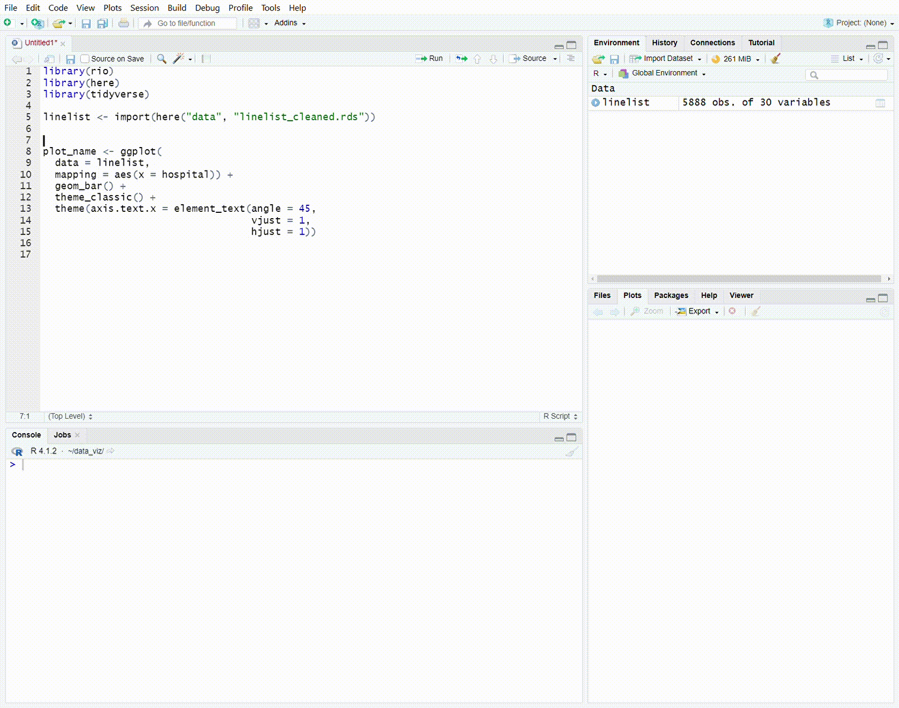
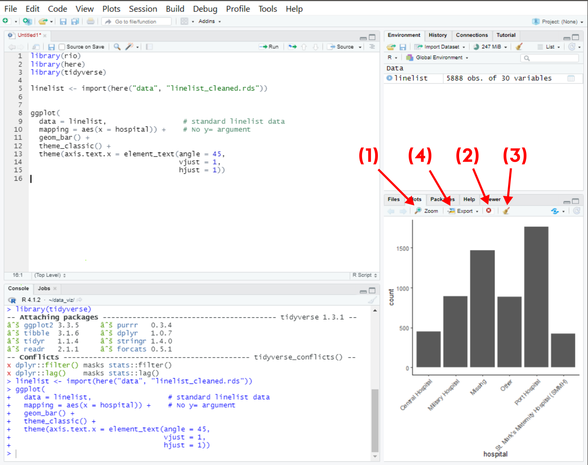

<!-- Add JavaScript code for making the exercise code larger -->
<script language="JavaScript" src="js/exercise-font-size.js"></script>

```{r packages, include=FALSE}
# load packages ----------------------------------------------------------------
library(learnr)
library(gradethis)
library(janitor)
library(stringr)
library(dplyr)
library(magrittr)
library(tidyr)
library(epikit)
library(lubridate)
library(ggrepel)
library(ggExtra)
library(scales)
library(gtsummary)
library(ggpubr)
library(flair)
library(gghighlight)
library(RColorBrewer)
library(cowplot)
library(Hmisc)
library(datasets)
# library(RMariaDB)        # connect to sql database

```

<!-- NOTES: To edit images, edit them in the "images" folder that lives NEXT TO THE RMD FILE -->


<!-- Add JavaScript code for making the exercise code larger -->
<script language="JavaScript" src="js/exercise-font-size.js"></script>


```{r setup, include=FALSE}
## set options for exercises and checking ---------------------------------------

## Define how exercises are evaluated 
gradethis::gradethis_setup(
  ## note: the below arguments are passed to learnr::tutorial_options
  ## set the maximum execution time limit in seconds
  exercise.timelimit = 60, 
  ## set how exercises should be checked (defaults to NULL - individually defined)
  # exercise.checker = gradethis::grade_learnr
  ## set whether to pre-evaluate exercises (so users see answers)
  exercise.eval = FALSE 
)

# ## event recorder ---------------------------------------------------------------
# ## see for details:
# ## https://pkgs.rstudio.com/learnr/articles/publishing.html#events
# ## https://github.com/dtkaplan/submitr/blob/master/R/make_a_recorder.R
# 
# ## connect to your sql database
# sqldtbase <- dbConnect(RMariaDB::MariaDB(),
#                        user = 'sander', 
#                        password = 'E9hqb2Tr5GumHHu',
#                        # user     = Sys.getenv("userid"),
#                        # password = Sys.getenv("pwd"),
#                        dbname   = 'excersize_log',
#                        host     = "144.126.246.140")
# 
# 
# ## define a function to collect data
# ## note that tutorial_id is defined in YAML
#     ## you could set the tutorial_version too (by specifying version:) but use package version instead
# recorder_function <- function(tutorial_id, tutorial_version, user_id, event, data) {
# 
#   ## define a sql query
#   ## first bracket defines variable names
#   ## values bracket defines what goes in each variable
#   event_log <- paste("INSERT INTO responses (
#                        tutorial_id,
#                        tutorial_version,
#                        date_time,
#                        user_id,
#                        event,
#                        section,
#                        label,
#                        question,
#                        answer,
#                        code,
#                        correct)
#                        VALUES('", tutorial_id,  "',
#                        '", tutorial_version, "',
#                        '", format(Sys.time(), "%Y-%M%-%D %H:%M:%S %Z"), "',
#                        '", Sys.getenv("SHINYPROXY_PROXY_ID"), "',
#                        '", event, "',
#                        '", data$section, "',
#                        '", data$label,  "',
#                        '", paste0('"', data$question, '"'),  "',
#                        '", paste0('"', data$answer,   '"'),  "',
#                        '", paste0('"', data$code,     '"'),  "',
#                        '", data$correct, "')",
#                        sep = '')
# 
#     # Execute the query on the sqldtbase that we connected to above
#     rsInsert <- dbSendQuery(sqldtbase, event_log)
# 
# }
# 
# options(tutorial.event_recorder = recorder_function)


# hide non-exercise code chunks ------------------------------------------------
knitr::opts_chunk$set(echo = FALSE, fig.align = "center", message = F, warning = F)


# data prep --------------------------------------------------------------------
#linelist_raw <- rio::import(system.file("dat/linelist_raw.xlsx", package = "epitutorials"))
linelist <- rio::import(system.file("dat/tutorial_linelist_clean.rds", package = "epitutorials"))
malaria_counts <- rio::import(system.file("dat/malaria_facility_count_data.rds", package = "epitutorials"))
```


## Welcome to Applied Epi's free self-paced R tutorial series

```{r, eval = TRUE, echo = FALSE, out.width = "100%"}
knitr::include_graphics("images/applied_epi_banner.png", error = F)
```

</br>

#### Tutorial 4: Introduction to data visualization

This is the **fourth** tutorial in the series.  

* **This tutorial teaches**: Introduction to visualization of public health and epidemiological data using the {ggplot2} R package  
* **Target audience**: Public health practitioners, epidemiologists, clinicians, and researchers who cannot access our live courses  
* **Format**: R coding is performed *within* this tutorial window  
* **Offline access**: Follow [these instructions](www.training.appliedepi.org) to download and view offline in your RStudio  

</br>

#### Our introductory R training materials  

All of our training materials focus on challenges and solutions for frontline practitioners, and are accessible to beginner audiences. Read more about our educational approach [here](training.appliedepi.org/educational-approach) 

:::: {style="display: flex;"}

::: {.tutorial}
**Self-paced tutorials:**

 
* Introduce you to the basics of R coding  
* R on your computer is **not** required  
* Help is available at our public [Applied Epi Community](http://community.appliedepi.org) forum  

:::


::: {.col data-latex="{0.05\textwidth}"}
\ 
<!-- an empty Div (with a white space), serving as
a column separator -->
:::


::: {.tutorial}
**Live courses:**  

* A more comprehensive curriculum  
* We help you navigate and use R on your computer  
* Personal support and tips from live instructors who have  
extensive frontline public health experience  


:::

::::

See our [live course offerings](www.training.appliedepi.org), [educational philosophy](https://applied-epi-training.netlify.app/educational-approach.html), and [email us](mailto:contact@appliedepi.org) for tutorial personal coaching options.  

</br>

#### About Applied Epi


:::: {style="display: flex;"}

::: {}


**[Applied Epi](www.appliedepi.org) is a nonprofit organization that supports frontline public health practitioners through accessible tools, training, and support.**  

We are a global team of 150 applied epidemiologists and public health practitioners with extensive ground-level experience.  

Our free [Epidemiologist R Handbook](www.epiRhandbook.com) is a vital resource for over **175,000 people**.  

We offer a comprehensive ecosystem of training, tools, and support:  


:::: {style="display: flex;"}

::: {}
```{r, out.width = "55%", fig.align = "left", echo=F}
knitr::include_graphics("images/teaching_icon.png")
```

**Training:**  
**[Live courses](https://appliedepi.org/live/)**  
**[Tutorials](https://appliedepi.org/tutorial/)**  
**[Case studies](https://appliedepi.org/case/)**  
:::

::: {}
```{r, out.width = "55%", fig.align = "left", echo=F}

```

**Tools:**  
**[Epi R Handbook](https://epiRhandbook.com)**  
**[R packages](https://appliedepi.org/tools/)**  
**[Sitrep templates](https://appliedepi.org/tools/)**  
:::

::: {}
```{r, out.width = "55%", fig.align = "left", echo=F}
knitr::include_graphics("images/QA_icon.png")
```

**Support:**  
**[Community forum](https:/community.appliedepi.org)**  
**[R Help Desk](https://appliedepi.org/helpdesk/)**  
**[Mentorship](https://appliedepi.org/join/)**  
:::


::::

<form target="_blank" action="https://www.paypal.com/donate" method="post" target="_top">
<input type="hidden" name="hosted_button_id" value="YTEZELC8VBXV6" />
<input type="image" src="https://github.com/appliedepi/epiRhandbook_eng/raw/master/images/donate_button_long.png" border="0" name="submit" title="PayPal - The safer, easier way to pay online!" alt="Donate with PayPal button" />

</form>


:::


::: {.col data-latex="{0.15\textwidth}"}
\ 
<!-- an empty Div (with a white space), serving as
a column separator -->
:::


::: {}
```{r, out.width = "100%", fig.align = "center", echo=F}
knitr::include_graphics("images/support-help-moz.jpg")
```
[*Image: Neale Batra*]{style="float:right"}
:::

::::


</br>

#### Acknowledgements and partners  

Authors of this tutorial include:  

* David Jorgensen  
* Neale Batra  

Funding for this tutorial was provided by Médecins Sans Frontières (MSF) / Doctors without Borders and TEPHINET.  


:::: {style="display: flex;"}

::: {}
```{r, out.width = "85%", fig.align = "center", echo=F}
knitr::include_graphics("images/msf-logo.jpg")
```
:::


::: {.col data-latex="{0.05\textwidth}"}
\ 
<!-- an empty Div (with a white space), serving as
a column separator -->
:::


::: {}
```{r, out.width = "85%", fig.align = "center", echo=F}
knitr::include_graphics("images/tephinet-logo.png")
```

:::

::::


### License {.unnumbered} 

<a rel="license" href="http://creativecommons.org/licenses/by-nc-sa/4.0/"></a> Applied Epi Incorporated, 2022 <br />This work is licensed by Applied Epi Incorporated under a <a rel="license" href="http://creativecommons.org/licenses/by-nc-sa/4.0/">Creative Commons Attribution-NonCommercial-ShareAlike 4.0 International License</a>.  


**Click "Next Topic" to move to the next section of the tutorial, or navigate using the Table of Contents on the left.**  


## About this tutorial


### Learning objectives

In this tutorial you will learn and practice:  

* The variety of data visualizations possible with R  
* The "grammar of graphics" approach to data visualization  
* The basics of building a data visualization in R with the {ggplot2} package  
* How to customize and edit plots to achieve the look you want  


#### Accompanying resources

This tutorial draws from chapters of our free [Epidemiologist R handbook](https://epirhandbook.com/en/) such as [ggplot basics](https://www.epirhandbook.com/en/ggplot-basics.html), [ggplot tips](https://www.epirhandbook.com/en/ggplot-tips.html), and [epidemic curves](https://www.epirhandbook.com/en/epidemic-curves.html).  


#### Next steps  

After completing this tutorial, we recommend you complete our tutorial on "Descriptive tables".  


### Review a dataset  

Because this tutorial is self-contained within this window, we will often ask you to look at the first few rows of practice datasets in the format below.  

Below, the dataset `linelist` is displayed. It contains `r nrow(linelist)` rows, but we are only showing the **first 25 rows** now. A "linelist" is a term used in applied epidemiology to refer to a table that contains key information about each case or suspect case in an outbreak. Each row represents one case, and the columns contain variables such as age, sex, date of symptom onset, outcomes, etc.  

* Scroll to the right to see all the columns  
* Use the numbers buttons in the lower-right to page through the additional available rows (25 rows in this case)  
* Click a column name to sort the rows  
* Filter rows by clicking/typing in the empty box above the column  

```{r, echo=FALSE, eval=TRUE, message = FALSE, warning = FALSE}
DT::datatable(head(linelist, 25), rownames = FALSE, filter="top", options = list(pageLength = 5, scrollX=T), class = 'white-space: nowrap' )
```


### Getting help  

To get help while completing this tutorial:  

1) Look for expandable green helper text  
2) Look for "hints" and "solutions" above the coding boxes   
3) Post a question in [Applied Epi Community](www.community.appliedepi.org) in the category for questions about Applied Epi Training  


### Helper text  

Here is what the "helper text" will look like. Click on it to expand the text.

<!--
NOTE: Below is the hint (all within details tags collapsed)
-->
<details>

<summary style='text-decoration: underline; color: darkgreen;'>`r fontawesome::fa("lightbulb", fill = "gold")` Click to read more</summary>
</br>

Here there will be some helpful tips or advice!


</br>
</details>


### Code boxes  

This tutorial does not assume that you have R or RStudio working on your computer. Therefore, you can complete coding exercises in these codeboxes within the tutorial. For example:  

**Type the following R command in the codebox and press "Submit answer"**. This command will cross-tabulate observations from the dataset `linelist` (displayed above), placing gender in the output table's rows and case definition in the output table's columns.  

```
tbl_cross(data = linelist, row = gender, col = case_def)
```

* Press "Hints" to see hints or tips  
* Press "Run code" to run the code to preview the result  
* Press "Start over" to revert the box to its original state  
* Press "Submit answer" to submit your code and compare it against the solution  


<!-- ```{r ex-demo-setup, echo=FALSE, eval=FALSE} -->
<!-- linelist <<- rio::import(system.file("dat/surveillance_linelist_20141201.csv", package = "epitutorials")) -->
<!-- ``` -->


```{r example-codebox, exercise = TRUE}
Type the code here
```

```{r example-codebox-hint, eval = FALSE, exercise = FALSE}
Type the code exactly as written, into the codebox. Then press Run
```

```{r example-codebox-hint2, eval = FALSE, exercise = FALSE}
tbl_cross(data = linelist, row = gender, col = case_def)
```

```{r example-codebox-solution, exercise = FALSE}
tbl_cross(data = linelist, row = gender, col = case_def)
```

```{r example-codebox-check, exercise = FALSE}
grade_this_code("Correct, you should see a cross-tabulation of the linelist, in which gender is in the rows and case definition is in the columns.")
```

</br>

`r fontawesome::fa("exclamation", fill = "red")` If you get the error: `It looks like this might not be valid R code...` try typing the code instead of copy/pasting into the codebox.  


### Quiz questions  

Please complete the quiz questions that you encounter throughout the tutorial. **Answering will help you** to comprehend the material, and will also help us to improve the exercises for future students.  

To practice, please answer the following questions:  

```{r quiz-use-helper, echo=F}
quiz(
  question_radio("When should I view the code hints and solutions?",
    answer("After trying to write the code myself", correct = TRUE),
    answer("Before I try coding", correct = FALSE),
    correct = "Reviewing best-practice code after trying to write yourself can help you improve",
    incorrect = "Please attempt the exercise yourself, or use the hint, before viewing the answer."
  )
)
```


```{r quiz-anxious, echo = FALSE}
question_numeric(
 "How anxious are you about beginning this tutorial - on a scale from 1 (least anxious) to 10 (most anxious)?",
 answer(10, message = "Try not to worry, we will help you succeed!", correct = T),
 answer(9, message = "Try not to worry, we will help you succeed!", correct = T),
 answer(8, message = "Try not to worry, we will help you succeed!", correct = T),
 answer(7, message = "Try not to worry, we will help you succeed!", correct = T),
 answer(6, message = "Ok, we will get there together", correct = T),
 answer(5, message = "Ok, we will get there together", correct = T),
 answer(4, message = "I like your confidence!", correct = T),
 answer(3, message = "I like your confidence!", correct = T),
 answer(2, message = "I like your confidence!", correct = T),
 answer(1, message = "I like your confidence!", correct = T),
 allow_retry = TRUE,
 correct = "Thanks for sharing. ",
 min = 1,
 max = 10,
 step = 1
)
```


### Icons  

You will see these icons throughout the exercises:

Icon  |Meaning
------|--------------------
`r fontawesome::fa("eye", fill = "darkblue")`|Observe  
`r fontawesome::fa("exclamation", fill = "red")`|Alert!  
`r fontawesome::fa("pen", fill = "brown")`|An informative note  
`r fontawesome::fa("terminal", fill = "black")`|Time for you to code!  
`r fontawesome::fa("window-restore", fill = "darkgrey")`|Change to another window  
`r fontawesome::fa("bookmark", fill = "orange")`|Remember this for later  


### Getting help on Applied Epi Community  

Our other site [Applied Epi Community](www.community.appliedepi.org) is a public Q&A and discussion forum. You can post a question in the category "Applied Epi Training" about the content in these tutorials. A member of the community may help you by voluntarily answering your question.  

* Be sure to clearly reference which tutorial and which question you are stuck on  
* Explain what you have already tried to do  
* Thank anyone who replies for their time  


## Data visualization in R  

Visualizing multi-dimensional data well is a balance of *art* and *science*.  

Visualization is one of the most important parts of a statistical analysis as it allows you to share what you have achieved and, when done correctly, can help to explain complex work and concepts to a wider audience of stakeholders or the general public. Exploratory visualization can also be a key step when understanding new data or with analyses you are conducting.  


### Examples of data visualization in R  

Below are plots that were all created with R. You too can make plots as beautiful as these, but you must begin with the fundamentals.  

### Epidemic curves  

```{r, out.width = "75%", fig.align = "center", fig.show='hold', echo=F}
knitr::include_graphics("images/epicurve_top.png")
```

[Source: Epi R Handbook](www.epiRhandbook.com)

### Age pyramids  

Age pyramids are very easy to make with R. This age pyramid actually plots *two* separate datasets over each other, to show the age/sex distribution of cases as compared to the underlying population.  

```{r, out.width = "100%", fig.align = "center", fig.show='hold', echo=F}
knitr::include_graphics("images/pop_pyramid_baseline.png")
```

[Source: Epi R Handbook](www.epiRhandbook.com)

### Reporting completeness - heat plot  

This heat plot shows the proportion of heath facilities reporting complete surveillance data to the district office, over time.  

```{r, out.width = "75%", fig.align = "center", fig.show='hold', echo=F}
knitr::include_graphics("images/heat_tile.png")
```

[Source: Epi R Handbook](www.epiRhandbook.com)

### Diagrams  

Simple and complex flow charts and diagrams can also be made with R, such as this one that reflect the flow of patients and information during an outbreak response.  

```{r, out.width = "50%", fig.align = "center", fig.show='hold', echo=F}
knitr::include_graphics("images/flow_chart.png")
```

[Source: Epi R Handbook](www.epiRhandbook.com)


### Mapping  

One major asset of R's plotting capability is the capacity to produce stunning and reproducible GIS maps.  

```{r, out.width = "100%", fig.align = "center", fig.show='hold', echo=F}
knitr::include_graphics("images/swiss_map.png")
```

[Source](https://timogrossenbacher.ch/2016/12/beautiful-thematic-maps-with-ggplot2-only/)


### Phylogenetic trees  

There are many R packages that assist you with analyzing and visualizing phylogenetic trees and other genetic data.  

```{r, out.width = "100%", fig.align = "center", fig.show='hold', echo=F}
knitr::include_graphics("images/phylo.jpg")
```

[Source](https://www.biostars.org/p/200489/)


### The importance of visualization  

Summary statistics are vital in an analysis, but sometimes do not tell the entire story. Visualizing data can reveal important differences and trends that otherwise would have gone unnoticed.  

Below is a famous example of four different datasets ("Anscombe's quartet"), which have the same summary statistics (e.g. means) and linear line of best fit - *yet, when the data are plotted as points reveal very different patterns*. This highlights the importance of visualization when dealing with new or unknown data.  


```{r anscombe, fig.height=8, message = F, warning = F}
p1 <- ggplot(anscombe) +
  geom_point(aes(x1, y1), color = "darkorange", size = 1) +
  scale_x_continuous(breaks = seq(0,20,2)) +
  scale_y_continuous(breaks = seq(0,12,2)) +
  expand_limits(x = 0, y = 0) +
  labs(x = "x1", y = "y1",
       title = "Dataset 1" ) +
  theme_classic()

p2 <- ggplot(anscombe) +
  geom_point(aes(x2, y2), color = "green4", size = 1) +
  scale_x_continuous(breaks = seq(0,20,2)) +
  scale_y_continuous(breaks = seq(0,12,2)) +
  expand_limits(x = 0, y = 0) +
  labs(x = "x2", y = "y2",
       title = "Dataset 2" ) +
  theme_classic()

p3 <- ggplot(anscombe) +
  geom_point(aes(x3, y3), color = "dodgerblue", size = 1) +
  scale_x_continuous(breaks = seq(0,20,2)) +
  scale_y_continuous(breaks = seq(0,12,2)) +
  expand_limits(x = 0, y = 0) +
  labs(x = "x3", y = "y3",
       title = "Dataset 3" ) +
  theme_classic()

p4 <- ggplot(anscombe) +
  geom_point(aes(x4, y4), color = "magenta3", size = 1) +
  scale_x_continuous(breaks = seq(0,20,2)) +
  scale_y_continuous(breaks = seq(0,12,2)) +
  expand_limits(x = 0, y = 0) +
  labs(x = "x4", y = "y4",
       title = "Dataset 4" ) +
  theme_classic()


p1_fitted <- p1 + geom_abline(intercept = 3.0001, slope = 0.5001, color = "blue")+ labs(caption = str_glue("mean x = {mean(anscombe$x1)} \n mean y = {round(mean(anscombe$y1),2)}"))+   theme(plot.caption = element_text(color = "blue", size = 12, face = "italic")) + lims(y = c(0,15), x = c(0,20))
p2_fitted <- p2 + geom_abline(intercept = 3.001, slope = 0.500, color = "blue")+ labs(caption = str_glue("mean x = {mean(anscombe$x2)} \n mean y = {round(mean(anscombe$y2),2)}"))+   theme(plot.caption = element_text(color = "blue", size = 12, face = "italic"))+ lims(y = c(0,15), x = c(0,20))
p3_fitted <- p3 + geom_abline(intercept = 3.0025, slope = 0.4997, color = "blue")+ labs(caption = str_glue("mean x = {mean(anscombe$x3)} \n mean y = {round(mean(anscombe$y3),2)}"))+   theme(plot.caption = element_text(color = "blue", size = 12, face = "italic"))+ lims(y = c(0,15), x = c(0,20))
p4_fitted <- p4 + geom_abline(intercept = 3.0017, slope = 0.499, color = "blue") + labs(caption = str_glue("mean x = {mean(anscombe$x4)} \n mean y = {round(mean(anscombe$y4),2)}"))+   theme(plot.caption = element_text(color = "blue", size = 12, face = "italic"))+ lims(y = c(0,15), x = c(0,20))


joint <- plot_grid(p1_fitted, p2_fitted,
                          p3_fitted, p4_fitted,
             ncol = 2)

title <- ggdraw() + 
  draw_label(
    "Four datasets with the same simple descriptive statistics\nbut different distributions (Anscombe's quartet)",
    fontface = 'bold',
    x = 0,
    hjust = 0
  ) +
  theme(
    # add margin on the left of the drawing canvas,
    # so title is aligned with left edge of first plot
    plot.margin = margin(0, 0, 0, 7)
  )
plot_grid(
  title, joint,
  ncol = 1,
  # rel_heights values control vertical title margins
  rel_heights = c(0.1, 1)
)

```

*Figure adapted from [Debosruti Dutta](https://rpubs.com/debosruti007/anscombeQuartet)*


## Setup  


### Install and Load R packages {#packages}

The first coding step of any cleaning process is to install and/or load all the R packages that will be used.  

We've pre-loaded the packages for this tutorial, but if writing an R script it is best to do this at the very top of the script, so that any reviewer can quickly see which packages are used.

If you are unfamiliar with this `pacman::p_load()` command, review the earlier tutorial on R basic syntax. In brief, this command will automatically install R packages if they are not already installed, *and* load them for use.  

Installation and loading of packages is described in the Epi R Handbook content on [Packages](https://epirhandbook.com/en/r-basics.html#packages) and [Suggested packages for public health](https://epirhandbook.com/en/suggested-packages-1.html).  

In this tutorial we use the following packages. Below they are written in a vertical style, with explanatory # comments to the right.  

The {ggplot2} package is installed/loaded within the {tidyverse} family of packages.  


```{r load-package-solution, echo=TRUE, eval = FALSE}
# install/load packages for use in the tutorial
pacman::p_load(
  rio,           # importing data  
  here,          # relative file pathways  
  janitor,       # data cleaning and tables
  epikit,        # age categories
  lubridate,     # working with dates
  ggExtra,       # extra functions for plotting
  apyramid,      # age pyramids
  scales,        # formatting of plot scales
  gghighlight,   # nice highlighting features for ggplot
  tidyverse      # includes ggplot2 and other data management packages
)
```


### Import data {#import}  

In this tutorial, we have pre-loaded the data. But if you were writing in an R script, your next command would be to import the "raw" or "unclean" data from where it is stored on your computer.  

As explained in the previous tutorial, we strongly recommend organizing your work within an [RStudio project](https://epirhandbook.com/en/r-projects.html). In this way, the "paths" to your data files will not break when used on different computers.  

Below is an command that imports the file "linelist.rds", which is located in the RStudio project's "data" folder. The .rds file is R's file type that stores column classes - so we know this is a dataset that has been previous cleaned in R.  

* The `here()` function, from the {here} package, creates the file path which automatically adjusts to whichever computer it is run on  
* The `import()` function, from the {rio} package, imports the data into R - no matter if it is .csv, .xlsx, .rds, etc.  
* The `<-` assignment operator stores the imported dataset in R as the object `linelist_raw` for later reference  

```{r import-demo-subfolder, echo=T, eval=F}
linelist <- import(here("data", "linelist.rds"))
```

You can read more in our Basics tutorial and in the [Epi R Handbook](https://www.epirhandbook.com/en/import-and-export.html) about how RStudio projects, the {here} package, and the {rio} package can be efficiently used together to make the data import process very easy!


## {ggplot2} in RStudio  

In this tutorial we code within chunks inside of this tutorial module. In reality you will likely be running your R code with the popular **R** coding environment **RStudio**.

When we run a plotting command in RStudio the code will run in the console (as with any other R code) but you will not see the output here. The output will be passed to the "Plots" tab. By default this is in the bottom right quadrant of RStudio alongside the "Files", "Packages", "Help" and "Viewer" tabs:

```{r, fig.margin = TRUE, echo = FALSE, fig.width = 3, out.width = "100%", fig.cap = ""}
knitr::include_graphics("images/RStudioplottab.PNG")
```

Sometimes, we use the assignment operator `<-` to save our plot with a name in our R environment. In this case the plot will only print when we run a separate command containing the name of the plot:  

```{r, eval = TRUE, echo = FALSE,out.width = "100%"}

```


### Plot handling buttons  

In the RStudio plots pane there are some buttons worth knowing about:  


```{r, fig.margin = TRUE, echo = FALSE, fig.width = 3, out.width = "100%", fig.cap = ""}

```

To see your plot in a larger window you can click on "Zoom" **(1)**  

We can also remove plots from the plot tab using the red X button to remove the current plot **(2)** or the little brush to remove all previous plots **(3)**. 

The "Export" button **(4)** allows us to save plots to a file or copy to our clipboard to paste elsewhere. Sometimes, this feature can unexpectedly capture only part of a plot, so usually it is best to save/export with the function `ggsave()`. This gives more options than exporting via the RStudio window and is also useful to save multiple plots from the same code.  


### `ggsave()`  

`ggsave()` can work in two ways:  

* Specify the name of the plot object, then the file path and name with extension  
    * For example: `ggsave(plot_name, path = here("plots", "plot_name.png"))`
* Run the command with only a file path, to save the last plot that was printed  
    * For example: `ggsave(path = here("plots", "plot_name.png"))`

You can export as png, pdf, jpeg, tiff, bmp, svg, or several other file types, by specifying the file extension in the file path.

You can also specify the arguments `width =`, `height =`, and `units =` (either “in”, “cm”, or “mm”). You can also specify `dpi =` with a number for plot resolution (e.g. 300). See the function details by entering `?ggsave` or reading the [documentation online](https://ggplot2.tidyverse.org/reference/ggsave.html).  


## A grammar of graphics

### Why use {ggplot2}  

There are a variety of visualization options within the R software, but in this tutorial and the Epi R Handbook we focus on the {ggplot2} package available within the {tidyverse} family of R packages. This is the visualization package of choice for many epidemiologists because it :  

* Is good for fast data exploration (especially with large numbers of parameters)
* Produces very high quality outputs which can be used directly in publications or reports
* Has well structured and consistent syntax (easy to apply to many plots once you learn the basics)  
* Benefits from additional R packages that extend its functionality  


### Grammar of graphics

The "grammar of graphics" refers to the basic structure of {ggplot2} commands, in which elements of the plot are created and sequentially "added" to one another in individual lines of code. This grammar incorporates actions as basic as specifying the dataset and columns to use, through extremely specific design adjustments.  


In {ggplot2} we build a plot by "adding" commands on top of one another with a "+" symbol, which specify plot layers and design elements. A standard plot will follow this order:  

1. **"Open" the plot** with the `ggplot()` command and specify the dataset
2. **"Map" data columns** to "aesthetic" features of the plot such as axes, color, size, shape fill, transparency etc. 
3. **Add "geom" layers** to visualize your data in the desired way (geometries such as bars, points, or boxplots)  
4. **Modify "scales"** such as color choices and axis breaks
5. **Add "theme" design elements** to your plot such as axis labels, title, captions, fonts, text sizes, background themes and the orientation of different elements

```{r grammar-graphics-pyramid, fig.margin = TRUE, echo = FALSE, fig.width = 3, out.width = "50%", fig.cap = ""}
knitr::include_graphics("images/gg_pyramid.png", error = F)
```


"Adding" layers to your plot is done literally by ending a line in the ggplot command with the `+` symbol. This indicates that you wish to add further details on the following line. This can be repeated until your complete plot is built.  

Using this line-by-line syntax allows your code to be more readable, both for you to make changes in the future and to others trying to understand your work.  

Additionally we can add line breaks within lines of ggplot code, this is useful to highlight when you are specifying a different argument of the plot and leads to more readable plots, you will see examples of this throughout the tutorial. These line breaks are not necessary for the code to run but are useful to help yourself and others understand the code.

```{r quiz1}
quiz(
  question("What is the most basic building block of data vizualisation?",
    answer("Statistics"),
    answer("Scale"),
    answer("Data", correct = TRUE),
    answer("Visualisation type"),
    allow_retry = TRUE
  ),
  question("Sub-components of ggplot2 commands are linked together by what symbol?",
    answer("`%>%`", message = "You have selected the 'pipe' operator, which is used in data management generally, but not within ggplot commands."),
    answer("`*`"),
    answer("`$`", message = "You can selected an indexing operator used to select a column from a data frame, which is generally not used within ggplot commands."),
    answer("`+`", correct = TRUE, message = "Yes, the plus symbol is used to link sub-commands within a ggplot command."),
    allow_retry = TRUE
  )
)
```

In the following sections we will put this into practice step-by-step.


## "Open" the plot  

The {ggplot2} package is built around the **R** function `ggplot()` which is the first command for any ggplot. 
Running `ggplot()` in your R console should generate a blank canvas:

```{r blank-plot, exercise = TRUE}
ggplot()
```

```{r blank-plot-check}
grade_this_code("correct, you should see a blank canvas loaded by ggplot2")
```

```{r blank-plot-solution, eval= FALSE}
ggplot()
```


In this step, we also typically specify the data frame (R's word for a dataset) to use, by placing the `data = ` argument inside the parentheses. In our example, the data frame is called `linelist`:  

```{r ggplot data, echo=T, eval=F}
ggplot(data = linelist)
```


If you are familiar with the pipe operator (`%>%`) from our data cleaning tutorial, data can also be *piped into* a ggplot command using a pipe:  

```{r pipe, eval=F, echo=T}
linelist %>%
  ggplot()
```

At this stage, neither of these approaches to specifying the data will change the blank canvas:  

```{r blank-plot2, exercise = TRUE}
ggplot(data = linelist)
```

```{r blank-plot2-check}
grade_this_code("correct, you should see a blank canvas loaded by ggplot2")
```

```{r blank-plot2-solution, eval= FALSE}
ggplot(data = linelist)
```


## Mapping columns to aesthetics  

### Aesthetics  

Now that we have a canvas, we must tell R what to plot. We begin by "mapping" columns in our dataset to certain "aesthetics" of the plot.  

"Aesthetics" are plot features related to the displayed data, such as position, color, and shape. Note this word "**aes**thetics" - as the root **aes** becomes part of the R command we will use.  

The first argument of `ggplot()` is `data = `. The second argument is `mapping = aes()`, in which you **map columns in the data to plot aesthetics.** The `mapping = ` argument of `ggplot()` is atypical in that you must provide the values to it *within the `aes()` function.*  

> `mapping = aes(x = COLUMN, y = COLUMN)`  

Remember that this code above is occurring *within* the `ggplot()` function. The `mapping = aes()` itself IS the second expected argument to `ggplot()`.  


### Axes  

Typically, the first aesthetic mappings are to *assign columns from the dataset to the axes*. 

For example, by mapping the column `age` to the x-axis, every row in the data is evaluated and each case may be placed on a different x-axis position according to their age.  

Below, we set the axes X and Y to the age and height columns from the linelist data. You can see this represented on the axes scales, which now have titles and values. Note that no data is yet displayed.  

```{r aes, echo=T, eval=T}
ggplot(data = linelist, mapping = aes(x = age_years, y = ht_cm))
```

In the codebox below, edit the code such that the y-axis reflects *temperature* rather than height. Clicking "Run code" will run what you have entered and produce an output. To check your answer against the solution click "Submit Answer". If you need help, click the "Hints" button above the code chunk to get a hint to the solution. You can also ask a question in our [Community Forum](www.community.appliedepi.org).  

The columns names of the `linelist` data are printed below so that you can find the correct column name to use.  

```{r echo=TRUE, eval=TRUE}
names(linelist)
```
 

```{r axes-plot, exercise = TRUE}
ggplot(data = linelist, mapping = aes(x = age_years, y = ht_cm))
```

```{r axes-plot-check}
grade_this_code("correct, you should now see temperature on the y axis")
```

```{r axes-plot-hint}
The temperature column is named temp
```

```{r axes-plot-solution, eval= FALSE}
ggplot(data = linelist, mapping = aes(x = age_years, y = temp))
```

`r fontawesome::fa("pen", fill = "brown")` *Note: You may see `aes()` written in ggplot code without the `mapping = ` argument name. As with any R function the argument names do not need to be written as long as they are written in the order expected by the function. For clarity here we include `mapping = ` but if you see code elsewhere without this, it achieves the same result.*


## Add geoms  

Next we need to declare *how* we want our data to be visualized - that is, which geometric shapes to use (e.g. points, bars, boxplots, lines, etc.).  

To "add" geometry, we extend our `ggplot()` command with a `+` symbol and write one of the "geom" functions below, such as `geom_point()`. Adding the function `geom_point()` to the `ggplot()` command visualizes each row in the data as a point, using the defined X and Y aesthetic mappings. Note that the `+` appears after the close of the `ggplot()` parentheses.  

```{r simple_plot, echo=T, message = T, warning = T}
ggplot(data = linelist, mapping = aes(x = age_years, y = wt_kg))+
  geom_point()
```

*You will see a warning when running this code reproduced above. This is {ggplot2} warning you that it is dropping rows with missing values from the plot.*  


### Other geom functions  

There are many "geom" functions that you can use, and each displays the data using different shapes.  

All these functions follow the common format of `geom_XXXX()`, where XXXX is replaced with a type of geometry. For example, `geom_line()` for lines, `geom_bar()` for bar plots. Geom functions can also create auxiliary plot components, such as `geom_text()` for text labels, or `geom_hline()` for horizontal lines (e.g. to mark a threshold). A full list of available {ggplot2} geoms can be found in the [ggplot reference document](ggplot2.tidyverse.org/reference/) and many more can be added by installing additional packages.  

Some common "geoms" for epidemiological data are listed below:


Shape           |{ggplot2} geom function                
----------------|--------------------
Histograms      |`geom_histogram()`
Points          |`geom_point()`  
Lines           |`geom_line()` or `geom_path()`  
Bar plots       |`geom_bar()` or `geom_col()`  
Box plots       |`geom_boxplot()`  
Violin plots    |`geom_violin()`  
Trend lines     |`geom_smooth()`


Below, we replace `geom_point()` with `geom_histogram()`, to show the distribution of the continuous variable `age`. A histogram only requires a single column of data, so we map `age` to the x-axis. But something is missing from the code below, preventing the histogram from being displayed - can you spot what is missing and fix it?  

```{r axis-plot, exercise = TRUE, warning=F, message=F}
ggplot(data = linelist, mapping = aes(x = age))
  geom_histogram()
```

```{r axis-plot-check}
grade_this_code("Correct, we need to link the commands together with a '+'")
```

```{r axis-plot-hint}
remember we need to add layers to our ggplot with a specific symbol
```

```{r axis-plot-solution, eval= FALSE}
ggplot(data = linelist, mapping = aes(x = age)) +
  geom_histogram()
```


### Newlines and indentations  

Indentations, spaces, and newlines within a ggplot command do not impact code execution, and can improve readability. The following commands all produce the same plot:  

This command is entirely horizontal, and does not use best practice spacing.
```{r, echo = TRUE, eval = FALSE, tidy = FALSE}
ggplot(data=surv,mapping=aes(x=age,y=ht_cm))+geom_point()
```

This approach begins to introduce proper spacing, and some new lines:  

```{r, echo = TRUE, eval = FALSE, tidy = FALSE}
ggplot(data = surv,
       mapping = aes(x = age_years, y = ht_cm)) +
geom_point()
```

Finally, here is our recommended approach:  

```{r, echo = TRUE, eval = FALSE, tidy = FALSE}
ggplot(
  data = surv,        # use case linelist
  mapping = aes(      # make aesthetic mappings for all geoms
    x = age_years,          # assign x-axis to age column
    y = ht_cm)) +     # assign y-axis to height
geom_point()          # display data as points
```

Note how the third more vertical coding approach looks similar to a "table of contents". It makes clear which argument belong to parts of the greater ggplot command, and allows explanatory comments to be typed to the left of each specific component.  

Ultimately, your approach is a stylistic choice. Try a few approaches until you find a style that makes the most sense for you.  


## More aesthetics

Recall that ggplot "aesthetics" are elements of the plot that control how the data are displayed. In the previous section we saw examples in which columns in the data were mapped to the x-axis and y-axis (e.g. scatter plots) and a plot that only had an x-axis mapping (e.g. histograms). 

Aside from the plot axes, other common aesthetics include:

Aesthetic    |What it controls                
-------------|---------------------------------------------------
`shape =`      |Display of point as dot, star, triangle, square...
`fill =`       |The *interior* color (e.g of bar or boxplot)  
`color =`      |The color of points and lines, or the outline of bars and boxplots  
`size =`       |Line thickness, point size...
`alpha =`      |Transparency: 0 (invisible) to 1 (opaque) 
`width =`      |Width of "bar plot" bars
`linetype =`   |Either solid, dashed, dotted, etc.  
`binwidth =`   |Width of histogram bins  


Importantly, plot aesthetics can be assigned values **statically**, or **dynamically**. Let's explore each of these:  

### Static aesthetic assignments  

We use the term "static" because in this approach the aesthetic is assigned to a single, unchanging value (e.g. `"orange"`, `2`, or `0.5`). This results in *the same display for all plotted data*. To make a static aesthetic assignment:  

1. The assignment is made to **a single value** (can be character, numeric, etc.)  
2. The assignment must occur **outside the `mapping = aes()` argument**  

Below, the `color = ` aesthetic of the points is assigned the value `"orange"`, and as a result *all the points* are colored orange. Note that this assignment is **not** made within the `mapping = aes()`, but rather with the `geom_point()` function.  

```{r plot-color, echo=T, warning=F, message=F}
ggplot(
  data = linelist,
  mapping = aes(
    x = age_years,
    y = ht_cm)) +
geom_point(color = "orange")
```

*NOTE: when we assign a character value such as the fixed color orange, we need to use quotation marks (`"orange"`) whereas when we are mapping an aesthetic to a column name we do not use quotation marks*


### Dynamic aesthetic assignments  

Alternatively, we can provide a *column name* for the aesthetic assignment, resulting in the aesthetic display being dynamic - potentially different for every observation in the data. To have a dynamic aesthetic:  

1. The assignment is made to a **column name**, without quotes  
2. The assignment is written **within the `mapping = aes()` argument** of the `ggplot()`  

We have already made dynamic assignments for the x-axis (and y-axis), but this can also be done for aesthetics like `color`. In the plot below, `color = ` is written within the `aes()` and is assigned to the column `gender`.  

Now the `color` of each point depends on the value for `gender` in that specific row of data. In effect, this "groups" the data by gender and also produces a legend on the right side of the plot.  
  
```{r dynamic-aes, warning=F, message=F, echo=T}
ggplot(
  data = linelist,
  mapping = aes(
    x = age_years,
    y = ht_cm,
    color = gender)) +
geom_point()
```

Now, apply this knowledge to a histogram. Change the code below to have the `fill ` aesthetic of the histogram determined by gender.  

```{r gender-plot, exercise = TRUE, warning=F, message=F}
ggplot(
  data = linelist,
  mapping = aes(x = age)) +
geom_histogram(fill = "orange")
```

```{r gender-plot-check}
grade_this_code("correct, we need to put the fill inside aes()")
```

```{r gender-plot-hint}
Try adding fill = gender within the aes()
Remember that you will need to also remove the static aesthetic assignment to "orange"
```

```{r gender-plot-solution, eval= FALSE}
ggplot(
  data = linelist,
  mapping = aes(
    x = age_years,
    fill = gender)) +
geom_histogram()
```

</br>

`r fontawesome::fa("exclamation", fill = "red")` If you get the error: `It looks like this might not be valid R code...` try typing the code instead of copy/pasting into the codebox.  


### Both static and dynamic aesthetics  

You may have both static and dynamic aesthetic in the same plot. Try changing this points plot such that:  

* The point `color` is determined dynamically by gender  
* The point `size` is 3 for all points  
* The `alpha` is 0.5 for all points  

```{r both-plot, exercise = TRUE, warning=F, message=F}
ggplot(
  data = linelist,
  mapping = aes(
    x = age_years,
    y = ht_cm)) +
geom_point(color = "orange")
```

```{r both-plot-check}
grade_this_code("Correct, you need color within aes(), and alpha and size outside aes()")
```

```{r both-plot-hint}
aes(color = gender)
geom_point(size = 3, alpha = 0.5)
```

```{r both-plot-solution, eval= FALSE}
ggplot(
  data = linelist,
  mapping = aes(
    x = age_years,
    y = ht_cm,
    color = gender)) +
geom_point(size = 3, alpha = 0.5)
```

*NOTE: Here you assign `size` and `alpha` to fixed values outside of the `mapping = aes()` argument, but these can also be mapped to columns if desired.*


We will cover different color options later and how to change the colors assigned to your data. Basic colors for static mapping are built-in with **ggplot2**:

```{r ggplot-default-cols, fig.height=15, fig.with=12}
d=data.frame(c=colors(), y=seq(0, length(colors())-1)%%66, x=seq(0, length(colors())-1)%/%66)
ggplot() +
scale_x_continuous(name="", breaks=NULL, expand=c(0, 0)) +
scale_y_continuous(name="", breaks=NULL, expand=c(0, 0)) +
scale_fill_identity() +
geom_rect(data=d, mapping=aes(xmin=x, xmax=x+1, ymin=y, ymax=y+1), fill="white") +
geom_rect(data=d, mapping=aes(xmin=x+0.05, xmax=x+0.95, ymin=y+0.5, ymax=y+1, fill=c)) +
geom_text(data=d, mapping=aes(x=x+0.5, y=y+0.5, label=c), colour="black", hjust=0.5, vjust=1, size=2)
```

A range of point shapes are also available in R, these can be used to set point shapes. Note that the shapes with blue centers can have both `fill` (interior) and `color` (outline) aesthetics specified.

```{r shapes}
ggpubr::show_point_shapes()

```

As with the other aesthetics, we have seen that `shape` can be dynamic. Below the point `shape` is assigned to the column `gender`, and the color to `case_def`. Note the two legends that appear on the right.  

```{r dynamic-shape, warning=F, message=F, echo=T}
ggplot(
  data = linelist,
  mapping = aes(
    x = age_years,
    y = wt_kg,
    shape = gender,      # shape by gender
    color = case_def)) +  # color by case definition
geom_point(
  size = 3,              # all points are size 3
  alpha = 0.3)           # all points are mostly transparent
```

Below, the points are all assigned to shape 21 - the circle with both an exterior `color` and an interior `fill`. Below we assign the color as "black" and the fill to the column `case_def`.  

```{r static-shape, warning=F, message=F, echo=T}
ggplot(
  data = linelist,
  mapping = aes(
    x = age_years,
    y = wt_kg,
    fill = case_def)) +  # interior fill of points by case definition
geom_point(
  shape = 21,            # all points are circles that can be filled
  color = "black",       # all points have black outline
  size = 3,              # all points are size 3
  alpha = 0.3)           # all points are mostly transparent
```


### Inheritance of aesthetic mappings  

Below are some rules about how aesthetic assignments are inherited (or not) by lower components of a ggplot command:  

1. Dynamic mappings in the initial `ggplot()` call will apply to subsequent geoms, *unless otherwise overwritten*  
2. Static aesthetics (e.g. color = "blue") are not inherited by subsequent geoms  
3. Aesthetic mappings written within one geom apply only to that geom

Point 3 above alludes to a variation in ggplot coding that we have not yet shown you - the fact that the `mapping = aes()` can be placed in multiple geoms. For simplicity, in the above examples we have written the `mapping = aes()` only in the top part of the `ggplot()` command. In truth, this argument can be written in any of the geoms, but typically this is only done in complex ggplot commands involving multiple data frames.  


```{r quiz_aes}
quiz(
  question("Where are dynamic aesthetics placed in ggplot code?",
    answer("inside aes()", correct = T),
    answer("outside aes()")
  ),
  question("Are static aesthetics in the initial ggplot() call inherited by subsequent geoms?",
    answer("No", correct = TRUE),
    answer("Yes")
  ),
  question("Are dynamic aesthetics in the initial ggplot() call inherited by subsequent geoms?",
    answer("No"),
    answer("Yes", correct = TRUE)
  )
)
```


## Facets  

While dynamic aesthetics are a good way of showing groups in your data, another way is by *faceting*. Also called "small-multiples", faceting produces individual plots for each unique value in a column passed to the function `facet_wrap()`. Place a tilde "~" before the column name in the command.  

Below, we create facets the source of infection (the column `souce`). Note that we write a "~" before the column name we want to facet by, otherwise we will get an error message. This symbol can be interpreted as the word "by".  

```{r facet-wrap, echo=T, warning=F, message=F}
ggplot(
  data = linelist,
  mapping = aes(x = date_onset)) +
geom_histogram() +
facet_wrap(~source)
```


### Free axes  

By default, `facet_wrap()` uses the same axes scales in all of the plots. This behavior can be turned off using the `scales = ` argument with one of the following values:  

1. "free_y"
2. "free_x"
3. "free" (both x and y)

```{r facet-wrap-free, echo=T, warning=F, message=F}
ggplot(
  data = linelist,
  mapping = aes(x = date_onset)) +
geom_histogram() +
facet_wrap(
  ~source,
  scales = "free_y")
```

**Free axes are generally not recommended as they can mislead an audience not carefully checking your plots** Note how in the plot above, a casual glance at the epidemic curves might lead you to think that they represent similar numbers of cases, when in fact the scales are quite different!  


### Facet rows and columns  

Within the `facet_wrap()` function, you can also control the number of columns or rows of plots produced with `ncol = ` and `nrow = `.  

Try editing the below code, which facets the histogram by the column `hospital_clean`:

1. Add a "free_y" free y axis
2. Have only 2 columns of plots  
3. Assign `fill =` to the column `source` of infection (tip: review the aesthetic mapping section above)  

```{r facet-test, exercise = TRUE, warning=F, message=F}
ggplot(
  data = linelist,
  mapping = aes(x = date_onset)) +
geom_histogram() +
facet_wrap(
  ~hospital_clean,
  ncol = 4)
```

```{r facet-test-check}
grade_this_code("correct, we remove the scales argument, change ncol to 2 and add fill = source to the mapping = aes() of the histogram")
```

```{r facet-test-hint}
1. Add the argument scales = "free_y" to facet_wrap()
2. Adust ncol = 
3. We want to specify fill = source inside the aes() mapping for the histogram
```

```{r facet-test-solution, eval= FALSE}
ggplot(
  data = linelist,
  mapping = aes(x = date_onset)) +
geom_histogram(mapping = aes(fill = source)) +
facet_wrap(
  ~hospital_clean,
  scales = "free_y",
  ncol = 2)
```


### Facet by two variables

As mentioned before, the tilde "~" signifies the word "by". This means that you actually facet by *two columns*, by writing their names on either side of the ~.  

If you do this within `facet_wrap()`, the levels of the two columns are combined into facet titles appearing alphabetically or by factor level.  

```{r multidimension facet wrap, echo=T, warning=F, message=F, fig.height=7}
ggplot(
  data = linelist,
  mapping = aes(x = date_onset)) +
geom_histogram(mapping = aes(fill = source)) +
facet_wrap(hospital_clean ~ gender)
```

To improve on this layout you can instead use the `facet_grid()` command:  

```{r multidimension facet grid, echo=T, warning=F, message=F, fig.height=7}
ggplot(
  data = linelist,
  mapping = aes(x = date_onset)) +
geom_histogram(mapping = aes(fill = source)) +
facet_grid(hospital_clean ~ gender)
```

### Drop levels from facets

The easiest way to drop unwanted levels from your facet plot is to remove them in advance with `filter()` or `drop_na()`, functions you will have seen in the data cleaning tutorial.

For ease we can pipe this amended data straight into `ggplot()` rather than saving the changes as a new object for plotting.

```{r dropping, echo=T, warning=F, message=F, fig.height=10}
# begin with the linelist
linelist %>% 
   drop_na(gender, hospital_clean) %>%  # drop rows with NA gender and hospital 

# pipe filtered linelist into the ggplot() command
# note: no data= argument needed
ggplot(mapping = aes(x = date_onset, fill = source)) +
geom_histogram() +
facet_grid(hospital_clean ~ gender)
```


### `gghighlight()`

{ggplot2} can be accompanied by extension packages such as {gghighlight}. This package has a useful function `gghighlight()` when used with facets and epidemic curves, can serve to show faceted epidemics within the context of the larger epidemic.  

```{r gghighlight, echo=T, warning=F, message=F}
ggplot(
  data = linelist,
  mapping = aes(
    x = date_onset,
    fill = hospital_clean)) +
geom_histogram() +
facet_wrap(~hospital_clean) +
gghighlight()

```

`gghighlight()` can also be added to other types of plots. Here we specify we want to highlight the 15-19 year olds in some data grouped from the linelist.


```{r gghighlight-other, echo=T, warning=F, message=F}
# begin with the linelist
linelist %>% 
  
  # create daily counts by age group
  count(date_onset, age_cat) %>%
  drop_na(date_onset) %>% 

  # create line plot
  ggplot(
    mapping = aes(
      x = date_onset,                    # x-axis is date
      y = n,                             # y-axis determined by the daily counts
      color = age_cat)) +                # lines colored by age category
  geom_line() +
  gghighlight(age_cat %in% c("15-19"))+  # highlight the 15-19 year olds
  theme(legend.position = "none")        # remove legend for clarity
```

Check the handbook for [more information on grouping data](https://epirhandbook.com/en/grouping-data.html)

Editing the facet title strips is touched on in the themes section of this tutorial, see [this short tutorial](https://www.datanovia.com/en/blog/how-to-change-ggplot-facet-labels/) for more information on this. 
The order of the facets can be adjusted by faceting by a factor and [reordering the levels](https://forcats.tidyverse.org/reference/fct_relevel.html). This is covered for barplots in the barplot section of the tutorial.

facet quiz - ways to group data - aesthetic and facet
can you think of situations where facets are preferred?
facet_wrap vs facet_grid

Below is a short quiz on facets, these are free text questions so there are no wrong answers, let us know what you think!  


```{r rhetorical1, echo = FALSE}
question_text(
  "When would you use a facet rather than an aesthetic?",
  answer_fn(function(value) {
    if (grepl(paste(letters, collapse = "|"), value)) {
      correct("")
    }
  }, )
)
```


```{r rhetorical2, echo = FALSE}
question_text(
  "When would you use a facet_wrap() instead of facet_grid()?",
  answer_fn(function(value) {
    if (grepl(paste(letters, collapse = "|"), value)) {
      correct("Facet grid is most useful for 2 discrete variables, where you are see all or most combinations of these two variables in your data. To split by one variable with a lot of levels or just to provide an additional aesthetic without cluttering the plot facet_wrap may be more useful.")
    }
  }, )
)
```


## Scales  

Scale commands replace defaults for how aesthetics are displayed such as:  

* *Which* colors or shapes to display  
* *How* date or proportions are written in axis labels  
* The min/max and frequency of axes breaks  

As a generic formula, these commands are written as: **scale**_*aesthetic*_*method*().

1. `scale_` : this prefix never changes
2. *aesthetic*: `_fill_` , `_color_` , `_x_` , `_y_` , etc.
3. *method*: `_continuous()`, `_discrete()`, `_manual()`, `_date()`, etc.

Some examples of scale commands:  

What you want to adjust  |Scale command
--------------------|-------------------
continuous y-axis   |`scale_y_continuous()`
date x-axis         |`scale_x_date()`  
categorical x-axis  |`scale_x_discrete()`  
fill, continuous    |`scale_fill_continuous()`
fill, continuous    |`scale_fill_gradient()`  
color, manual assignment|`scale_color_manual()`  

You may notice that above we show two different ways to create a continuous color gradient. `scale_*_continuous` works with pre-built gradient palettes, `scale_*_gradient()` creates a 2 color gradient, whereas `scale_*_gradient2` allows you to also set a midpoint color between these two, and `scale_gradientn()` allows you to create more complex palettes. More information on these functions is [available here](r-graphics.org/recipe-colors-palette-continuous).  

Let's practice adjusting scales in the following sections of this tutorial.  


### Default scales


Below, we create a bar plot using `geom_bar()`, which creates bars reflecting the number of rows per unique `outcome`, with the `fill` (internal bar color) by `gender`. You can see the default fill colors and y-axis breaks.  

```{r, eval=T, echo=T, warning = F, message = F}
ggplot(
  data = linelist,
  mapping = aes(
    x = outcome,
    fill = gender)) +
geom_bar()
```

We can adjust the color and y-axis scales of this plot with their respective scale functions, added with a `+` to the end of our `ggplot()`.  


### Adjust fill

Below, we adjust the `fill` color of the bars *manually* with `scale_fill_manual()`. Manual means that we provide manual color assignments for each of the `fill` values, which in this case come from the column `gender` ("m" and "f"). We provide these assignments to the argument `values = `, wrapped within a vector created with `c()`.  

Note that to assign a color to the `NA` values we specify this with the separate argument `na.value = ` within `scale_fill_manual()`. 


```{r, eval=T, echo=T, warning = F, message = F}
ggplot(
  data = linelist,
  mapping = aes(
    x = outcome,
    fill = gender)) +
geom_bar() +
scale_fill_manual(        
  values = c(
   "m" = "violetred", 
   "f" = "aquamarine"),
   na.value = "green")
```


Wow! The colors above are quite ugly! Edit the code below, and try changing the color for "m" to "dodgerblue" and "f" to "tomato" for a nicer color combination. Also set the color for `NA` to be "grey".  

```{r manual-color, exercise = TRUE, warning=F, message=F}
ggplot(
  data = linelist,
  mapping = aes(
    x = outcome,
    fill = gender)) +
geom_bar() +
scale_fill_manual(        
  values = c(
   "m" = "violetred", 
   "f" = "aquamarine"),
   na.value = "green")
```

```{r manual-color-check}
grade_this_code("Correct! We can edit the values to specify any manual color combination we want")
```

```{r manual-color-solution, eval= FALSE}
ggplot(
  data = linelist,
  mapping = aes(
    x = outcome,
    fill = gender)) +
geom_bar() +
scale_fill_manual(        
  values = c(
    "m" = "dodgerblue",
    "f" = "tomato"),
  na.value = "grey")
```


#### Built-in color palettes

R and {ggplot2} come with a number of built-in color palettes. We can use `scale_fill_brewer()` to access the following palettes for the `fill`, rather than manually specifying our own colors. Within `scale_fill_brewer()` you can provide one of the following abbreviations to the `palette = ` argument, and again choose a color for `na.value = ` if you wish.  

```{R brewerpal, fig.height=8}
RColorBrewer::display.brewer.all()

```

The middle group of palettes are most appropriate for discrete values like those in our bar chart.

```{r brewer_eg, eval= T, echo=T, warning = F, message = F}
ggplot(
  data = linelist,
  mapping = aes(
    x = outcome,
    fill = gender)) +
geom_bar() +
scale_fill_brewer(palette = "Pastel2",
                  na.value = "grey")
```

A color-blind friendly palette is also available in the package {viridis}. This comes in discrete and continuous forms `scale_fill_viridis_d()` and `scale_fill_viridis_c()`:

```{r viridis_eg, eval= T, echo=T, warning = F, message = F}
ggplot(
  data = linelist,
  mapping = aes(
    x = outcome,
    fill = gender)) +
geom_bar() +
scale_fill_viridis_d(na.value = "grey")
```

Try applying what you have learned to add a continuous viridis palette to the following plot. Be aware that here we are dealing with a `color` rather than `fill` aesthetic, so you will need to modify your scale command slightly. It is best practice to also specify an `na.value = `

```{r pal-color, exercise = TRUE, warning=F, message=F}
ggplot(
  data = linelist,
  mapping = aes(
    x = age_years,
    y = wt_kg,
    color = temp)) +
geom_point() 
```

```{r pal-color-check}
grade_this_code("Correct! we need to specify we want a color scale, viridis palette and have continuous data (scale_color_viridis_c)")
```

```{r pal-color-hint}
+ scale_color_viridis_c(na.value = "grey")

```

```{r pal-color-solution, eval= FALSE}
ggplot(
  data = linelist,
  mapping = aes(
    x = age_years,
    y = wt_kg,
    color = temp)) +
geom_point() +
scale_color_viridis_c(na.value = "grey")
```

Want to learn more? Read about the [viridis](https://cran.r-project.org/web/packages/viridis/vignettes/intro-to-viridis.html) functions and try with `option = "plasma"` or "inferno". Viridis and [colorbrewer](https://www.r-graph-gallery.com/38-rcolorbrewers-palettes.html) palette functions can be added to any ggplot.  


### Adjusting y-axis

Axis scales can be edited in a similar way. In our bar plot, we have a continuous y-axis and discrete x-axis. We might decide that the intervals on the y-axis are not descriptive enough, so we wish to supply our own break points. 

By adding `scale_y_continuous()` we can adjust the y-axis breaks using the {base} function `seq()` to define a numeric sequence. The function `seq()` accepts a `from = `, `to = `, and `by = ` values, and produces a vector of values that are used by the scale command. For example:  

```{r, echo=T, eval=T}
seq(from = 0, to = 400, by = 25)
```

We can supply this vector to the argument `breaks = ` in the `scale_y_continuous` function to achieve exactly the breaks that we want.  

```{r axis-breaks, eval= T, echo=T, warning = F, message = F}
ggplot(
  data = linelist,
  mapping = aes(
    x = outcome,
    fill = gender)) +
geom_bar() +
scale_fill_viridis_d(na.value = "grey") +
scale_y_continuous(breaks = seq(from = 0,
                                to = 400,
                                by = 25))
```


### Starting scales at 0 

You may have noticed that by default, your plots can appear to be "floating in the air". {ggplot2} has a behavior of expanding your y-axis beyond the data, with a gap between the values and the axis at the bottom. This can be fixed within a scales command by using the `expand = ` argument.  

Below, we add `expand = c(0,0)` in the `scales_y_continuous()` function. Note the subtle difference between the outcome and the previous plot.  

```{r axis-end, eval= T, echo=T, warning = F, message = F}
ggplot(
  data = linelist,
  mapping = aes(
    x = outcome,
    fill = gender)) +
geom_bar() +
scale_fill_viridis_d(na.value = "grey") +
scale_y_continuous(breaks = seq(from = 0,
                                to = 400,
                                by = 25),
                   expand = c(0,0))
```

Below, try applying the same `expand = c(0,0)` to the *discrete* x-axis. You will need to add another scale command...

```{r expand, exercise = TRUE, warning=F, message=F}
ggplot(
  data = linelist,
  mapping = aes(
    x = outcome,
    fill = gender)) +
geom_bar() +
scale_fill_viridis_d(na.value = "grey") +
scale_y_continuous(breaks = seq(from = 0,
                                to = 400,
                                by = 25),
                   expand = c(0,0))
```

```{r expand-check}
grade_this_code("Correct! we follow the same syntax with scale_x_discrete()")
```

```{r expand-solution, eval= FALSE}
ggplot(
  data = linelist,
  mapping = aes(
    x = outcome,
    fill = gender)) +
geom_bar() +
scale_fill_viridis_d(na.value = "grey") +
scale_y_continuous(breaks = seq(from = 0,
                                to = 400,
                                by = 25),
                   expand = c(0,0)) +
scale_x_discrete(expand = c(0,0))
```


### Date axis labels

The default scale for date axis labels will vary by the range of your data. Here is an example plot, which has such a wide range of data that the axis breaks are given every 3 months:  


```{r date-x, eval= T, echo=T, warning = F, message = F}
ggplot(
  data = linelist,
  mapping = aes(x = date_onset)) +
geom_histogram()
```

Adjustment of this date axis can be done with `scale_x_date()`. The first step is to supply the `date_breaks =` argument with values like "1 week", "2 weeks", or "3 months".  

Note: these are the axis *label* breaks - they do not impact the bins of the histogram (bar widths). To adjust the histogram bins, see the [Epidemic curves](https://epirhandbook.com/en/epidemic-curves.html) chapter of the Epi R Handbook.  

For practice, try setting the date axis breaks in this plot to appear every 2 weeks:

```{r date-break, exercise = TRUE, warning=F, message=F}
ggplot(
  data = linelist,
  mapping = aes(x = date_onset)) +
geom_histogram()
```

```{r date-break-check}
grade_this_code("Good, we should be getting used to the syntax by now!")
```

```{r date-break-solution, eval= FALSE}
ggplot(
  data = linelist,
  mapping = aes(x = date_onset)) +
geom_histogram() +
scale_x_date(date_breaks = "2 weeks")
```

You may notice that the labels now appear in a defauly format: YYYY-MM-DD. We will show you how to change this in the next section...  


### Date axis labels

Exactly *how* the dates are displayed we can do in one of two ways:  

1) Specify the display format with `date_labels = ` using ["strptime" syntax](https://www.rdocumentation.org/packages/base/versions/3.6.2/topics/strptime)  
2) Use the `label_date_short()` for quick automated and efficient date labels  

#### Using "strptime" syntax  

This syntax uses abbreviations within a quotes string to organize the date elements for display. For example:  

* %d for day of the month (e.g. 21)  
* %b for 3-letter abbreviation of the month (use %B for full month name)  
* %Y for 4-digit year  

You would combine these within quote marks like this: `"%d %b %Y"`, to achieve the display DD MMM YYYY. In the example below, we also include a new line with `\n` to place the year below the day and month.

```{r date-labs, eval= T, echo = T, warning = F, message = F}
ggplot(
  data = linelist,
  mapping = aes(x = date_onset)) +
geom_histogram() +
scale_x_date(date_breaks = "2 weeks",
             date_labels = "%d %b \n %Y" )
```

See the Epi R Handbook [Epicurves](https://epirhandbook.com/epidemic-curves.html) and [Strings](https://epirhandbook.com/characters-and-strings.html) chapters for more tips.


#### Auto-efficient date labels  

There is also a simple way of setting date label display, using the [{scales}](https://scales.r-lib.org/) package. Confusingly, this is applied using the `labels = ` argument, rather than `date_labels = `, but now you know.  

Assigning `labels = ` to `label_date_short()` ensures that only the minimum necessary information is shown - in this case it means that the year is not repeated on each label.  

```{r date-short-labs, eval= T, echo = T, warning = F, message = F}
ggplot(
  data = linelist,
  mapping = aes(x = date_onset)) +
geom_histogram() +
scale_x_date(date_breaks = "2 weeks",
             labels = scales::label_date_short() )
```

### Display percentages  

The {scales} package also offers useful function to help us display percentages. The easiest approach is to store your data in decimal proportions, and then convert them to percents within the ggplot command with the function `percent()`, as supplied to the `labels = ` argument of `scale_y_continuous()`.  

To create an example, we summarise the linelist data to arrive at the monthly case fatality ratio:  


```{r CFR, echo = TRUE, eval = TRUE}
# Create new data frame of monthly case fatality ratios
CFR_data <- linelist %>% 
  
  # group the data by month
  group_by(month = floor_date(date_outcome, "month")) %>% 
  
  # create new summary table with statistics for each month 
  summarise(
    cases  = n(),
    deaths = sum(outcome == "Death", na.rm=T),
    CFR    = deaths / cases)
```

The first 4 rows are shown below:  

```{r, echo = F, eval = T}
CFR_data %>% 
  head(4) %>%
  knitr::kable()
```

Conveniently, we can simply write `labels = percent`, and ggplot will know to use this function to convert the decimal proportions to percents (assuming you have installed and loaded the {scales} package).  

```{r , echo = TRUE, eval = T, warning = F, message = F}
ggplot(
  data = CFR_data,
  mapping = aes(
    x = month,
    y = CFR)) +
geom_line(
  size = 2,
  color = "brown") +
scale_y_continuous(labels = percent)
```


## Plot labels

```{r, echo = TRUE, eval = T, warning = F, message = F}
linelist$hosp_time <- linelist$date_outcome - linelist$date_hospitalisation

ggplot(data = linelist) +
geom_point(
  mapping = aes(
    x = age_years,
    y = hosp_time,
    color = outcome),    
  alpha = 0.7) +
scale_color_brewer(
  palette = "Pastel2",
  na.value = "grey") +
ylim(c(0, 70)) +
labs(
  title = "Duration of admission",
  subtitle = "All hospitals",
  x = "Age (years)",
  y = "Duration (days)",
  caption = "Fictional Ebola data",
  color = "Outcome"
)
```


Use `labs()` as above to edit the labels on the plot
Note: to edit legend title, use the aesthetic that created the legend (e.g. `color = `).  

Here we also use `ylim()` to set the limits of the y-axis. The same terminology can be applied for the x-axis. 

We can also use `"\n"` to break lines within labels for longer names.

### Dynamic labels

We can embed code in `str_glue()` that updates with the data  

```{r, eval=T, echo=T}
str_glue("Data as of {Sys.Date()}")
```

Here we extract the current date (`Sys.Date()`) in the time zone of our computer to add to the plot.

```{r, eval=T, echo=T}
str_glue("{fmt_count(linelist, is.na(date_onset))} cases missing onset and not shown")
```

Anything wrapped in curly brackets (`{__}`) will be run as **R** code allowing us to produce labels which will update with values from our data as the data is updated. The `fmt_count()` is a useful function from {epikit} that returns nicely formatted counts and the corresponding percents.  


## Theme elements

Themes are non-data design features (background, text size/color, etc).  

### Complete themes

[These "complete themes"](https://ggplot2.tidyverse.org/reference/ggtheme.html) are easy to add.  

```{r, eval=F, echo=T}
# Try one of these...
+ theme_bw()
+ theme_classic()
+ theme_dark()
+ theme_gray()
+ theme_minimal()
+ theme_light()
+ theme_void()
```

Try adding the default themes above to this plot to see the changes:

Try the argument `base_size = 16` inside the theme command to quickly increase all text sizes.  


```{r theme_trial, exercise = TRUE, warning=F, message=F, exercise.lines = 24}
linelist$hosp_time <- linelist$date_outcome - linelist$date_hospitalisation

ggplot(data = linelist) +
geom_point(
  mapping = aes(
    x = age_years,
    y = hosp_time,
    color = outcome),    
  alpha = 0.7) +
scale_color_brewer(
  palette = "Pastel2",
  na.value = "grey") +
ylim(c(0, 70)) +
labs(
  title = "Duration of admission",
  subtitle = "All hospitals",
  x = "Age (years)",
  y = "Duration (days)",
  caption = "Fictional Ebola data",
  color = "Outcome"
)
```


```{r themes, echo=F, eval=T, warning=F, message=F, fig.height = 6}
linelist$hosp_time <- linelist$date_outcome - linelist$date_hospitalisation

plt_base <- ggplot(data = linelist) +
geom_point(
  mapping = aes(
    x = age_years,
    y = hosp_time,
    color = outcome),    
  alpha = 0.7) +
scale_color_brewer(
  palette = "Pastel2",
  na.value = "grey") +
ylim(c(0, 70))

bw <- plt_base + theme_bw() + ggtitle("theme_bw()")
classic <- plt_base + theme_classic() + ggtitle("theme_classic()")
dark <- plt_base + theme_dark() + ggtitle("theme_dark()")
gray <- plt_base + theme_gray() + ggtitle("theme_gray()")
minimal <- plt_base + theme_minimal() + ggtitle("theme_minimal()")
light <- plt_base + theme_light() + ggtitle("theme_light()")
void <- plt_base + theme_void() + ggtitle("theme_void()")


themes_plots <- cowplot::plot_grid( classic,
  bw, dark,
  gray, minimal,
  light, void,
  nrow = 3, rel_widths = c(2,2))
themes_plots

```

### Themes

Micro-adjustments to the theme can be made with `theme()` as these are mostly small layout and visual details we won't go into much detail here. More information is available [in the handbook](https://www.epirhandbook.com/en/ggplot-basics.html#ggplot_basics_themes). The syntax for themes taxes time to learn and is not used often enough to commit to memory for most R users. See [this list](https://ggplot2.tidyverse.org/reference/theme.html) of feature-specific arguments. or running `theme_get()` in your R window to get a list of all theme arguments in the console.
```{r theme-adjustment, echo = T, message = F, warning = F}
ggplot(data = linelist) +
geom_point(
  mapping = aes(
    x = age_years,
    y = hosp_time,
    color = outcome),    
  alpha = 0.7) +
scale_color_brewer(
  palette = "Pastel2",
  na.value = "grey") +
ylim(c(0, 70)) +
labs(
  title = "Duration of admission",
  subtitle = "All hospitals",
  x = "Age (years)",
  y = "Duration (days)",
  caption = "Fictional Ebola data",
  color = "Outcome"
) +
theme_classic(base_size = 16) +
theme(
  legend.position = "bottom",                # move legend to bottom
  plot.title = element_text(color = "red",   # title color
                            size = 20,       # title font size
                            face = "bold"),  # title typeface
  axis.title.y = element_text(angle = 0))    # rotate y axis title to be horizontal
```

These theme elements follow a similar 2-part syntax much like `mapping = aes()` where we pass a function to an argument of a higher level function (here `theme()`).

**Remember to add any adjustments after any pre-built themes**

some useful theme options are presented below:

`theme()` argument                  |	What it adjusts
------------------------------------|-------------------
`plot.title = element_text()`       |	The title
`plot.subtitle = element_text()`    |	The subtitle
`plot.caption = element_text()`     |	The caption (family, face, color, size, angle, vjust, hjust…)
`axis.title = element_text()`       |	Axis titles (both x and y) (size, face, angle, color…)
`axis.title.x = element_text()`     |	Axis title x-axis only (use .y for y-axis only)
`axis.text = element_text()`        |	Axis text (both x and y)
`axis.text.x = element_text()`      |	Axis text x-axis only (use .y for y-axis only)
`axis.ticks = element_blank()`      |	Remove axis ticks
`axis.line = element_line()`        |	Axis lines (colour, size, linetype: solid dashed dotted etc)
`strip.text = element_text()`       |	Facet strip text (colour, face, size, angle…)
`strip.background = element_rect()` |	facet strip (fill, colour, size…)


The main adjustments you are likely to make regularly are to do with the plot `legend.position = `. Default options are `"top"`, `"bottom"`, `"left"`, `"right"` and `"none"` (to hide the legend completely). The legend position can also be set more specifically with `c(x,y)` where x and y refer to the position along the x or y axis as a proportion of the total length (ie. bottom right is c(1,0))

Most other theme elements can also be turned off using `element_blank()` eg turn off minor y-axis grid lines and legend title:


Check your understanding of the basics of themes below:

```{r themes-quiz}
quiz(
  question("Should adjustments to the theme be made before or after setting one of the default themes?",
    answer("before"),
    answer("after", correct = TRUE)
  ),
  question("Which of the following are prebuilt themes in ggplot",
    answer("theme_bw()", correct = TRUE),
    answer("theme_classic()", correct = TRUE),
    answer("theme_red()"),
    answer("scale_color_brewer()")
  ),
  question("How would you hide a legend in ggplot?",
    answer("theme(legend.title = 'element.blank()')"),
    answer("theme(legend.position = 'right')"),
    answer("theme(legend.position(`none`))"),
    answer("theme(legend.position = 'none')", correct = TRUE)
  ),
  question("How would you set your legend to appear in the centre of your graph?",
    answer("theme(legend.position = 'middle')"),
    answer("theme(legend.position =  c(0.5,0.5))", correct = TRUE)
  )
)
```

## Practice  

Now that you have seen all of the basic building blocks of a `ggplot()` we would like you to attempt to build your own visualisation from scratch using the information in the previous sections. Feel free to use any of the aesthetics, geoms, facets and scales in the previous sections and go back to these sections to refresh as you work on this, your code should remain in the window.

We would like you to produce a plot with the same fictional Ebola linelist data as in the previous sections, a section of this data is reproduced again below:

```{r linelist-data-2}
head(linelist,25)
```

Can you think of a good way to represent the date of onset for infections by the source of infection and gender, be sure to try customizing your axis labels, title etc. to get a plot you are happy with. An example plot is provided as the answer with some comments but have a go at producing one for yourself. Once you have something you are happy with consider the questions below the exercise. If you want to know more about a certain `geom_*()` and how to use it, try using a question mark before the name of the geom to pull up the documentation for the function, e.g. `?geom_point`

```{r your_plot, exercise = TRUE, warning=F, message=F, fig.height=8}

```


```{r your_plot-solution, eval= F}
ggplot(
  data = linelist,
  mapping = aes(x = date_onset,            # X-axis is date 
                fill = gender)) +          # fill is gender
geom_histogram(binwidth = 7) +             # plot a histogram with binwidth of 7 (= 1 week)
scale_fill_brewer(palette = "Set2",        # pick a preset color palette
                  na.value = "grey",
                  labels = c("Female", "Male")) +   # Adjust labels to make them clearer  
scale_x_date(date_breaks = "3 months",     # fix overlapping date labels
             expand = c(0,0)) +            # no white space around the plotted area
scale_y_continuous(expand = c(0,0)) +      # no white space around the plotted area
facet_wrap(~source,                        # wrap by source as we have already used color for gender
           ncol = 1) +                     # one column as we are dealing with wide rather than tall plots
labs(
  title = "Cases by source of infection",
  subtitle = str_glue(
  "Weekly cases from {min(linelist$date_onset, na.rm = TRUE)}
  to {max(linelist$date_onset, na.rm = TRUE)}"),  # use str_glue to extract information ot add to the plot
  x = "Date of onset",
  y = "Number of cases",
  fill = "Gender"
) +
theme_light() +                            # pick a theme which allows the data to be clearly seen
theme(legend.position = "bottom",          # move legend to bottom so there is more width for plotting
      strip.background = element_rect(fill = "lightgrey",  # change colors of the facet strip elements
                                      color = "darkgrey"), # to make this clearer to read
      strip.text = element_text(color = "black")
)
```

```{r rhetorical3, echo = FALSE}
question_text(
  "Do you think your plot would be easily understandable at a quick glance?",
  answer_fn(function(value) {
    if (grepl(paste(letters, collapse = "|"), value)) {
      correct("Good graphics are usually interpretable within a few seconds for those familiar with standard plotting methods. This interpretation can be aided by including descriptive titles, axis labels, legends and captions as well as by not over-cluttering your plot. Do not be afraid to use facets if you feel that a plot is becoming too complex.")
    }
  }, )
)
```

```{r rhetorical4, echo = FALSE}
question_text(
  "Do you think your visualization is showing something too complex to explain with words?",
  answer_fn(function(value) {
    if (grepl(paste(letters, collapse = "|"), value)) {
      correct("This is a good way to consider data visualization, if something can easily be explained with words it likely doesn't need to be plotted unless to support other information. If a plot is explaining something which you would struggle to explain succinctly with words this means that it is an effective and valuable visualization.")
    }
  }, )
)
```

```{r rhetorical5, echo = FALSE}
question_text(
  "What do you think about the contrast in your plot? is it highlighting what you want to show?",
  answer_fn(function(value) {
    if (grepl(paste(letters, collapse = "|"), value)) {
      correct("Don't be afraid to play with colors and the different background themes in ggplot to create an effective and visually appealing visualization. It is important that associations you are trying to highlight are easily visible and noticed without further prompting.")
    }
  }, )
)
```

```{r rhetorical6, echo = FALSE}
question_text(
  "How would you improve on the example plot in the answer (reproduced below)?",
  answer_fn(function(value) {
    if (grepl(paste(letters, collapse = "|"), value)) {
      correct("This is up to you to decide! One thing which jumps out is that it doesn't mention that we are using Ebola data anywhere on the plot. This would be ok if it was to form part of a report on a certain dataset or a presentation on the progress of an Ebola outbreak but may be an issue if it is a plot to be viewed by the public or wider level stakeholders and collaborators.")
    }
  }, )
)
```


```{r your_plot-plot, eval= T, echo = F, fig.height = 8}
ggplot(
  data = linelist,
  mapping = aes(x = date_onset,            # X-axis is date 
                fill = gender)) +          # fill is gender
geom_histogram(binwidth = 7) +             # plot a histogram with binwidth of 7 (= 1 week)
scale_fill_brewer(palette = "Set2",        # pick a preset color palette
                  na.value = "grey",
                  labels = c("Female", "Male")) +   # Adjust labels to make them clearer  
scale_x_date(date_breaks = "3 months",     # fix overlapping date labels
             expand = c(0,0)) +            # no whit space around the plotted area
scale_y_continuous(expand = c(0,0)) +      # set limits for the y-axis scale
facet_wrap(~source,                        # wrap by source as we have already used color for gender
           ncol = 1) +                     # one column as we are dealing with wide rather than tall plots
labs(
  title = "Cases by source of infection",
  subtitle = str_glue(
  "Weekly cases from {min(linelist$date_onset, na.rm = TRUE)}
  to {max(linelist$date_onset, na.rm = TRUE)}"),  # use str_glue to extract information ot add to the plot
  x = "Date of onset",
  y = "Number of cases",
  fill = "Gender"
) +
theme_light() +                            # pick a theme which allows the data to be clearly seen
theme(legend.position = "bottom",          # move legend to bottom so there is more width for plotting
      strip.background = element_rect(fill = "lightgrey",  # change colors of the facet strip elements
                                      color = "darkgrey"), # to make this clearer to read
      strip.text = element_text(color = "black")
)
```

## End  


Congratulation on finishing this tutorial!  

Some additional resources are listed below. Please also see the tutorial that focuses on more complex plotting techniques and common epidemiological plots.  

Please consider making a donation to us. We are a nonprofit organization and rely on your contributions to continue supporting frontline epidemiologists around the world.


<form target="_blank" action="https://www.paypal.com/donate" method="post" target="_top">
<input type="hidden" name="hosted_button_id" value="YTEZELC8VBXV6" />
<input type="image" src="https://github.com/appliedepi/epiRhandbook_eng/raw/master/images/donate_button_long.png" border="0" name="submit" title="PayPal - The safer, easier way to pay online!" alt="Donate with PayPal button" />

</form>


For refreshers on what we have covered in this tutorial and more detailed information on {ggplot2} look at the [ggplot basics](https://epirhandbook.com/en/ggplot-basics.html) and [ggplot tips](https://epirhandbook.com/en/ggplot-tips.html) sections of the Epi R Handbook.  

Further {ggplot2} resources are plentiful with all of the documentation for individual functions available directly from the [Tidyverse website](https://ggplot2.tidyverse.org/), including a nice [cheat sheet](https://github.com/rstudio/cheatsheets/blob/main/data-visualization-2.1.pdf) which you can print as a simple refresher and reference guide.  


