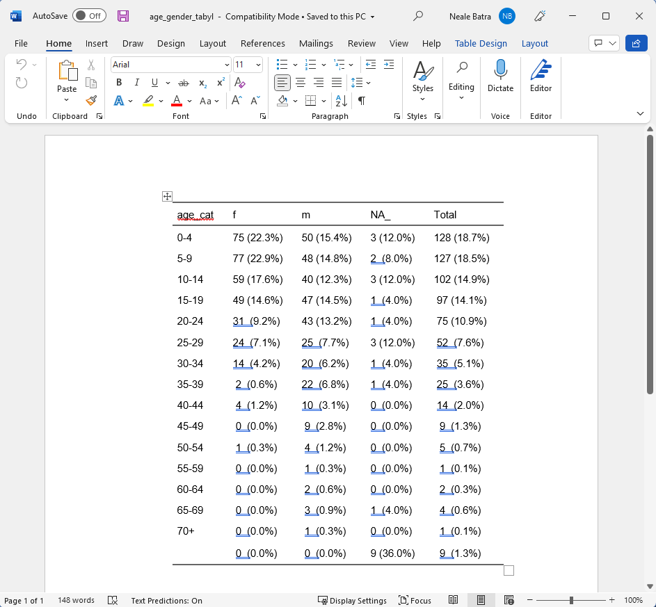

<!-- NOTES: To edit images, edit them in the "images" folder that lives NEXT TO THE RMD FILE -->


<!-- Add JavaScript code for making the exercise code larger -->
<script language="JavaScript" src="js/exercise-font-size.js"></script>

```{r setup, include=FALSE}
library(learnr)          # create lessons from rmd
library(gradethis)       # evaluate exercises
library(sortable)        # questions on choosing order of commands
library(skimr)           # dataset summary
library(dplyr)           # wrangle data
library(tidyr)           # data handling
library(janitor)         # tables and clean_names()
library(forcats)         # factors
library(lubridate)       # dates
library(stringr)         # string handling
library(epikit)          # age categories
library(flair)           # highlight code
library(ggplot2)         # visualise data
library(gtsummary)       # visualise data
library(flextable)       # html tables
library(stats)           # basic statistics
library(scales)          # for percents and such
library(fontawesome)     # for emojis
library(DT)              # present tables

# library(RMariaDB)      # connect to sql database

## set options for exercises and checking ---------------------------------------

## Define how exercises are evaluated 
gradethis::gradethis_setup(
  ## note: the below arguments are passed to learnr::tutorial_options
  ## set the maximum execution time limit in seconds
  exercise.timelimit = 60, 
  ## set how exercises should be checked (defaults to NULL - individually defined)
  # exercise.checker = gradethis::grade_learnr
  ## set whether to pre-evaluate exercises (so users see answers)
  exercise.eval = FALSE 
)

# ## event recorder ---------------------------------------------------------------
# ## see for details:
# ## https://pkgs.rstudio.com/learnr/articles/publishing.html#events
# ## https://github.com/dtkaplan/submitr/blob/master/R/make_a_recorder.R
# 
# ## connect to your sql database
# sqldtbase <- dbConnect(RMariaDB::MariaDB(),
#                        user = 'sander', 
#                        password = 'E9hqb2Tr5GumHHu',
#                        # user     = Sys.getenv("userid"),
#                        # password = Sys.getenv("pwd"),
#                        dbname   = 'excersize_log',
#                        host     = "144.126.246.140")
# 
# 
# ## define a function to collect data
# ## note that tutorial_id is defined in YAML
#     ## you could set the tutorial_version too (by specifying version:) but use package version instead
# recorder_function <- function(tutorial_id, tutorial_version, user_id, event, data) {
# 
#   ## define a sql query
#   ## first bracket defines variable names
#   ## values bracket defines what goes in each variable
#   event_log <- paste("INSERT INTO responses (
#                        tutorial_id,
#                        tutorial_version,
#                        date_time,
#                        user_id,
#                        event,
#                        section,
#                        label,
#                        question,
#                        answer,
#                        code,
#                        correct)
#                        VALUES('", tutorial_id,  "',
#                        '", tutorial_version, "',
#                        '", format(Sys.time(), "%Y-%M%-%D %H:%M:%S %Z"), "',
#                        '", Sys.getenv("SHINYPROXY_PROXY_ID"), "',
#                        '", event, "',
#                        '", data$section, "',
#                        '", data$label,  "',
#                        '", paste0('"', data$question, '"'),  "',
#                        '", paste0('"', data$answer,   '"'),  "',
#                        '", paste0('"', data$code,     '"'),  "',
#                        '", data$correct, "')",
#                        sep = '')
# 
#     # Execute the query on the sqldtbase that we connected to above
#     rsInsert <- dbSendQuery(sqldtbase, event_log)
# 
# }
# 
# options(tutorial.event_recorder = recorder_function)

# data prep (must be in setup chunk) --------------------------------------------------------------------
 
# linelist_raw <- rio::import(system.file("dat/surveillance_linelist_20141201.csv", package = "epitutorials")) %>% 
#   select(-bmi, -case_def) %>% 
#   mutate(age = as.numeric(age)) %>% 
#   mutate(hospital = na_if(hospital, ""))
# 
# # create epilink column
# linelist_raw <- linelist_raw %>% 
#   mutate(epilink = sample(
#     c(rep("yes", .85 * nrow(linelist_raw)),
#       rep("no", .10 * nrow(linelist_raw)),
#       rep(NA, .05 * nrow(linelist_raw))),
#     size = nrow(linelist_raw), replace = TRUE)
#     ) %>% 
#   
# # create lab confirmed
#   mutate(lab_confirmed = sample(
#     c(rep(TRUE, .75 * nrow(linelist_raw)),
#       rep(FALSE, .15 * nrow(linelist_raw)),
#       rep(NA, .10 * nrow(linelist_raw))),
#     size = nrow(linelist_raw), replace = TRUE)
#     )
# 
# # Randomly convert some temperatures to Fahrenheit instead of celcius for an exercise later
# set.seed(1)
# take_these <- sample(1:nrow(linelist_raw), 42)
# linelist_raw$temp[take_these] <- (linelist_raw$temp[take_these] * 9/5) + 32

linelist <- rio::import(system.file("dat/tutorial_linelist_clean.rds", package = "epitutorials"))

# hide non-exercise code chunks ------------------------------------------------
knitr::opts_chunk$set(echo = FALSE)

```


## Welcome to Applied Epi's free self-paced R tutorial series

```{r, eval = TRUE, echo = FALSE, out.width = "100%"}
knitr::include_graphics("images/applied_epi_banner.png", error = F)
```

</br>

#### Tutorial 5: Summary tables

This is the **fifth** tutorial in the series.  

* **This tutorial teaches**: Summarising public health data into descriptive tables in R  
* **Target audience**: Public health practitioners, epidemiologists, clinicians, and researchers who cannot access our live courses  
* **Format**: R coding is performed *within* this tutorial window  

</br>

#### Our introductory R training materials  

All of our training materials focus on challenges and solutions for frontline practitioners, and are accessible to beginner audiences. Read more about our educational approach [here](https://appliedepi.org/eduapproach/) 

:::: {style="display: flex;"}

::: {.tutorial}
**Self-paced tutorials:**

 
* Introduce you to the basics of R coding  
* R on your computer is **not** required  
* Help is available at our public [Applied Epi Community](http://community.appliedepi.org) forum  

:::


::: {.col data-latex="{0.05\textwidth}"}
\ 
<!-- an empty Div (with a white space), serving as
a column separator -->
:::


::: {.tutorial}
**Live courses:**  

* A more comprehensive curriculum  
* We help you navigate and use R on your computer  
* Personal support and tips from live instructors who have  
extensive frontline public health experience  


:::

::::

See our [live course offerings](https://appliedepi.org/live/), [educational philosophy](https://appliedepi.org/edapproach/), and [email us](mailto:contact@appliedepi.org) for tutorial personal coaching options.  

</br>

#### About Applied Epi


:::: {style="display: flex;"}

::: {}


**[Applied Epi](https://appliedepi.org/) is a nonprofit organization that supports frontline public health practitioners through accessible tools, training, and support.**  

We are a global team of 150 applied epidemiologists and public health practitioners with extensive ground-level experience.  

Our free [Epidemiologist R Handbook](https://epiRhandbook.com) is a vital resource for over **175,000 people**.  

We offer a comprehensive ecosystem of training, tools, and support:  


:::: {style="display: flex;"}

::: {}
```{r, out.width = "55%", fig.align = "left", echo=F}
knitr::include_graphics("images/teaching_icon.png")
```

**Training:**  
**[Live courses](https://appliedepi.org/live/)**  
**[Tutorials](https://appliedepi.org/tutorial/)**  
**[Case studies](https://appliedepi.org/case/)**  
:::

::: {}
```{r, out.width = "55%", fig.align = "left", echo=F}
knitr::include_graphics("images/tools_icon.png")
```

**Tools:**  
**[Epi R Handbook](https://epiRhandbook.com)**  
**[R packages](https://appliedepi.org/tools/)**  
**[Sitrep templates](https://appliedepi.org/tools/)**  
:::

::: {}
```{r, out.width = "55%", fig.align = "left", echo=F}
knitr::include_graphics("images/QA_icon.png")
```

**Support:**  
**[Community forum](https://community.appliedepi.org)**  
**[R Help Desk](https://appliedepi.org/helpdesk/)**  
**[Mentorship](https://appliedepi.org/join/)**  
:::


::::

<form target="_blank" action="https://www.paypal.com/donate" method="post" target="_top">
<input type="hidden" name="hosted_button_id" value="YTEZELC8VBXV6" />
<input type="image" src="https://github.com/appliedepi/epiRhandbook_eng/raw/master/images/donate_button_long.png" border="0" name="submit" title="PayPal - The safer, easier way to pay online!" alt="Donate with PayPal button" />

</form>


:::


::: {.col data-latex="{0.15\textwidth}"}
\ 
<!-- an empty Div (with a white space), serving as
a column separator -->
:::


::: {}
```{r, out.width = "100%", fig.align = "center", echo=F}

```
[*Image: Neale Batra*]{style="float:right"}
:::

::::


</br>

#### Acknowledgements and partners  

Authors of this tutorial include:  

* Arran Hamlet  
* Neale Batra  

Funding for this tutorial was provided by Médecins Sans Frontières (MSF) / Doctors without Borders and TEPHINET.  


:::: {style="display: flex;"}

::: {}
```{r, out.width = "85%", fig.align = "center", echo=F}

```
:::


::: {.col data-latex="{0.05\textwidth}"}
\ 
<!-- an empty Div (with a white space), serving as
a column separator -->
:::


::: {}
```{r, out.width = "85%", fig.align = "center", echo=F}

```

:::

::::

### License {.unnumbered} 

<a rel="license" href="http://creativecommons.org/licenses/by-nc-sa/4.0/"></a> Applied Epi Incorporated, 2022 <br />This work is licensed by Applied Epi Incorporated under a <a rel="license" href="http://creativecommons.org/licenses/by-nc-sa/4.0/">Creative Commons Attribution-NonCommercial-ShareAlike 4.0 International License</a>.


**Click "Next Topic" to move to the next section of the tutorial, or navigate using the Table of Contents on the left.**  


## About this tutorial


### Learning objectives

In this tutorial you will learn and practice three methods for making descriptive tables in R:  

* Creating simple, fast tables with the `tabyl()` function from the {janitor} package  
* Creating custom tables for specific calculations with the {dplyr} package  
* Creating publication-ready tables with the {gtsummary} package  


#### Accompanying resources

This tutorial draws from chapters of our free [Epidemiologist R handbook](https://epirhandbook.com/en/) such as [Descriptive tables](https://epirhandbook.com/en/descriptive-tables.html) and [Tables for presentation](https://epirhandbook.com/en/tables-for-presentation.html).  


#### Next steps  

If you want further support, we recommend you post questions on [Applied Epi Community](community.appliedepi.org) or inquire about our R Help Desk by emailing **contact@appliedepi.org**.  


### Review a dataset  

Because this tutorial is self-contained within this window, we will often ask you to look at the first few rows of practice datasets in the format below.  

Below, the dataset `linelist` is displayed. It contains `r nrow(linelist)` rows, but we are only showing the **first 25 rows** now. A "linelist" is a term used in applied epidemiology to refer to a table that contains key information about each case or suspect case in an outbreak. Each row represents one case, and the columns contain variables such as age, sex, date of symptom onset, outcomes, etc.  

* Scroll to the right to see all the columns  
* Use the numbers buttons in the lower-right to page through the additional available rows (25 rows in this case)  
* Click a column name to sort the rows  
* Filter rows by clicking/typing in the empty box above the column  

```{r, echo=FALSE, eval=TRUE, message = FALSE, warning = FALSE}
DT::datatable(head(linelist, 25), rownames = FALSE, filter="top", options = list(pageLength = 5, scrollX=T), class = 'white-space: nowrap' )
```


### Getting help  

To get help while completing this tutorial:  

1) Look for expandable green helper text  
2) Look for "hints" and "solutions" above the coding boxes   
3) Post a question in [Applied Epi Community](www.community.appliedepi.org) in the category for questions about Applied Epi Training  


### Helper text  

Here is what the "helper text" will look like. Click on it to expand the text.

<!--
NOTE: Below is the hint (all within details tags collapsed)
-->
<details>

<summary style='text-decoration: underline; color: darkgreen;'>`r fontawesome::fa("lightbulb", fill = "gold")` Click to read more</summary>
</br>

Here there will be some helpful tips or advice!


</br>
</details>


### Code boxes  

This tutorial does not assume that you have R or RStudio working on your computer. Therefore, you can complete coding exercises in these codeboxes within the tutorial. For example:  

**Type the following R command in the codebox and press "Submit answer"**. This command will cross-tabulate observations from the dataset `linelist` (displayed above), placing gender in the output table's rows and case definition in the output table's columns.  

```
tbl_cross(data = linelist, row = gender, col = case_def)
```

* Press "Hints" to see hints or tips  
* Press "Run code" to run the code to preview the result  
* Press "Start over" to revert the box to its original state  
* Press "Submit answer" to submit your code and compare it against the solution  


<!-- ```{r ex-demo-setup, echo=FALSE, eval=FALSE} -->
<!-- linelist <<- rio::import(system.file("dat/surveillance_linelist_20141201.csv", package = "epitutorials")) -->
<!-- ``` -->


```{r example-codebox, exercise = TRUE}
Type the code here
```

```{r example-codebox-hint, eval = FALSE, exercise = FALSE}
Type the code exactly as written, into the codebox. Then press Run
```

```{r example-codebox-hint2, eval = FALSE, exercise = FALSE}
tbl_cross(data = linelist, row = gender, col = case_def)
```

```{r example-codebox-solution, exercise = FALSE}
tbl_cross(data = linelist, row = gender, col = case_def)
```

```{r example-codebox-check, exercise = FALSE}
grade_this_code("Correct, you should see a cross-tabulation of the linelist, in which gender is in the rows and case definition is in the columns.")
```

</br>

`r fontawesome::fa("exclamation", fill = "red")` If you get the error: `It looks like this might not be valid R code...` try typing the code instead of copy/pasting into the codebox.  


### Quiz questions  

Please complete the quiz questions that you encounter throughout the tutorial. **Answering will help you** to comprehend the material, and will also help us to improve the exercises for future students.  

To practice, please answer the following questions:  

```{r quiz-use-helper, echo=F}
quiz(
  question_radio("When should I view the code hints and solutions?",
    answer("After trying to write the code myself", correct = TRUE),
    answer("Before I try coding", correct = FALSE),
    correct = "Reviewing best-practice code after trying to write yourself can help you improve",
    incorrect = "Please attempt the exercise yourself, or use the hint, before viewing the answer."
  )
)
```


```{r quiz-anxious, echo = FALSE}
question_numeric(
 "How anxious are you about beginning this tutorial - on a scale from 1 (least anxious) to 10 (most anxious)?",
 answer(10, message = "Try not to worry, we will help you succeed!", correct = T),
 answer(9, message = "Try not to worry, we will help you succeed!", correct = T),
 answer(8, message = "Try not to worry, we will help you succeed!", correct = T),
 answer(7, message = "Try not to worry, we will help you succeed!", correct = T),
 answer(6, message = "Ok, we will get there together", correct = T),
 answer(5, message = "Ok, we will get there together", correct = T),
 answer(4, message = "I like your confidence!", correct = T),
 answer(3, message = "I like your confidence!", correct = T),
 answer(2, message = "I like your confidence!", correct = T),
 answer(1, message = "I like your confidence!", correct = T),
 allow_retry = TRUE,
 correct = "Thanks for sharing. ",
 min = 1,
 max = 10,
 step = 1
)
```


### Icons  

You will see these icons throughout the exercises:

Icon  |Meaning
------|--------------------
`r fontawesome::fa("eye", fill = "darkblue")`|Observe  
`r fontawesome::fa("exclamation", fill = "red")`|Alert!  
`r fontawesome::fa("pen", fill = "brown")`|An informative note  
`r fontawesome::fa("terminal", fill = "black")`|Time for you to code!  
`r fontawesome::fa("window-restore", fill = "darkgrey")`|Change to another window  
`r fontawesome::fa("bookmark", fill = "orange")`|Remember this for later  


### Getting help on Applied Epi Community  

Our other site [Applied Epi Community](www.community.appliedepi.org) is a public Q&A and discussion forum. You can post a question in the category "Applied Epi Training" about the content in these tutorials. A member of the community may help you by voluntarily answering your question.  

* Be sure to clearly reference which tutorial and which question you are stuck on  
* Explain what you have already tried to do  
* Thank anyone who replies for their time  


## Setup  


### Install and Load R packages {#packages}

The first coding step of any cleaning process is to install and/or load all the R packages that will be used.  

We've pre-loaded the packages for this tutorial, but if writing an R script it is best to do this at the very top of the script, so that any reviewer can quickly see which packages are used.

If you are unfamiliar with this `pacman::p_load()` command, review the earlier tutorial on R basic syntax. In brief, this command will automatically install R packages if they are not already installed, *and* load them for use.  

Installation and loading of packages is described in the Epi R Handbook content on [Packages](https://epirhandbook.com/en/r-basics.html#packages) and [Suggested packages for public health](https://epirhandbook.com/en/suggested-packages-1.html).  

In this tutorial we use the following packages. Below they are written in a vertical style, with explanatory # comments to the right.  

```{r, echo=TRUE, eval=FALSE}
pacman::p_load(
  rio,            # for importing/exporting data
  here,           # for flexible file paths
  janitor,        # for cleaning and tabulating data
  gtsummary,      # for publication-ready tables
  tidyverse)      # contains {dplyr} package for tables, data cleaning, and more
```

Note: the {tidyverse} meta-package is very useful because it includes {dplyr}, {ggplot2}, and several other packages useful for data analysis and management.  


## Import data {#import}  

In this tutorial, we have pre-loaded the data. There is no need to import any data.  

If you were writing a typical R script for public health analysis, you would likely have begun by writing a series of commands that import your "raw" or "uncleaned" data and then perform a series of cleaning steps (see the Data Cleaning tutorial). In this tutorial we will use the data that were cleaned in the Data Cleaning tutorial. 

Below is a command that could be used to import a clean dataset that was saved as a .rds file at a location on your computer.  

As explained in the first tutorial, we strongly recommend organizing your work within an [RStudio project](https://epirhandbook.com/en/r-projects.html). In this way, the "paths" to your data files will not break when used on different computers.  

Below is an command that imports the file "linelist.rds", which is located in the RStudio project's "data" folder. The .rds file is R's file type that stores column classes - so we know this is a dataset that has been previous cleaned in R.  

* The `here()` function, from the {here} package, creates the file path which automatically adjusts to whichever computer it is run on  
* The `import()` function, from the {rio} package, imports the data into R - no matter if it is .csv, .xlsx, .rds, etc.  
* The `<-` assignment operator stores the imported dataset in R as the object `linelist_raw` for later reference  

```{r import-demo-subfolder, echo=T, eval=F}
linelist <- import(here("data", "linelist.rds"))
```

You can read more in our Basics tutorial and here in the [Epi R Handbook](https://epirhandbook.com/en/import-and-export.html) about how RStudio projects, the {here} package, and the {rio} package can be efficiently used together to make the data import process very easy!


### View the data  

Here is a scollable view of the raw dataset that we just imported:  

```{r, echo=FALSE, eval=TRUE, message = FALSE, warning = FALSE}
DT::datatable(head(linelist, 25), rownames = FALSE, filter="top", options = list(pageLength = 5, scrollX=T), class = 'white-space: nowrap' )
```


## Descriptive tables

The ability to create summary tables of counts, proportions, percents, and more nuanced statistics is vital to the job of an applied epidemiologist or public health practitioner. Sometimes, we create table using "raw" data in order to understand which values need to be cleaned. Other times, we want to prepare a table for a presentation or report.  

```{r rhetorical2, echo = FALSE}
question_text(
  "How often do you produce summary tables, how long does it usually take, and how often do errors result? Could R help reduce your workload and prevent errors?",
  answer_fn(function(value) {
    if (grepl(paste(letters, collapse = "|"), value)) {
      correct("Thank you for your answer")
    }
  }, )
)
```


There are a number of R packages that can be used to make tables, including {janitor}, {dplyr}, {gtsummary}, {rstatix} and {base} R. Each of these have advantages and disadvantages, and the tool you use will depend on factors such as code simplicity, customizeability and the desired output (for further manipulation in R, or to produce a figure for a report/publication).  

In this tutorial we will focus on these three options:  

* Use `tabyl()` from {janitor} to produce and "adorn" simple tabulations and cross-tabulations
* Use `summarize()` and `count()` from {dplyr} for more complex statistics, tidy data frame outputs or preparing data for `ggplot()`
* Use `tbl_summary()` from {gtsummary} to produce detailed publication-ready tables

It is also worthwhile to know about the options below. They will not be covered in this tutorial but are described in the tables and stats chapters of the [Epi R Handbook](www.epiRhandbook.com):  

* Use `get_summary_stats()` from {rstatix} to easily generate data frames of numerical summary statistics from multiple columns or groups
* Use `table()` from **base** R if you do not have access to the above packages


## Simple tables with `tabyl()`  

Often, we want just a quick tabulation of counts of a categorical variable, or simply to know "what are the unique values" in a particular column.  

The `tabyl()` function from {janitor} (pronounced similarly to "table" but spelled with a "Y") does this quickly by tabulating counts and percents of the unique values of a column. Easy customization can follow, using the related `adorn_()` functions. 

The below image of a simple wooden picnic table represents the ability of `tabyl()` to make fast, simple tables:  

```{r, out.width = "50%", fig.align = "center", echo=F}

```

The {janitor} package offers the `tabyl()` function to produce tabulations and cross-tabulations, which can be "adorned" or modified with helper functions to display percentages, proportions, counts, etc. Below we produce a "tabyl" of the unique values in the column `age_cat`. 

The command begins with the data frame (named `linelist` in this scenario), and then a "pipe operator" (`%>%`), which is used to "pass" or "send" the data to the function on the next line. If you are not familiar with the pipe operator, please review the Data Cleaning tutorial before proceeding.  

The pipe sends the `linelist` into the function `tabyl()`. This function expects at least one argument - the name of a column in the data frame. The function returns a table to the R console of all the unique values in that column, the "n" (counts, i.e. number of rows with that value), the decimal proportion (confusingly labeled as "percent" - but we will clarify this in a moment), and a final column labeled "valid" percent.  

```{r, echo = T, eval = T}
# print a summary table of the column age_cat
linelist %>%
  tabyl(age_cat)
```
It is that simple! One command and you have a detailed tabulation!  

`r fontawesome::fa("exclamation", fill = "red")` Be sure to click through, to see the entire extent of the table.  

In case you are wondering - the `valid_percent` column on the far right side of the table displays each age category's proportion of the total, *excluding missing values from the denominator of this calculation*.  

### Alternate syntax  

For those of you who are familiar with other styles of R coding, this same command can be written as below, without a pipe operator. However, we recommend that you become familiar using the pipe operator as it will be necessary for subsequent modifications of the table.  

```{r, echo = T, eval = F}
# two alternate ways of writing the tabyl() command
tabyl(linelist, age_cat)   # provide data frame first, then the column name
tabyl(linelist$age_cat)    # use the base R $ operator to distinguish data frame and column
```


### Missing values: `show_na = FALSE`  

You can adjust how missing values are displayed in the `tabyl()` with the optional argument `show_na = `, which is `TRUE` by default. If you write this argument in the `tabyl()` function and set it equal to `FALSE`, any missing values (`NA`) in the far-left column will be removed. In addition, the `valid_percent` column will be removed. 

This argument only removes missing values that are properly coded as `NA` (capital letters). For a review of how R handles missing data, see the R Basics tutorial or the Epi R Handbook chapters on [Data Cleaning](https://epirhandbook.com/en/cleaning-data-and-core-functions.html) and [Missing data](https://epirhandbook.com/en/missing-data.html).  

In the code box below, can you you write a simple `tabyl()` command to print the unique values and decimal proportions of the column `hospital_clean`?  

```{r table_hospital, exercise = TRUE}

```

```{r table_hospital-hint}
Start with the data frame, then a pipe operator, then the tabyl() function with the column name inside the function.
```

```{r table_hospital-hint-2}
linelist %>%
    tabyl(hospital_clean)
```

```{r table_hospital-check}
  grade_this({
    # Automatically pass if .result equal to .solution
    pass_if_equal()
    # Default to failing grade with feedback
    fail(message = "Look at the hints")
  })
```

```{r table_hospital-solution}
linelist %>%
    tabyl(hospital_clean)
```


```{r quiz-tabyl1}
quiz(caption = "Quiz - hospital tabulation",
  question("Based on this tabulation, how many rows are missing hospital information?",
    allow_retry = T,
    answer("102", message = "No, this is 'Other', which is not missing"),
    answer("96"),
    answer("169", correct = T, message = "In this dataset, missing values are properly coded as NA, and so appear in the table this way as well."),
    answer("Not displayed in this table", message = "No, you can see this in the table. Remember that missing values in R are properly coded as NA.")
  ),
  question("How does the table change if you add the argument show_na = FALSE (select all applicable)?",
    allow_retry = T,
    answer("No effect"),
    answer("Removes NA from the rows", correct = T, message = "Any NA (missing) values are removed from the rows of the table."),
    answer("Removes the percent column", message = "No, it is the valid_percent column that is removed, because this calculation depends on the missing values."),
    answer("Removes the valid_percent column", correct = T, message = "The valid_percent column is removed because this calculation depends on the missing values."),
    answer("Filters data to only child patients")
  )
)
```


### "Adorn" formatting  

{janitor} includes a series of "adorn" functions that can be added with a pipe after the `tabyl()` function. They allow you to customize the format of the table, for example to add totals, convert to percents, or otherwise adjust the display. Often, you will pipe the "tabyl" through several of these functions before arriving at your final table.  


| **Function**      | **Outcome** |
| ----------- | ----------- |
| `adorn_totals()`      | Adds totals (`where = ` "row", "column", "both"). You can adjust the `name = ` argument to change the word "Total"       |
| `adorn_pct_formatting()`   | Converts proportions to percents. Specify `digits =`. Remove the “%” symbol with `affix_sign = FALSE`        |
| `adorn_rounding()`   | To round proportions to `digits =` places. To round percents use `adorn_pct_formatting()` with `digits =`        |


**To practice adorning a tabyl, add the following functions to the tabyl with pipe operators, *in this order***. Run the code at each step, to observe how each function changes the table.  

* `adorn_totals()`  
* `adorn_pct_formatting()`  


```{r, table_hospital_adorn, exercise = TRUE}
linelist %>%
    tabyl(hospital_clean)
```


<!--
NOTE: Below is the solution (all within details tags collapsed)
-->

<details>
<summary style='text-decoration: underline; color: red;'>`r fontawesome::fa("check", fill = "red")`Click to see a solution (try it yourself first!)</summary>
</br>

```{r eval = F, echo=T}
linelist %>% 
  tabyl(hospital_clean) %>% 
  adorn_totals() %>% 
  adorn_pct_formatting()
```

</br>
</details>
<!--
NOTE: End of solution
-->

```{r quiz-tabyl2}
quiz(caption = "Quiz - Adorn hospital tabulation",
  question("What does the adorn_totals() function do to this table?",
    allow_retry = T,
    answer("It converts the decimals to percentages and adds a total row", message = "No, adorn_totals() only adds a total row. It does not change the decimals to percents - this is done by the adorn_pct_formatting() function."),
    answer("It adds a total row to the bottom of the table", correct = T),
    answer("It adds a total column to the right side", message = "No, when tabulation a single column, this function does not add a total column."),
    answer("It totals all the patients who died")
  ),
  question("What does the adorn_pct_formatting() function do to this table?",
    allow_retry = T,
    answer("It adds pictures to the table"),
    answer("It converts the decimal proportions to percentages, with % symbols", correct= T, message = "The decimals are converted to percents. Now the column header 'percent' aligns with the values.")
  ),
  question("What happens if you pipe the table into adorn_pct_formatting() before piping into adorn_totals()?",
    allow_retry = T,
    answer("There is no difference"),
    answer("The % columns are not totaled", correct= T, message = "The columns with % are not totaled because with that symbol they are 'character' values and not 'numeric'. Be careful of the order of your adorn_() commands!"),
    answer("An error is returned")
  )  
)
```

### Cross-tabulation

Cross-tabulation counts are achieved with `tabyl()` by writing one or more additional columns within the function. Below, we cross-tabulate `age_cat` and `gender`:  

```{r, echo = T, eval = T}
linelist %>% 
  tabyl(age_cat, gender)
```

Note that with a cross-tabulation, `tabyl()` returns *only counts* by default - proportions and percents can be added with additional steps shown below.


**Now try to cross-tabulate `district` and `hospital_clean`, by placing both column names in the `tabyl()` function, separated by a comma. Write `district` first, so that it appears as the "rows" of the table.**  

```{r cross_tab_play, exercise = TRUE}

```

```{r cross_tab_play-hint-2}
linelist %>% 
  tabyl(district, hospital_clean)
```

```{r cross_tab_play-check}
  grade_this({
    # Automatically pass if .result equal to .solution
    pass_if_equal()
    # Default to failing grade with feedback
    fail(message = "Look at the hints")
  })
```

```{r cross_tab_play-solution}
linelist %>% 
  tabyl(district, hospital_clean)
```

Now use this code box to answer the below questions:

```{r tabyl_play2, exercise = TRUE}
linelist %>% 
  tabyl(district, hospital_clean)
```


```{r quiz-tabyl3}
quiz(caption = "Quiz - hospital tabulation",
  question("If you add adorn_totals('both') to this table, what is the total number of cases from Military Hospital?",
    allow_retry = T,
    answer("15"),
    answer("99", correct = TRUE),
    answer("128"),
    answer("119")
  ),
  question("How does the tabyl() argument show_na = FALSE impact this cross-tabulation?",
    allow_retry = T,
    answer("No effect"),
    answer("Removes NA from the rows"),
    answer("Removes NA from rows and columns", correct = T, message = "Note this behavior for cross-tabulations."),
    answer("Removes NA from the columns")
  ),
  question("Why do you think there is a blank (empty) value in the districts?",
    allow_retry = T,
    answer("It is a district that has no name", message = "No, it would be very inconvenient administratively if a district did not have a name!"),
    answer("For patients missing district information, the missing value has been imported as empty space and not properly coded as NA", correct = T, message = "Yes, sometimes data imported from Excel or CSV can result in empty cells coded in the data frame as empty character space, or a single character space. These should be converted to NA in the data cleaning steps to be properly handled by R functions.")
  ),
  question("If show_na = FALSE is added to the command, what happens to the 'blank' district?",
    allow_retry = T,
    answer("It is removed", message = "No, it is not removed. The NA value in the hospital column is removed, but the blank value in the district column is not. Pick the correct answer to see an explanation."),
    answer("It is not removed", correct = T, message = "It is not removed because it is not coded as NA. Therefore, the tabyl() function does not know to treat it as a missing value.")
  )
)
```


### Adorning the cross-tabulation

Here are some more of the {janitor} `adorn_()` functions that are more typically used for cross-tabulations.  

| **Function**      | **Outcome** |
| ----------- | ----------- |
| **`adorn_percentages()`**   | Convert counts to decimal proportions, with `denominator = ` "row", "col" or "all"        |
| **`adorn_ns()`**   | Add counts to a table of proportions or percents. Indicate `position = “rear”` to show counts in parentheses, or “front” to put the percents in parentheses|
| **`adorn_title()`**   | For two-way tables, to add titles to the columns and rows|


Try to add these `adorn_()` functions to the cross-tabulation, in the order given below. Run the code to see each incremental change. See how these functions behave slightly differently on cross-tabulations than they did on tabulation of a single column.  

* `adorn_totals()`  
* `adorn_percentages()` (converts counts to decimal proportions) 
* `adorn_pct_formatting()` (converts decimal proportions to % format. Try with `digits = 0`.)  

```{r, table_agecat_2way_adorn, exercise = TRUE}
linelist %>%
    tabyl(age_cat, gender)
```


<!--
NOTE: Below is the solution (all within details tags collapsed)
-->

<details>
<summary style='text-decoration: underline; color: red;'>`r fontawesome::fa("check", fill = "red")`Click to see a solution (try it yourself first!)</summary>
</br>

Your command should look like this, at the end  
```{r eval = F, echo=T}
linelist %>%
    tabyl(age_cat, gender) %>% 
    adorn_totals() %>% 
    adorn_percentages() %>% 
    adorn_pct_formatting()
```

</br>
</details>
<!--
NOTE: End of solution
-->

Then try adding these functions to the command (only one at a time):  

* `adorn_ns()` or `adorn_ns("rear")` or `adorn_ns("front")`  

```{r, table_agecat_2way_adorn_2, exercise = TRUE}
linelist %>%
    tabyl(age_cat, gender) %>% 
    adorn_totals() %>% 
    adorn_percentages() %>% 
    adorn_pct_formatting()
```


```{r quiz11}
quiz(
  question("What happens if you adorn_pct_formatting() before adorn_percentages()?",
           answer("R returns an error", correct = F),
           answer("R begins a game of table tennis", correct = F),
           answer("The counts are converted to percentages", correct = T, message = "The resulting percentages are huge and make no sense. This is because the adorn_pct_formatting expects decimal proportions as the input.")
  ),
  question("What is the default behavior for adorn_ns(), as used after adorn_pct_formatting()?",
           answer("To place the counts in from of the percentages", correct = F),
           answer("To replace the percentages with counts", correct = F),
           answer("To place the counts in parentheses behind the percentages", correct = T)
  )
)

```


**`tabyl()` final exercise 1:**  

Can you summarize age categories (`age_cat`) in `linelist` in a table with no `NA` values, and "adorn" to show a total row and to show proportions as percentages (to 2 decimal places)?  

```{r crosstab_age, exercise = TRUE}
  
```

```{r crosstab_age-hint}
Re-read the table above if you need help deciding which "adorn" function to use in order to display age categories as a percentage
```

```{r crosstab_age-check}
  grade_this({
    # Automatically pass if .result equal to .solution
    pass_if_equal()
    # Default to failing grade with feedback
    fail(message = "Remember to drop NA values using 'show_na = FALSE'")
  })
```

```{r crosstab_age-solution}
linelist %>%
    tabyl(age_cat, show_na = FALSE) %>%
    adorn_totals() %>% 
    adorn_pct_formatting(digits = 2)
```


**`tabyl()` final exercise 2:**  

Now, create a cross-table of columns `age_cat` and `gender` with age cateogry in the rows and gender in the columns. Show the percentages by row, including a totals row. Can you use several "adorn" functions to do this? Use the hints as necessary.  


```{r crosstab_age_gender, exercise = TRUE}
  
```

```{r crosstab_age_gender-hint}
You will need to use three "adorn" functions. Remember to specify "where = " for totals, and the "denominator = " for the percentages correctly.
```

```{r crosstab_age_gender-hint-2}
After your cross-tabulation with tabyl(), try adorn_total() to get a total row, then adorn_percentages() with the denominator set to row, and finally convert to percents instead of proportions with adorn_pct_formatting()
```

```{r crosstab_age_gender-check}
  grade_this({
    # Automatically pass if .result equal to .solution
    pass_if_equal()
    # Default to failing grade with feedback
    fail()
  })
```

```{r crosstab_age_gender-solution}
linelist %>%                                  
  tabyl(age_cat, gender) %>%
  adorn_totals(where = "row") %>%
  adorn_percentages(denominator = "row") %>%
  adorn_pct_formatting()
```

```{r quiz12}
quiz(
  question("Which of these would change the row name title to 'Age category' and add a title to the groups (gender) of 'Gender'?",
           answer("adorn_totals(row_name = 'Age Category', col_name = 'Gender')", correct = F),
           answer("tabyl(row_name = 'Age Category', col_name = 'Gender')", correct = F),
           answer("adorn_title(row_name = 'Age Category', col_name = 'Gender')", correct = T, message = "Adding titles to a raw tabyl() can be a bit difficult and is not often done. If you try this, read the documentation carefully. It is more common to save the table as a pretty HTML image using {flextable} and edit the title there, as described below.")
  ),
  question("Which of these functions would add counts in front of the percentages?",
           answer("adorn_totals('front')", correct = F),
           answer("adorn_ns()", correct = F),
           answer("adorn_ns('front')", correct = T, message = "This is right! Single quote marks are treated the same as double quote marks, so you can use either around the word 'front'")
           )
  )

```

### Saving the tabyl  

Until now we have only demonstrated "printing" a table to your R console. If you want to save the table as an object in your R environment, remember that you must use the `<-` assignment operator, as shown below to save a table as `age_gender_table`.  

```{r, eval=T, echo=T}
# save the table as an R object
age_gender_table <- linelist %>% 
  tabyl(age_cat, gender)

# print the table
age_gender_table
```

Now you can reference it later, or even modify it with functions like `mutate()` or `select()` that you learned in the tutorial on Data Cleaning.  


### Printing the tabyl

By default, the tabyl will print "raw" to your R console - not a very useful format for reports or slides!  

Alternatively, you can pass the tabyl to a function from {flextable} or similar package to print as a “pretty” HTML image in the RStudio Viewer, which can then be exported and saved to a specific folder as .png, .jpeg, .html, etc.  

To do this, you will need to install and load the package {flextable} - we have already done this because we listed it in our `p_load()` command at the top of this tutorial.  

The function `qflextable()` is an easy one to use - it stands for "quick flextable".  

```{r, echo = T, eval = T}
linelist %>%
  tabyl(age_cat, gender) %>%                   # make cross-table
  adorn_totals(where = "col") %>%              # add a total column
  adorn_percentages(denominator = "col") %>%   # convert counts to proportions by column
  adorn_pct_formatting() %>%                   # convert proportions to percents
  adorn_ns(position = "front") %>%             # add the counts in front of percents  
  qflextable()                                 # ***convert to flextable***
```


There are many other steps you can take with {flextable} to make the table more beautiful, colorful, with headings and even conditional formatting. See the [Epi R Handbook chapter on Table for Presentation](https://epirhandbook.com/en/tables-for-presentation.html).  


### Saving the tabyl

If you convert the table using {flextable}, you can also save it with functions from that same package - like `save_as_html()`, `save_as_word()` (as an editable Word document), `save_as_ppt()` (to a powerpoint slide), and `save_as_image()` 

To save as a PNG image with the {flextable} function `save_as_image()`, you will need to install Phantom JS (free). You can do this by running the command `webshot::install_phantomjs()` in your R console.  

Using these functions, a file will be saved to your folder directory with this table. Here is an example that creates the table, converts it to a flextable, and then saves it as an editable Word document in the root folder of the R project.  

```{r, echo = T, eval = F}
linelist %>%
  tabyl(age_cat, gender) %>% 
  adorn_totals(where = "col") %>% 
  adorn_percentages(denominator = "col") %>% 
  adorn_pct_formatting() %>% 
  adorn_ns(position = "front") %>% 
  qflextable() %>%                               # convert to flextable
  save_as_docx(path = "age_gender_tabyl.docx")   # save as Word document to filepath
```


You can then open the table in Microsoft Word to complete your edits:

```{r, out.width = "100%", fig.align = "center", echo=F}

```

### Statistics

You can apply statistical tests on tabyls, like `chisq.test()` or `fisher.test()` from the {stats} package as shown below. Note missing values are not allowed so they are excluded from the tabyl with `show_na = FALSE`.

```{r, echo = T, eval = T}
# Create table and save it in R environment
hosp_by_outcome <- linelist %>%      
  tabyl(hospital_clean, outcome, show_na = FALSE) 

# print hosp_by_outcome table
hosp_by_outcome

# run Chi-Square test on the saved table, printing the results
chisq.test(hosp_by_outcome)


# print hosp_by_outcome with row percents
hosp_by_outcome %>% 
  adorn_percentages() %>% 
  adorn_pct_formatting() %>% 
  adorn_ns("front")
```

Statistical tests in R will be covered extensively in another tutorial, but you can always reference the [Simple statistical tests](https://epirhandbook.com/en/simple-statistical-tests.html) chapter in the Epi R Handbook, or the chapter on [regression](https://epirhandbook.com/en/univariate-and-multivariable-regression.html).  


## Custom tables with {dplyr}  

But what if you want more than just the counts and percents?  

* "What is the mean age in each group?"  
* "What is the latest date of symptom onset in each group?"  
* "What is the number of deaths among males in each group?"  

The {dplyr} package provides functions that you can use to make very custom tables of statistics by group. It is also the best tool to create summary tables that feed into `ggplot()` plots.  

### The {dplyr} package  

You are already familiar with core {dplyr} functions for data handling such as `select()`, `mutate()`, and `filter()`. The name "dplyr" is a reference to a "plier" - a hand tool for working with metal objects. This package is part of the {tidyverse} and so does not need to be loaded/installed separately from {tidyverse}.  

This package also offers the functions `count()`, `group_by()`, and `summarise()` that are frequently used to calculate specific statistics on groups in the data - resulting in custom summary tables.  

The below image of a multi-tool represents the *versatility* of this option for creating summary tables.  

```{r, out.width = "50%", fig.align = "center", echo=F}

```

### `count()`  

The most simple function from {dplyr} to produce summary tables is `count()`.  

**Try running this code:**  

```{r, count_hosp, exercise = TRUE}
linelist %>% 
  count(hospital_clean)
```

How does it compare to the simple `tabyl()` on the same column?  

**Now, run the `count()` "cross-tabulation" of the two columns `district` and `hospital`**:  

```{r, count_hosp_dis, exercise = TRUE}
linelist %>% 
  count(hospital_clean, outcome)
```

Compare the output above of `count()` to the output below from `tabyl()`.... how many rows does each have? What are the columns?  

```{r, eval=T, echo=T, warning=FALSE, message = FALSE}
linelist %>% 
  tabyl(hospital_clean, outcome)
```


```{r quiz_count1}
quiz(
  question("How does the count() output differ from the 'cross-tabulation' produced by tabyl()?",
           answer("No difference", correct = F),
           answer("The count() table is in a 'long' format, with all the counts in one column", correct = T, message = "A 'long' table adheres to the principles of tidy data by having one row per observation, and one column per variable (variable being an underlying characteristic being measured)"),
           answer("This table contains more values", correct = F, message = "No, the tables contain the same count values, although they are organized differently"),
           allow_retry = TRUE
  ),
  question("What is the name of the default 'counts' column produced by count()?",
           answer("count"),
           answer("counts"),
           answer("numbers"),
           answer("n", correct = T, message = "You can change this using the name= argument."),
           allow_retry = TRUE
  )
  )
```


In the "tidy" format produced by `count()`, it is easy to use the table in a `ggplot()` command, because each underlying variable (e.g. outcome, hospital, and counts) is stored in a single column.  

```{r, count_hosp_dis2, exercise = TRUE}
linelist %>%                                                           # start with linelist
  count(hospital_clean, outcome) %>%                                   # create table of counts
  ggplot(mapping = aes(x = hospital_clean, y = n, fill = outcome))+    # set ggplot mappings from new counts table
  geom_col()+                                                          # plot as bar chart with height specified by mapped y values
  coord_flip()                                                         # invert X and Y so bars are horizontal 
```

Here is a thought experiment - how would you write the `ggplot()` command using the `tabyl()` cross-table?

```{r, tabyl_hosp_dis_gg, exercise = TRUE}
linelist %>% 
  tabyl(hospital_clean, outcome) %>% 
  ggplot(mapping = aes(x = ___, y = ___, fill = ___))+
  geom_col()+
  coord_flip() 
```

You may have found this to be a difficult task (if not impossible!)... because there is no single column to provide for the outcomes nor the bar heights. This highlights the difference between tables that are tidy and structured to be easily analyzable (`count()`), and those structured to be human-readable (`tabyl()`).


### `group_by()` and `summarise()`  

```{r, out.width = "85%", fig.align = "center", echo=F}
knitr::include_graphics("images/Grouping_1500x500.png")
```

The true versatility of {dplyr} is achieved by using the functions `group_by()` and `summarise()` together, to make a new summary data frame that holds specific summary statistics.  

`r fontawesome::fa("pen", fill = "brown")` *The function `summarise()` can also be spelled `summarize()` with a "Z"*  

The major advantage of `summarise()` over other tabling functions in R, is the ability to return more customized statistical summaries like `median()`, `mean()`, `max()`, `min()`, `sd()` (standard deviation), percentiles, and the number/percent of rows that meet certain logical criteria. 

```{r rhetorical1, echo = FALSE}
question_text(
  "Why would you want to display summarised data by groups?",
  answer_fn(function(value) {
    if (grepl(paste(letters, collapse = "|"), value)) {
      correct("")
    }
  }, )
)
```

### Summary statistics  

**Try this command below**. 

```{r try_group_by1, exercise = TRUE}
linelist %>% 
  group_by(hospital_clean) %>% 
  summarise()
```

See how the table returned contains a list of the unique hospital names - this is the result of grouping the data by `hospital_clean`. The subsequent `summarise()` command prints the table, which at this moment only contains the groupings and no other summary statistics.  

**Now try this slight variation**.  

It should produce exactly the same table as you made with `count(hospital_clean)`, except with the column name `n_rows` instead of `n`.  

```{r try_group_by2, exercise = TRUE}
linelist %>% 
  group_by(hospital_clean) %>% 
  summarise(n_rows = n())
```

By writing a statement *within* `summarise()`, we create a new column in the resulting summary data frame.  

You might wonder why anyone would write the command this way, when they could simply write `count(hospital_clean)`? The answer is that you can add *more* of these statements within `summarise()` which will create *more* new columns in the summary table.  

Let's better understand how the above command is working.   

1) `group_by()`  

* The `group_by()` is secretly aggregating the `linelist` rows into groups by the unique values in the column `hospital_clean`. There is no visible change to the `linelist` data frame, but this action prepares it for the next step.  

Within `summarise()`:  

* The `n_rows` on the left of the equals, is the *name we are designating* for a new column to appear in the summary dataset  
* The `= n()` on the right of the equals, is a function `n()` that counts the number of rows within each group (in this case, within each *hospital_clean* value)  

The syntax within `summarise()` is similar to how you learned to use `mutate()`, in which the name of a new column is written to the left of an equals sign, and on the right is a function to create its values.  

Regard below how 3 new columns are created, each with their respective calculations:  

```{r, echo=T, eval = T}
linelist %>% 
  group_by(hospital_clean) %>%               # group the linelist by hospital
  summarise(                                 # begin creating new summary table with columns:
    #new name = #calculation
    n_rows    = n(),                           # amount of rows per group
    age_avg   = mean(age_years, na.rm = TRUE), # mean age in the group
    max_onset = max(date_onset, na.rm = TRUE)  # latest onset date
)
```

The two new lines in the `summarise()` function each create a new column in the summary data frame, using statistical functions like `mean()` and `max()` on rows in the original `linelist`. These statistical functions are supplied with a column from `linelist` to be used for the summary calculation (e.g. `age_years`) and also supplied with any other relevant arguments (e.g. `na.rm = TRUE`).  

#### `na.rm = TRUE`  

We have mentioned before how in most mathematical functions you usually should include the argument `na.rm = TRUE`. The default behavior of these functions is to return `NA` if there are any `NA`'s present - in order to alert you to missing values. Including `na.rm = TRUE` (`NA` "remove") turns off this default behavior.  

```{r, eval=TRUE, echo=TRUE}
max(2, 4, 10, 25, 100, NA, 13)
```

```{r, eval=TRUE, echo=TRUE}
max(2, 4, 10, 25, 100, NA, 13, na.rm = TRUE)
```

As an experiment, temporarily re-run your above code but without `na.rm = TRUE` in the calculation for the `max_onset` column. What changes? Do you see how the table is impacted by the fact that there are missing values of `date_onset`?  

```{r quiz_na}
quiz(
  question("What happens to the grouped summary outputs for max_onset if you do not include na.rm=TRUE ?",
           answer("No difference", correct = F),
           answer("The onset dates now show as month-day-year", correct = F),
           answer("Some hospital groups now have NA as their latest onset date", correct = T, message = "For any hospital group of rows that contains a missing value for onset date, the maximum is returned as NA to alert the user that some data is missing."),
           allow_retry = TRUE
  )
  )
```


### Logical criteria using `sum()`  

Like `max()`, `mean()`, and `min()`, you can also use the mathematical function `sum()` within `summarise()`.  

**`sum()` is used to return the number of rows per group that meet a logical criteria.**  

The result returned is the number of rows in the `linelist` group that evaluate to `TRUE` for the criteria that you write within `sum()`. For example:

* `sum(age_years < 18, na.rm = TRUE)` returns the number of rows with `age_years` greater than `18`  
* `sum(gender == "m", na.rm = TRUE)` returns the number of rows with `gender` equal to `m`  
* `sum(response %in% c("Likely", "Very Likely"), na.rm = TRUE)` returns the number of rows with `response` as either "Likely" or "Very Likely"  

Note the use of `na.rm = TRUE` within mathematical functions like `sum()`, otherwise `NA` will be returned if there are any missing values in the assessed values.  

**Now, write a `summarise()` command that returns, for each `hospital_clean` group in `linelist`:**  

1) The number of cases per group (name this column `n_cases`)  
2) The number of cases for which `outcome` was "Death" (name this column `n_died`)  

```{r count_bi, exercise = TRUE}

```

```{r count_bi-hint}
First, start with the linelist, then pipe to group_by() with the column name hospital_clean. Then pipe to summarise(), and write one line within summarise() for each new column you want to create in the table. Separate each of these lines within summarise() with commas.
```

```{r count_bi-hint-2}
Within each line within the summarise() command: Write a name for the new column you want to create, then an equals sign, and to the right write a function to use on the group's data. E.g. n() to count the number of rows. Or sum() to return the number of rows that meet certain logical criteria.
```

```{r count_bi-hint-3}
linelist %>%                                  
  group_by(hospital_clean) %>% 
  summarise(
    n_cases = n(),
    n_died = sum(outcome == "Death", na.rm = TRUE)
  )
```

```{r count_bi-check}
  grade_this({
    # Automatically pass if .result equal to .solution
    pass_if_equal()
    # Default to failing grade with feedback
    fail()
  })
```

```{r count_bi-solution}
linelist %>%                                  
  group_by(hospital_clean) %>% 
  summarise(
    n_cases = n(),
    n_died = sum(outcome == "Death", na.rm = TRUE)
  )
```


**How would you return the number of cases with unknown/missing outcome? (hint: it involves using `is.na(outcome)`)**  


<!--
NOTE: Below is the solution (all within details tags collapsed)
-->

<details>
<summary style='text-decoration: underline; color: red;'>`r fontawesome::fa("check", fill = "red")`Click to see a solution (try it yourself first!)</summary>
</br>


```{r, eval=FALSE, echo=TRUE}
linelist %>%                                  
  group_by(hospital_clean) %>% 
  summarise(
    n_cases = n(),
    n_died = sum(outcome == "Death", na.rm = TRUE),
    n_miss_outcome = sum(is.na(outcome), na.rm = TRUE)
  )
```

</br>
</details>
<!--
NOTE: End of solution
-->


`r fontawesome::fa("exclamation", fill = "red")` **The most important idea to understand about `summarise()` is that you are creating a *new* data frame that is a summary of the original data frame (`linelist`).**  


### Percents  
Once you begin creating these new summary columns, you may want to divide one by another, to create a proportion or percent column.  

When you have defined a column within a `summarise()` function, you can reference it in *lower* parts of the same `summarise()` function. For example:  

* First, you calculate the total number of cases per hospital, and call it `n_cases`  
* Second, you calculate the number of male cases per hospital, and call it `n_males`  
* Third, you calculate the proportion male using the two previous columns 

```{r, echo=T, eval=T}
linelist %>% 
  group_by(hospital_clean) %>% 
  summarise(
    n_cases   = n(),                            # the number of rows (cases)
    n_males   = sum(gender == "m", na.rm=T),    # the number of males
    males_pct = n_males/n_cases                 # proportion males of all cases
  )
```

What does that "percent" look like? Is it really a percent? Or a (decimal) proportion?  

There is a function you can use to quickly transform this proportion into a percent - it is the function `percent()` from the package {scales} (we loaded the {scales} package at the top of the tutorial).

This function can be wrapped around the fraction, and will return a nicely-formatted percent with "%". You can control the number of decimal places with the `accuracy = ` argument (supply `0.1` for 1 decimal place, `0.01` for two decimal places, etc.).  

**Try wrapping the function `percent()` around the males fraction and specify 2 decimal places.**  

```{r percents, exercise = TRUE}
linelist %>% 
  group_by(hospital_clean) %>% 
  summarise(
    n_cases   = n(),
    males     = sum(gender == "m", na.rm=T),
    males_pct = males / n_cases
  )
```

```{r percents-hint}
The line should include: percent(males / n_cases) and also accuracy = 0.01
```

```{r percents-hint-2}
linelist %>% 
  group_by(hospital_clean) %>% 
  summarise(
    n_cases   = n(),
    males     = sum(gender == "m", na.rm=T),
    males_pct = percent(males/n_cases, accuracy = 0.01)
  )
```

```{r percents-check}
  grade_this({
    # Automatically pass if .result equal to .solution
    pass_if_equal()
    # Default to failing grade with feedback
    fail()
  })
```

```{r percents-solution}
linelist %>% 
  group_by(hospital_clean) %>% 
  summarise(
    n_cases   = n(),
    males     = sum(gender == "m", na.rm=T),
    males_pct = percent(males/n_cases, accuracy = 0.01)
  )
```

For more details, see the chapter on Descriptive tables in the [Epi R Handbook](https://epirhandbook.com/en/descriptive-tables.html#dplyr-package).  


#### Traditional rounding  

If you are not working with percents, but rather with a decimal or average, and you simply want to round to a certain number of digits, you can wrap the value with the function `round()` and use the argument `digits = ` to adjust the number of decimals. 

The example below uses the `mean()` of age. **Wrap this statement in `round()` and specify the `digits = 1`**  

As you use `round()`, be very aware of which arguments and parentheses belong to the `round()` function (e.g. `digits = 1`), and which belong to the `mean()` function (e.g. `na.rm = TRUE`).  


```{r round_ex, exercise = TRUE, exercise.lines = 6}
linelist %>% 
  group_by(hospital_clean) %>% 
  summarise(
    mean_age = mean(age_years, na.rm = T)
  )
```


```{r round_ex-hint}
Write percent() around the entire mean() function, and place a the argument na.rm=TRUE after the closing parenthesis of the mean() function.
```

```{r round_ex-hint-2}
linelist %>% 
  group_by(hospital_clean) %>% 
  summarise(
    mean_age = round(mean(age_years, na.rm = T), digits = 1)
  )
```

```{r round_ex-check}
  grade_this({
    # Automatically pass if .result equal to .solution
    pass_if_equal()
    # Default to failing grade with feedback
    fail()
  })
```

```{r round_ex-solution}
linelist %>% 
  group_by(hospital_clean) %>% 
  summarise(
    mean_age = round(mean(age_years, na.rm = T), digits = 1)
  )
```

Sometimes it can be easier to see which arguments belong to which function if you use newlines and indentations intentionally. 

```{r round_ex2, exercise = TRUE, exercise.lines = 10}
linelist %>% 
  group_by(hospital_clean) %>% 
  summarise(
    mean_age = round(
      mean(age_years,
           na.rm = T),
      digits = 1)
  )
```


### Conditional statistics

One of the more advanced calculation tools you can use with `summarise()` is subsetting brackets `[ ]`. These symbols can be used after a column name and will filter it according to whatever logical criteria you write inside.  

For example, within a `summarise()` command, `max_temp_cases = max(temp[case_def == "Confirmed"], na.rm = T)` will return the maximum temperature recorded in each group, *but only among confirmed cases*.  

**Add a line within `summarise()` to create a column named `latest_confirmed` showing the latest onset date *among confirmed cases only***  

```{r latest_confirmed, exercise = TRUE, exercise.lines = 10}
linelist %>% 
  group_by(hospital_clean) %>% 
  summarise(
    n_cases   = n(),
    males     = sum(gender == "male", na.rm=T),
    males_pct = percent(round(males / n_cases))
  )
```

```{r latest_confirmed-hint}
Write code to return the max() of date_onset, but also write square brackets to restrict the dates of onset to only rows in which case_def == "Confirmed". Do not forget na.rm=TRUE after the closing square bracket. Also do not forget a comma after the males_pct line!
```

```{r latest_confirmed-hint-2}
latest_confirmed_onset = max(date_onset[case_def == "Confirmed"], na.rm = TRUE)
```

```{r latest_confirmed-hint-3}
linelist %>% 
  group_by(hospital_clean) %>% 
  summarise(
    n_cases   = n(),
    males     = sum(gender == "male", na.rm=T),
    males_pct = percent(males/n_cases),
    latest_confirmed = max(date_onset[case_def == "Confirmed"], na.rm = TRUE)
  )
```

```{r latest_confirmed-check}
  grade_this({
    # Automatically pass if .result equal to .solution
    pass_if_equal()
    # Default to failing grade with feedback
    fail()
  })
```

```{r latest_confirmed-solution}
linelist %>% 
  group_by(hospital_clean) %>% 
  summarise(
    n_cases   = n(),
    males     = sum(gender == "male", na.rm=T),
    males_pct = percent(males/n_cases),
    latest_confirmed = max(date_onset[case_def == "Confirmed"], na.rm = TRUE)
  )
```

Be aware however when creating conditional statistics this way - it may be more appropriate to add another column to the `group_by()` command and then use `pivot_wider()` after the `summarise()`. See the Epi R Handbook chapter on [Pivoting data](https://epirhandbook.com/en/pivoting-data.html).  


### {dplyr} final exercise 1  

Create a data frame that has the following columns, with summary stats for each `hospital_clean` group:  

* Number of cases (named `n_cases`)  
* The most recent onset date (named `max_onset`)   
* Number of cases under age 5 years (named `under5`)  
* Number of cases that were vomiting (named `vomit_n`)  
* The PERCENT of cases that reported vomiting (named `vomit_pct`)  
* The maximum weight, *among male cases* (named `max_wt_male`)  


```{r dplyr_final_1, exercise = TRUE, exercise.lines = 10}

```

```{r dplyr_final_1-hint}
Do not forget to start with linelist. Remeber that hospital column is called hospital_clean, and the age column is called age_years. Remember also that the values in the vomit column are lowercase (e.g. "yes"). Also remember that the gender values are "m" and "f".
```


```{r dplyr_final_1-hint-2}
linelist %>% 
  group_by(hospital_clean) %>%                       # get statistics for each hospital
  summarise(
    n_cases   = n(),                                     # number of rows (cases)
    max_onset = max(date_onset, na.rm = T),              # latest onset date
    under5    = sum(age_years < 5, na.rm = T),           # number of children under 5
    vomit_n   = sum(vomit == "yes", na.rm=T),            # number vomiting
    vomit_pct = percent(vomit_n / n_cases),              # percent vomiting
    max_wt_male = max(wt_kg[gender == "m"], na.rm = T)   # max weight among men
  )
```

```{r dplyr_final_1-check}
  grade_this({
    # Automatically pass if .result equal to .solution
    pass_if_equal()
    # Default to failing grade with feedback
    fail()
  })
```

```{r dplyr_final_1-solution}
linelist %>% 
  group_by(hospital_clean) %>%                       # get statistics for each hospital
  summarise(
    n_cases   = n(),                                     # number of rows (cases)
    max_onset = max(date_onset, na.rm = T),              # latest onset date
    under5    = sum(age_years < 5, na.rm = T),           # number of children under 5
    vomit_n   = sum(vomit == "yes", na.rm=T),            # number vomiting
    vomit_pct = percent(vomit_n / n_cases),               # percent vomiting
    max_wt_male = max(wt_kg[gender == "m"], na.rm = T)    # max weight among men
  )
```

When making a complex summary table with {dplyr}, be sure to read the chapter in the [Epi R Handbook](https://epirhandbook.com/en/descriptive-tables.html#dplyr-package), as there are details that we did not have time to cover here.  


### Using and improving your table  

#### Further data handling  

The output of a {dplyr} table is a data frame, so you can pipe to other functions such as `select()`, `mutate()`, and `arrange()` (for sorting), as demonstrated below:  

```{r, eval=TRUE, echo=TRUE}
linelist %>% 
  group_by(hospital_clean) %>%                 # get statistics for each hospital
  summarise(
    n_cases   = n(),                                     # number of rows (cases)
    max_onset = max(date_onset, na.rm = T),              # latest onset date
    under5    = sum(age_years < 5, na.rm = T),           # number of children under 5
    vomit_n   = sum(vomit == "yes", na.rm=T),            # number vomiting
    vomit_pct = percent(vomit_n / n_cases),              # percent vomiting
    max_wt_male = max(wt_kg[gender == "m"], na.rm = T)   # max weight among men
  ) %>% 
  select(-vomit_n) %>%                                   # remove vomit counts column  
  arrange(desc(max_onset))                               # sort by latest onset date, descending
```


You can also pipe to `qflextable()` from {flextable}, as described in the `tabyl()` section.

```{r, eval=TRUE, echo=TRUE}
linelist %>% 
  group_by(hospital_clean) %>%                # get statistics for each hospital
  summarise(
    n_cases   = n(),                                     # number of rows (cases)
    max_onset = max(date_onset, na.rm = T),              # latest onset date
    under5    = sum(age_years <= 5, na.rm = T),          # number of children under 5
    vomit_n   = sum(vomit == "yes", na.rm=T),            # number vomiting
    vomit_pct = percent(vomit_n / n_cases),              # percent vomiting
    max_wt_male = max(wt_kg[gender == "m"], na.rm = T)   # max weight among men
  ) %>% 
  select(-vomit_n) %>%                                   # remove vomit counts column  
  arrange(desc(max_onset))  %>%                          # sort by latest onset date, descending
  qflextable()                                           # convert to HTML flextable
```


#### Missing values  

Although there are benefits to having missing values coded as `NA` for data handling, when it comes time to display the data you may prefer a more understandable word such as "Missing".  

We recommend preserving the values as `NA` in the underlying data (e.g. `linelist`) and converting them to text word in the command that produces the table.  

Below, we use a `mutate()` command prior to summarising in order to convert `NA` in the column `hospital_clean` to an explicit word. The function `fct_explicit_na()` from the {forcats} package does this by converting `NA` to "(Missing)". Read more about this function in this ([Epi R Handbook chapter on factors](https://epirhandbook.com/en/factors.html)).  

```{r, eval=TRUE, echo=TRUE}
linelist %>% 
  mutate(hospital_clean = fct_explicit_na(hospital_clean)) %>% # convert NA to "(Missing)"
  group_by(hospital_clean) %>%                
  summarise(
    n_cases   = n(),                                     # number of rows (cases)
    max_onset = max(date_onset, na.rm = T),              # latest onset date
    under5    = sum(age_years <= 5, na.rm = T),          # number of children under 5
    vomit_n   = sum(vomit == "yes", na.rm=T),            # number vomiting
    vomit_pct = percent(vomit_n / n_cases),              # percent vomiting
    max_wt_male = max(wt_kg[gender == "m"], na.rm = T)   # max weight among men
  ) %>% 
  select(-vomit_n) %>%                                   # remove vomit counts column  
  arrange(desc(max_onset))  %>%                          # sort by latest onset date, descending
  qflextable()                                           # convert to HTML flextable
```

#### Column headings  

To make a table ready for presentation, you will probably want to adjust the column headings... again, in typical R coding style, the output "flair" such as table headings, plot axes labels, etc. are adjusted in the command used to produce the output.  

For table headings, there are several approaches but one good approach is to pipe the table data frame to `qflextable()` (to convert the table to HTML), and then use the {flextable} command `set_header_labels()` to adjust the headings. 

```{r, eval=TRUE, echo=TRUE}
linelist %>% 
  group_by(hospital_clean) %>%                       
  summarise(
    n_cases  = n(),                                     
    max_onset = max(date_onset, na.rm = T)
  ) %>% 
  qflextable() %>%                          # convert to flextable
  set_header_labels(                        # set the new header labels
    hospital_clean = "Hospital",
    n_cases        = "Num. of cases",
    max_onset      = "Latest date of onset"
  )
```

You can read more about using {flextable} to make your tables very nice in this [Epi R Handbook chapter](https://epirhandbook.com/en/tables-for-presentation.html).  


#### Combining and re-arranging columns

The function `str_glue()` from {stringr} is useful to combine values together into one "string" (text). It can be useful for combining values from from several columns into one new column. In this context, this is typically used after the `summarise()` command. You can read more about `str_glue()` in the [Characters and strings](https://epirhandbook.com/en/characters-and-strings.html#dynamic-strings) chapter of the Epi R Handbook, but below is a quick summary:  

1. Within the `str_glue()` parentheses, you place double quotation marks, with text inside: `str_glue("There were 500 cases today")`  

```{r, echo=TRUE, eval=TRUE}
str_glue("There were 500 cases today")
```

2. You can insert R code into this text using curly brackets: `str_glue("There were {n_cases} cases on {Sys.Date()}")` This will dynamically embed the value of `n_cases` and today's date (`Sys.Date()`) into the text.  

```{r, eval=TRUE, echo=TRUE}
n_cases <- 500
str_glue("There were {n_cases} cases on {Sys.Date()}")
```

When used in a data frame, `str_glue()` can pull values from columns. Below, for demonstration, a table that describes the delay between symptom onset and hospitalisation is created and saved as the object `summary_delay_table`.

```{r, echo=TRUE}
summary_delay_table <- linelist %>%                                  # begin with linelist, save as new object
  mutate(hospital_clean = fct_explicit_na(hospital_clean)) %>%       # convert NA to "Missing"
  mutate(days_onset_hosp = date_hospitalisation - date_onset) %>%    # create a column with delay between onset and hospitalisation
  group_by(hospital_clean) %>%                                       # group all calculations by hospital
  summarise(                                                         # only the below summary columns will be returned
    cases       = n(),                                                # number of rows per group
    delay_max   = max(days_onset_hosp, na.rm = T),                    # max delay
    delay_mean  = round(mean(days_onset_hosp, na.rm = T), digits = 1),# mean delay, rounded
    delay_sd    = round(sd(days_onset_hosp, na.rm = T), digits = 1),  # standard deviation of delays, rounded
    delay_3     = sum(days_onset_hosp >= 3, na.rm = T),               # number of rows with delay of 3 or more days
    pct_delay_3 = percent(delay_3 / cases)                            # delay column as percent
  )

summary_delay_table  # print
```


To prepare the table for presentation, we seek to: combine several columns together with parenthesis formatting and to specify proper column headings before printing.

1) We use `mutate()` on the current table to create a new column `delay`. `str_glue()` is used to combine the values in `delay_mean` and `delay_sd` together in the format "mean (sd)", with the standard deviation in parentheses. 

2) We do the same procedure to combine the count and percent of cases with a delay of more than 3 days: "count (%)".  

3) We use `select()` from {dplyr} to both select only certain columns and specify the column order.  
4) We can convert to a flextable and adjust the column headers

```{r, echo = T, eval = T}
summary_delay_table %>%
  mutate(delay = str_glue("{delay_mean} ({delay_sd})")) %>%     # combine and format
  mutate(delay_3 = str_glue("{delay_3} ({pct_delay_3})")) %>%   # combine and format
  select(hospital_clean, cases, delay_max, delay, delay_3) %>%  # select and re-order cols
  qflextable() %>%                                              # convert to flextable
  set_header_labels(                                            # set new headers
    hospital_clean = "Hospital Name",
    cases = "Cases",
    delay_max = "Max delay",
    delay = "Mean (sd)",
    delay_3 = "Delay 3+ days (%)"
  ) %>% 
  add_header_lines("Delay to hospitalisation, by hospital")     # add title above
```


### Summarise aggregated data

It is very important to note that using `n()` will return the number of **rows**, not the sum of aggregated counts. If your analysis begins with aggregated data, to get sums, use `sum()` on the data frame’s counts column.

For example, let’s say you are beginning with the data frame of counts below, called `malaria_counts` - it shows in “long” format the case counts by outcome and gender.

```{r, echo = F, eval = T}
malaria_counts <- tribble(
  ~District,   ~Year,  ~Cases,
    "A",         1995,   500,
    "A",         1996,   490,
    "A",         1997,   610,
    "A",         1998,   585,
    "A",         1999,   676,
    "A",         2000,   730,
    "B",         1995,   110,
    "B",         1996,   90,
    "B",         1997,   105,
    "B",         1998,   115,
    "B",         1999,   120,
    "B",         2000,   125,
    "C",         1998,   322,
    "C",         1999,   346,
    "C",         2000,   451,
)

malaria_counts
```


To sum the counts (in column `Cases`), by District group, you can use `group_by()` and `summarise()` as shown above... but set the new summary column (in this case named `total_cases`) equal to `sum(Cases, na.rm = TRUE)`, because the counts are held in the column Cases.  

```{r, echo = T, eval = T}
malaria_counts %>% 
  group_by(District) %>% 
  summarise(total_cases  = sum(Cases, na.rm=T))
```


## Publication-ready tables with {gtsummary}  

The package {gtsummary} aims to produce *publication-ready images* with very simple and short code. Indeed, you *can* make very complex and detailed adjustments to these tables, but it is also easy to get a sharp table with very little code.  

```{r, out.width = "50%", fig.align = "center", echo=F}

```

### Summary table

The {gtsummary} function `tbl_summary()` prints a summary of the columns provided to it, including median and inter-quartile range (IQR) for numeric columns, and counts (%) for categorical columns. Missing values are converted automatically to “Unknown”. Footnotes are added to the bottom to explain the statistics, while the total N is shown at the top.  

```{r, echo = T, eval = T}
linelist %>% 
  select(age_years, outcome, temp, hospital_clean) %>%  # keep only the columns of interest
  tbl_summary()                                         # default tbl_summary output
```

**Try to make a table that assesses `gender`, `age_cat`, `wt_kg`, and `ht_cm`**  

```{r gt1, exercise = TRUE}
  
```


<!--
NOTE: Below is the solution (all within details tags collapsed)
-->

<details>
<summary style='text-decoration: underline; color: red;'>`r fontawesome::fa("check", fill = "red")`Click to see a solution (try it yourself first!)</summary>
</br>

```{r, eval=TRUE, echo=TRUE}
linelist %>% 
    select(age_cat, gender, wt_kg, ht_cm) %>%
    tbl_summary()
```

</br>
</details>
<!--
NOTE: End of solution
-->


### Simple adjustments  

#### Adjust column labels  

You can adjust the way that column names are displayed by specifying the `label =` argument inside `tbl_summary()`. To do this, you provide the corresponding column and preferred named, separated by a tilde (~), inside a "list" using the function `list()`, like below:  

**Run the code below to see the effect, then add appropriate labels for `wt_kg` and `ht_cm`
into the list.**  

```{r gt_labels_add, exercise = TRUE}
linelist %>% 
    select(age_cat, gender, wt_kg, ht_cm) %>%
    tbl_summary(
      label = list(
        # raw name    # preferred name
        age_cat    ~ "Age category",
        gender     ~ "Gender"
      )
    )
```

<!--
NOTE: Below is the solution (all within details tags collapsed)
-->

<details>
<summary style='text-decoration: underline; color: red;'>`r fontawesome::fa("check", fill = "red")`Click to see a solution (try it yourself first!)</summary>
</br>

```{r, eval=TRUE, echo=TRUE}
linelist %>% 
    select(age_cat, gender, wt_kg, ht_cm) %>%
    tbl_summary(
      label = list(
        # raw name    # preferred name
        age_cat    ~ "Age category",
        gender     ~ "Gender",
        wt_kg      ~ "Weight (kg)",
        ht_cm      ~ "Height (cm)"
      )
    )
```

</br>
</details>
<!--
NOTE: End of solution
-->

#### Stratify the table  

You can also add a `by = ` argument to the `tbl_summary()` command, and designate a column to stratify the table (in columns). Do not forget to include this column in the `select()` command above!  

Below, write a `tbl_summary()` command for columns `age_years`, `source`, and `outcome`, stratified by `gender`. Don't forget to include `gender` in the `select()` function!  

```{r gt_stratify, exercise = TRUE}

```


<!--
NOTE: Below is the solution (all within details tags collapsed)
-->

<details>
<summary style='text-decoration: underline; color: red;'>`r fontawesome::fa("check", fill = "red")`Click to see a solution (try it yourself first!)</summary>
</br>

```{r, eval=TRUE, echo=TRUE}
linelist %>% 
    select(age_years, source, outcome, gender) %>%
    tbl_summary(by = gender)
```

</br>
</details>
<!--
NOTE: End of solution
-->


### More complex adjustments

{gtsummary} tables can be modified in minute detail, if you wish. As it takes time to learn the syntax, we will only provide a simple example here. If interested, please review the [Epi R Handbook chapter](https://epirhandbook.com/en/descriptive-tables.html#tbl_gt) and the [package documentation](https://www.danieldsjoberg.com/gtsummary/index.html).  

One other key argument for `tbl_summary()` is `statistic = `, in which you can use equations to specify which statistics to show and how to display them. There are two sides to the equation, separated by a tilde `~`  

* The left side of the equation, you can specify columns by name (e.g. `age` or `c(age, gender)`), or using helpers such as `all_continuous()`, `contains()`, `starts_with()`, etc.  
* The right side of the equation uses the syntax of `str_glue()` from {stringr} to combine some keys that represent specific statistics.  
  
Below, a summary of `age_years` is specified to display as (min, max):  

```{r, echo = T, eval = T}
linelist %>% 
  select(age_years) %>%                       # keep only columns of interest 
  tbl_summary(                                # create summary table
    statistic = age_years ~ "({min}, {max})") # print min and max of age
```

You can also specify syntax for different columns or types of columns, by providing them in a `list()`, e.g. 

```{r, echo = T, eval = T, warning=FALSE, message=FALSE}
linelist %>% 
  select(age_years, gender, outcome, fever, temp, hospital_clean) %>% # keep only columns of interest
  tbl_summary(     
    by = outcome,                                               # stratify entire table by outcome
    statistic = list(all_continuous() ~ "{mean} ({sd})",        # stats and format for continuous columns
                     all_categorical() ~ "{n} / {N} ({p}%)"),   # stats and format for categorical columns
    digits = all_continuous() ~ 1,                              # rounding for continuous columns
    type   = all_categorical() ~ "categorical",                 # force all categorical levels to display
    label  = list(                                              # display labels for column names
      outcome   ~ "Outcome",                           
      age_years ~ "Age (years)",
      gender    ~ "Gender",
      temp      ~ "Temperature",
      hospital_clean  ~ "Hospital"),
    missing_text = "Missing"                                    # how missing values should display
  )
```

If you wish, you can now try to produce a table which shows the summary of `age_years`, `temp`, and `outcome`, all stratified by `gender`? Additionally we want to:

* Produce summary statistics that show for continuous columns as "median (min - max)"
* Rename `age_years`, `outcome` and `gender` to `Age`, `Outcome`, `Gender`
* Rename any missing text as "Not found"

```{r adjust_age_gender_outcome, exercise = TRUE}
  
```


<!--
NOTE: Below is the solution (all within details tags collapsed)
-->

<details>
<summary style='text-decoration: underline; color: red;'>`r fontawesome::fa("check", fill = "red")`Click to see a solution (try it yourself first!)</summary>
</br>

```{r, eval=TRUE, echo=TRUE}
linelist %>% 
    select(age_years, gender, outcome) %>%
    tbl_summary(by = gender,
                statistic = list(all_continuous() ~ "{median} ({min} - {max})"),
                label = list(
                  outcome ~ "Outcome",
                  age_years ~ "Age",
                  gender ~ "Gender"
                ),
                missing_text = "Not found")
```

</br>
</details>
<!--
NOTE: End of solution
-->


## End  

Congratulations on finishing this tutorial!  

We welcome you to advance to the next tutorial in the series.  

Please consider making a donation to us. We are a nonprofit organization and rely on your contributions to continue supporting frontline epidemiologists around the world.


<form target="_blank" action="https://www.paypal.com/donate" method="post" target="_top">
<input type="hidden" name="hosted_button_id" value="YTEZELC8VBXV6" />
<input type="image" src="https://github.com/appliedepi/epiRhandbook_eng/raw/master/images/donate_button_long.png" border="0" name="submit" title="PayPal - The safer, easier way to pay online!" alt="Donate with PayPal button" />

</form>

Images are from Applied Epi's Canva account.

