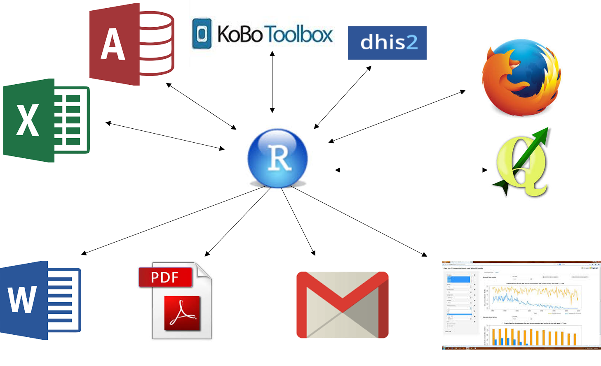
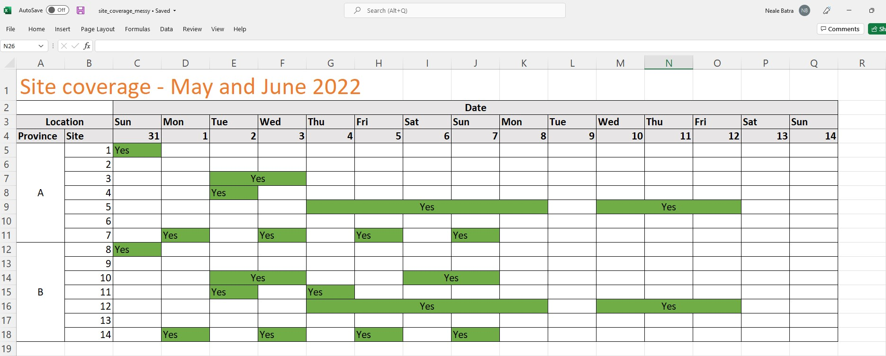
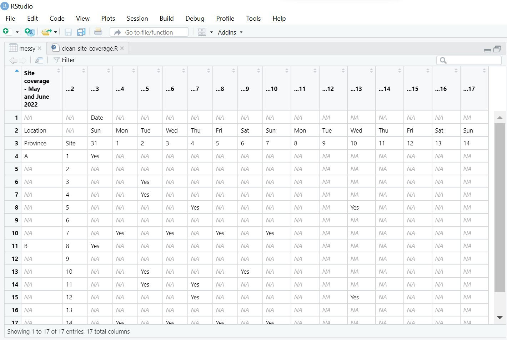
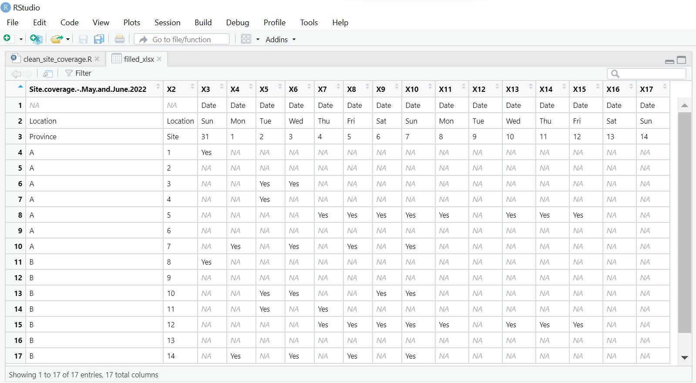

<!-- NOTES: To edit images, edit them in the "images" folder that lives NEXT TO THE RMD FILE -->


<!-- Add JavaScript code for making the exercise code larger -->
<script language="JavaScript" src="js/exercise-font-size.js"></script>

```{r setup, include=FALSE}
library(learnr)          # create lessons from rmd
library(gradethis)       # evaluate exercises
library(sortable)        # questions on choosing order of commands
library(skimr)           # dataset summary
library(scales)          # plots
library(dplyr)           # wrangle data
library(lubridate)       # dates
library(janitor)         # quick tables
library(forcats)         # factors
library(tidyr)           # for complete in the messy dats series
library(flair)           # highlight code
library(ggplot2)         # visualise data
library(gtsummary)       # visualise data
library(fontawesome)     # for emojis
library(DT)              # present tables

# library(RMariaDB)      # connect to sql database

## set options for exercises and checking ---------------------------------------

## Define how exercises are evaluated 
gradethis::gradethis_setup(
  ## note: the below arguments are passed to learnr::tutorial_options
  ## set the maximum execution time limit in seconds
  exercise.timelimit = 60, 
  ## set how exercises should be checked (defaults to NULL - individually defined)
  # exercise.checker = gradethis::grade_learnr
  ## set whether to pre-evaluate exercises (so users see answers)
  exercise.eval = FALSE 
)

# ## event recorder ---------------------------------------------------------------
# ## see for details:
# ## https://pkgs.rstudio.com/learnr/articles/publishing.html#events
# ## https://github.com/dtkaplan/submitr/blob/master/R/make_a_recorder.R
# 
# ## connect to your sql database
# sqldtbase <- dbConnect(RMariaDB::MariaDB(),
#                        user = 'sander', 
#                        password = 'E9hqb2Tr5GumHHu',
#                        # user     = Sys.getenv("userid"),
#                        # password = Sys.getenv("pwd"),
#                        dbname   = 'excersize_log',
#                        host     = "144.126.246.140")
# 
# 
# ## define a function to collect data
# ## note that tutorial_id is defined in YAML
#     ## you could set the tutorial_version too (by specifying version:) but use package version instead
# recorder_function <- function(tutorial_id, tutorial_version, user_id, event, data) {
# 
#   ## define a sql query
#   ## first bracket defines variable names
#   ## values bracket defines what goes in each variable
#   event_log <- paste("INSERT INTO responses (
#                        tutorial_id,
#                        tutorial_version,
#                        date_time,
#                        user_id,
#                        event,
#                        section,
#                        label,
#                        question,
#                        answer,
#                        code,
#                        correct)
#                        VALUES('", tutorial_id,  "',
#                        '", tutorial_version, "',
#                        '", format(Sys.time(), "%Y-%M%-%D %H:%M:%S %Z"), "',
#                        '", Sys.getenv("SHINYPROXY_PROXY_ID"), "',
#                        '", event, "',
#                        '", data$section, "',
#                        '", data$label,  "',
#                        '", paste0('"', data$question, '"'),  "',
#                        '", paste0('"', data$answer,   '"'),  "',
#                        '", paste0('"', data$code,     '"'),  "',
#                        '", data$correct, "')",
#                        sep = '')
# 
#     # Execute the query on the sqldtbase that we connected to above
#     rsInsert <- dbSendQuery(sqldtbase, event_log)
# 
# }
# 
# options(tutorial.event_recorder = recorder_function)

# data prep (must be in setup chunk) --------------------------------------------------------------------
linelist <- rio::import(system.file("dat/linelist_cleaned.xlsx", package = "epitutorials"))

malaria_counts <- rio::import(system.file("dat/malaria_facility_count_data.rds", package = "epitutorials"))

datadict <- rio::import(system.file("dat/linelist_datadict.csv", package = "epitutorials"))

long_data <- rio::import(system.file("dat/site_coverage_messy.xlsx", package = "epitutorials"), sheet = "Tidy")
# hide non-exercise code chunks ------------------------------------------------
knitr::opts_chunk$set(echo = FALSE)

```


## Welcome to Applied Epi's free self-paced R tutorial series

```{r, eval = TRUE, echo = FALSE, out.width = "100%"}
knitr::include_graphics("images/applied_epi_banner.png", error = F)
```

</br>

#### Tutorial 2: Data preparation  

This is the **second** tutorial in the series.  

* **This tutorial teaches**: Best practices for data entry, format, documentation, and preparation for analysis using R  
* **Target audience**: Public health practitioners, epidemiologists, clinicians, and researchers who cannot access our live courses  
* **Format**: R coding is performed *within* this tutorial window  
* **Offline access**: Follow [these instructions](www.training.appliedepi.org) to download and view offline in your RStudio  

</br>

#### Our introductory R training materials  

All of our training materials focus on challenges and solutions for frontline practitioners, and are accessible to beginner audiences. Read more about our educational approach [here](training.appliedepi.org/educational-approach) 

:::: {style="display: flex;"}

::: {.tutorial}
**Self-paced tutorials:**

 
* Introduce you to the basics of R coding  
* R on your computer is **not** required  
* Help is available at our public [Applied Epi Community](http://community.appliedepi.org) forum  

:::


::: {.col data-latex="{0.05\textwidth}"}
\ 
<!-- an empty Div (with a white space), serving as
a column separator -->
:::


::: {.tutorial}
**Live courses:**  

* A more comprehensive curriculum  
* We help you navigate and use R on your computer  
* Personal support and tips from live instructors who have  
extensive frontline public health experience  


:::

::::

See our [live course offerings](www.training.appliedepi.org), [educational philosophy](https://applied-epi-training.netlify.app/educational-approach.html), and [email us](mailto:contact@appliedepi.org) for tutorial personal coaching options.  

</br>

#### About Applied Epi


:::: {style="display: flex;"}

::: {}


**[Applied Epi](www.appliedepi.org) is a nonprofit organization that supports frontline public health practitioners through accessible tools, training, and support.**  

We are a global team of 150 applied epidemiologists and public health practitioners with extensive ground-level experience.  

Our free [Epidemiologist R Handbook](www.epiRhandbook.com) is a vital resource for over **175,000 people**.  

We offer a comprehensive ecosystem of training, tools, and support:  


:::: {style="display: flex;"}

::: {}
```{r, out.width = "55%", fig.align = "left", echo=F}
knitr::include_graphics("images/teaching_icon.png")
```

**Training:**  
**[Live courses](www.appliedepi.org)**  
**[Tutorials](https://training.appliedepi.org)**  
**[Case studies](www.training.appliedepi.org)**  
:::

::: {}
```{r, out.width = "55%", fig.align = "left", echo=F}
knitr::include_graphics("images/tools_icon.png")
```

**Tools:**  
**[Epi R Handbook](www.epiRhandbook.com)**  
**[R packages](https://appliedepi.org/tools/)**  
**[Sitrep templates](https://appliedepi.org/tools/)**  
:::

::: {}
```{r, out.width = "55%", fig.align = "left", echo=F}
knitr::include_graphics("images/QA_icon.png")
```

**Support:**  
**[Community forum](www.community.appliedepi.org)**  
**[R Help Desk](https://appliedepi.org/helpdesk/)**  
**[Mentorship](https://appliedepi.org/join/)**  
:::


::::

<form target="_blank" action="https://www.paypal.com/donate" method="post" target="_top">
<input type="hidden" name="hosted_button_id" value="YTEZELC8VBXV6" />
<input type="image" src="https://github.com/appliedepi/epiRhandbook_eng/raw/master/images/donate_button_long.png" border="0" name="submit" title="PayPal - The safer, easier way to pay online!" alt="Donate with PayPal button" />

</form>


:::


::: {.col data-latex="{0.15\textwidth}"}
\ 
<!-- an empty Div (with a white space), serving as
a column separator -->
:::


::: {}
```{r, out.width = "100%", fig.align = "center", echo=F}
knitr::include_graphics("images/support-help-moz.jpg")
```
[*Image: Neale Batra*]{style="float:right"}
:::

::::


</br>

#### Acknowledgements and partners  

Authors of this tutorial include:  

* Mara Kont  
* Neale Batra  

Funding for this tutorial was provided by Médecins Sans Frontières (MSF) / Doctors without Borders and TEPHINET.  


:::: {style="display: flex;"}

::: {}
```{r, out.width = "85%", fig.align = "center", echo=F}
knitr::include_graphics("images/msf-logo.jpg")
```
:::


::: {.col data-latex="{0.05\textwidth}"}
\ 
<!-- an empty Div (with a white space), serving as
a column separator -->
:::


::: {}
```{r, out.width = "85%", fig.align = "center", echo=F}
knitr::include_graphics("images/tephinet-logo.png")
```

:::

::::


**Click "Next Topic" to move to the next section of the tutorial, or navigate using the Table of Contents on the left.**  


## About this tutorial


### Learning objectives

In this tutorial you will learn and practice:  

* Different data types and how to collect and record them  
* What format is easiest for analysis in R  
* How to name files, columns and values appropriately  
* How to reformat your data for analysis and plotting  
* What is a data dictionary and why is it useful  
* How to record different types of data  


#### Accompanying resources

This tutorial draws from chapters of our free [Epidemiologist R handbook](https://epirhandbook.com/en/) such as [R basics](https://epirhandbook.com/en/r-basics.html), [Importing and exporting](https://epirhandbook.com/en/import-and-export.html), and [R projects](https://epirhandbook.com/en/r-projects.html).  


#### Next steps  

After completing this tutorial, we recommend you complete our tutorial on "Cleaning data".  


### Review a dataset  

Because this tutorial is self-contained within this window, we will often ask you to look at the first few rows of practice datasets in the format below.  

Below, the dataset `linelist` is displayed. It contains `r nrow(linelist)` rows, but we are only showing the **first 25 rows** now. A "linelist" is a term used in applied epidemiology to refer to a table that contains key information about each case or suspect case in an outbreak. Each row represents one case, and the columns contain variables such as age, sex, date of symptom onset, outcomes, etc.    

* Scroll to the right to see all the columns  
* Use the numbers buttons in the lower-right to page through the additional available rows (25 rows in this case)  
* Click a column name to sort the rows  
* Filter rows by clicking/typing in the empty box above the column  

```{r, echo=FALSE, eval=TRUE, message = FALSE, warning = FALSE}
DT::datatable(head(linelist, 25), rownames = FALSE, filter="top", options = list(pageLength = 5, scrollX=T), class = 'white-space: nowrap' )
```


### Getting help  

To get help while completing this tutorial:  

1) Look for expandable green helper text  
2) Look for "hints" and "solutions" above the coding boxes   
3) Post a question in [Applied Epi Community](www.community.appliedepi.org) in the category for questions about Applied Epi Training  


### Helper text  

Here is what the "helper text" will look like. Click on it to expand the text.

<!--
NOTE: Below is the hint (all within details tags collapsed)
-->
<details>

<summary style='text-decoration: underline; color: darkgreen;'>`r fontawesome::fa("lightbulb", fill = "gold")` Click to read more</summary>
</br>

Here there will be some helpful tips or advice!


</br>
</details>


### Code boxes  

This tutorial does not assume that you have R or RStudio working on your computer. Therefore, you can complete coding exercises in these codeboxes within the tutorial. For example:  

**Type the following R command in the codebox and press "Submit answer"**. This command will cross-tabulate observations from the dataset `linelist` (displayed above), placing gender in the output table's rows and case definition in the output table's columns.  

```
tbl_cross(data = linelist, row = gender, col = case_def)
```

* Press "Hints" to see hints or tips  
* Press "Run code" to run the code to preview the result  
* Press "Start over" to revert the box to its original state  
* Press "Submit answer" to submit your code and compare it against the solution  


<!-- ```{r ex-demo-setup, echo=FALSE, eval=FALSE} -->
<!-- linelist <<- rio::import(system.file("dat/surveillance_linelist_20141201.csv", package = "epitutorials")) -->
<!-- ``` -->


```{r example-codebox, exercise = TRUE}
Type the code here
```

```{r example-codebox-hint, eval = FALSE, exercise = FALSE}
Type the code exactly as written, into the codebox. Then press Run
```

```{r example-codebox-hint2, eval = FALSE, exercise = FALSE}
tbl_cross(data = linelist, row = gender, col = case_def)
```

```{r example-codebox-solution, exercise = FALSE}
tbl_cross(data = linelist, row = gender, col = case_def)
```

```{r example-codebox-check, exercise = FALSE}
grade_this_code("Correct, you should see a cross-tabulation of the linelist, in which gender is in the rows and case definition is in the columns.")
```

</br>
`r fontawesome::fa("exclamation", fill = "red")` If you get the error: `It looks like this might not be valid R code...` try typing the code instead of copy/pasting into the codebox.  


### Quiz questions  

Please complete the quiz questions that you encounter throughout the tutorial. **Answering will help you** to comprehend the material, and will also help us to improve the exercises for future students.  

To practice, please answer the following questions:  

```{r quiz-use-helper, echo=F}
quiz(
  question_radio("When should I view the code hints and solutions?",
    answer("After trying to write the code myself", correct = TRUE),
    answer("Before I try coding", correct = FALSE),
    correct = "Reviewing best-practice code after trying to write yourself can help you improve",
    incorrect = "Please attempt the exercise yourself, or use the hint, before viewing the answer."
  )
)
```


```{r quiz-anxious, echo = FALSE}
question_numeric(
 "How anxious are you about beginning this tutorial - on a scale from 1 (least anxious) to 10 (most anxious)?",
 answer(10, message = "Try not to worry, we will help you succeed!", correct = T),
 answer(9, message = "Try not to worry, we will help you succeed!", correct = T),
 answer(8, message = "Try not to worry, we will help you succeed!", correct = T),
 answer(7, message = "Try not to worry, we will help you succeed!", correct = T),
 answer(6, message = "Ok, we will get there together", correct = T),
 answer(5, message = "Ok, we will get there together", correct = T),
 answer(4, message = "I like your confidence!", correct = T),
 answer(3, message = "I like your confidence!", correct = T),
 answer(2, message = "I like your confidence!", correct = T),
 answer(1, message = "I like your confidence!", correct = T),
 allow_retry = TRUE,
 correct = "Thanks for sharing. ",
 min = 1,
 max = 10,
 step = 1
)
```


### Icons  

You will see these icons throughout the exercises:

Icon  |Meaning
------|--------------------
`r fontawesome::fa("eye", fill = "darkblue")`|Observe  
`r fontawesome::fa("exclamation", fill = "red")`|Alert!  
`r fontawesome::fa("pen", fill = "brown")`|An informative note  
`r fontawesome::fa("terminal", fill = "black")`|Time for you to code!  
`r fontawesome::fa("window-restore", fill = "darkgrey")`|Change to another window  
`r fontawesome::fa("bookmark", fill = "orange")`|Remember this for later  


### Getting help on Applied Epi Community  

Our other site [Applied Epi Community](www.community.appliedepi.org) is a public Q&A and discussion forum. You can post a question in the category "Applied Epi Training" about the content in these tutorials. A member of the community may help you by voluntarily answering your question.  

* Be sure to clearly reference which tutorial and which question you are stuck on  
* Explain what you have already tried to do  
* Thank anyone who replies for their time  


## Example datasets

In this tutorial we will use the following datasets. Please take a few minutes to review the structure and content of each dataset before continuing.

Use the arrows on the right to scroll through hidden columns. Note that these are "raw" (messy) datasets that mimic problems commonly found in real-life epidemiological datasets.  


### **A "linelist" of cases in a fictional (not real) Ebola outbreak**

A "linelist" is a term used in applied epidemiology to refer to a table that contains key information about each case or suspect case in an outbreak. Each row represents one case, and the columns contain variables such as age, sex, date of symptom onset, outcomes, etc.

This dataset contains `r nrow(linelist)` rows and `r ncol(linelist)` columns. Below are the first 5 rows:  

```{r linelist}
head(linelist,5)
```


### **Routine surveillance: Aggregated data from malaria surveillance in a fictional country**  

Aggregated data in epidemiology usually means a table of counts for each facility, or district, etc. Sometimes, the counts can also be per day, week, or month.  

In this fictional dataset, each facility reported *daily* case counts of rapid-test (RDT)-confirmed malaria. Thus, each row represents the number of cases for a specific facility on a specific day.  

This dataset contains `r nrow(malaria_counts)` rows and `r ncol(malaria_counts)` columns. Below are the first 5 rows:  

```{r malaria_counts}
head(malaria_counts,5)
```


Click to [download the **clean** malaria counts dataset as an **.rds file**](https://github.com/appliedepi/epirhandbook_eng/raw/master/data/malaria_facility_count_data.rds) for your own practice. A *.rds file* is an R-specific file type that preserves column classes. This ensures you will have only minimal cleaning to do after importing the data into R.


### **Hand-entered Excel spreadsheets**  

Here we provide two Excel datasets which were hand-entered.

The first dataset contains information on clinics and their patient capacities:

```{r, out.width = "85%", fig.align = "center", echo=F}
knitr::include_graphics("images/messydata.PNG")
```


The second dataset contains the information on which organizations are responding to an emergency in particular provinces and districts:

```{r, out.width = "85%", fig.align = "center", echo=F}
knitr::include_graphics("images/messydata2.PNG")
```


## "Machine-readable" data  

When you first begin to collect data, you must ask the question: *is the primary audience of this dataset **humans** or **machines**?*   

Recording information such that it is optimized for for "human-readability" can be very different than optimization for "machine-readability" and analysis. Be clear from the beginning what your priority is. Please allow us to give some general advice - it is generally easier to transition from machine-readable to human-readable than the other way!  

### Excel spreadsheets  

At Applied Epi, we promote the use of R for [many reasons](https://appliedepi.org/why-r/), but we know that for most applied epidemiologists, Excel is tool that is fundamental to their workflows. There is nothing wrong with using Excel. Workflows that involve R almost always *also involve Excel*. But it is important that you use Excel in a manner that allows you to also maximize the benefits of R.  


```{r, out.width = "85%", fig.align = "center", echo=F}

```

Excel is a powerful and beginner-friendly software. While it is also possible to do some analysis in Excel, you find that more complex analyses and data management operations may be very complicated or impossible to carry out in this software. This is where versatile programs such as R become very useful.  


```{r, out.width = "85%", fig.align = "center", echo=F, fig.cap="R has an initial learning curve, but more complex tasks become much easier than in Excel."}

```


In this series of tutorials, you will become more familiar with R code syntax. In this section, we will focus on steps that you can take to ensure that an Excel dataset can be easily interpreted by R for analysis.  


## Non-tidy data

*The main reason one encounters non-tidy data is because many Excel spreadsheets are designed to prioritize easy reading by humans, not easy reading by machines/software.* 

“Tidy” datasets may not be as readable to a human eye, but they make data cleaning and analysis much easier!

To help you see the difference, below are some fictional examples of **non-tidy data** that prioritize *human*-readability over *machine*-readability.
Here is our hospital capacity dataset in Excel:

```{r, out.width = "55%", fig.align = "left", echo=F}
knitr::include_graphics("images/messydata.PNG")
```


```{r quiz_messydata}
quiz(
  question("What do you foresee may be issues when uploading this to R? Tick all that are most likely to apply.",
    answer("I don't think there will be any issues when we upload this to R.", message = "The format will not be the same in R."),
    answer("R will not be able to read this dataset.", message = "R will be able to read this dataset, however it will require a lot of cleaning!"),
    answer("The colours won't appear.", correct = TRUE, message = "The colours won't appear, which may be an issue if the colours represent another variable!"),
    answer("The colours will appear but it is not clear what they represent.", message = "The colours will not appear in R."),
    answer("Some rows are empty.", correct = TRUE, message = "The extra empty rows will require an extra cleaning step."),
    answer("Some row values are empty.", correct = TRUE, message = "R can handle missing values in different cells. The issue with this dataset is that some empty cells imply another value (that from the row above)."),
    answer("Some columns are empty.", correct = TRUE, message = "The empty columns will require an extra cleaning step."),
    answer("Some column values are empty.", message = "R can handle missing values in columns."),
    answer("Spaces in the column names.", correct = TRUE, message = "Column names will be changed from what we see in Excel if they have spaces and as a result and may require an extra cleaning step!"),
    answer("Spaces in the cell values.", message = "R can handle spaces when it comes to cell values. Note that these values will then be recorded as a character (i.e. string) variable."),
    answer("Different recording formats in the same column.", message = "If the same column has different recording formats, R will still be able to read it. It may however save it in the wrong format which will require an extra cleaning step. Recording in different formats in the same column also does not follow the principles of tidy data."),
    allow_retry = TRUE
  )
)
```

These different options have already given you quite a few things to think about! Let's now go over specific issues that you may encounter when importing a dataset from Excel to R.


### **Merged cells**

Merged cells are often useful to make data *human-readable* but can cause problems for analysis by machines.  

In the spreadsheet below, the "coverage" at 14 sites are tracked for a period of days in May and June 2022.  

```{r, out.width = "100%", fig.align = "left", echo=F}

```


```{r quiz_mergedcells}
question("What issues do you think R will encounter when loading this dataset?",
  answer("R will not recognise the merged cells and will drop the value.",
         message = "Indeed, R cannot recognise merged cells. However it will not drop all those values."),
  answer("R will recognise the merged cell and also create a merged cell.",
         message = "Data frames in R cannot contain merged cells."),
  answer("R will not recognise the merged cell so will only keep the value in the first row and column of the merged area.", correct = TRUE),
  answer("R will recognise the merged cells and duplicate these values across the merged area.",
         message = "Unfortunately, most import functions in R will not do this by default."),
  allow_retry = TRUE
)
```

Using most import functions, R will not recognize the merged cell formatting, and all cells except the first merged cell will be read-in as empty! This will lead to loss of data and make analysis difficult.  

Let's see this in action: if we import this spreadsheet into R, see what it looks like in the RStudio viewer.  

```{r, out.width = "100%", fig.align = "left", echo=F}

```

As you see, importing this dataset into R in the given Excel format leads to data loss in multiple ways:

* Most columns do not have the right header
* Many observations (i.e. rows) are missing data
* The actual values of interest are not all in the right rows  

We can use the {openxlsx} R package to import the spreadsheet, which is built specifically for handling Excel spreadsheets, to reduce the damage.  

```{r, echo=TRUE, eval=FALSE}
sites <- openxlsx::read.xlsx("site_coverage.xlsx", fillMergedCells = TRUE)
```

The argument `fillMergedCells = ` can result in the merged value appearing in all its cells, but the spreadsheet is still very difficult to analyze:  

```{r, out.width = "100%", fig.align = "left", echo=F}

```

Which columns to use is still not clear - it would take many R commands to clean the data in order to produce even a simple tabulation of "Yes" values by site.  

**How could you enter these data in a manner that is "tidy" and machine-readable?**  

```{r quiz_mergedtidy}
question("If these data were entered in a tidy format, what would be the column headers?",
  answer("Day, Cell, Province, X", message = ""),
  answer("Date, Province, Site, Status", correct=T, message = "Correct, these are the variables in play, with Status being either Yes or No."),
  answer("May, June"),
  answer("A, B, Site, Date"),
  allow_retry = TRUE
)
```

Here you can see these same data entered in that "tidy" format (also called "long" format). See how:  

* Every value has its own cell  
* Every observation has its own row  
* Every underlying variable has its own column  

```{r, out.width = "50%", fig.align = "left", echo=F}
knitr::include_graphics("images/site_coverage_long.jpg")
```

The above format is not very easy for humans to read, but it is easily imported and handled by R.  

Once in R, it is relatively easy to work with the dataset - the code below cleans/expands this tidy data so that *every possible date and site are present in the data*.  

```{r, echo=TRUE, eval=TRUE}
# import the long data 
sites_clean <- long_data %>%    # create complete dataset 
  mutate(Date = ymd(Date)) %>%  # convert dates to proper class in R
  complete(                     # fill-in all sites and dates not mentioned
    Date = seq.Date(
      from = min(Date),
      to = max(Date),
      by = "day"),
    Site = seq(1:14),
    fill = list(Status = "No")) %>% 
  mutate(Province = as_factor(ifelse(Site %in% 1:7, "A", "B")),
         Site = as_factor(Site)) 
```

Now the dataset has expanded from `r nrow(long_data)` rows to `r nrow(sites_clean)` rows - all possible dates and sites - a complete data set! (one row for each cell in the original messy Excel spreadsheet!)  

```{r, eval=TRUE, echo=TRUE}
sites_clean
```

Now we can use the {ggplot2} package to create a "heat plot" that resembles the original Excel spreadsheet.  

```{r, eval=TRUE, echo=TRUE, fig.width=8, fig.height=6}
# create heat tile plot
ggplot(data = sites_clean, mapping = aes(x = Date, y = fct_rev(Site),
                                         fill = Status, label = Status))+
  geom_tile(color = "white")+
  geom_text()+
  scale_x_date(
    date_breaks = "day",
    labels = label_date_short(),
    expand = c(0,0))+
  scale_fill_manual(
    values = c(
      "Yes" = "darkgreen",
      "No" = "orange"))+
  theme_minimal(base_size = 16)+
  labs(title = "Site coverage",
       y = "Site")+
  facet_wrap(~Province, ncol = 1, scales = "free_y")
```

If you don't understand the above code, that is OK - we only want to show you that with a few line of R code you can create an "Excel-like", "human-readable" output that is *much* more easy to analyze than the original spreadsheet.  

In many ways, this setup is more useful than the original Excel spreadsheet:  

* The data are able to be analyzed, whereas in the Excel they could not be  
* New rows added to the Excel can be re-imported and the plot updated in seconds  
* This plot can be exported to a PDF report and emailed to partner organizations  

Unlike the Excel, this dataset in R can be analyzed! It takes only a few lines of code to tabulate `Status` by `Province`:  

```{r, echo=TRUE, eval= TRUE, fig.cap="Site coverage by province"}
sites_clean %>% 
  tabyl(Province, Status)
```

Or by `Date`:  

```{r, echo=TRUE, eval= TRUE, fig.cap="Site coverage by date"}
sites_clean %>% 
  tabyl(Date, Status) %>% 
  arrange(desc(No))
```

Or the number of unfilled spots by week:  

```{r, echo=TRUE, eval= TRUE, fig.cap="Site coverage by week"}
sites_clean %>% 
  group_by(week_of = floor_date(Date, "week")) %>% 
  summarise(days_coverage_needed = sum(Status == "No"))
```

Or to make other kinds of plots:  

```{r, echo=TRUE, eval=TRUE}
sites_clean %>% 
  filter(Status == "Yes") %>% 
  ggplot(mapping = aes(x = fct_infreq(Site)))+
  geom_bar(fill = "dodgerblue")+
  coord_flip()+
  theme_minimal(base_size = 16)+
  labs(title = "Number of days 'covered', by site",
       x = "Site",
       y = "Number of days with coverage")
```


```{r quiz_mergedcells2}
question("Out of the answers given below, which course of action do you think would be the wisest to make this dataset *machine*-readable?",
  answer("Combining header names so that the columns are: `Location_Province`, `Location_District`, `Date_Sun_31`, `Date_Mon_1`, etc.",
         message = "Whilst this would fix the header problem, this option is probably not the most efficient one out of the options here. It also does not deal with the loss of values in the cells under the columns `Date`."),
  answer("Removing the unecessary header location (so we have `Province` and `District` and changing the date variables into two columns `Date_day_of_week` and `Date_day_N` with one new column for the value.",
         correct=T,
         message = "If you remember the principles of tidy data, each variable should be in a column. Having the date spread across multiple columns makes it more complex for data analysis and if your data collection keeps going, you might end up with a very heavy Excel file!"),
  answer("Only keep the 3rd row as header and repeat the value in the merged cell in each cell", 
         message = "The 3rd row does indeed contain the most relevant information out of the 3 top rows used to specify the header. However, keeping the date in this wide format does not follow tidy data principles and, if only the numbers are kept as headers, it may not be obvious what these represent in the new version."),
  answer("Separate the recording of data for each province in a new sheet",
         message = "This is not necessary and would probably complicate importing the dataset to R and the consequent analysis."),
  allow_retry = TRUE
)
```

### *Conclusions*

When collecting data for analysis, it is best to avoid the use of merged cells. Try and think of ways to represent your data that avoids having the combine cells and if you can't, you should then replicate the value in each cell that is relevant. Remember that variables are represented in columns, and think of the most efficient way of showing this (for example, date can be written in one column rather than spread across multiple ones). 

### **Empty cells**

```{r, out.width = "100%", fig.align = "left", echo=F}
knitr::include_graphics("images/messydata.PNG")
```


*Problems*: In the spreadsheet above, there are numerous extra empty rows and columns within the dataset - this will cause cleaning headaches in R.

```{r quiz_emptyrows}
question("Which of the empty cells do you think will be most problematic?",
  answer("The first empty row as R will not recognise the column names",
         message = "R will actually recognise the second row as the header row in this case. So whilst this is not ideal, this empty row is not too problematic."),
  answer("The third empty row.",
         message = "The third empty row will be loaded as a row of `NA` values. Whilst not ideal, this can be fairly easily removed."),
  answer("The empty columns.", correct = TRUE,
         message = "These will be the most problematic as you will probably have to manually remove these in R, because one 'real' column (`Patients`) also does not contain values. This means that you will need to take note of every column number that you want to remove and do so manually!"),
  answer("All empty cells.",
         message = "All empty cells are not necessarily issues, as sometimes there is no data available for one particular variable (which may be data itself, or grounds for exclusion from analysis)."),
  allow_retry = TRUE
)
```

### *Answer*

The empty columns in this dataset are likely to be the most problematic out of the options given above, as you will probably manually have to remove these. The empty rows from row number 4 onwards are also an issue, as they actually imply the value that is given in the cell above, but will be recorded as `NA` values. This will require significant extra cleaning. 
On the other hand, the values in the column `Patients` are actually missing. In this case, it would be wiser to write `NA` in each of the cells of this column, to explicitly indicate that these data are missing for this particular variable.


### **Colour dictionaries**

```{r, out.width = "55%", fig.align = "left", echo=F}
knitr::include_graphics("images/messydata2.PNG")
```

*Problems:* A color-based dictionary is to the right side of the dataset shown above and cell values are represented by colors - which is also not easily interpreted by R (nor by humans with color-blindness!). Furthermore, different pieces of information are combined into one cell (multiple partner organizations working in one area, or the status “TBC” in the same cell as “Partner D”).

```{r quiz_colourdict}
question("In this case, what do you think would be the best modification before loading the dataset to R?",
  answer("Keep as is, R will recognise the colours.",
         message = "R cannot read in colours."),
  answer("Keep as is, but add text to the colours.",
         message = "This would help as R cannot read colours. However, this data format would still not be well read in R and the colour dictionary at the right would cause issues."),
  answer("Keep as is, but move the colour dictionary to another sheet.",
         message = "Moving the colour dictionary to another sheet would be helpful and could be loaded separately as a lookup, however R cannot read colours so you would still face issues when loading the main table."),
  answer("Change the dataset so that each column is a variable and each cell contains one unique value, integrating the colours as a new variable.", correct = TRUE,
         message = "Indeed, transforming this data to a tidy format is absolutely necessary if any analysis will be performed on this data. Removing the necessity for colours by adding a variable to specify what these represent would be the way to go."),
  answer("Change the dataset by adding a column to specify what the colour means.",
         message = "Whilst this is generally the way to go to transform a dataset using a colour dictionary before uploading it to R, this dataset contains other issues making it untidy and hard to analyse in the current format."),
  allow_retry = TRUE
)
```

### *Answer*

Whilst colour dictionaries may be helpful for human-readability of a dataset, colours should never be used as the only way of recording data as machines will not be able to interpret it for analysis. Again, it is important to think of how best to represent that data layer, probably by adding an extra variable column.
As a general rule, dictionaries (whether they are colour dictionaries as shown here or data dictionaries) should be kept separately from the main table. In Excel, it would be best practice to have this dictionary on another sheet. When loading it to R, you can then load it as a separate dataframe. But we're getting ahead of ourselves... More on data dictionaries later!


### **Excel-to-R resources**

Here are some links to tutorials to help you transition to R from Excel:

*   [R vs. Excel](https://www.northeastern.edu/graduate/blog/r-vs-excel/)
*   [RStudio course in R for Excel users](https://rstudio-conf-2020.github.io/r-for-excel/)


### **R-Excel interaction**

R has robust ways to import Excel workbooks, work with the data, export/save Excel files, and work with the nuances of Excel sheets.

It is true that some of the more aesthetic Excel formatting can get lost in translation (e.g. italics, sideways text, etc.). If your work flow requires passing documents back-and-forth between R and Excel while retaining the original Excel formatting, try packages such as {openxlsx}.  


## What is tidy data?

Tidying data refers to the process of structuring your datasets for analysis. Most datasets will require some level of cleaning, a process which can make up the majority of the time you spend on your analysis depending on how "messy" your dataset is.

```{r rhetorical1, echo = FALSE}
question_text(
  "What are some features of your data that make it particularly difficult to clean prior to analysis?",
  answer_fn(function(value) {
    if (grepl(paste(letters, collapse = "|"), value)) {
      correct("")
    }
  }, )
)
```

Whilst the process of tidying your dataset will vary depending on the data and analysis type, in this tutorial we will go through different principles of tidy data and their value in getting your dataset analysis-ready, i.e. *machine*-readable “tidy” data instead of messy *human*-readable data.
Human-readable data is what you might see on Excel, i.e. a spreadsheet which uses colours or merged cells to facilitate understanding. The use of such features do not use the logic used by computers, and so may cause issues when it comes to analysing your data.
Before going into detail into what a machine-readable dataset looks like, let's go over some key terminology.

### Data semantics

A dataset contains different **values**, these are generally either *numbers* (if dealing with quantitative data) or *strings* (i.e. text, if dealing with qualitative data). These values are associated to a **variable** and an **observation**. A *variable* is an attribute to which the different values belong to, with one given unit for all the different values, for example temperature, age or weight. An *observation* refers to the values across different variables for one measure of the data, for example per person, date or country.

Let's test your understanding of these terms.

```{r quiz_data_semantics}
quiz(
  question("50 kg, 75 kg, 67 kg, 90 kg are...",
    answer("Different observations of the variable `temperature`", message = "Think again! It does not make much sense that `temperature` would be measured in kilograms! It is also unlikely that these values would be referred to as observations..."),
    answer("Different variables of the observation `weight`", message = "Think again! These values all have the same unit, so they would probably be one variable rather than different ones. `weight` as an observation might also not be the most logical way of recording this data..."),
    answer("Different values of the variable `weight`", correct = TRUE, message = "Indeed, these are correct values (in this case we are dealing with numbers, so quantitative data). As the different values have the same unit, they can be grouped under one variable (in this case, weight would make sense)."),
    answer("None of these answers are correct", message = "Are you sure? Try and think of what these different terms refer to!"),
    answer("All of these answers are correct", message = "Are you sure? Try and think of what these different terms refer to!"),
    allow_retry = TRUE
  ),
  question("`Name` would most likely be...",
    answer("A value", message = "If this was a value, what would be the variable and observation it could be grouped under?"),
    answer("A variable", correct = TRUE, message = "Indeed, different values could include 'Josephine', 'Alex' or 'Billy'."),
    answer("An observation", message = "If this was an observation, what is the unit of measure? How would you get other observations?"),
    allow_retry = TRUE
  ),
  question("Thinking of data structure, how would an observation best be represented? ",
    answer("As a row", correct = TRUE, message = "That's right! More on this below..."),
    answer("As a column", message = "Think again! Is this the most efficient way of representing your data?"),
    answer("As a cell", message = "Think again! Is this the most efficient way of representing your data?"),
    allow_retry = TRUE
  )
)
```

### Principles of tidy data

These are the three main principles of “tidy” data:

*    Each **variable** must have its own **column**
*    Each **observation** must have its own **row**
*    Each **value** must have its own **cell**

*Source: [R for Data Science](http://r4ds.had.co.nz/)*  

Why is it important to make sure your data is tidy?

*   In making sure the data you collect or analyse is tidy, you follow a **consistent** data structure. This consistency will make it easier to learn and apply tools to different datasets. It will also make your analyses more efficient.
*   When working with R, placing variables in columns allows for easy manipulation of data that feels natural. Most of the packages from the **tidyverse** are designed to work with tidy data.

### What a "tidy" dataset looks like

Here is a subset of the [malaria routine surveillance dataset](https://github.com/appliedepi/epirhandbook_eng/raw/master/data/malaria_facility_count_data.rds), presented in 3 ways. Take a bit of time to explore each of these.

```{r table-format,echo=FALSE}
table1 <- malaria_counts[c(1:5),] %>% 
  reshape2::melt(id.vars=c(1:5))
table2 <- malaria_counts[c(1:5),]
table3 <- malaria_counts[c(1:5),] %>% 
  mutate("malaria_rate_0-4"=paste0(`malaria_rdt_0-4`,"/",malaria_tot)) %>% 
  dplyr::select(location_name, Province, District,`malaria_rate_0-4`)
```

```{r table-format2, echo=T}
table1
table2
table3
```

```{r quiz-table-format}
quiz(
  question("Out of the 3 datasets presented above, which one is considered tidy as specified in the requirements specified previously?",
    answer("`table1`", 
           message="Different variables are saved in the same column `variable` rather than each having its own column."),
    answer("`table2`", correct = TRUE,
           message="Correct! Each variable has its own column, each value has its own cell and each observation has its own row."),
    answer("`table3`", 
           message="The cells in column 'malaria_rate_0-4' contain multiple values."),
  allow_retry = TRUE
  )
)
```

### *Answer*

Only `table2` is tidy as it is the only one where each column is a variable and each cell has its own value and each observation has its own row.

### Tidy data practices

```{r open_text_qu2}
question_text(
  "Reflecting on tidy data practices, what proportion of the datasets you use are tidy?",
  answer("lemons", correct = TRUE),
  incorrect="Thank you for your feedback!",
  correct="Thank you for your feedback!",
  allow_retry = TRUE
)
```

## Tidy data for analysis

An example of “tidy” data would be the case linelist used throughout these tutorials - each variable has its own column, each observation (one case) has its own row, and every value is in just one cell. Below you can view the first 50 rows of the linelist:

```{r}
head(linelist,50)
```

### **Data presentation**

Let's see how data presentation may affect how easy it is to analyse the data.
Here is a subset of the linelist presented in 3 ways. This dataset presents data on symptoms for each case, as well as which generation the case belongs to. Take your time to go through each dataset to see in what ways the data is presented differently.

```{r linelist_edit}
linelist1 <- linelist %>% 
  mutate(fever=ifelse(fever=="yes",
                      paste0("yes: ",temp), fever)) %>% 
  dplyr::select(case_id,generation,fever)
linelist2 <- linelist %>% 
  dplyr::select(c(1,2,c(22:26))) %>% 
  reshape2::melt(id.vars=c(1,2),
                 variable.name="symptom")
linelist3 <- linelist %>% 
  dplyr::select(case_id,generation,fever)

# figure out which rows to show as e.g. below
rowsub0 <- linelist1[match(unique(linelist1$generation),linelist1$generation),] %>% 
  pull(case_id)
rowsub <- rowsub0[c(1:3,35:38)]

```

`linelist1`
```{r}
linelist1 %>% filter(case_id%in%rowsub)
```
`linelist2`
```{r}
linelist2 %>% filter(case_id%in%rowsub)
```
`linelist3`
```{r}
linelist3 %>% filter(case_id%in%rowsub)
```


Now here is a little exercise: **for each case generation, compute the number of patients with fever**. To do so, you will need to:

*   Make sure the values recorded are clean.
*   Extract the cases for each generation (using `group_by()`).
*   Compute the sum of cases with fever in each of these group (using `summarize()` and `sum`).
*   Store back in the appropriate place.

```{r exercise2, exercise=TRUE, exercise.eval=TRUE,exercise.lines=5}

```

```{r exercise2-hint}
# Checking that recorded values are 'clean'
unique(linelist$fever)

# Remove rows where there is no input value
linelist_tidy <- linelist %>% 
  filter(!is.na(fever))

```

```{r exercise2-solution}
# Compute the number of fever cases by generation
linelist_nfever <- linelist_tidy %>% 
  group_by(generation) %>% 
  summarise(n_fever=sum(fever=="yes"))
linelist_nfever  
```


```{r letter-a, echo=FALSE}
question("Which of these data representations is the easiest to work with? Why?",
  answer("`linelist1`",message = "Are you sure? Multiple values are contained in one cell!"),
  answer("`linelist2`",message = "Are you sure? Different variables are grouped in one column!"),
  answer("`linelist3`", correct = TRUE,
         message = "Indeed, as each variable of interest (i.e. `generation` and `fever` have their own column, each observation (i.e. case) has its own row, and each value has its own cell, manipulating this data for analysis is quite straightforward."),
  allow_retry = T
)
```


### *Answer*

Dataset `linelist3` is easiest to work with in R because:

*   Each variable has its own column
*   Each observation has its own row
*   Each value has its own cell

In a dataset where one cell contains more than one value, such as `linelist1`, extracting the relevant value may be overly complicated: you might have to resort to using pattern recognition functions (such as `grep()` or `separate()`) or, in this case, filter away the "no" (using the `!` operator, so that the summarise function becomes: `summarise(n_fever=sum(!fever=="no"))`), but this might not always be applicable.

In a dataset where different variables are contained in the same column, such as shown in `linelist2`, you will have to filter for your variable of interest, which requires one extra line of code. Whilst this dataset does not follow tidy data principles, we will see later how such formats may sometimes be easier for data analysis.


## Pivoting data for analysis

Whilst the principles of tidy data given to you previously are the most convenient for storing your data, they might not always be the most efficient for data analysis. You might sometimes require an extra step of data manipulation before you start your analysis.

### **"Wide" and "long" data**

{width=70%}

#### *"Wide" data*

A "wide" dataset is a dataset in which each variable is a column and its respective value is listed in that column. Each row of data will therefore contain many values, each of which represents a different variable. In wide datasets, filtering the data might not be necessary as all the reader would need to do is take the information from specific columns.

While this may be useful for presentation, it is not ideal for some types of analysis. Wide datasets are quite voluminous and take longer to read in R. It is also harder to manipulate a wide dataset for analysis.

The R functions `pivot_wider()` (from package **tidyr**) or `cast()` (from package **reshape2**) transforms data to wide formats. 

#### *"Long" data*

In "long" datasets, the different variables are listed in one column and their respective values listed in another column. A long dataset would therefore have at minimum 2 columns, but could also have more columns than that (for example, if we are listing malaria cases by country and year, we could have 3 columns as shown in the Figure above).

Long datasets are much easier to read in R (even if they contain many rows) and are required for many types of analyses, including plotting with `ggplot2` or most modelling functions. However, these types of datasets may not be the most intuitive for the human eye.

The R functions `pivot_longer()`(from package **tidyr**) or `melt()` (from package **reshape2**) transforms data to long formats. 


### Impact of pivoting for plotting {.tabset}

Let's look at our Ebola linelist again. If we wanted to plot the **evolution of symptoms over time, coloured by symptom**, which of the following data formats do you think would be easiest to work with?

```{r}
linelist1 <- linelist %>% 
  dplyr::select(c(1,4,c(22:26))) %>% 
  arrange(case_id)
linelist2 <- linelist %>% 
  dplyr::select(c(1,4,c(22:26))) %>% 
  reshape2::melt(id.vars=c(1,2),
                 variable.name="symptom") %>% 
  subset(!is.na(value)) %>% 
  mutate(value=ifelse(value=="no",0,1)) %>% 
  arrange(case_id)
linelist3 <- linelist %>% 
  dplyr::select(c(1,4,c(22:26))) %>% 
  reshape2::melt(id.vars=c(1,2),
                 variable.name="symptom") %>% 
  subset(!is.na(value)) %>% 
  mutate(value=ifelse(value=="yes",paste0(date_onset),value)) %>% 
  dplyr::select(-date_onset) %>% 
  arrange(case_id)
```

#### Click to see format 1  

```{r}
head(linelist1,10)
```

#### Click to see format 2
```{r}
head(linelist2,10)
```

#### Click to see format 3

```{r}
head(linelist3,10)
```

```{r quiz_plotting, echo=FALSE}
question("Which of these datasets would be easiest to work with for plotting?",
  answer("`linelist1`",message = "Are you sure? The long format would probably require many lines of code!"),
  answer("`linelist2`",correct = TRUE,
         message = "Long data formats are easier to plot with."),
  answer("`linelist3`", 
         message = "Whilst this is a long format dataset, multiple variables are contained in one column (column `value` contains the date is there was a symptom) - this would make it quite complex to plot."),
  allow_retry = T
)
```

### *Answer*

Here, you can see that a long data format, as represented in `linelist2`, is easiest to work with for plotting:

```{r, echo=TRUE}
ggplot(linelist2, aes(x = date_onset,
                     y = value,
                     fill = symptom)) +
  geom_bar(position = "stack", stat = "identity")
```

Trying to get this plot with the data format shown in `linelist1` or `linelist3` would be much more complex!

### Impact of pivoting for data analysis

Let's look again at our malaria surveillance dataset in three different ways:

```{r}
malaria_counts1 <- malaria_counts %>% 
  dplyr::select(c(1,2,5:8)) %>% 
  reshape2::melt(id.vars=c(1:3),
                 variable.name="rdt_age_cat") %>% 
  subset(!is.na(value))
malaria_counts2 <- malaria_counts %>% 
  dplyr::select(c(1,2,5:8))
malaria_counts3 <- malaria_counts %>% 
  dplyr::select(c(1,2,5,9))
```

`malaria_counts1`
```{r}
head(malaria_counts1,10)
```
`malaria_counts2`
```{r}
head(malaria_counts2,10)
```
`malaria_counts3`
```{r}
head(malaria_counts3,10)
```

You are trying to get the **total number of positive malaria RDT results per age category for each district, as well as the number of locations and days these were collected over**.

```{r quiz_analysis, echo=FALSE}
question("Which of these datasets would be easiest to work with for plotting?",
  answer("`malaria_counts1`",correct = TRUE),
  answer("`malaria_counts2`",
         message = "The fact that age categories are spread across different columns would require extra lines of code. If you only have 3 age categories, as is the case here, this may not be too bad but if you have 10+ age categories this may quickly become complex!"),
  answer("`malaria_counts3`", 
         message = "There is no variable for age category in this dataset!"),
  allow_retry = T
)
```

### *Answer*

Here, you can see that a long data format, as represented in `malaria_counts1`, is easiest to work with for this analysis:

```{r, echo=TRUE}
malaria_counts1 %>% group_by(District,rdt_age_cat) %>% 
  summarise(n_rdt=sum(value),
            n_facilities=n_distinct(location_name),
            n_days=n_distinct(data_date))
```

Trying to get this plot with the data format shown in `malaria_counts2` would be much more complex (and impossible with `malaria_counts3` as there is no information on age)!


## Data dictionaries

A data dictionary, also sometimes referred to as a 'key', is a separate table from your main recording sheet. This dictionary allows to specify what specific variables mean, whether they be column names, colours, or other.

### **Variable definition**

A data dictionary describes what each column header represents. For example, when we look at the `linelist` dataset, what each of the column names represent may not be clear to someone not familiar with the data.

```{r}
head(linelist,5)
```

 
```{r quiz-colname}
quiz(
  question("For example, what do you think the column named `age_cat5` represents?",
    answer("The 5th age category"),
    answer("The age of the five cats"),
    answer("The age category, as categorised by 5 years age ranges", correct = TRUE),
    answer("The age category, as categorised in 5 groups"),
  allow_retry = TRUE
  )
)
```

### *Answer*

Even if you are familiar with the dataset, the meaning of the column names may not be obvious! That's when data dictionaries become useful, as they will provide information on the column name meaning. 

### **Listing possible values and levels**

Data dictionaries can also be helpful to specify which of the different values one variable can have. For example, you could specify what unit the numerical variable is recorded in. This can also be helpful if there is a set amount of values the variable can have, for example if recording age groups, you could specify how many groups age is broken into. This is similar to what a cell with a drop-down list of values would provide in Excel.

```{r quiz_datadict_valueslevels}
quiz(
  question("Which of these would be helpful to add in a data dictionary to specify the value levels or format?",
    answer("Date, YYYY-MM-DD", correct = TRUE, message = "Adding the date format is helpful as a date can be written in many different ways (e.g. years in 2 or 4 digits, putting the day/month first, etc.) and specifying what input format the date should have will help save time when it comes to cleaning your dataset"),
    answer("Gender, 'M' or 'F' or 'other' or 'unknown'", correct= TRUE, message = "Specifying the input format is helpful as you can input gender as words or initials, which may differ depending on the language or your input data. This can also be helpful to decide where you are only recording 'males' and 'females' or if you are recording other genders too."),
    answer("Age, years", correct = TRUE, message = "Specifying the unit of one value is important especially if that unit is not evident. In this case, age could be recorded in days, months or years for example."),
    answer("Name of hospital, 'A' or 'B' or 'C'", message = "Adding a level to the definition of this value in your data dictionary is probably not helpful. In the case that your data originates from 3 hospitals (in this case, A, B or C), it is evident that the name of the hospital will have to be listed if your dataset contains a hospital asking for 'Hospital Name'. In the case that you have many values (for example, more than 10), listing all of the possible values in the data dictionary will just make the definition overly long and unhelpful. In the case that you do not know all of the locations where the data is generated (for example, you are creating a template collection sheet), listing only some specific hospitals may lead to some locations not recording their data or incorrect input data."),
    answer("Age category, '0-4' or '5-14' or '15-44' or '45+'", correct=TRUE, message="When asking for data to be categorised, it is very important to specify the categories that you are expecting as these may not be obvious and can differ depending on the research question and data type."),
    answer("Presence of fever on admission, 'yes' or 'no'", correct = TRUE, message = "If you are expecting a binary data input, it is important to specify that you are as well as the format you are expecting. In this example, rather than 'yes' and 'no', the data collector could have asked for '1' and '0', where 1 = 'yes' and 0 = 'no'. If asking for numerical inputs to binary data, it is important to specify what these numbers represent."),
    allow_retry = TRUE
  )
)
```

### Data dictionary example

Below is the data dictionary for this dataset:

```{r datadict,echo=F}
# datadict <- readxl::read_excel('data/linelist_datadict.xlsx')
# datadict

knitr::kable(datadict)
```

This data dictionary allows to understand what each column value means, as well as what units the values were recorded in. These help keep dataframes tidy, so that the loaded dataframe can be understood by computers but the epidemiologist still has a clear understanding of what each column represents.

It is good practice to create data dictionaries when you collect data and create new templates. These will also allow you to have column names that are easier to use for analysis. When creating your template in Excel, try to remember these tips so that your analysis in R will be as easy as possible:


*   Keep column name concise
*   Do not use spaces, but rather underscores (`_`)
*   Avoid the use of special characters, such as hyphen (`-`), commas (`,`), percentage signs (`%`), or currency signs (for example`$` or `£`). These will either not be read by R or the column names will then have to be called on using backticks
*   Avoid recording unit values in column name unless the unit is shown in multiple units (it might be worth considering creating a new column for the value unit in this case)
*   Bold or italics will not be read by R
*   Stay consistent in how you name columns (for example, avoid mixing upper- and lower-case and if possible, keep column names all in lower-case)

### **Data dictionary variable descriptions**

Thinking of the best practices you have just learned, try to answer the following questions.

```{r quiz_datadict_vardesc}
quiz(
  question("What would be the best description for a column named `Date`?",
    answer("Date, YY-MM-JJ", message = "This description may not be explicit (what occurence is this date recording?) and the format is inconsistent: YY refers to 'years' (i.e. in English) whereas JJ refers to 'jour' (i.e. in French)."),
    answer("Date, YY-MM-DD", message = "This description may not be explicit (what occurence is this date recording?)."),
    answer("Date of diagnosis, YYYY/DD/MM", correct = TRUE, message = "This description explicitly specifies what event the date is recording and the format clear and consistent."),
    answer("Date of collection, AA-MM-JJ", correct = TRUE, message = "This description explicitly specifies what event the date is recording and the format clear and consistent."),
    answer("Date, YYYY.MM.DD", message = "This description may not be explicit (what occurence is this date recording?)."),
    allow_retry = TRUE
  ),
  question("What would be the best description for a column named `Location`?",
    answer("Location, District", correct = TRUE,
           message = "If using a vague term such as location, it is important to specify which unit you expect this value in."),
    answer("Location in country",
           message = "This description is very vague, without any indication of the unit of interest."),
    answer("Location in village",
           message = "This description is very vague, without any indication of the unit of interest."),
    answer("Location, ADMIN-3", correct = TRUE,
           message = "If using a vague term such as location, it is important to specify which unit you expect this value in."),
    answer("Location, GPS coords",
           message = "Whilst the unit is somewhat specified, GPS coordinates can be recorded in different formats! It is important to specify which one the are to be recorded in."),
    answer("Location, GPS coords (DMS)", correct = TRUE,
           message = "If using a vague term such as location, it is important to specify which unit you expect this value in."),
    allow_retry = TRUE
  )
)
```

### **Conclusions**

Data dictionaries are extremely useful and important if the data is recorded by multiple people or analysed by people that were not the collectors. Being as explicit as possible in the dictionary minimises the risk of misunderstanding and inaccurate recording.
Data dictionaries should be kept in separate documents or sheets of your Excel document.

## Recording data

When recording data, the most important aspect is to stay **consistent**. This will help minimise the time it takes to clean the data as well as re-use the same code on new data.

### **Recording dates**

Dates can be recorded in numerous formats. For example:

* The order of days, months, or years may change
* The numbers required for days, months, or years may change
* Months may be written numerically or as characters
* If using a numerical date, the separator may change

```{r quiz_recording_dates, echo=FALSE}
question("What is the correct way of recording a date?",
  answer("YYYY-MM-DD", message="That's right, this is a correct way of recording a date! Are you sure this is the only correct way though?"),
  answer("DD/MM/YY", message="That's right, this is a correct way of recording a date! Are you sure this is the only correct way though?"),
  answer("MM/DD/YYYY", message="That's right, this is a correct way of recording a date! Are you sure this is the only correct way though?"),
  answer("MM.DD.YY", message="That's right, this is a correct way of recording a date! Are you sure this is the only correct way though?"),
  answer("All of those may be correct", correct = TRUE,
         message="Indeed, all of the above options may be correct ways of recording dates!"),
  answer("Neither of those are correct",
         message="Are you sure about this?"),
  allow_retry = TRUE
)
```

### *Answer*

Dates can be recorded in multiple ways, none of which is particularly superior to another. The most important aspect to remember is to stay *consistent* in how the date is recorded, whether that is numerically or in strings, the type of separator used, the order or the amount of numbers expected for days, months, years or hours and minutes!

### **Recording gender**

```{r quiz_gender}
question("Out of the below options, which do you think are good ways of recording gender?",
  answer("`f`,`h`", correct = TRUE),
  answer("`Female`, `Boy`, `Man`, `Baby`",
         message = "'Boy' and 'Baby' would not fall under a 'gender' variable. If using 'man', consistency would require the counterpart 'woman' rather than 'female' but when recording gender, 'female' and 'male' are the more correct form."),
  answer("`female`, `Male`",
         message = "Consistency in the capitalisation of the words is necessary!"),
  answer("`F`,`M`", correct = TRUE),
  answer("`0`,`1`", correct = TRUE),
  answer("`f`,`man`",
         message = "Consistency in the recording format is necessary! It would also be better to use the term 'male' rather than 'man' when recording gender."),
  allow_retry = TRUE
)
```

### *Conclusions*

When recording genders, **consistency** is key, whichever format is used.
The letters 'F' and 'M' are generally widely understood. Note that this needs to come with a data dictionary so that if other initials are used (for example H and F for 'homme' and 'femme', in French), the person analysing the data will be aware of what these represent
If using a binary format to represent gender, a data dictionary is crucial to specify which number refers to which gender.
Whilst not incorrect, it is generally better to avoid spelling out the gender as this leaves more room for typos or using different styles of letter capitalisation (which will be read out as different values in R).


### **Recording location**

Look at the `GPS` column in the dataset below:

```{r, out.width = "55%", fig.align = "left", echo=F}
knitr::include_graphics("images/messydata.PNG")
```

```{r quiz_gps}
question("What is the issue with it?",
  answer("I don't think there's any issue with it."),
  answer("The data is recorded in the wrong format."),
  answer("The data is recorded in multiple formats."),
  answer("The data is recorded in the right format but over multiple rows."),
  answer("The data is recorded in the wrong format and over multiple rows."),
  answer("The data is recorded in multiple formats and over multiple rows", correct = TRUE),
  allow_retry = TRUE
)
```

### *Answer*

There are two issues with how this data is recorded:

* The data is recorded in multiple formats
* The data is recorded over multiple rows

```{r quiz_gps2}
question("How do you think these are best remedied?",
  answer("You harmonise the formats (pick one) and duplicate the data from the first row to the one below.",
         message = "Are you sure duplicating the data from one row to the next is the most efficient way of presenting your data?"),
  answer("You harmonise the formats (pick one) and separate the coordinates over two columns (merged cell).",
         message = "Remember that R can't read merged cells!"),
  answer("You harmonise the formats (pick one) and separate the coordinates over two columns (`latitude` and `longitude`).",correct = TRUE),
  answer("The format in rows 16 and 17 is the right way to record GPS data. You convert the other values to this format and you combine the values from the two rows into one cell.",
         message = "Whilst combining the two coordinate values into one cell is right, there is not one format that is better than another when recording GPS coordinates. You can pick any that you think is suitable, but the most important aspect is to stay consistent."),
  answer("The format in rows 16 and 17 is the right way to record GPS data. You drop the values that do not conform to this format and you combine the values from the two rows into one cell.",
         message = "Whilst combining the two coordinate values into one cell is right, there is not one format that is better than another when recording GPS coordinates. You can pick any that you think is suitable, but the most important aspect is to stay consistent. You should not drop the values as you would then be deleting valid data."),
  answer("The coordinates are well recorded except for row 14. You drop row 14 and 15 and convert the coordinates over two columns.",
         message = "Dropping rows 14 and 15 would mean getting rid of data across other variables too, so you should not do that. You could replace the value 'pending' by `NA`."),
  allow_retry = TRUE
)
```

### *Answer*

GPS coordinates can be given in different [formats](https://www.ubergizmo.com/how-to/read-gps-coordinates/):

* Degrees, minutes and seconds (DMS), for example: 41°24’12.2"N   2°10’26.5"E
* Degrees and decimal minutes (DMM), for example: 41 24.2028,  2 10.4418
* Decimal degrees (DD), for example: 41.40338,  2.17403

Any of these units are fine to record in, but the most important rule to remember when recording location is to stay consistent with the format you are using. 

## Good practices for collecting and storing data

In this tutorial, you have learned about what tidy data is and its importance for data analysis. Let's review some of these concepts which will be important to keep in mind next time you design a dataset.

### **Collecting data**

Before collecting your data, think of:

* Your investigation objectives and the data needed to fulfill these
* Your outcome measures
* Your measures of exposure
* Other relevant variables that may act as possible confounders
* If this is data that will be collected over a certain period of time or by different people, think of the format your are creating for collection: is it explicit? Is it expandable?

An ideal dataset will be exhaustive enough to permit your analysis without being too complicated to fill when collecting the data.

### **Storing data**

In this tutorial we have shown you examples of datasets stored in Excel and analysed in R. Whether using this format or not, keep in mind that:

* Each variable should be in a column for collection (these may be grouped together for analysis)
* Each observation should have its own row (these may be grouped together for analysis)
* Each value should have its own cell

When creating your data collection template and when collecting data, remember to:

* Have clear, explicit and concise column names
* Avoid the use of special characters (eg greek letters or accents)
* Specify the unit of each variable, if relevant, and use the same unit throughout that column
* Specify the different levels of each variable, if relevant, and only use those throughout that column
* Be consistent with your use of capitalisation throughout your column
* Explicitly state is your data is missing
* Do not leave cells empty if they imply another meaning
* Avoid the use of merged cells
* Avoid the use of colours

If collecting data over multiple sheets, think of:

1) Whether is makes sense to collect it over multiple sheets. For example, if each sheet represents recording for a different location or month, could you not instead add a column to specify which location/month the observation belongs to?

2) If it makes sense to have your data across multiple sheets but you are recording common variables across both sheets, stay consistent in how you are recording your data and the units that you are using! Also stay consistent in which cells you are recording your data so you can automate your data extraction from the Excel sheets into R (rather than manually selecting which cells you will extract data from in each sheet!)


