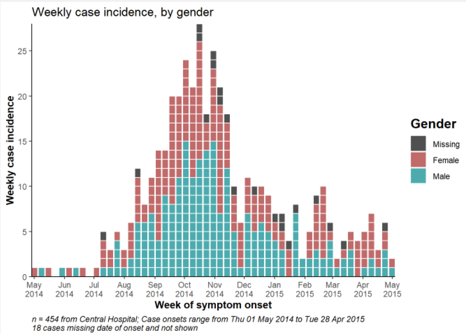
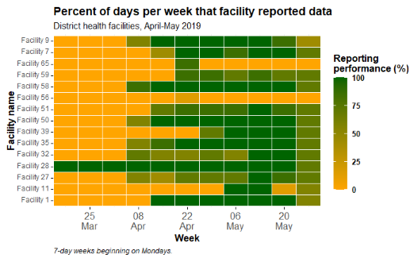
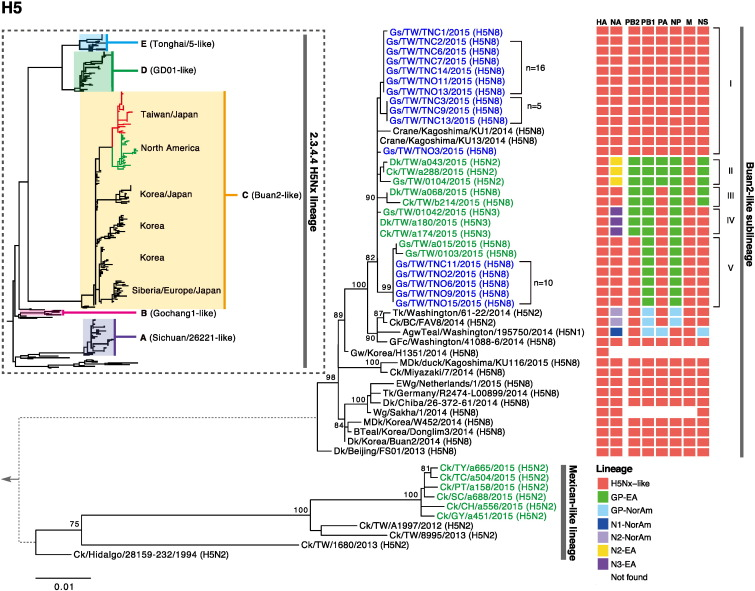

<!-- Add JavaScript code for making the exercise code larger -->
<script language="JavaScript" src="js/exercise-font-size.js"></script>

```{r setup, include=FALSE}
# load packages ----------------------------------------------------------------
library(learnr)
library(gradethis)
library(etude) # helper functions for gradethis
library(basket) # not sure if we need this
library(DT)
library(janitor)
library(stringr)
library(dplyr)
library(magrittr)
library(tidyr)
library(skimr)
library(epikit)
library(lubridate)
library(incidence2)
library(ggrepel)
library(ggExtra)
library(esquisse)
library(apyramid)
library(scales)
library(plotly)
library(cowplot)
library(ggpubr)
library(gghighlight)
library(RColorBrewer)
library(Hmisc)
library(datasets)


# data prep --------------------------------------------------------------------
linelist_raw <- rio::import(system.file("dat/linelist_raw.xlsx", package = "epitutorials"))
linelist <- rio::import(system.file("dat/linelist_cleaned.rds", package = "epitutorials"))
malaria_counts <- rio::import(system.file("dat/malaria_facility_count_data.rds", package = "epitutorials"))


# set options for exercises and checking ---------------------------------------
gradethis_setup()

learnr::tutorial_options(exercise.timelimit = 60) 
  #exercise.checker = gradethis::grade_learnr) 
    # alternatively, submitr::null_code_checker


# event recorder ---------------------------------------------------------------
# see https://github.com/dtkaplan/submitr/blob/master/R/make_a_recorder.R
tutorial_options(exercise.eval = FALSE)  # pre-evaluate exercises


 
# 
# new_recorder <- function(tutorial_id, tutorial_version, user_id, event, data) {
#     cat(
#       tutorial_id, 
#       " (v", tutorial_version, "); ",
#       format(Sys.time(), "%Y-%M%-%D %H:%M:%S %Z"), "; ",
#       user_id, "; ",
#       event, "; ",
#       data$label, "; ",
#       data$answers, "; ",
#       data$code, "; ",
#       data$correct, "\n", sep = "",
#       
#       file = here::here("event_records", "learnr_basics.txt"),
#       append = TRUE)
# }
# 
# options(tutorial.event_recorder = new_recorder)


# hide non-exercise code chunks ------------------------------------------------
knitr::opts_chunk$set(echo = FALSE, fig.align = "center", message = F, warning = F)
```


## Introduction to R for Applied Epidemiology and Public Health

```{r, eval = TRUE, echo = FALSE, out.width = "100%"}
knitr::include_graphics("images/banner.png", error = F)
```

Welcome to the self-paced interactive tutorial course "Introduction to R for applied epidemiologists" offered for free by **[Applied Epi](www.appliedepi.org)**, a nonprofit organization of 150 epidemiologists each with years of ground-level experience in local public health and outbreak response.  

This tutorial teaches **visualization of public health data with the ggplot2 R package**. We teach you how to write code to create figures such as epidemic curves, demographic pyramids, and many varieties of bar, line, and scatter plots.  


#### Applied Epi  


**[Applied Epi](www.appliedepi.org) is a nonprofit organization that supports frontline public health practitioners through open-source tools, training, and support.**  

Our free [Epidemiologist R Handbook](www.epiRhandbook.com) has helped over **150,000 people** learn R and remains a vital resource for many practitioners.  
We have built a comprehensive ecosystem of tools, training, and support around this foundation:  


:::: {style="display: flex;"}

::: {}
```{r, out.width = "75%", fig.align = "center", echo=F}
knitr::include_graphics("images/Applied Epi Hex Tools.png")
```

* **[Epi R Handbook](www.epiRhandbook.com)**
* **[R packages](https://appliedepi.org/tools/)**
* **[Situation report templates](https://appliedepi.org/tools/)**
:::


::: {.col data-latex="{0.05\textwidth}"}
\ 
<!-- an empty Div (with a white space), serving as
a column separator -->
:::


::: {}
```{r, out.width = "75%", fig.align = "center", echo=F}
knitr::include_graphics("images/Applied Epi Hex Training.png")
```

* **[Live R training courses](www.training.appliedepi.org)**
* **[Self-paced R tutorials](https://training.appliedepi.org)**
* **[YouTube channel](https://www.youtube.com/channel/UCgXBQIFJ_Rmq3UhWL_yrkxQ)**
:::


::: {.col data-latex="{0.05\textwidth}"}
\ 
<!-- an empty Div (with a white space), serving as
a column separator -->
:::

::: {}
```{r, out.width = "75%", fig.align = "center", echo=F}
knitr::include_graphics("images/Applied Epi Hex Support.png")
```

* **[Q&A discussion forum](www.community.appliedepi.org)**
* **[R Help Desk](https://appliedepi.org/helpdesk/)**
* **[Case studies](www.training.appliedepi.org)**
:::


::::


<form target="_blank" action="https://www.paypal.com/donate" method="post" target="_top">
<input type="hidden" name="hosted_button_id" value="YTEZELC8VBXV6" />
<input type="image" src="https://github.com/appliedepi/epiRhandbook_eng/raw/master/images/donate_button_long.png" border="0" name="submit" title="PayPal - The safer, easier way to pay online!" alt="Donate with PayPal button" />

</form>


#### Target Audience  

Public health practitioners, applied epidemiologists, clinicians, and researchers seeking to learn R but who do not have access to our *live R courses*. R coding is taught *within* the tutorials, whereas in our live courses we have the flexibility to teaching *in RStudio*.    

These tutorials:  

* Are friendly to people who have never used a programming language before
* Teach R emphasizing examples, datasets, and challenges commonly faced by applied epidemiologists
* Are modular so that you can skip to sections most relevant to you


#### Offline / Online

You can access these tutorials offline by following [these instructions] to download our R package {epitutorials}. You will then be able to complete these exercises *within RStudio* offline.  


#### Learning goals

In this tutorial you will learn:  

* The basics of data visualization in R with **ggplot2**  
* The "grammar of graphics" approach to data visualization  
* How to customize and edit plots to achieve the look you want  


#### Accompanying resources

This tutorial draws from chapters of our free [Epidemiologist R handbook](https://epirhandbook.com/en/) such as [ggplot basics](https://www.epirhandbook.com/en/ggplot-basics.html), [ggplot tips](https://www.epirhandbook.com/en/ggplot-tips.html), and [epidemic curves](https://www.epirhandbook.com/en/epidemic-curves.html). The Epi R Handbook has over 50 chapters, has helped over 150,000 people learn R, and is also available for offline use.  


#### Acknowledgements  

Authors of this tutorial include:  

* David Jorgensen  
* Neale Batra  


## Data used  

In this tutorial we will use the following "linelist" of cases from a simulated (fake) Ebola outbreak in Sierra Leone. Please take a few minutes to review the structure and content.  

Use the arrows on the right to scroll through hidden columns. Note that there are "raw" (messy) datasets that mimic problems commonly found in real-life epidemiological datasets availble. As we are focusing on visualization here we will use pre-cleaned data. The data cleaning tutorials cover the processing of raw data to get to this point and we recommend looking through these first

A "linelist" is a term used in applied epidemiology to refer to a table that contains key information about each case or suspect case in an outbreak. Each row represents one case, and the columns contain variables such as age, sex, date of symptom onset, outcomes, etc.

This dataset contains `r nrow(linelist)` rows and `r ncol(linelist)` columns. Below are the first 6 rows:  

```{r}
head(linelist) %>% 
  DT::datatable()
```


### Accessing example data
If you want to practice with this dataset, click to [download the **clean** dataset as an **.rds file**](https://github.com/appliedepi/epirhandbook_eng/raw/master/data/case_linelists/linelist_cleaned.rds). An *.rds file* is an R-specific file type that preserves column classes, which leaves only minimal cleaning to do after importing the data into R.  


### Tidy Data

We highly recommend doing our tutorial on [Tidy Data in Applied Epidemiology](www.training.appliedepi.org). Collecting, formatting, and preparing your dataset *before* importing it into R is a critical step!

We recommend completing our self-paced R tutorials in order, to first learning data cleaning. 


## Data visualization in R  

Visualizing multi-dimensional data well is a balance of *art* and *science*.  

Visualization is one of the most important parts of a statistical analysis as it allows you to share what you have achieved and, when done correctly, can help to explain complex work and concepts to a wider audience of stakeholders or the general public. Exploratory visualization can also be a key step when understanding new data or with analyses you are conducting.  


### Examples of data visualization in R  

Below are plots that were all created with R. You too can make plots as beautiful as these, but you must begin with the fundamentals.  

### Epidemic curves  

```{r, out.width = "75%", fig.align = "center", fig.show='hold', echo=F}

```

[Source: Epi R Handbook](www.epiRhandbook.com)

### Reporting completeness - heat plot  

This heat plot shows the proportion of heath facilities reporting complete surveillance data to the district office, over time.  

```{r, out.width = "75%", fig.align = "center", fig.show='hold', echo=F}

```

[Source: Epi R Handbook](www.epiRhandbook.com)

### Age pyramids  

Age pyramids are very easy to make with R. This age pyramid actually plots *two* separate datasets over each other, to show the age/sex distribution of cases as compared to the underlying population.  

```{r, out.width = "100%", fig.align = "center", fig.show='hold', echo=F}
knitr::include_graphics("images/pop_pyramid_baseline.png")
```

[Source: Epi R Handbook](www.epiRhandbook.com)

### Diagrams  

Simple and complex flow charts and diagrams can also be made with R, such as this one that reflect the flow of patients and information during an outbreak response.  

```{r, out.width = "50%", fig.align = "center", fig.show='hold', echo=F}
knitr::include_graphics("images/flow_chart.png")
```

[Source: Epi R Handbook](www.epiRhandbook.com)


### Mapping  

One major asset of R's plotting capability is the capacity to produce stunning and reproducible GIS maps.  

```{r, out.width = "100%", fig.align = "center", fig.show='hold', echo=F}
knitr::include_graphics("images/swiss_map.png")
```

[Source](https://timogrossenbacher.ch/2016/12/beautiful-thematic-maps-with-ggplot2-only/)


### Phylogenetic trees  

There are many R packages that assist you with analyzing and visualizing phylogenetic trees and other genetic data.  

```{r, out.width = "100%", fig.align = "center", fig.show='hold', echo=F}

```

[Source](https://www.biostars.org/p/200489/)


### The importance of visualization  

Summary statistics are vital in an analysis, but sometimes do not tell the entire story. Visualizing data can reveal important differences and trends that otherwise would have gone unnoticed.  

Below is a famous example of four different datasets ("Anscombe's quartet"), which have the same summary statistics (e.g. means) and linear line of best fit - *yet, when the data are plotted as points reveal very different patterns*. This highlights the importance of visualization when dealing with new or unknown data.  


```{r anscombe, fig.height=8, message = F, warning = F}
p1 <- ggplot(anscombe) +
  geom_point(aes(x1, y1), color = "darkorange", size = 1) +
  scale_x_continuous(breaks = seq(0,20,2)) +
  scale_y_continuous(breaks = seq(0,12,2)) +
  expand_limits(x = 0, y = 0) +
  labs(x = "x1", y = "y1",
       title = "Dataset 1" ) +
  theme_classic()

p2 <- ggplot(anscombe) +
  geom_point(aes(x2, y2), color = "green4", size = 1) +
  scale_x_continuous(breaks = seq(0,20,2)) +
  scale_y_continuous(breaks = seq(0,12,2)) +
  expand_limits(x = 0, y = 0) +
  labs(x = "x2", y = "y2",
       title = "Dataset 2" ) +
  theme_classic()

p3 <- ggplot(anscombe) +
  geom_point(aes(x3, y3), color = "dodgerblue", size = 1) +
  scale_x_continuous(breaks = seq(0,20,2)) +
  scale_y_continuous(breaks = seq(0,12,2)) +
  expand_limits(x = 0, y = 0) +
  labs(x = "x3", y = "y3",
       title = "Dataset 3" ) +
  theme_classic()

p4 <- ggplot(anscombe) +
  geom_point(aes(x4, y4), color = "magenta3", size = 1) +
  scale_x_continuous(breaks = seq(0,20,2)) +
  scale_y_continuous(breaks = seq(0,12,2)) +
  expand_limits(x = 0, y = 0) +
  labs(x = "x4", y = "y4",
       title = "Dataset 4" ) +
  theme_classic()


p1_fitted <- p1 + geom_abline(intercept = 3.0001, slope = 0.5001, color = "blue")+ labs(caption = str_glue("mean x = {mean(anscombe$x1)} \n mean y = {round(mean(anscombe$y1),2)}"))+   theme(plot.caption = element_text(color = "blue", size = 12, face = "italic")) + lims(y = c(0,15), x = c(0,20))
p2_fitted <- p2 + geom_abline(intercept = 3.001, slope = 0.500, color = "blue")+ labs(caption = str_glue("mean x = {mean(anscombe$x2)} \n mean y = {round(mean(anscombe$y2),2)}"))+   theme(plot.caption = element_text(color = "blue", size = 12, face = "italic"))+ lims(y = c(0,15), x = c(0,20))
p3_fitted <- p3 + geom_abline(intercept = 3.0025, slope = 0.4997, color = "blue")+ labs(caption = str_glue("mean x = {mean(anscombe$x3)} \n mean y = {round(mean(anscombe$y3),2)}"))+   theme(plot.caption = element_text(color = "blue", size = 12, face = "italic"))+ lims(y = c(0,15), x = c(0,20))
p4_fitted <- p4 + geom_abline(intercept = 3.0017, slope = 0.499, color = "blue") + labs(caption = str_glue("mean x = {mean(anscombe$x4)} \n mean y = {round(mean(anscombe$y4),2)}"))+   theme(plot.caption = element_text(color = "blue", size = 12, face = "italic"))+ lims(y = c(0,15), x = c(0,20))


joint <- plot_grid(p1_fitted, p2_fitted,
                          p3_fitted, p4_fitted,
             ncol = 2)

title <- ggdraw() + 
  draw_label(
    "Four datasets with the same simple descriptive statistics\nbut different distributions (Anscombe's quartet)",
    fontface = 'bold',
    x = 0,
    hjust = 0
  ) +
  theme(
    # add margin on the left of the drawing canvas,
    # so title is aligned with left edge of first plot
    plot.margin = margin(0, 0, 0, 7)
  )
plot_grid(
  title, joint,
  ncol = 1,
  # rel_heights values control vertical title margins
  rel_heights = c(0.1, 1)
)

```

*Figure adapted from [Debosruti Dutta](https://rpubs.com/debosruti007/anscombeQuartet)*


## R packages {#packages}

We cover the intricacies of R package installation and loading in our tutorial on [R Basics](www.training.appliedepi.org). We have pre-loaded the below packages for use in this tutorial.  

Recall that the {pacman} package and it's function `p_load()` will automatically install each R package *if not yet installed* and will load it for use in the current R session.  

Installation and loading of these packages is described in detail in the Epi R Handbook chapter [_Suggested Packages_](https://epirhandbook.com/en/suggested-packages-1.html).  


```{r load-package-solution, echo=T, eval = FALSE}
# install/load packages for use in the tutorial
pacman::p_load(
  rio,           # importing data  
  here,          # relative file pathways  
  skimr,         # review data
  janitor,       # data cleaning and tables
  epikit,        # age categories
  lubridate,     # working with dates
  incidence2,    # epidemic curves
  ggrepel,       # smart plot labels
  ggExtra,       # extra functions for plotting
  esquisse,      # point-and-click for simple ggplots
  apyramid,      # age pyramids
  scales,        # formatting of plot scales
  plotly,        # interactive plots
  cowplot,       # combine plots
  gghighlight,   # nice highlighting features for ggplot
  tidyverse      # includes ggplot2 and other data management packages
)
```


## Import data {#import} 

In this tutorial we will work with the *cleaned* Ebola linelist shown above. If you are interested in the process of cleaning data have a look at the data cleaning tutorial.

Below we show a command that imports the data into R and saves it as the object `linelist` in our R environment for later use. This command uses the `import()` function from the package {rio}.  

**Your import command may look different from this one**, depending upon how your files are organized within your RStudio project. See the [R Basics](www.training.appliedepi.org) tutorial to learn more about importing data into R with `import()`, RStudio projects, and the {here} R package.  

```{r import-demo-subfolder, echo=T, eval=F}
linelist <- import("linelist_cleaned.rds")   # import data and save as "linelist"
```


## {ggplot2} in RStudio  

In this tutorial we code within chunks inside of this tutorial module. In reality you will likely be running your R code with the popular **R** coding environment **RStudio**.

When we run a plotting command in RStudio the code will run in the console (as with any other R code) but you will not see the output here. The output will be passed to the "Plots" tab. By default this is in the bottom right quadrant of RStudio alongside the "Files", "Packages", "Help" and "Viewer" tabs:

```{r, fig.margin = TRUE, echo = FALSE, fig.width = 3, out.width = "100%", fig.cap = ""}
knitr::include_graphics("images/RStudioplottab.PNG")
```

Sometimes, we use the assignment operator `<-` to save our plot with a name in our R environment. In this case the plot will only print when we run a separate command containing the name of the plot:  

```{r, eval = TRUE, echo = FALSE,out.width = "100%"}
knitr::include_graphics("./images/plotvis.gif")
```


### Plot handling buttons  

In the RStudio plots pane there are some buttons worth knowing about:  


```{r, fig.margin = TRUE, echo = FALSE, fig.width = 3, out.width = "100%", fig.cap = ""}
knitr::include_graphics("images/plotopts.png")
```

To see your plot in a larger window you can click on "Zoom" **(1)**  

We can also remove plots from the plot tab using the red X button to remove the current plot **(2)** or the little brush to remove all previous plots **(3)**. 

The "Export" button **(4)** allows us to save plots to a file or copy to our clipboard to paste elsewhere. Sometimes, this feature can unexpectedly capture only part of a plot, so usually it is best to save/export with the function `ggsave()`. This gives more options than exporting via the RStudio window and is also useful to save multiple plots from the same code.  


### `ggsave()`  

`ggsave()` can work in two ways:  

* Specify the name of the plot object, then the file path and name with extension  
    * For example: `ggsave(plot_name, path = here("plots", "plot_name.png"))`
* Run the command with only a file path, to save the last plot that was printed  
    * For example: `ggsave(path = here("plots", "plot_name.png"))`

You can export as png, pdf, jpeg, tiff, bmp, svg, or several other file types, by specifying the file extension in the file path.

You can also specify the arguments `width =`, `height =`, and `units =` (either “in”, “cm”, or “mm”). You can also specify `dpi =` with a number for plot resolution (e.g. 300). See the function details by entering `?ggsave` or reading the [documentation online](https://ggplot2.tidyverse.org/reference/ggsave.html).  


## A grammar of graphics

### Why use {ggplot2}  

There are a variety of visualization options within the R software, but in this tutorial and the Epi R Handbook we focus on the {ggplot2} package available within the {tidyverse} family of R packages. This is the visualization package of choice for many epidemiologists because it :  

* Is good for fast data exploration (especially with large numbers of parameters)
* Produces very high quality outputs which can be used directly in publications or reports
* Has well structured and consistent syntax (easy to apply to many plots once you learn the basics)  
* Benefits from additional R packages that extend its functionality  


### Grammar of graphics

The "grammar of graphics" refers to the basic structure of {ggplot2} commands, in which elements of the plot are created and sequentially "added" to one another in individual lines of code. This grammar incorporates actions as basic as specifying the dataset and columns to use, through extremely specific design adjustments.  


In {ggplot2} we build a plot by "adding" commands on top of one another with a "+" symbol, which specify plot layers and design elements. A standard plot will follow this order:  

1. **"Open" the plot** with the `ggplot()` command and specify the dataset
2. **"Map" data columns** to "aesthetic" features of the plot such as axes, color, size, shape fill, transparency etc. 
3. **Add "geom" layers** to visualize your data in the desired way (geometries such as bars, points, or boxplots)  
4. **Modify "scales"** such as color choices and axis breaks
5. **Add "theme" design elements** to your plot such as axis labels, title, captions, fonts, text sizes, background themes and the orientation of different elements

```{r grammar-graphics-pyramid, fig.margin = TRUE, echo = FALSE, fig.width = 3, out.width = "50%", fig.cap = ""}
knitr::include_graphics("images/gg_pyramid.png", error = F)
```


"Adding" layers to your plot is done literally by ending a line in the ggplot command with the `+` symbol. This indicates that you wish to add further details on the following line. This can be repeated until your complete plot is built.  

Using this line-by-line syntax allows your code to be more readable, both for you to make changes in the future and to others trying to understand your work.  

Additionally we can add line breaks within lines of ggplot code, this is useful to highlight when you are specifying a different argument of the plot and leads to more readable plots, you will see examples of this throughout the tutorial. These line breaks are not necessary for the code to run but are useful to help yourself and others understand the code.

```{r quiz1}
quiz(
  question("What is the most basic building block of data vizualisation?",
    answer("Statistics"),
    answer("Scale"),
    answer("Data", correct = TRUE),
    answer("Visualisation type")
  ),
  question("Sub-components of ggplot2 commands are linked together by what symbol?",
    answer("`%>%`", message = "You have selected the 'pipe' operator, which is used in data management generally, but not within ggplot commands."),
    answer("`*`"),
    answer("`$`", message = "You can selected an indexing operator used to select a column from a data frame, which is generally not used within ggplot commands."),
    answer("`+`", correct = TRUE, message = "Yes, the plus symbol is used to link sub-commands within a ggplot command.")
  )
)
```

In the following sections we will put this into practice step-by-step.


## "Open" the plot  

The {ggplot2} package is built around the **R** function `ggplot()` which is the first command for any ggplot. 
Running `ggplot()` in your R console should generate a blank canvas:

```{r blank-plot, exercise = TRUE}
ggplot()
```

```{r blank-plot-check}
grade_this_code("correct, you should see a blank canvas loaded by ggplot2")
```

```{r blank-plot-solution, eval= FALSE}
ggplot()
```


In this step, we also typically specify the data frame (R's word for a dataset) to use, by placing the `data = ` argument inside the parentheses. In our example, the data frame is called `linelist`:  

```{r ggplot data, echo=T, eval=F}
ggplot(data = linelist)
```


If you are familiar with the pipe operator (`%>%`) from our [Data cleaning tutorial](www.training.appliedepi.org), data can also be *piped into* a ggplot command using a pipe:  

```{r pipe, eval=F, echo=T}
linelist %>%
  ggplot()
```

Neither of these approaches to specifying the data will change the blank canvas:  

```{r blank-plot2, exercise = TRUE}
ggplot(data = linelist)
```

```{r blank-plot2-check}
grade_this_code("correct, you should see a blank canvas loaded by ggplot2")
```

```{r blank-plot2-solution, eval= FALSE}
ggplot(data = linelist)
```


## Mapping columns to aesthetics  

### Aesthetics  

Now that we have a canvas, we must tell R what to plot. We begin by "mapping" columns in our dataset to certain "aesthetics" of the plot.  

"Aesthetics" are plot features related to the displayed data, such as position, color, and shape. Note this word "**aes**thetics" - as the root **aes** becomes part of the R command we will use.  


### Axes  

Typically, the first aesthetic mappings are to *assign columns from the dataset to the axes*. 

For example, by mapping the column `age` to the X-axis, every row in the data is evaluated and each case may be placed on a different X-axis position according to their age.  

As you remember, the first argument of `ggplot()` is `data = `. The second argument is `mapping = aes()`, where you **map columns in the data to plot aesthetics.** The `mapping = ` argument of `ggplot()` is atypical in that you must provide the values to it *within the `aes()` function.*  

> `mapping = aes(x = COLUMN, y = COLUMN)`  

Remember that this code above is occurring *within* the `ggplot()` function. The `mapping = aes()` itself IS the second expected argument to `ggplot()`.  
Below, we set the axes X and Y to the age and height columns from the linelist data. You can see this represented on the axes scales, which now have titles and values. Note that no data is yet displayed.  

```{r aes, echo=T, eval=T}
ggplot(data = linelist, mapping = aes(x = age, y = ht_cm))
```

The first 25 rows of the linelist data are reproduced below. In the **R** window below, try changing the Y axis to temperature rather than `ht_cm`. You can use the arrows to scroll left and right through this table and find the correct column. 

```{r linelist-data}
head(linelist, 25)
```

Below is an R exercise where you can edit and write your own code. Clicking "Run code" will run what you have entered and produce an output. To check your answer against the solution click "Submit Answer". If you need help, click the "Hints" button above the code chunk to get a hint to the solution. You can also ask a question in our [Community Forum](www.community.appliedepi.org).    

```{r axes-plot, exercise = TRUE}
ggplot(data = linelist, mapping = aes(x = age, y = ht_cm))
```

```{r axes-plot-check}
grade_this_code("correct, you should now see temperature on the y axis")
```

```{r axes-plot-hint}
The temperature column is named temp
```

```{r axes-plot-solution, eval= FALSE}
ggplot(data = linelist, mapping = aes(x = age, y = temp))
```

*Note: You may see `aes()` written in ggplot code without the `mapping = ` argument name. As with any R function the argument names do not need to be written as long as they are written in the order expected by the function. For clarity here we include `mapping = ` but if you see code elsewhere without this, it achieves the same result.*


## Add geoms  

Next we need to declare *how* we want our data to be visualized - that is, which geometric shapes to use (e.g. points, bars, boxplots, lines, etc.).  

To "add" geometry, we extend our `ggplot()` command with a `+` symbol and write one of the "geom" functions, such as `geom_point()` below. Adding (`+`) the function `geom_point()` to our previous `ggplot()` command plots each row in the data as a point, using the X and Y mappings we defined earlier. Note that the `+` appears after the close of the `ggplot()` parentheses.  

```{r simple_plot, echo=T, message = T, warning = T}
ggplot(data = linelist, mapping = aes(x = age, y = wt_kg))+
  geom_point()
```

*You will see a warning when running this code reproduced above. This is {ggplot2} is warning you that it is dropping rows with missing values from the plot.*  


### Other geom functions  

There are many "geom" functions that you can use, each displaying the data using different shapes.  

All follow a common format of `geom_XXXX()` where XXXX is replaced with a plot type such as `geom_line()` or `geom_bar()` or more general objects to be plotted such as text: `geom_text()` or a horizontal line: `geom_hline()`. A full list of available {ggplot2} geoms can be found in the [ggplot reference document](ggplot2.tidyverse.org/reference/) and many more can be added by loading additional packages.  

Some common "geoms" for epidemiology are listed below:


Shape           |{ggplot2} geom function                
----------------|--------------------
Histograms      |`geom_histogram()`
Points          |`geom_point()`  
Lines           |`geom_line()` or `geom_path()`  
Bar plots       |`geom_bar()` or `geom_col()`  
Box plots       |`geom_boxplot()`  
Violin plots    |`geom_violin()`  
Trend lines     |`geom_smooth()`


We can easily make other simple plots using the same data by replacing `geom_point()` with another geom function.  

Below we use `geom_histogram()` to show the distribution the continuous variable age. A histogram plot only requires a single column of data, so we map `age` to the x-axis. But something is missing from the code below, preventing the histogram from being displayed - can you spot what is missing and fix it?  

```{r axis-plot, exercise = TRUE, warning=F, message=F}
ggplot(data = linelist, mapping = aes(x = age))
  geom_histogram()
```

```{r axis-plot-check}
grade_this_code("Correct, we need to link the commands together with a '+'")
```

```{r axis-plot-hint}
remember we need to add layers to our ggplot with a specific symbol
```

```{r axis-plot-solution, eval= FALSE}
ggplot(data = linelist, mapping = aes(x = age)) +
  geom_histogram()
```


### Newlines and indentations  

As in much of **R** code, indentations, spaces, and newlines within a ggplot command do not impact code execution, and can improve readability. The following commands all produce the same plot:  

This command is entirely horizontal, and does not use best practice spacing.
```{r, echo = TRUE, eval = FALSE, tidy = FALSE}
ggplot(data=surv,mapping=aes(x=age,y=ht_cm))+geom_point()
```

This approach begins to introduce proper spacing, and some new lines:  

```{r, echo = TRUE, eval = FALSE, tidy = FALSE}
ggplot(data = surv,
       mapping = aes(x = age, y = ht_cm)) +
geom_point()
```

Finally, here is our recommended approach:  

```{r, echo = TRUE, eval = FALSE, tidy = FALSE}
ggplot(
  data = surv,        # use case linelist
  mapping = aes(      # make aesthetic mappings for all geoms
    x = age,          # assign x-axis to age column
    y = ht_cm)) +     # assign y-axis to height
geom_point()          # display data as points
```

Note how the third more vertical coding approach looks similar to a "table of contents". It makes clear which argument belong to parts of the greater ggplot command, and allows explanatory comments to be typed to the left of each specific component.  


## More aesthetics

Recall that ggplot "aesthetics" are elements of the plot that control how the data are displayed. In the previous section we saw examples win which columns in the data were mapping to the x-axis and y-axis (e.g. scatter plots) and a plot that used only an x-axis (e.g. histograms). 

Aside from axes, other common aesthetics include:

Aesthetic    |What it controls                
-------------|---------------------------------------------------
`shape`      |Display of point as dot, star, triangle, square...
`fill`       |The *interior* color (e.g of bar or boxplot)  
`color`      |The color of points and lines, or the outline of bars and boxplots  
`size`       |Line thickness, point size...
`alpha`      |Transparency: 0 (invisible) to 1 (opaque) 
`width`      |Width of "bar plot" bars
`linetype`   |Either solid, dashed, dotted, etc.  
`binwidth`   |Width of histogram bins  


Importantly, aesthetics can be assigned values **statically**, or **dynamically***. Let's explore each of these:  

### Static aesthetic assignments  

We use the term "static" because in this approach the aesthetic is assigned to a single, static value (e.g. `"orange"`, `2`, or `0.5`) *that results in the same display for all data in the plot*. To apply the same display for all plotted observations:  

1. The static assignment is made to a single value (can be character, numeric, etc.)  
2. The assignment must occur _outside_ the `mapping = aes()` argument  

Below, the `color` aesthetic of the points is assigned the value `"orange"`, so *all the points* are colored orange. This assignment is done within the `geom_point()` function, **not** within the `mapping = aes()`.  

```{r plot-color, echo=T, warning=F, message=F}
ggplot(
  data = linelist,
  mapping = aes(
    x = age,
    y = ht_cm)) +
geom_point(
  fill = "orange")
```

*NOTE: when we assign a character value such as the fixed color orange, we need to use quotation marks (`"orange"`) whereas when we are mapping an aesthetic to a column name we do not use quotation marks*


### Dynamic aesthetic assignments  

Alternatively, we can provide a *column name* for the aesthetic assignment, resulting in the aesthetic display being dynamic - potentially different for every observation in the data. To have a dynamic aesthetic:  

1. The assignment is made to a *column name*, without quotes  
2. Write the assignment *within* the `mapping = aes()` argument in the top `ggplot()` command  

We have already made dynamic assignments for the x-axis (and y-axis), but this can also be done for aesthetics like `color`. In the plot below, `color = gender` is added to the `mapping = aes()` argument. Now the `color` of each point depends on the value for `gender` in that specific row. In effect, this "groups" the data by gender and also produces a legend on the right side of the plot.  
  
```{r dynamic-aes, warning=F, message=F, echo=T}
ggplot(
  data = linelist,
  mapping = aes(
    x = age,
    fill = gender)) +
geom_point()
```

Try changing the histogram plot code below to have the `fill` determined by gender.

```{r gender-plot, exercise = TRUE, warning=F, message=F}
ggplot(
  data = linelist,
  mapping = aes(x = age)) +
geom_histogram(fill = "orange")
```

```{r gender-plot-check}
grade_this_code("correct, we need to put the fill inside aes()")
```

```{r gender-plot-hint}
aes(fill = gender)
```

```{r gender-plot-solution, eval= FALSE}
ggplot(
  data = linelist,
  mapping = aes(
    x = age,
    fill = gender)) +
geom_histogram()
```

### Both static and dynamic aesthetics  

You may have both static and dynamic aesthetic in the same plot. Try changing this points plot such that:  

* The point `color` is determined dynamically by gender  
* The point `size` is 3 for all points  
* The `alpha` is 0.5 for all points  

```{r both-plot, exercise = TRUE, warning=F, message=F}
ggplot(
  data = linelist,
  mapping = aes(
    x = age,
    y = ht_cm)) +
geom_point(fill = "orange")
```

```{r both-plot-check}
grade_this_code("Correct, you need color within aes(), and alpha and size outside aes()")
```

```{r both-plot-hint}
aes(color = gender)
geom_point(size = 3, alpha = 0.5)
```

```{r both-plot-solution, eval= FALSE}
ggplot(
  data = linelist,
  mapping = aes(
    x = age,
    y = ht_cm,
    color = gender)) +
geom_point(size = 3, alpha = 0.5)
```


### More examples  

For dot and line plots we assign the color using *color* rather than *fill* as they are outlines rather than filled objects. Here we also adjust the size (`size = `) of the points and the opacity (`alpha = `)(make them more see through; useful for overlaid plots)
```{r static-col, warning=F, message=F, echo=T}
ggplot(
  data = linelist,
  mapping = aes(
    x = age,
    y = wt_kg)) +
geom_point(
  mapping = aes(color = outcome),
  size = 2,
  alpha = 0.5)
```

*NOTE: here we assign size and alpha to fixed values outside of the `mapping = aes()` argument, these can also be mapped to columns in our data by placing them inside the argument and specifying a column name to map them to.*

We will cover different color options later and how to change the colors assigned to your data. Basic colors for static mapping are built-in with **ggplot2**:

```{r ggplot-default-cols, fig.height=15, fig.with=12}
d=data.frame(c=colors(), y=seq(0, length(colors())-1)%%66, x=seq(0, length(colors())-1)%/%66)
ggplot() +
scale_x_continuous(name="", breaks=NULL, expand=c(0, 0)) +
scale_y_continuous(name="", breaks=NULL, expand=c(0, 0)) +
scale_fill_identity() +
geom_rect(data=d, mapping=aes(xmin=x, xmax=x+1, ymin=y, ymax=y+1), fill="white") +
geom_rect(data=d, mapping=aes(xmin=x+0.05, xmax=x+0.95, ymin=y+0.5, ymax=y+1, fill=c)) +
geom_text(data=d, mapping=aes(x=x+0.5, y=y+0.5, label=c), colour="black", hjust=0.5, vjust=1, size=3)
```

A range of point shapes are also available in R, these can be used to set point shapes. The ones with blue centers below have a fill and so can be filled with a different argument to their colour (outline)

```{r shapes}
ggpubr::show_point_shapes()

```

As with the other aesthetics we have seen shape can be dynamic:

```{r dynamic-shape, warning=F, message=F, echo=T}
ggplot(
  data = linelist,
  mapping = aes(
    x = age,
    y = wt_kg)) +
geom_point(
  mapping = aes(
    shape = gender,
    color = age_cat), 
  size = 3, 
  alpha = 0.3)
```

or static:

```{r static-shape, warning=F, message=F, echo=T}
ggplot(
  data = linelist,
  mapping = aes(
    x = age,
    y = wt_kg)) +
geom_point(
  mapping = aes(fill = age_cat),
  color = "black",
  shape = 21,
  size = 3,
  alpha = 0.3)
```

Here we use a shape with fill to allow each point to have a black outline with categorical fill.

### Static aesthetics
An aesthetic is static if it applies the same display to all data points in the geom or plot. Static aesthetics are defined *outside* `aes()` to a *number or character value*.
egs.
`color = seagreen`
`size = 3`
`alpha = 0.5`

```{r plot-with-those-aes, warning=F, message=F}
ggplot(
  data = linelist,
  mapping = aes(
    x = age,
    y = wt_kg)) +
geom_point(color = "seagreen",
           size = 3,
           alpha = 0.5)
```

### Assigned (dynamic) aesthetics
*Dynamic* aesthetics are mapped to a column name, and defined *inside* `aes()`. This creates "groups" in the plot and generates a legend. The display varies for each data point.

### Combining both types
As we have shown in the examples, both types of aesthetic can be combined in one plot to generate the desired outcome.

### Placement of `aes()`
1. Dynamic mappings in the initial `ggplot()` call will apply to subsequent geoms, *unless otherwise indicated*
2. Static aesthetics (e.g. color = "blue") are not inherited by subsequent geoms
3. Mappings written within one geom apply only to that geom


It is good practice to add global option sin the initial `ggplot()` call such as the coordinates used in the plot. This makes reading the code more easy for others and yourself. The data is also usually global but in some cases you may load different data for individual geoms inside those geoms

```{r quiz_aes}
quiz(
  question("Where are dynamic aesthetics placed in ggplot code?",
    answer("inside aes()", correct = T),
    answer("outside aes()")
  ),
  question("Are static aesthetics in the initial ggplot() call inherited by subsequent geoms?",
    answer("No", correct = TRUE),
    answer("Yes")
  ),
  question("Are dynamic aesthetics in the initial ggplot() call inherited by subsequent geoms?",
    answer("No"),
    answer("Yes", correct = TRUE)
  )
)
```


## Facets
Aesthetics are a good way of showing groups in your data, another way is by *faceting*. `facet_wrap()` can be used to produce an individual plot for each unique value of the column passed to it. Put a "~" before the column name in the command

```{r facet-wrap, echo=T, warning=F, message=F}
ggplot(
  data = linelist,
  mapping = aes(x = date_onset)) +
geom_histogram() +
facet_wrap(~source)
```

Here we split out the linelist data by source of infection. A key thing to see here is that we must put a "~" before the column name we want to facet by otherwise we will get an error message. 

You will also notice that the date axes in these facet plots look terrible by default! We will address this in the scales section of the tutorial.

By default `facet_wrap()` automatically matches scales between plots. This can be turned off with "free" options passed to `scales =` 

1. "free_y"
2. "free_x"
3. "free" (both x and y)

```{r facet-wrap-free, echo=T, warning=F, message=F}
ggplot(
  data = linelist,
  mapping = aes(x = date_onset)) +
geom_histogram() +
facet_wrap(
  ~source,
  scales = "free_y")
```

**Free axes are generally not recommended as they can mislead an audience not carefully checking your plots**

you can also set the number of columns or rows of plots produced with `ncol = ` and `nrow = `

Try fixing the below code splitting cases by reporting hospital to plot a facet:

1. Without a free y axis
2. With 2 columns of plots
3. With fill set by the source of infection (calls back to aesthetic mapping section)

```{r facet-test, exercise = TRUE, warning=F, message=F}
ggplot(
  data = linelist,
  mapping = aes(x = date_onset)) +
geom_histogram() +
facet_wrap(
  ~hospital,
  scales = "free_y",
  ncol = 4)
```

```{r facet-test-check}
grade_this_code("correct, we remove the scales argument, change ncol to 2 and add fill = source to the mapping = aes() of the histogram")
```

```{r facet-test-hint}
1. We can remove the scales argument completely as we want to use the default.
2. adust ncol = 
3. we want to specify fill = source inside the aes mapping for the histogram
```

```{r facet-test-solution, eval= FALSE}
ggplot(
  data = linelist,
  mapping = aes(x = date_onset)) +
geom_histogram(mapping = aes(fill = source)) +
facet_wrap(
  ~hospital,
  ncol = 2)
```

 We will fix the date (x) axis label overlap later in the tutorial.
 
### Facet by two variables

The "~" signifies "by". You can place columns on either side.
With `facet_wrap()`, levels are combined into facet titles, appearing alphabetically/by factor level.

```{r multidimension facet wrap, echo=T, warning=F, message=F, fig.height=7}
ggplot(
  data = linelist,
  mapping = aes(x = date_onset)) +
geom_histogram(mapping = aes(fill = source)) +
facet_wrap(hospital ~ gender)
```

To improve on this layout we can instead use the `facet_grid()` command:
```{r multidimension facet grid, echo=T, warning=F, message=F, fig.height=7}
ggplot(
  data = linelist,
  mapping = aes(x = date_onset)) +
geom_histogram(mapping = aes(fill = source)) +
facet_grid(hospital ~ gender)
```

### Drop levels from facets

The easiest way to drop unwanted levels from your facet plot is to remove them in advance with `filter()` or `drop_na()`, functions you will have seen in the data cleaning tutorial.

For ease we can also pipe this amended data straight into `ggplot()` rather than saving the changes as a new object for plotting.

```{r dropping, echo=T, warning=F, message=F, fig.height=7}
linelist %>% 
   drop_na(gender, hospital) %>% 
   filter(hospital != "Missing") %>% 
  
ggplot(
  mapping = aes(x = date_onset)) +
geom_histogram(mapping = aes(fill = source)) +
facet_grid(hospital ~ gender)
```
*NOTE: here we are piping (`%>%`) into our plotting function after filtering with `dplyr`. *

### `gghighlight()`

It can be useful to show facets in context of other data for comparison. `gghighlight()` from the package **gghighlight** can be used in combination with facets to have this effect.

```{r gghighlight, echo=T, warning=F, message=F}
ggplot(
  data = linelist,
  mapping = aes(x = date_onset)) +
geom_histogram(mapping = aes(fill = hospital)) +
facet_wrap(~hospital) +
gghighlight()

```

gghighlight can also be added to other types of ggplot. Here we specify we want to highlight the 15-19 year olds in some data grouped from the linelist in this tutorial.


```{r gghighlight-other, echo=T, warning=F, message=F}
linelist %>% 
  # get daily counts by age group
  group_by(age_cat, date_onset) %>%
  count() %>% 

  ggplot(
    mapping = aes(
      x = date_onset,
      y = n,
      color = age_cat)) +
  geom_line() +
  gghighlight::gghighlight(
    age_cat %in% c("15-19"))+
  theme(legend.position = "none")
```

Check the handbook for [more information on grouping data](https://epirhandbook.com/en/grouping-data.html)

Editing the facet title strips is touched on in the themes section of this tutorial, see [This short tutorial](https://www.datanovia.com/en/blog/how-to-change-ggplot-facet-labels/) for more information on this. 
The order of the facets can be adjusted by faceting by a factor and [reordering the levels](https://forcats.tidyverse.org/reference/fct_relevel.html). This is covered for barplots in the barplot section of the tutorial.

facet quiz - ways to group data - aesthetic and facet
can you think of situations where facets are preferred?
facet_wrap vs facet_grid

Below is a short quiz on facets, these are free text questions so there are no wrong answers, let us know what you think! 
```{r facet-quiz}
quiz(
  question_text("When would you use a facet rather than an aesthetic?",
    answer("Facets are useful to contrast and compare subsets of the data, sometimes this cannot be done efficiently with aesthetics alone as there is a large amount of overlap between different datasets. Sometimes we are already using multiple aesthetics to show different properties of the data and a facet gives us an additional diffentiation without further cluttering the plot.", correct = T), incorrect  = "Facets are useful to contrast and compare subsets of the data, sometimes this cannot be done efficiently with aesthetics alone as there is a large amount of overlap between different datasets. Sometimes we are already using multiple aesthetics to show different properties of the data and a facet gives us an additional diffentiation without further cluttering the plot."
    ),
    question_text("When would we use facet_wrap rather than facet_grid?",
    answer("Facet grid is most useful for 2 discrete variables, where you are seeall or most combinations of these two variables in your data. To split by one variable with a lot of levels or just to provide an additional aesthetic without cluttering the plot facet_wrap may be more useful.", correct = T), incorrect  = "Facet grid is most useful for 2 discrete variables, where you are seeall or most combinations of these two variables in your data. To split by one variable with a lot of levels or just to provide an additional aesthetic without cluttering the plot facet_wrap may be more useful. "
    )
  
)
```


## Scales
Scale commands replace defaults of how the aesthetic mappings manifest, such as:

* Which colors or shapes to display
* The min/max of point sizes
* The min/max and frequency of axes breaks

As a generic formula, these commands are written as: `scale_AESTHETIC_METHOD()`.

1. `scale_` : this prefix never changes
2. AESTHETIC: `_fill_` , `_color_` , `_x_` , `_y_` , etc.
3. METHOD: `_continuous()`, `_discrete()`, `_manual()`, `_date()`, etc.

Some examples of scale commands:  

You want to adjust  |Scale command
--------------------|-------------------
continuous y-axis   |`scale_y_continuous()`
date x-axis         |`scale_x_date()`  
categorical x-axis  |`scale_x_discrete()`  
fill, continuous    |`scale_fill_continuous()`
fill, continuous    |`scale_fill_gradient()`  
color, manual assign|`scale_color_manual()`  

here we show two different ways to create a continuous color gradient. `scale_*_continuous` works with pre-built gradient palettes, `scale_*_gradient()` creates a 2 color gradient, `scale_*_gradient2` allows you to also set a midpoint color between these two and `scale_gradientn()` allows you to create more complex palettes. More information on these functions is [available here](r-graphics.org/recipe-colors-palette-continuous).


### Default scales

```{r, eval=T, echo=T, warning = F, message = F}
ggplot(
  data = linelist,
  mapping = aes(
    x = outcome,
    fill = gender)) +
geom_bar()
```

Above, the fill of a bar plot uses the **default colors and axis breaks**. We can adjust the elements of this plot with a `scale_AESTHETIC_METHOD()` function added (`+`) to the end of our `ggplot()`

### Adjust fill

Here we adjust the *fill* color of the bars *manually* (`scale_fill_manual()`). We provide assingments to the values in our dataset ("m" and "f") within a vector (`c()`). To assign a colour to the na values we need to specify this with the seperate argument `na.value = `

```{r, eval=T, echo=T, warning = F, message = F}
ggplot(
  data = linelist,
  mapping = aes(
    x = outcome,
    fill = gender)) +
geom_bar() +
scale_fill_manual(        
  values = c(
   "m" = "violetred", 
   "f" = "aquamarine"),
   na.value = "green")
```

Here we have chosen some ugly colors to highlight what we are changing! Try changing the color for "m" to "dodgerblue" and "f" to "tomato" for a nicer color combination in the code below. Also set NA to be "grey", a common standard plot color.

```{r manual-color, exercise = TRUE, warning=F, message=F}
ggplot(
  data = linelist,
  mapping = aes(
    x = outcome,
    fill = gender)) +
geom_bar() +
scale_fill_manual(        
  values = c(
   "m" = "violetred", 
   "f" = "aquamarine"),
   na.value = "green")
```

```{r manual-color-check}
grade_this_code("Correct! We can edit the values to specify any manual color combination we want")
```

```{r manual-color-solution, eval= FALSE}
ggplot(
  data = linelist,
  mapping = aes(
    x = outcome,
    fill = gender)) +
geom_bar() +
scale_fill_manual(        
  values = c(
    "m" = "dodgerblue",
    "f" = "tomato"),
  na.value = "grey")
```

#### Built-in palettes

**R** and **ggplot2** come with a number of built-in palettes. As we are working here with discrete data we can use `scale_fill_brewer()` to access the following palettes rather than specifying our own colors:

```{R brewerpal, fig.height=6}
RColorBrewer::display.brewer.all()

```

As we are working with a discrete scale the middle group of color palettes are most appropriate.

```{r brewer_eg, eval= T, echo=T, warning = F, message = F}
ggplot(
  data = linelist,
  mapping = aes(
    x = outcome,
    fill = gender)) +
geom_bar() +
scale_fill_brewer(palette = "Pastel2",
                  na.value = "grey")
```

A color-blind friendly palette is also available known as `viridis`. This comes in discrete and continuous forms `scale_fill_viridis_d()` and `scale_fill_viridis_c()`:

```{r viridis_eg, eval= T, echo=T, warning = F, message = F}
ggplot(
  data = linelist,
  mapping = aes(
    x = outcome,
    fill = gender)) +
geom_bar() +
scale_fill_viridis_d(na.value = "grey")
```

Try applying what you have learned to add a continuous viridis palette to the following plot. Be aware that here we are dealing with a *color* rather than *fill* aesthetic. It is best practice to also specify an `na.value = `

```{r pal-color, exercise = TRUE, warning=F, message=F}
ggplot(
  data = linelist,
  mapping = aes(
    x = age,
    y = wt_kg,
    color = temp)) +
geom_point() 
```

```{r pal-color-check}
grade_this_code("Correct! we need to specify we want a color scale, viridis palette and have continuous data (scale_color_viridis_c)")
```

```{r pal-color-hint}
+ scale_color_viridis_c(na.value = "grey")

```

```{r pal-color-solution, eval= FALSE}
ggplot(
  data = linelist,
  mapping = aes(
    x = age,
    y = wt_kg,
    color = temp)) +
geom_point() +
scale_color_viridis_c(na.value = "grey")
```

[Viridis](https://cran.r-project.org/web/packages/viridis/vignettes/intro-to-viridis.html) (try with `option = "plasma"` or "inferno"), and [colorbrewer](https://www.r-graph-gallery.com/38-rcolorbrewers-palettes.html) palette functions can be added to any ggplot.  


### Adjusting y-axis

We can edit axes in a similar way. In a barplot such as this one we have a continuous y-axis and discrete x-axis. Here we might decide that the counts on the y-axis are not descriptive enough so we wish to supply our own break points. In `scale_y_continuous()` we adjust the y-axis breaks using `seq()` to define a numeric sequence:   

```{r axis-breaks, eval= T, echo=T, warning = F, message = F}
ggplot(
  data = linelist,
  mapping = aes(
    x = outcome,
    fill = gender)) +
geom_bar() +
scale_fill_viridis_d(na.value = "grey") +
scale_y_continuous(breaks = seq(from = 0,
                                to = 3000,
                                by = 500))
```

### Starting scales at 0 

You may have noticed that **ggplot2** has a behaviour of expanding your axis beyond the data, with a gap between the values and the axis at the bottom. This can be fixed with the axes scales using the `expand = ` argument.

```{r axis-end, eval= T, echo=T, warning = F, message = F}
ggplot(
  data = linelist,
  mapping = aes(
    x = outcome,
    fill = gender)) +
geom_bar() +
scale_fill_viridis_d(na.value = "grey") +
scale_y_continuous(breaks = seq(from = 0,
                                to = 3000,
                                by = 500),
                   expand = c(0,0))
```

Try applying the same `expand = c(0,0)` to the *discrete* x-axis:

```{r expand, exercise = TRUE, warning=F, message=F}
ggplot(
  data = linelist,
  mapping = aes(
    x = outcome,
    fill = gender)) +
geom_bar() +
scale_fill_viridis_d(na.value = "grey") +
scale_y_continuous(breaks = seq(from = 0,
                                to = 3000,
                                by = 500),
                   expand = c(0,0))
```

```{r expand-check}
grade_this_code("Correct! we follow the same syntax with scale_x_discrete()")
```

```{r expand-solution, eval= FALSE}
ggplot(
  data = linelist,
  mapping = aes(
    x = outcome,
    fill = gender)) +
geom_bar() +
scale_fill_viridis_d(na.value = "grey") +
scale_y_continuous(breaks = seq(from = 0,
                                to = 3000,
                                by = 500),
                   expand = c(0,0)) +
scale_x_discrete(expand = c(0,0))
```

### Date axis labels

The default scale for date axis labels will vary by the range of your data. Here is an example plot:
```{r date-x, eval= T, echo=T, warning = F, message = F}
ggplot(
  data = linelist,
  mapping = aes(x = date_onset)) +
geom_histogram()
```

Adjust axis labels with `scale_x_date()`.  

Use `date_breaks=` values like "1 week", "2 weeks", or "3 months". 

Note: these are the *axis* label breaks, the don't affect the bins of the histogram (bar widths), for tips on geom_histogram() bins, see Epi R Handbook epicurves page


Try setting the date axis breaks to 2 months on the plot from above:

```{r date-break, exercise = TRUE, warning=F, message=F}
ggplot(
  data = linelist,
  mapping = aes(x = date_onset)) +
geom_histogram()
```

```{r date-break-check}
grade_this_code("Good, we should be getting used to the syntax by now!")
```

```{r date-break-solution, eval= FALSE}
ggplot(
  data = linelist,
  mapping = aes(x = date_onset)) +
geom_histogram() +
scale_x_date(date_breaks = "2 months")
```

### Date axis labels

We can specify the date labels format with `date_labels = ` using ["strptime" syntax - see R documentation for more information on this](https://www.rdocumentation.org/packages/base/versions/3.6.2/topics/strptime)  

`"%d %b %Y"` for DD MMM YYYY. Below we also include a new line with `\n` to move the year below the day and month.

```{r date-labs, eval= T, echo = T, warning = F, message = F}
ggplot(
  data = linelist,
  mapping = aes(x = date_onset)) +
geom_histogram() +
scale_x_date(date_breaks = "2 months",
             date_labels = "%d %b \n %Y" )
```

See Epi R Handbook [Epicurves](https://epirhandbook.com/epidemic-curves.html) and [Strings](https://epirhandbook.com/characters-and-strings.html) pages for more tips

There is also a built-in simplification for date labels using the scales package. Confusingly this is applied using the `labels = ` rather than `date_labels = ` argument. Assigning `labels=` to `label_date_short()` from [**the scales package**](https://scales.r-lib.org/) means the year is not repeated on each label anymore.  

```{r date-short-labs, eval= T, echo = T, warning = F, message = F}
ggplot(
  data = linelist,
  mapping = aes(x = date_onset)) +
geom_histogram() +
scale_x_date(date_breaks = "2 months",
             labels = scales::label_date_short() )
```

### Display percentages
We can easily display proportions as percents with `percent()` from **scales** within `scale_y_continuous()`. 

Here we plot some case fatality data adapted from the linelist:

```{r CFR, echo = F, eval = T}
CFR_data <- linelist %>% 
  group_by(month = floor_date(
    date_outcome,
    "month")) %>% 
  summarise(
    cases = n(),
    deaths = sum(
      outcome == "Death",
      na.rm=T),
    CFR = deaths / cases)
```

```{r, echo = F, eval = T}
CFR_data %>% 
  head(4) %>%
  knitr::kable()
```

```{r , echo = TRUE, eval = T, warning = F, message = F}
ggplot(
  data = CFR_data,
  mapping = aes(
    x = month,
   y = CFR)) +
geom_line(
  size = 2,
  color = "brown") +
scale_y_continuous(labels = percent)
```

## Plot labels

```{r, echo = TRUE, eval = T, warning = F, message = F}
linelist$hosp_time <- linelist$date_outcome - linelist$date_hospitalisation

ggplot(data = linelist) +
geom_point(
  mapping = aes(
    x = age,
    y = hosp_time,
    color = outcome),    
  alpha = 0.7) +
scale_color_brewer(
  palette = "Pastel2",
  na.value = "grey") +
ylim(c(0, 70)) +
labs(
  title = "Duration of admission",
  subtitle = "All hospitals",
  x = "Age (years)",
  y = "Duration (days)",
  caption = "Fictional Ebola data",
  color = "Outcome"
)
```


Use `labs()` as above to edit the labels on the plot
Note: to edit legend title, use the aesthetic that created the legend (e.g. `color = `).  

Here we also use `ylim()` to set the limits of the y-axis. The same terminology can be applied for the x-axis. 

We can also use `"\n"` to break lines within labels for longer names.

### Dynamic labels

We can embed code in `str_glue()` that updates with the data  

```{r, eval=T, echo=T}
str_glue("Data as of {Sys.Date()}")
```

Here we extract the current date (`Sys.Date()`) in the time zone of our computer to add to the plot.

```{r, eval=T, echo=T}
str_glue("{fmt_count(linelist, is.na(date_onset))} cases missing onset and not shown")
```

Anything wrapped in curly brackets (`{__}`) will be run as **R** code allowing us to produce labels which will update with values from our data as the data is updated.

## Theme elements

Themes are non-data design features (background, text size/color, etc).  

### Complete themes

[These "complete themes"](https://ggplot2.tidyverse.org/reference/ggtheme.html) are easy to add.  

```{r, eval=F, echo=T}
# Try one of these...
+ theme_bw()
+ theme_classic()
+ theme_dark()
+ theme_gray()
+ theme_minimal()
+ theme_light()
+ theme_void()
```

Try adding the default themes above to this plot to see the changes:

```{r theme_trial, exercise = TRUE, warning=F, message=F}
linelist$hosp_time <- linelist$date_outcome - linelist$date_hospitalisation

ggplot(data = linelist) +
geom_point(
  mapping = aes(
    x = age,
    y = hosp_time,
    color = outcome),    
  alpha = 0.7) +
scale_color_brewer(
  palette = "Pastel2",
  na.value = "grey") +
ylim(c(0, 70)) +
labs(
  title = "Duration of admission",
  subtitle = "All hospitals",
  x = "Age (years)",
  y = "Duration (days)",
  caption = "Fictional Ebola data",
  color = "Outcome"
)
```

Try the argument `base_size = 16` inside the theme to quickly increase text size.  

```{r themes, echo=F, eval=T, warning=F, message=F, fig.height = 6}
linelist$hosp_time <- linelist$date_outcome - linelist$date_hospitalisation

plt_base <- ggplot(data = linelist) +
geom_point(
  mapping = aes(
    x = age,
    y = hosp_time,
    color = outcome),    
  alpha = 0.7) +
scale_color_brewer(
  palette = "Pastel2",
  na.value = "grey") +
ylim(c(0, 70))

bw <- plt_base + theme_bw() + ggtitle("theme_bw()")
classic <- plt_base + theme_classic() + ggtitle("theme_classic()")
dark <- plt_base + theme_dark() + ggtitle("theme_dark()")
gray <- plt_base + theme_gray() + ggtitle("theme_gray()")
minimal <- plt_base + theme_minimal() + ggtitle("theme_minimal()")
light <- plt_base + theme_light() + ggtitle("theme_light()")
void <- plt_base + theme_void() + ggtitle("theme_void()")


themes_plots <- cowplot::plot_grid( classic,
  bw, dark,
  gray, minimal,
  light, void,
  nrow = 3, rel_widths = c(2,2))
themes_plots

```

### Themes

Micro-adjustments to the theme can be made with `theme()` as these are mostly small layout and visual details we won't go into much detail here. More information is available [in the handbook](https://www.epirhandbook.com/en/ggplot-basics.html#ggplot_basics_themes). The syntax for themes taxes time to learn and is not used often enough to commit to memory for most R users. See [this list](https://ggplot2.tidyverse.org/reference/theme.html) of feature-specific arguments. or running `theme_get()` in your R window to get a list of all theme arguments in the console.
```{r theme-adjustment, echo = T, message = F, warning = F}
ggplot(data = linelist) +
geom_point(
  mapping = aes(
    x = age,
    y = hosp_time,
    color = outcome),    
  alpha = 0.7) +
scale_color_brewer(
  palette = "Pastel2",
  na.value = "grey") +
ylim(c(0, 70)) +
labs(
  title = "Duration of admission",
  subtitle = "All hospitals",
  x = "Age (years)",
  y = "Duration (days)",
  caption = "Fictional Ebola data",
  color = "Outcome"
) +
theme_classic(base_size = 16) +
theme(
  legend.position = "bottom",                # move legend to bottom
  plot.title = element_text(color = "red",   # title color
                            size = 20,       # title font size
                            face = "bold"),  # title typeface
  axis.title.y = element_text(angle = 0))    # rotate y axis title to be horizontal
```

These theme elements follow a similar 2-part syntax much like `mapping = aes()` where we pass a function to an argument of a higher level function (here `theme()`).

**Remember to add any adjustments after any pre-built themes**

some useful theme options are presented below:

`theme()` argument                  |	What it adjusts
------------------------------------|-------------------
`plot.title = element_text()`       |	The title
`plot.subtitle = element_text()`    |	The subtitle
`plot.caption = element_text()`     |	The caption (family, face, color, size, angle, vjust, hjust…)
`axis.title = element_text()`       |	Axis titles (both x and y) (size, face, angle, color…)
`axis.title.x = element_text()`     |	Axis title x-axis only (use .y for y-axis only)
`axis.text = element_text()`        |	Axis text (both x and y)
`axis.text.x = element_text()`      |	Axis text x-axis only (use .y for y-axis only)
`axis.ticks = element_blank()`      |	Remove axis ticks
`axis.line = element_line()`        |	Axis lines (colour, size, linetype: solid dashed dotted etc)
`strip.text = element_text()`       |	Facet strip text (colour, face, size, angle…)
`strip.background = element_rect()` |	facet strip (fill, colour, size…)


The main adjustments you are likely to make regularly are to do with the plot `legend.position = `. Default options are `"top"`, `"bottom"`, `"left"`, `"right"` and `"none"` (to hide the legend completely). The legend position can also be set more specifically with `c(x,y)` where x and y refer to the position along the x or y axis as a proportion of the total length (ie. bottom right is c(1,0))

Most other theme elements can also be turned off using `element_blank()` eg turn off minor y-axis grid lines and legend title:


Check your understanding of the basics of themes below:

```{r themes-quiz}
quiz(
  question("Should adjustments to the theme be made before or after setting one of the default themes?",
    answer("before"),
    answer("after", correct = TRUE)
  ),
  question("Which of the following are prebuilt themes in ggplot",
    answer("theme_bw()", correct = TRUE),
    answer("theme_classic()", correct = TRUE),
    answer("theme_red()"),
    answer("scale_color_brewer()")
  ),
  question("How would you hide a legend in ggplot?",
    answer("theme(legend.title = 'element.blank()')"),
    answer("theme(legend.position = 'right')"),
    answer("theme(legend.position(`none`))"),
    answer("theme(legend.position = 'none')", correct = TRUE)
  ),
  question("How would you set your legend to appear in the centre of your graph?",
    answer("theme(legend.position = 'middle')"),
    answer("theme(legend.position =  c(0.5,0.5))", correct = TRUE)
  )
)
```

## Challenge 1

Now that you have seen all of the basic building blocks of a `ggplot()` we would like you to attempt to build your own visualisation from scratch using the information in the previous sections. Feel free to use any of the aesthetics, geoms, facets and scales in the previous sections and go back to these sections to refresh as you work on this, your code should remain in the window.

We would like you to produce a plot with the same fictional Ebola linelist data as in the previous sections, a section of this data is reproduced again below:

```{r linelist-data-2}
head(linelist,25)
```

Can you think of a good way to represent the date of onset for infections by the source of infection and gender, be sure to try customizing your axis labels, title etc. to get a plot you are happy with. An example plot is provided as the answer with some comments but have a go at producing one for yourself. Once you have something you are happy with consider the questions below the exercise. If you want to know more about a certain `geom_*()` and how to use it, try using a question mark before the name of the geom to pull up the documentation for the function, e.g. `?geom_point`

```{r your_plot, exercise = TRUE, warning=F, message=F, fig.height=8}

```


```{r your_plot-solution, eval= F}
ggplot(
  data = linelist,
  mapping = aes(x = date_onset,            # X-axis is date 
                fill = gender)) +          # fill is gender
geom_histogram(binwidth = 7) +             # plot a histogram with binwidth of 7 (= 1 week)
scale_fill_brewer(palette = "Set2",        # pick a preset color palette
                  na.value = "grey",
                  labels = c("Female", "Male")) +   # Adjust labels to make them clearer  
scale_x_date(date_breaks = "3 months",     # fix overlapping date labels
             expand = c(0,0)) +            # no whit space around the plotted area
scale_y_continuous(expand = c(0,0),           
                   limits = c(0,200)) +    # set limits for the y-axis scale
facet_wrap(~source,                        # wrap by source as we have already used color for gender
           ncol = 1) +                     # one column as we are dealing with wide rather than tall plots
labs(
  title = "Cases by source of infection",
  subtitle = str_glue(
  "Weekly cases from {min(linelist$date_onset, na.rm = TRUE)}
  to {max(linelist$date_onset, na.rm = TRUE)}"),  # use str_glue to extract information ot add to the plot
  x = "Date of onset",
  y = "Number of cases",
  fill = "Gender"
) +
theme_light() +                            # pick a theme which allows the data to be clearly seen
theme(legend.position = "bottom",          # move legend to bottom so there is more width for plotting
      strip.background = element_rect(fill = "lightgrey",  # change colors of the facet strip elements
                                      color = "darkgrey"), # to make this clearer to read
      strip.text = element_text(color = "black")
)
```


```{r your_plot_quiz}
quiz(
  question_text("Do you think your plot would be easily understandable at a quick glance?",
    answer("Good graphics are usually interpretable within a few seconds for those familiar with standard plotting methods. This interpretation can be aided by including descriptive titles, axis labels, legends and captions as well as by not over-cluttering your plot. Do not be afraid to use facets if you feel that a plot is becoming too complex.", correct = T), incorrect  = "Good graphics are usually interpretable within a few seconds for those familiar with standard plotting methods. This interpretation can be aided by including descriptive titles, axis labels, legends and captions as well as by not over-cluttering your plot. Do not be afraid to use facets if you feel that a plot is becoming too complex."
    ),
    question_text("Do you think your visualization is showing something too complex to explain with words?",
    answer("This is a good way to consider data visualization, if something can easily be explained with words it likely doesn't need to be plotted unless to support other information. If a plot is explaining something which you would struggle to explain succinctly with words this means that it is an effective and valuable visualization.", correct = T), incorrect  = "This is a good way to consider data visualization, if something can easily be explained with words it likely doesn't need to be plotted unless to support other information. If a plot is explaining something which you would struggle to explain succinctly with words this means that it is an effective and valuable visualization."
    ),
    question_text("What do you think about the contrast in your plot? is it highlighting what you want to show?",
    answer("Don't be afraid to play with colors and the different background themes in ggplot to create an effective and visually appealing visualization. It is important that associations you are trying to highlight are easily visible and noticed without further prompting.", correct = T), incorrect  = "Don't be afraid to play with colors and the different background themes in ggplot to create an effective and visually appealing visualization. It is important that associations you are trying to highlight are easily visible and noticed without further prompting."
    ),
    question_text("How would you improve on the example plot in the answer (reproduced below)?",
    answer("This is up to you to decide! One thing which jumps out is that it doesn't mention that we are using Ebola data anywhere on the plot. This would be ok if it was to form part of a report on a certain dataset or a presentation on the progress of an Ebola outbreak but may be an issue if it is a plot to be viewed by the public or wider level stakeholders and collaborators.", correct = T), incorrect  = "This is up to you to decide! One thing which jumps out is that it doesn't mention that we are using Ebola data anywhere on the plot. This would be ok if it was to form part of a report on a certain dataset or a presentation on the progress of an Ebola outbreak but may be an issue if it is a plot to be viewed by the public or wider level stakeholders and collaborators."
    )

)

```
```{r your_plot-plot, eval= T, echo = F, fig.height = 8}
ggplot(
  data = linelist,
  mapping = aes(x = date_onset,            # X-axis is date 
                fill = gender)) +          # fill is gender
geom_histogram(binwidth = 7) +             # plot a histogram with binwidth of 7 (= 1 week)
scale_fill_brewer(palette = "Set2",        # pick a preset color palette
                  na.value = "grey",
                  labels = c("Female", "Male")) +   # Adjust labels to make them clearer  
scale_x_date(date_breaks = "3 months",     # fix overlapping date labels
             expand = c(0,0)) +            # no whit space around the plotted area
scale_y_continuous(expand = c(0,0),           
                   limits = c(0,200)) +    # set limits for the y-axis scale
facet_wrap(~source,                        # wrap by source as we have already used color for gender
           ncol = 1) +                     # one column as we are dealing with wide rather than tall plots
labs(
  title = "Cases by source of infection",
  subtitle = str_glue(
  "Weekly cases from {min(linelist$date_onset, na.rm = TRUE)}
  to {max(linelist$date_onset, na.rm = TRUE)}"),  # use str_glue to extract information ot add to the plot
  x = "Date of onset",
  y = "Number of cases",
  fill = "Gender"
) +
theme_light() +                            # pick a theme which allows the data to be clearly seen
theme(legend.position = "bottom",          # move legend to bottom so there is more width for plotting
      strip.background = element_rect(fill = "lightgrey",  # change colors of the facet strip elements
                                      color = "darkgrey"), # to make this clearer to read
      strip.text = element_text(color = "black")
)
```

## Part 2

To learn more about plotting in **R**, focusing on more complex plotting techniques and common epidemiological plots, check out part 2 of this tutorial. 

For refreshers on what we have covered in this tutorial and more detailed information on **ggplot2** look at the [ggplot basics](https://epirhandbook.com/en/ggplot-basics.html) and [ggplot tips](https://epirhandbook.com/en/ggplot-tips.html) sections of the epiRhandbook. 

Further **ggplot2** resources are plentiful with all of the documentation for individual functions available directly from the [Tidyverse website](https://ggplot2.tidyverse.org/), including a nice [cheat sheet](https://github.com/rstudio/cheatsheets/blob/main/data-visualization-2.1.pdf) which you can print as a simple refresher and reference guide.

